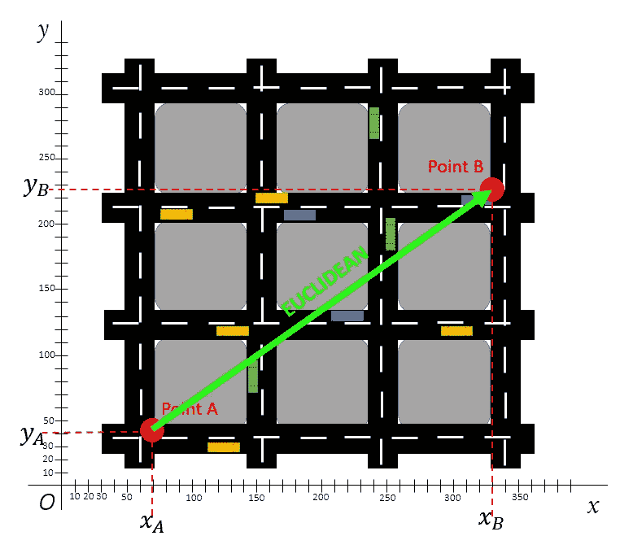
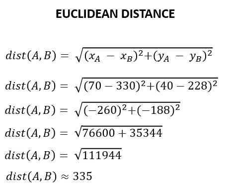
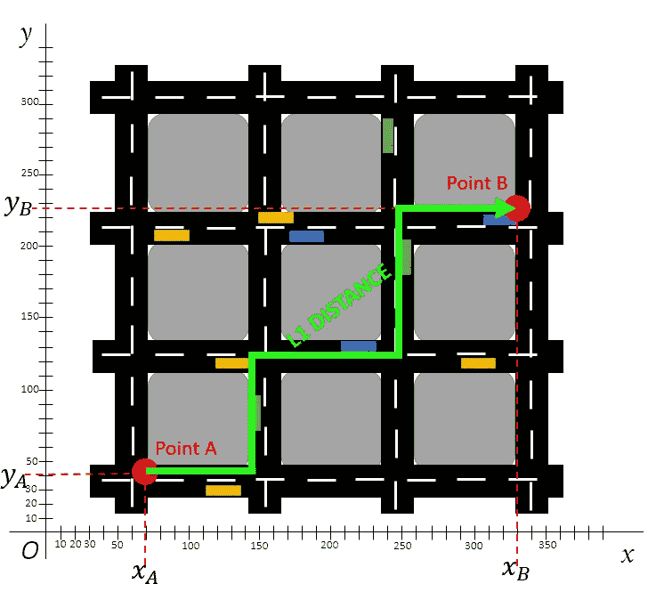
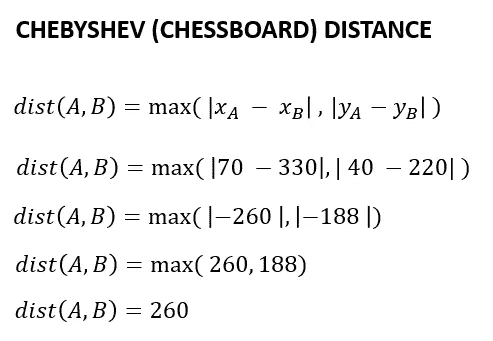

# 每个数据科学家都应该知道的 3 个距离

> 原文：<https://towardsdatascience.com/3-distances-that-every-data-scientist-should-know-59d864e5030a?source=collection_archive---------3----------------------->

无论您是刚开始接触数据科学，还是已经在该领域工作了很长时间，如果不了解以下 3 个距离，您将无法生存:

# 1.欧几里德距离(或直线距离)

欧几里德距离是最直观的:当有人要求我们进行距离测量时，我们都会直观地测量它。

欧几里得距离是使用 x 和 y 坐标的两点之间的直线距离:例如，我们可以通过给出两个坐标(纬度和经度)在世界地图上找到一个城市。

> 欧几里德距离测量直线距离。

假设我们想在图中所示的市中心地图上测量 A 点到 B 点的直线距离。

The Euclidean Distance from a Point A to a Point B is the straight-line distance, computed with Pythagoras.

有了欧几里德距离，我们只需要两点的(x，y)坐标，就可以用毕达哥拉斯公式计算距离了。

请记住，[毕达哥拉斯定理](https://en.wikipedia.org/wiki/Pythagorean_theorem)告诉我们，当我们知道水平边和垂直边的长度时，我们可以计算直角三角形的“对角线”的长度(斜边)，使用公式 a + b =c。

Computation of the Euclidean distance from Point A to Point B.

# 2.L1 距离(或城市街区距离)

L1 距离，也称为城市街区距离、曼哈顿距离、出租车距离、直线距离或蛇形距离，不是直线距离，而是街区距离。

> L1 距离测量城市街区距离:仅沿直线的距离。

这幅图直接说明了发生了什么:L1 距离只允许我们做直线运动！

The L1 distance from Point A to Point B is the City Block Distance, also called Manhattan Distance.

从图中的 A 点到 B 点有多种最短路径:我们可以向上走两个街区，然后向右走三个街区，或者我们可以向右走三个街区，然后向上走三个街区，等等。

但是 L1 距离是一个距离，所以实际的轨迹并不重要。我们需要知道的是，总的来说，我们必须向东走一定距离 *x* ，向北走一定距离 *y* 。两者之和就是从 A 点到 b 点的 L1 距离

Compute the L1 (City Block) Distance from Point A to Point B.

# 3.切比雪夫距离(或棋盘距离)

切比雪夫距离也称为棋盘距离或 L 无穷远距离。对切比雪夫距离最直观的理解就是棋王在棋盘上的移动:它可以向任何方向(上、下、左、右、垂直)走一步。

In the Chebyshev distance, a diagonal step is as large as a vertical step.

它不同于 L1 距离，因为在切比雪夫距离中，我们将垂直运动计为一步，而在城市街区距离中，我们将垂直运动计为两步(向左一步和向右一步)。

它也不同于欧几里德距离，因为欧几里德距离中的一个垂直移动，其距离为 *sqrt( x + y )* 正如我们之前看到的。

Comparison of the Euclidean Distance, L1 Distance, and Chebyshev Distance.

> 切比雪夫距离是棋盘距离。

切比雪夫距离的一个直观例子是一架无人机，它有两个独立的电机:一个电机向前，一个电机侧向。两台电机可以同时运行，并且可以同时达到最大速度。

这样做的结果是，无人机在对角线方向上的速度可以和它在水平方向上的速度一样快:只要让两个电机都以最大速度运行。

回到切比雪夫距离城市地图的图片，这意味着在步骤 1 中，两个电机同时运行，在步骤 2 中，两个电机也同时运行，但在步骤 3 中，不再需要向前移动，只有横向电机仍在运行。

因此，切比雪夫距离被定义为一个轴上的最长距离。

Computing the Chebyshev Distance from point A to point B.

我希望这篇文章能提高你对未来距离的理解，我真诚地感谢你阅读我的内容。祝你在练习中应用距离时好运！