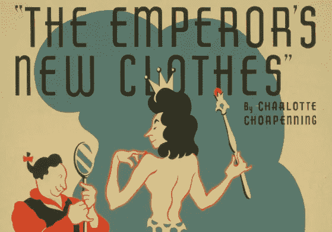
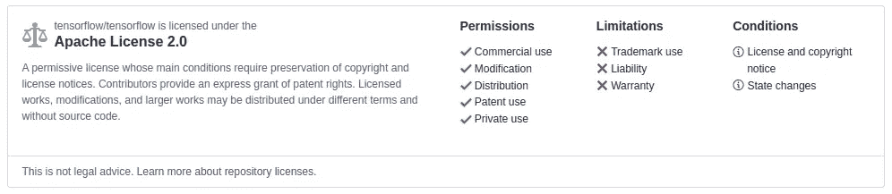
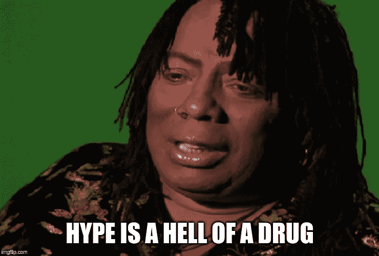

# 数据科学家告诉自己的 3 个谎言

> 原文：<https://towardsdatascience.com/3-lies-data-scientists-tell-themselves-8d29af9ccdf2?source=collection_archive---------19----------------------->

如果你浏览 [r/MachineLearning](https://www.reddit.com/r/MachineLearning/) 的话，你可能已经在过去几周看到了一些关于 Siraj Raval 的帖子，Siraj Raval 是 YouTube 上一位致力于为自己树立在线数据科学教育家名声的人物。他最近因抄袭、夸大其技能以及利用数据科学炒作赚快钱而受到抨击。

虽然 Siraj 的罪行清单是多种多样的，但我认为有一个自我欺骗的潜在主题。对自己说善意的谎言并不新鲜，数据科学也不例外；事实上，这个领域的某些方面可能会让它变得更加普遍。我思考了我的职业生涯——我所看到的——三种类型的谎言很突出。

# **谎言 1:执行代码相当于理解方法论**

在数据科学(和一般的计算机科学)中，业余和理解之间的区域可能相当灰色。举个例子，如果有人复制了一个回购，创建了一个识别手写数字的模型，是不是说明他们懂计算机视觉？我不这么认为；事实上，他们可能连 GitHub 都不懂。

那么，在什么时候我们可以说我们真正了解了一些东西——当我们已经编码了它，将它应用于不同的场景，或者研究了潜在的数学？什么时候我们对一个话题足够了解，可以把它放在简历上，申请工作，或者收费让别人向我们学习？

我 7 岁女儿的数学课很好的框定了这个问题。学生们使用自我评估将他们的能力分为三组:*我可以在别人的帮助下完成*、*我可以自己完成*和*我可以教别人*。它的数据科学版本可能是*我可以克隆它*，*我可以编码它*，*我可以派生它*。

那么你需要达到什么样的程度才能声称自己拥有一项技能呢？大多数人可能会说在*编码*和*派生*之间。这是不是意味着，如果你能导出 OLS，你就只能得到做回归的许可？看情况。如果你在为一个 Kaggle 比赛做模型，那么就开始吧:毕竟，这是你将要学习的方式。但是，假设您的结果是一家制造公司的人类安全项目的一部分。你最好对你的方法论的数学和假设有一个坚实的理解。切尔诺贝利是一个强有力的例子，说明有些人认为他们知道自己在做什么，但却没有很好地理解其中的机制。同样，我们可以很容易地合理化我们执行代码的能力等同于我们的理解，但这不是真的。

# 谎言 2:如果是在网上，那就是公开招标

如果你像我一样，堆栈溢出已经使你习惯于简单地复制、粘贴、测试，然后继续前进。然而，堆栈溢出和 GitHub 之间有着天壤之别，即版权法。我认为有一个常见的误解，即如果代码在公共回购中，那么它就在公共领域中。然而，仅仅因为你可以在公共图书馆买到《哈利·波特》,你就没有权利在车库外出售它的影印版。数据科学家需要了解版权级别和使用他人代码的常见惯例。

那么在使用别人的代码之前应该怎么做呢？首先你需要弄清楚回购是在什么样的许可下进行的。对于大多数回购，这通常是在许可证文件中，尽管我注意到 scikit-learn 回购将它们存储在一个名为 copy 的文件中。无论你在哪里找到它，这基本上是自述文件的合法版本。在那里，您应该可以看到所选择的项目许可以及适用的条件。GitHub 通常会在大多数许可文件的顶部有一个很好的可视化效果。

好吧，如果回购没有许可证，然后呢？GitHub 上的[许可页面](https://help.github.com/en/articles/licensing-a-repository)声明如下:“你没有义务选择许可。但是，如果没有许可证，将适用默认的版权法，这意味着您保留对您的源代码的所有权利，任何人都不得复制、分发或从您的作品创建衍生作品。”因此，即使是看似没有公开许可的回购也仍然受到严格的版权保护。

我强烈推荐 MattyMeck 的文章[一个数据科学家的开源许可指南](/a-data-scientists-guide-to-open-source-licensing-c70d5fe42079)给任何想了解更多的人。

# **谎言三:人气相当于同行评议**

围绕我们领域的大肆宣传意味着我们可以从几乎任何来源找到验证。有了这样源源不断的崇拜，我们很容易成为不穿衣服走来走去的皇帝，以为自己的工作无可挑剔。

社交媒体往往会加剧这种效应。比如，我有 LinkedIn 上的背书，这些人从未见过我，更不用说见过我的作品了。你可以制作一个在 Reddit 上获得好评的数据可视化，一个获得浏览量的 YouTube 视频，或者一篇获得阅读量的文章，但这种反馈并不总是与你的内容准确一致。

突击测验。哪位科技领袖被提名为*财富*年度商业人物、*时代*全球最具影响力人物之一、以及*福布斯*最具影响力人物之一？你可能会猜测史蒂夫·乔布斯或埃隆·马斯克，但答案其实是 Theranos 公司的伊丽莎白·霍姆斯。炒作和关注并不等同于你所生产的产品的质量和价值。

# 我们如何保持诚实？

Siraj 的受欢迎程度盖过了其他伟大的创作者和教育工作者，这很可悲。我最喜欢的两个学习 TensorFlow 的 YouTubers 是 [Morvan](https://www.youtube.com/user/MorvanZhou/featured) 和 [DanDoesData](https://www.youtube.com/user/dvbuntu/featured) 。可悲的是，他们俩都不再制作视频了。DanDoesData 尤其伟大；他会记录这些长达一小时的工作会议，你可以看到他遇到问题，并与错误作斗争。在他的主页视频中，他说，“我想体验安装东西的痛苦！”我喜欢这种观点:困难的事情有一种真实性。引用艾米莉·狄金森的话“我喜欢痛苦的样子，因为我知道这是真的；

所有这些都是一个很好的提醒，让我们放慢脚步，尽职尽责，不要被炒作分心。我们很容易被这个领域的激动人心所吸引。但是当兴奋变成夸张时，我们就知道我们没有朝着正确的方向前进。