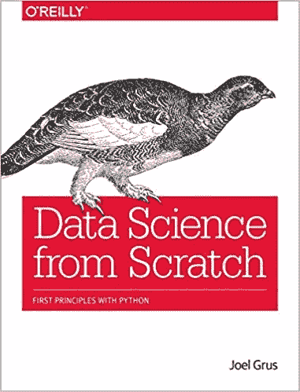
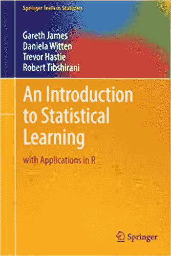
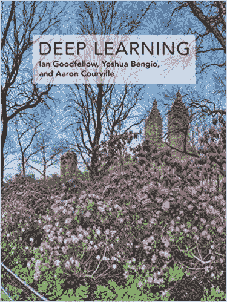

# 3 本机器学习书籍帮助我提高了水平

> 原文：<https://towardsdatascience.com/3-machine-learning-books-that-helped-me-level-up-a95764c458e3?source=collection_archive---------16----------------------->

Source: [Pixabay](https://pixabay.com/photos/book-read-old-literature-pages-1659717/)

There is a Japanese word, *tsundoku* (積ん読), which means buying and keeping a growing collection of books, even though you don’t really read them all.

我觉得我们开发者和数据科学家特别容易掉进这个陷阱。就我个人而言，我甚至收藏书签:我手机的 Chrome 浏览器有太多打开的标签，计数器被替换成了“:D”表情符号。

在我们大多数人经历的那种对阅读和学习的热情中，我们通常会以失去而告终，不知道下一本书该拿哪本。这就是为什么今天我会给你一个非常**的短列表**:就 3 本机器学习的书，这样你就不会把它标上书签就忘了。

在我作为一名数据科学家的职业生涯的不同阶段，每本书都给了我很大的帮助，尤其是在我担任机器学习工程师的时候。

书来了！

# O'Reilly:使用 Python 从零开始研究数据科学

我对这本书有很深的个人感情，因为这本书让我找到了工作。没错！在拿起这本书之前，我对数据科学几乎一无所知，甚至不知道什么是数据科学。

我确实有很强的概率和统计背景，并且知道足够多的 Python 来保护自己。然而，我错过了它实用的一面。

这本书为我做了很多事情。它:

*   向我展示了如何用 Python 高效而优雅地**处理数据(遵循 Python 的**良好实践**)。**
*   教我如何从零开始**实现**最简单的**机器学习算法**。
*   向我展示了数据科学家的日常工作可能是什么样的。
*   教我如何**清晰地向他人传达我的结果**。

如果您是数据科学社区的新手，我衷心推荐您使用它。它将为您提供成为一名高效数据科学家所需的大多数主题的清晰概述。

它还将展示 Python 最常用的库，并向您展示大量的**惯用代码**，这总是一个优点。

下面是亚马逊上 [*数据科学从头开始*](https://amzn.to/2DDhIUH) 的链接。

# 斯普林格:统计学习导论

[这本书](https://amzn.to/2ZP93YS)是我目前为止找到的最全面的**机器学习书籍**。我从中学到了很多，从**无监督学习**算法，如 [K 均值聚类](http://www.datastuff.tech/machine-learning/k-means-clustering-unsupervised-learning-for-recommender-systems/)，到**监督学习**算法，如[提升树](http://www.datastuff.tech/machine-learning/xgboost-predicting-life-expectancy-with-supervised-learning/)。

如果你已经在这个领域工作了，第一章可能会感觉有点太入门了(至少我的经验是这样)。然而，他们也总结了许多你以前可能没有以如此有条理的方式学到的东西。

然而，后面的章节是我认为这本书真正闪光的地方。它对随机森林、提升树和支持向量机的解释非常准确。

以下是您可以从*统计学习简介*中学到的一些主题:

*   **回归**和**监督学习**算法:从**线性回归**和 **SVM** 到**基于树的**方法。
*   **无监督学习**技术:尤其是聚类，包括 K-Means 算法。
*   抽样方法和其他通用机器学习**核心概念**。
*   **指标**如**准确度、召回率、精确度**等的含义、优缺点。

我认为这本书是我今年迄今为止最好的一本书，它使我成为一个更全面的数据科学家。如果你有更多的经验，但是想要打磨你的棱角，我推荐你。这也是一本非常好的参考书，放在你的书架上。

还展示了一切在 R 中的实现，我没发现特别有用，但也没什么坏处。您可能会从 SciKit learn 中导入大部分代码。

和以前一样，这里有一个亚马逊上的[斯普林格统计学习介绍](https://amzn.to/2ZP93YS)的链接。

# Goodfellow，Bengio 等人的深度学习。

这本书每次打开都让我神魂颠倒。我会第一个承认我没有真正从头到尾读过它。还没有。
它在列表中垫底的唯一原因是因为它非常**具体的范围**:人工**神经网络**或**深度学习**。

然而，它的第一章，概述了深度学习的**前身**及其不同之处，然后解释了**深度学习如何工作**，非常精彩。

它甚至从解释你在学习深度学习之前需要知道的一切**开始，整个章节都致力于**线性代数**、**概率**和**信息论**以及**数值计算**方法。**

接下来的几章，我只是读了一部分，当你需要更深入地研究一个特定的神经网络架构时，它们会成为一个很棒的参考。

它们包括对**卷积**神经网络和**递归**神经网络的深入解释，以及许多**正则化**或优化方法。

第三部分也是最后一部分，围绕着**尖端技术**，解释了**生成模型**、[自动编码器](http://www.datastuff.tech/machine-learning/autoencoder-deep-learning-tensorflow-eager-api-keras/)和许多其他有趣的算法。将它们添加到您自己的工具包中可能会给您带来很大的提升！

这本书的作者是目前机器学习领域的**摇滚明星**。他们中的一个人甚至最近获得了图灵奖，所以我想不出更好的人来教这个学科。

如果你对深度学习这本书感兴趣，这里有一个亚马逊链接。

# 结论

我从一个广泛的，介绍性的书到一个先进的，具体的书。

这些机器学习书籍中的每一本都对我的职业生涯产生了深远的影响，在某种程度上，也影响了我看待世界的方式。

我真的希望至少其中一些能对你的生活产生同样的积极影响！

如果你已经读过，或者正在读，请在评论中告诉我你对它们的看法！我很乐意进一步讨论它们中的任何一个，尤其是深度学习这本书。

如果你有兴趣，我们也可以在 [Twitter](http://twitter.com/strikingloo) 、 [dev.to](http://dev.to/strikingloo) 的 [Medium](http://medium.com/@strikingloo) 上讨论。
想听听大家的意见！

*(小免责声明:所有这些链接都是亚马逊附属链接，这意味着如果你买了这些书，我会得到一小笔佣金。然而，我只会回顾我真正读过的书，并且在现实生活中真诚地向人们推荐过的书)*

*原载于 2019 年 4 月 28 日*[*https://striking loo . github . io*](https://strikingloo.github.io/3-ml-books)*。*