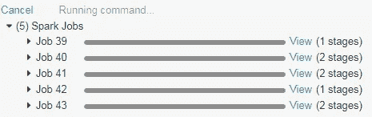

# Spark 中的 3 种并行化方法

> 原文：<https://towardsdatascience.com/3-methods-for-parallelization-in-spark-6a1a4333b473?source=collection_archive---------2----------------------->


Source: [geralt](https://pixabay.com/en/users/geralt-9301/) on pixabay

## 提升数据科学任务的速度

Spark 非常适合扩展数据科学任务和工作负载！只要您使用 Spark 数据框架和操作这些数据结构的库，您就可以扩展到分布在集群中的大规模数据集。然而，在某些情况下，库可能无法用于处理 Spark 数据帧，因此需要其他方法来实现 Spark 的并行化。本文讨论了在 PySpark 中实现并行化的三种不同方式:

1.  **原生 Spark:** 如果您使用 Spark 数据帧和库(例如 MLlib)，那么您的代码将由 Spark 进行并行化和原生分发。
2.  **线程池:**[多处理库](https://docs.python.org/3/library/multiprocessing.html)可以用来运行并发 Python 线程，甚至可以用 Spark 数据帧执行操作。
3.  **Pandas UDF:**Spark 中的一个新特性，支持在 Spark 环境中对 Pandas 数据帧进行并行处理。

我将使用 [Boston housing](https://scikit-learn.org/0.16/modules/generated/sklearn.datasets.load_boston.html#sklearn.datasets.load_boston) 数据集作为样本数据集，提供在 PySpark 中实现并行性的每种不同方法的示例。

入门之前，it；在 Spark 中区分并行和分布是很重要的。当一个任务在 Spark 中被并行化时，这意味着并发任务可能在驱动节点或工作节点上运行。如何在集群中的这些不同节点之间分配任务取决于您使用的数据结构和库的类型。Spark 中有可能没有分布的并行，这意味着驱动程序节点可能执行所有的工作。这种情况发生在我下面讨论的 scikit-learn 线程池的例子中，如果可能的话应该避免。当一个任务分布在 Spark 中时，这意味着被操作的数据分散在集群中的不同节点上，并且任务是并发执行的。理想情况下，您希望创作并行和分布式的任务。

本教程中给出的例子的完整笔记本可在 [GitHub](https://github.com/bgweber/StartupDataScience/blob/master/EDA/PySpark_Parallel.ipynb) 上获得，笔记本的渲染图可在[这里](http://alumni.soe.ucsc.edu/~bweber/PySpark_Parallel.html)获得。我使用 Databricks 社区版编写了这个笔记本，之前在我的 PySpark [介绍文章](/a-brief-introduction-to-pyspark-ff4284701873)中也提到过使用这个环境。

## 单线程

在展示 Spark 中的并行处理之前，让我们从基本 Python 中的单节点示例开始。我使用波士顿住房数据集建立了一个回归模型，使用 13 种不同的特征来预测房价。下面的代码显示了如何加载数据集，并将数据集转换为 Pandas 数据框。

Loading the Boston housing data set

接下来，我们将数据集分成训练组和测试组，并将每个组的特征从标签中分离出来。然后，我们使用 *LinearRegression* 类来拟合训练数据集，并为测试数据集创建预测。下面代码片段的最后一部分显示了如何计算实际房价和预测房价之间的相关系数。

Building a regression model with scikit-learn

我们现在有一项任务需要并行处理。对于本教程，并行化任务的目标是同时尝试不同的超参数，但这只是使用 Spark 可以并行化的任务类型的一个例子。

## 天然火花

如果您使用 Spark 数据帧和库，那么 Spark 将本机并行化和分布您的任务。首先，我们需要将 Pandas 数据框转换为 Spark 数据框，然后将要素转换为 MLlib 所需的稀疏矢量表示。下面的代码片段显示了如何对住房数据集执行这项任务。

Converting the data frame from Pandas to Spark and creating the vector input for MLlib

一般来说，在将数据转换成 Spark 之前，最好避免将数据加载到 Pandas 表示中。而是使用 *spark.read* 等接口将数据源直接加载到 spark 数据框中。

既然我们已经准备了 Spark 格式的数据，我们可以使用 MLlib 来执行并行拟合和模型预测。下面的代码片段显示了如何实例化和训练一个线性回归模型，并计算估计房价的相关系数。

Building a regression model with MLlib

在 Databricks 环境中对 Spark 数据框进行操作时，您会注意到单元格下方显示了一个任务列表。该输出表明任务正在被分配给集群中的不同工作节点。在单线程示例中，所有代码都在驱动程序节点上执行。



Spark jobs distributed to worker nodes in the Cluster

我们现在有一个并行的模型拟合和预测任务。然而，如果我们还想同时尝试不同的超参数配置呢？您可以手动完成这项工作，如下两节所示，或者使用在 Spark 中本地执行这项操作的 *CrossValidator* 类。下面的代码显示了如何使用交叉验证来尝试不同的弹性网络参数，以选择性能最佳的模型。

Hyperparameter tuning using the CrossValidator class

如果 MLlib 拥有构建预测模型所需的库，那么通常可以直接并行化任务。但是，您可能希望使用不包含在 MLlib 中的算法，或者使用不直接处理 Spark 数据框的其他 Python 库。这就是线程池和熊猫 UDF 变得有用的地方。

## 线程池

不使用 Spark 数据帧而在 Spark 中实现并行的方法之一是使用多处理库。该库提供了一个线程抽象，您可以使用它来创建并发执行线程。但是，默认情况下，所有代码都将在驱动程序节点上运行。下面的代码片段显示了如何创建一组并行运行的线程，它们是随机森林的不同超参数的返回结果。

Using thread pools for parallelizing hyperparameter tuning

这种方法通过在线程池上使用 map 函数来工作。map 函数将 lambda 表达式和值的数组作为输入，并为数组中的每个值调用 lambda 表达式。一旦所有线程完成，输出显示每个线程的超参数值( *n_estimators* )和 R 平方结果。

```
[[10, 0.92121913976894299],  
 [20, 0.92413752558900675],  
 [50, 0.92705124846648523]]
```

以这种方式使用线程池是危险的，因为所有的线程都将在驱动程序节点上执行。如果可能的话，在使用线程池时最好使用 Spark 数据帧，因为这样操作将分布在集群中的工作节点上。使用线程池的 MLib 版本如下例所示，它将任务分配给工作节点。

Using thread pools with MLLib

## 熊猫 UDF

Spark 中支持并行处理的新特性之一是 Pandas UDFs。使用此功能，您可以将 Spark 数据框划分为较小的数据集，这些数据集被分发并转换为 Pandas 对象，在这些对象中应用您的函数，然后将结果合并回一个大的 Spark 数据框。本质上，Pandas UDFs 使数据科学家能够使用基本的 Python 库，同时获得并行化和分布的好处。我在我的 PySpark [介绍帖子](/a-brief-introduction-to-pyspark-ff4284701873)中提供了这个功能的例子，我将在 2019 年 Spark 峰会上[展示【Zynga 如何使用功能。](https://databricks.com/sparkaisummit/north-america/sessions-single-2019?id=113)

下面的代码显示了使用 scikit-learn 时如何执行并行化(和分布式)超参数调整。该脚本的第一部分获取波士顿数据集并执行交叉连接，从而创建输入数据集的多个副本，并向每个组附加一个树值( *n_estimators* )。接下来，我们定义一个 Pandas UDF，它将一个分区作为输入(这些副本中的一个)，并作为结果转换一个 Pandas 数据帧，指定被测试的超参数值和结果( *r 平方*)。最后一步是执行并行计算的 groupby 和 apply 调用。

Parallelizing scikit-learn with Pandas UDFs

使用这种方法，结果类似于使用线程池的方法，但主要区别在于任务分布在工作节点上，而不是只在驱动程序上执行。示例输出如下:

```
[Row(trees=20, r_squared=0.8633562691646341), 
 Row(trees=50, r_squared=0.866335129308371), 
 Row(trees=11, r_squared=0.8257884742588874)]
```

## 结论

将 PySpark 用于数据科学时，有多种方法可以实现并行。如果可能，最好使用本地库，但是根据您的用例，可能没有可用的 Spark 库。在这种情况下，可以使用线程池或 Pandas UDFs 在 Spark 环境中并行化您的 Python 代码。只是要小心你如何并行化你的任务，如果可能的话，试着分配工作负载。

[本·韦伯](https://www.linkedin.com/in/ben-weber-3b87482/)是 Zynga 的首席数据科学家。我们正在[招聘](https://www.zynga.com/careers/positions/categories)！