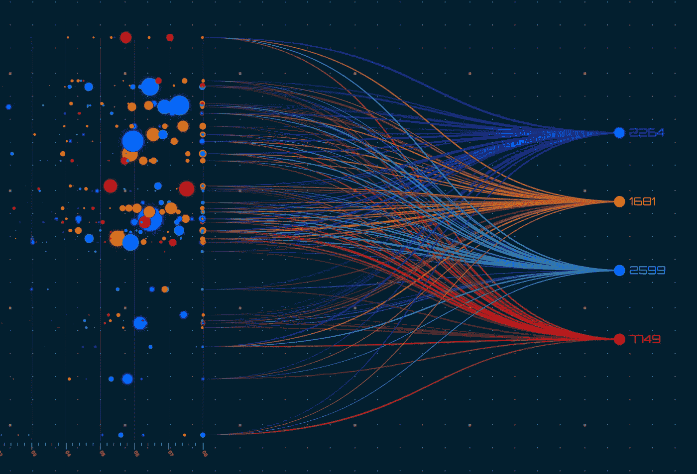
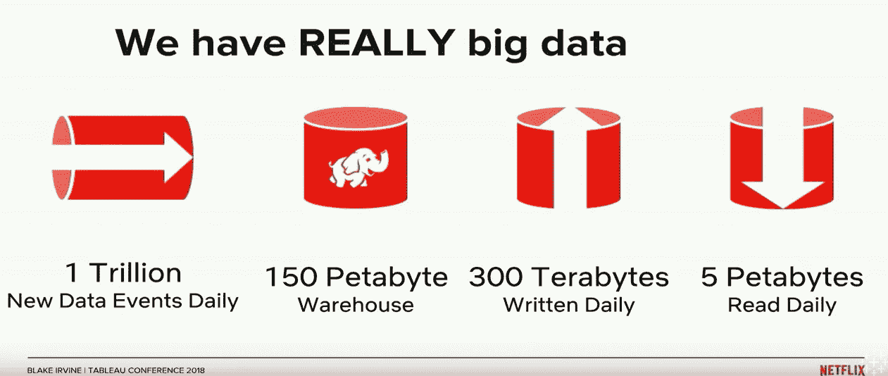
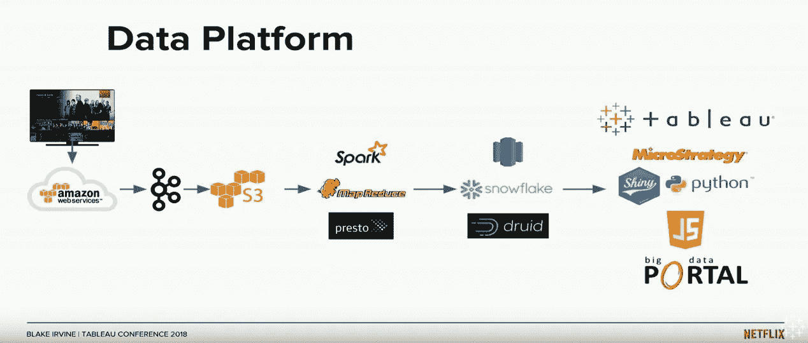
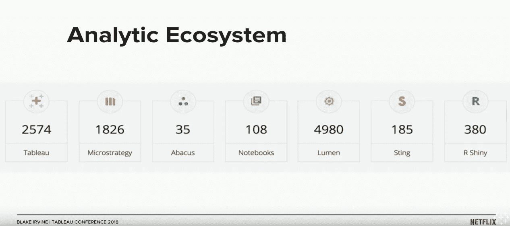
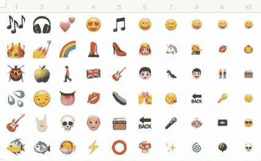
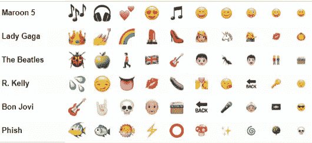

# 网飞、Spotify 和家得宝赢得了 2018 年 Tableau 大会

> 原文：<https://towardsdatascience.com/3-must-see-recorded-sessions-on-data-analytics-75ae83ffe550?source=collection_archive---------20----------------------->

*将 TC18 的三个最佳数据分析演示集中在一起。*

Gary Killian Vectors; Shutterstock

经过 439 场会议的筛选，我找到了 Tableau Conference 2018 (TC18)中我最喜欢的三场演讲。网飞、Spotify 和家得宝是我的赢家！在这篇文章中，我将深入每个演示并提供关键要点。

Tableau 是领先的数据可视化商业智能工具，他们每年都举行会议庆祝一切数据。我认为大部分会议都属于两种情况之一。1)教你如何更好的做 Tableau。2)一家分享他们如何在数据分析领域取得惊人成就的公司。

在这篇文章中，我们将关注第二个方面——公司数据故事。我做了很多很多演示，为你提供最好的。所以你可以残酷地对待你的时间，不要把它浪费在尿壶演示上(*见文章结尾*)。

此外，为了提高帖子的强度，我会给各种公司颁发假奖。

# **网飞**

## 主持人:[布莱克·欧文](https://www.linkedin.com/in/blakeirvine) |科学经理&分析

## 最佳狂欢演讲奖

YouTube 浏览量:932 |时间:54 分钟(包括问答)

**Binging on Data: Enabling Analytics at Netflix; TC18; YouTube**

他们不仅用他们的原创杀死它，网飞倾向于可靠地上演一场伟大的会议。对于一家不愿分享高水平观众人数的公司来说，他们肯定喜欢在 TC 拉开帷幕。

**要点 1:** 网飞是大数据重量级冠军，但他们仍然对自己面临的挑战保持谦逊。

**Binging on Data: Enabling Analytics at Netflix; TC18; YouTube**

以我的经验来看，Tableau 在你能够提取数据的时候是最好的。人们不能简单地提取 300 的数据并开始构建仪表板。他们涵盖了许多处理大数据的方法，包括一个名为 [druid](http://druid.io/) 的开源产品和一个让员工运行 SQL 查询的内部解决方案，该查询将输出作为 Tableau 数据提取推送到服务器。

对大多数人来说，网飞拥有的数据量绝对是惊人的。有趣的测试——在书上做标记，25 年后给人们看这张幻灯片——可能会像软盘上的空间一样可笑。

尽管他们在大数据方面做得很好，但他们也承认遇到了瓶颈，仍然必须在速度和规模之间做出选择。

**关键要点 2:** 网飞生活在重数据的初创企业文化中。

测量和实验是这家公司的支柱。大约 10%的员工在专门的数据分析团队工作。大约 50%的员工(5，000 人中的 2，574 人)访问过 Tableau 仪表盘。这是他们的数据分析堆栈和分析生态系统:

**Binging on Data: Enabling Analytics at Netflix; TC18; YouTube**

**Binging on Data: Enabling Analytics at Netflix; TC18; YouTube**

Lumen 和大数据门户是内部解决方案。该演示在大数据门户中占有重要地位(将在下面详细讨论)。

我发现有趣的是，他们所有的数据都是从 AWS 开始的。

**关键要点 3:** 网飞暗地里是数据治理的忍者

在每一次 Tableau 会议上，都有 50 多个类似于*的故事:“每个人都在使用 Excel，然后我们引入了 Tableau，现在公司变得更好了。”TC 的叙述已经变得如此乏味，我几乎决定忽略这些介绍。然而，今年我确实注意到了第二种说法，即*“我们的公司是封闭的，每个人都在做自己的事情，到处都是数据和报告，却不知道该相信什么。”**

布莱克提到了用数据解放企业的双刃剑。结果是许多许多的报告和表格。它们像兔子一样繁殖。然而，通过他们的内部解决方案、大数据门户和其他各种努力，他们似乎在这个问题上遥遥领先。

大数据门户允许用户首先搜索公司中所有现有的项目和表格，以查看他们正在寻找的内容是否已经存在。如果没有，他们可以进入第二步，开始编写查询或构建项目。

# Spotify

## 演讲者:[斯凯勒·约翰逊](https://www.linkedin.com/in/skyler-johnson-4b790b104) |数据可视化设计师

## 最佳数据故事奖

YouTube 浏览量:433 |时间:28 分钟

This is Not a Love Song | How Spotify uses Tableau Public; TC18; YouTube

**要点 1:** Spotify 正在做更多公司需要做的事情。与公众分享很酷的数据故事。

斯凯勒强调了 Spotify 分享的一些很酷的故事，比如当真正的月食经过时，人们会播放关于该地区月食高峰期的歌曲。

**关键要点 2:** 文本和语言处理需要始终考虑包括表情符号。它们现在是我们语言的一部分。

你知道哪些表情符号最常与你最喜欢的艺术家联系在一起吗？Spotify 将艺术家发布在他们平台上的表情符号转化为游戏。你能猜出这些十大表情横排的艺术家吗？

**没有答案**

Spotify Interests; Tableau Public

**带答案**

Spotify Interests; Tableau Public

是的，我是有争议的，包括 R·凯利。只是觉得表情符号太离谱了。

**关键要点 3:** 激情胜过多年经验。

对斯凯勒来说，做自己热爱的事情帮助他在 Spotify 找到了梦想中的工作。斯凯勒热爱音乐。斯凯勒在业余时间使用公开的 Spotify API 讲述了惊人的数据故事。最终，Spotify 把他招进了公司，让他成为一名员工。他在演讲开始时提到，他使用 Tableau 才三年。然而，他在 Tableau 公共平台上拥有一些最受欢迎的数据可视化。

# 家得宝

## 主讲人:[大卫·贝利](https://www.linkedin.com/in/david-berry-567a5444) |商业智能领袖& [蔡斯·齐曼](https://www.linkedin.com/in/chaseczieman) |分析和数据科学领袖

## 最佳规范分析和双关语同时使用奖

YouTube 浏览量:307 |时间:57 分钟(带问答)

Not Tooling Around; YouTube

**要点 1:** 加强业务关系或反馈回路的一个好方法是通过仪表板。

家得宝拥有一家名为[Blinds.com](https://www.blinds.com/)的公司。Blinds.com 实际上并不生产百叶窗。他们的产品有很多供应商。为了建立更好的关系和反馈回路，他们向供应商提供了一个 Tableau 仪表板。

这里的一个要点是，他们提到他们的供应商并不总是最懂技术的。他们有意将 Tableau 仪表板设计成可以轻松地推送到静态 PDF 并像传统记分卡一样共享的东西。显然，能够与一个活动的仪表板进行交互是首选，但是，不能总是期望观众以这种方式与仪表板互动。

**关键要点 2:** 如果你有一个网站，你应该从你的点击流数据中建模。

Blinds.com 将这个数据集与他们已经知道的关于客户的一切联系起来。这些算法能够指出并发现网站、客户体验的改进机会，或者客户自己是否容易犯错误。

**关键要点 3:** 归根结底，判断一个模型不是看它的准确性，而是看它对公司的影响。

当该算法选择要审查的订单、预计会有问题的订单时，它会根据业务的预期成本对它们进行排序。

Chase 提到，你可以通过许多不同的 KPI 来判断一个模型，但该模型最重要的事情是降低成本，帮助公司做得更好——所以他们通过再订购概率乘以预期再订购成本来判断他们的模型。这为他们提供了一个业务可以利用的可行指标。

# **结论**

这是我最喜欢和最值得花时间的三次会议。我想继续下去，并删除链接，所以如果你想，你可以探索剩下的 436 个会议。

[Tableau 大会 2018 届库](https://tc18.tableau.com/learn/sessions)

另外，由于我看了很多这样的视频，我想分享一些其他公司的会议，这些会议被考虑但没有通过(但仍然值得一个假奖)

**未入围奖项:**

强生|最佳实施累奖，*《我们比 Excel 电子表格更好》*故事

Google-Nest |每个人都希望会议被记录下来，但却没有

脸书|在*比赛中获得第一名“我来是为了留下深刻印象，但我却看到了小便池的幻灯片*(他们是唯一一个参赛的)

波音|最美丽和最丑陋仪表板奖

阿尔伯塔健康|最积极使用停车灯配色方案奖

运行迪士尼|最佳深入挖掘平庸数据奖

波特兰开拓者队|将球队色彩融入每一个可能的场景的奖项