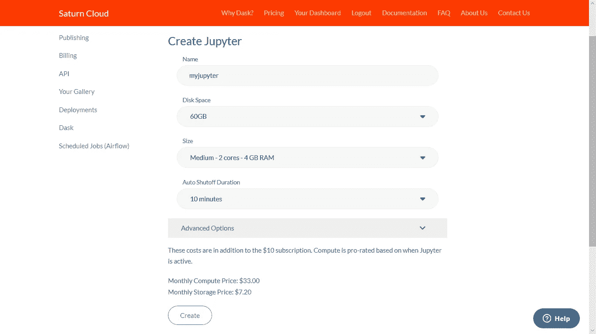

# 企业界关于数据科学的 3 个神话

> 原文：<https://towardsdatascience.com/3-myths-about-data-science-in-the-corporate-world-1321c48c4a40?source=collection_archive---------27----------------------->

## 如何在没有成本、风险或痛苦的情况下将数据科学整合到您的项目中

虽然我们可能同意数据科学只是一个朗朗上口的术语，但其潜在的概念有着坚实的基础。数据科学包括用于处理、分析和从信息中提取有用知识的所有方法和技术，主要通过统计学、机器学习和人工智能的手段。虽然现在的重点是机器学习和人工智能，但实际上它作为一种统计分析工具的基本用法让普通用户感兴趣。

早在 50 年代计算机时代开始时，数据分析就已经存在(计算机的第一个非科学应用与人口普查分析和统计有关)，并且在过去的 20 或 30 年中得到广泛应用。如果数据分析是商业和企业界的老玩家，为什么它现在如此重要？原因是，现在技术可用性、成本和工具的组合已经收敛到一个可以真正被每个人采用的点。

让我们举一个技术的例子。自 1981 年索尼推出索尼 Mavica 以来，数码相机就一直存在。但直到 90 年代末，数码相机的成本、可用性和可靠性才让大众可以使用它们。

这个转折点已经发生在数据科学上，因为现在这种技术可以以经济高效的方式应用。就工具的成本和可用性而言，当前的技术水平简化了开发和使用，直到采用它是有利可图的。

这些要点乍看起来可能并不明显，人们通常认为数据科学是为复杂和前沿的环境保留的。在你对这个领域有所了解之前，我可以列举三个最常见的误解。

## 误解一:我的项目/团队不需要数据科学

我们可以发现不同的部门和团队在极其不同的背景下处理和分析数据。不管是销售、营销、工程、运营还是物流。每个人都需要分析他们的数据，从中提取知识，分享和交流这些发现，以改善业务运营。

大多数情况下，使用简单的电子表格来分析数据(这绝对不是正确的工具，尤其是当您处理大量数据时)。拥有计算技能和资源的团队和部门有时可以使用更复杂的工具，如定制编程。

在与技术无关的纯业务部门，一些数据挖掘和商业智能工具一直应用于公司报告的数据。数据分析并不新鲜，它在商业和公司世界中被不断地应用。

数据科学改变了这种方法。现在有了像 Jupyter 笔记本电脑这样的技术，任何计算机技能有限的人都可以有效地处理大量数据。数据展示和图表也更容易生成，曾经为技术含量高、资金充足的部门保留的总成本已经下降到适合每个预算的程度。

> 焦点不再是报告，而是从数据中获取有用的知识，让团队提供价值而不是报告。

## 误解二:数据科学是我所在行业不需要的前沿技术

Python 和 Jupyter 笔记本带来的是数据分析的极大简化。Jupyter 笔记本减少了定制分析的所有痛苦，任何具有基本开发技能的人都可以使用更好的环境来分析数据。实际上，使用任何其他方法，包括 BI 工具，都要复杂和昂贵得多。

> Jupyter 笔记本大大降低了与数据分析相关的复杂性和成本。在短短几年内，它们已经成为事实上的标准和数据科学的通用语言。

如果在您的团队或项目中，您经常使用电子表格来分析数据，那么很有可能存在整合数据科学的空间。这不仅仅是选择一个新工具的问题，它实际上可以帮助您提供比标准电子表格和商业智能工具更多的价值。

经常发现的一个障碍是，数据科学似乎是专家的专利。媒体充满了复杂的解释和算法，但对于一般的商业用户来说，将简单的统计数据纳入大型数据集并获得探索和操作数据的灵活性的可能性，比更复杂的人工智能算法具有更大的价值。

数据科学对新人来说可能是令人生畏的，尤其是在企业界，但在现实中，它只是一种处理和分析数据的更智能的方法，可以有效地克服所有电子表格在灵活性和性能方面的限制。数据可视化也得到了极大的改善，因为 Jupyter 笔记本在图形方面的灵活性令人震惊，这要归功于 Matplotlib 图形库。

确实，您的团队需要获得一些新技能，但是这些实际上并不比预先使用电子表格中使用的宏和脚本语言难太多。转型后的回报是巨大的。

## 误解三:我需要建立基础设施，实施和维护成本高昂

现实是，你不需要基础设施(实际上你应该避免它)。虽然您可以在员工电脑或公司服务器上部署本地 Jupyter 笔记本电脑，但这并不是开始数据科学项目的最佳方式。您正在创造一个需要实施、维护和支持的薄弱环境，所有这些都意味着成本。内部部署也无助于专注于核心业务。

SaturnCloud.io provides scalable cloud infrastructure for Python DataScience in one click

如上所述，本地部署会带来隐性成本，更糟糕的是，它们不会促进团队合作、协作和数据共享。不要犯错，数据分析是为了迭代，在团队中工作，探索不同的方法来分析和理解数据。这完全是关于协作和迭代。

> 协作和敏捷性是数据科学项目成功的关键。基础设施必须保持在最低水平。云解决方案非常适合。项目必须是小型的，并且有团队共享的具体目标。

集中部署肯定是可能的(所有涉及的技术都是开源的)，但在实施和维护方面，这将带来更大的隐性成本。安全性和备份等问题也需要考虑。我在过去已经这样做了，虽然它是可行的，但它实际上变成了“另一种服务”来维护。

实施数据科学项目的一个更聪明的方法是利用现有的云服务，如 [SaturnCloud.io](https://www.saturncloud.io/?source=me-1) 。我喜欢这项云服务的一点是，只需一次点击就可以部署基础设施，它从零开始促进协作，并允许扩大和缩小我们的项目，这是内部解决方案难以实现的。云服务还消除了处理软件和库依赖、更新、安全和备份的需要。

笔记本可以通过链接共享，甚至可以与第三方、合作者、客户甚至普通大众共享。如果您的项目增长，并且您想要使用您的私有云，您也可以这样做。

云再次让事情变得更简单、更便宜、更快速，因为您可以避免内部基础架构和服务部署的零附加值活动，同时提供一个易于维护的实时环境，这也有助于协作。我非常支持尽可能减少拥有的基础设施，因为经验表明，使用专业基础设施比拥有它更容易、更便宜。

## 摘要

让您的项目和团队具备数据科学能力比您想象的要容易得多。你不需要基础设施，也不会被互联网上许多文章的复杂性和理论性所吓倒。数据科学就是分析数据，只需使用简单的统计数据就能获得出色的结果。

考虑在你的团队中拥有合适的技能组合，并确保促进协作。Jupyter 笔记本促进迭代，在迭代中，数据被逐步分析，许多不同的线可以被探索和共享。使用云服务将降低隐性成本，确保可用性和灵活性，最重要的是，将从第一天起促进任何数据分析活动所需的协作环境。