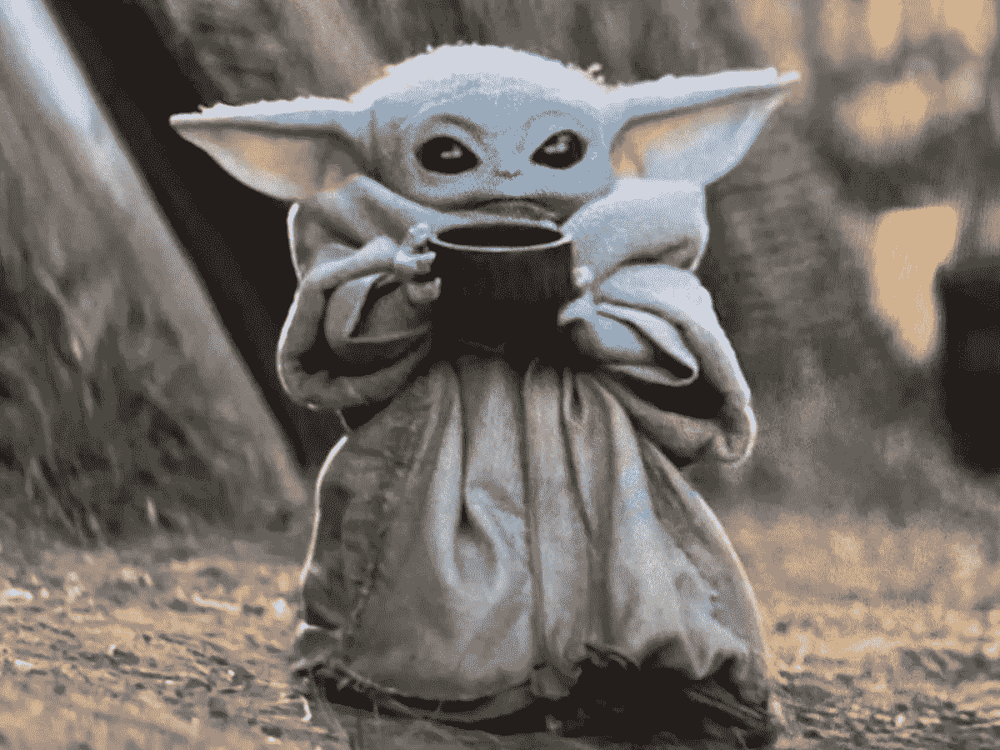
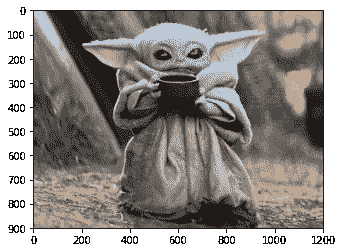
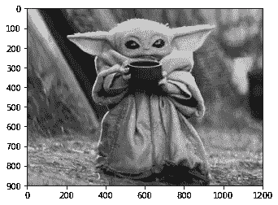
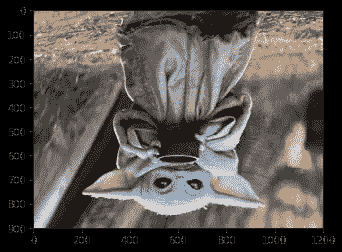
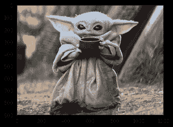
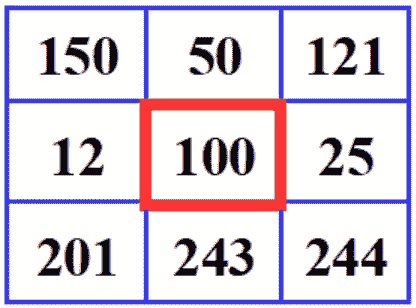
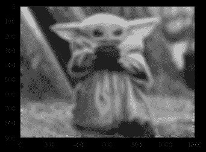

# 尤达宝宝上的 3 次 Numpy 图像变换

> 原文：<https://towardsdatascience.com/3-numpy-image-transformations-on-baby-yoda-c27c1409b411?source=collection_archive---------16----------------------->

## 互联网已经失去了对小尤达的集体意识，这是有充分理由的。我是说…看看他。

我最近在帮助我的一些学生准备他们的 Python 期末考试，并认为在流行的 Python 库 Numpy 中学习一些基本的图像处理会很有趣，使用 baby Yoda 作为我们的源材料。

## 使用 Numpy 读取图像

首先，我们如何使用 Numpy 读取图像？事实证明，这很简单！假设您的工作目录中有一个名为 *baby_yoda.jpg* 的文件，下面是您需要的代码。

Read and show an image in Python

我们应该看看我们的小尤达:

## 但是 Python 是如何表示图像的呢？

现在，为了真正理解我们将要做的五种图像转换，我们应该对图像如何在 Python 中表示有一个基本的概念。

一幅图像基本上是一个 ***大、像素为矩形网格的*** 。并且，每个像素完全由三个值定义:红色、绿色和蓝色(RGB)。这些值中的每一个都是 0 到 255 之间的整数。该值越高，图像中的颜色就越多。

在一个极端，我们有一个 RGB 值(0，0，0)的像素，这意味着该像素中绝对没有颜色，也就是黑色。在另一个极端，我们有一个具有最大 RGB 值(255，255，255)的像素，这意味着图像中有尽可能多的颜色，也就是白色。你能想象到的每一种颜色都介于两者之间。

如果您的图像大小为 100 像素乘 200 像素，Python 会将整个图像编码成一个三维 Numpy 数组，其尺寸为 **100 乘 200 乘 3** 。3 对应的是我们之前提到的三个颜色通道。通过发挥这个三维数字阵列的创造性，我们可以对我们的图像进行各种各样的酷的变换！

## 1.灰度

首先，我们将把小尤达的彩色图像转换成灰度图像。请注意，我们称之为“灰色”的所有颜色都是简单的 RGB 组合，其中红色、绿色和蓝色的值正好是**相同的**。例如，RGB (60，60，60)是一种灰色，而(200，200，200)是另一种灰色。

嗯……我们如何将一个 RGB 值为(60，100，200)的像素转换成一个灰色像素？一个基本的想法是取三个数字的平均值，然后选择三个数字都是这个平均值的灰色阴影。因此，对于像素(60，100，200)，平均值为 120，因此我们将其映射到灰色像素(120，120，120)。

让我们看看如何用代码实现这个结果！

为了解释这里的一些微妙之处:

*   对于三维数组，有多种方式来解释“取平均值”。例如，我们可能打算对数组中的每个数字取平均值，得到一个数字。我们可能指的是每行的平均值、每列的平均值或每个像素的平均值。因此，我们需要使用“axis”关键字来指定我们想要的平均值。在这种情况下，它是像素的平均值。
*   一旦我们得到了平均值，我们就需要将这些平均值“堆叠”起来，以创建灰度图像。另一种思考方式是，我们希望将每个像素的红色、绿色和蓝色值设置为该像素的平均值。
*   注意，任何像素的 RGB 值的平均值可能不是整数，但是 Numpy 希望图像中是整数，所以我们将简单地将灰度图像转换回整数。

而且…如果一切顺利，我们应该会得到仍然可爱的灰度豹宝宝尤达:

**2。水平/垂直翻转**

我们可能还想水平或垂直翻转我们的小尤达。后退一步，让我们看看如何反转一个普通的数字列表。

如果我有*list _ of _ num*，它们是[1，2，3，4，5]，运行以下命令:

*数字列表[::-1]*

会产生相反的列表:[5，4，3，2，1]。

解释一下 *[::-1]* ，它是 *[0:len(list_of_nums)，-1]【T9]的简写，上面写着:*

“遍历我的整个列表，步长为-1”，更简单的意思是“向后遍历我的列表”

我们也可以使用这种方便的符号来翻转整个图像。下面是垂直翻转的代码:

Vertically flip an image in Python

由于行是我们的图像(这是一个三维数组)的第一个轴，我们可以简单地对整个图像使用相同的 *[::-1]* 变换，我们将颠倒所有行的顺序。颠倒行的顺序与垂直翻转图像是一样的，会产生颠倒的婴儿尤达:

水平翻转我们的图像也很简单，使用下面的代码:

哇哦。混乱的语法是怎么回事: *[:，::-1]* 。这也是 *[0:numRows，0:numCols:-1]* 的简写，意思是“遍历我的所有行，并以相反的顺序遍历我的所有列”。这具有保持行原样的效果，但是翻转列，导致水平翻转:

## 3.模糊图像

最后，让我们来看看一个稍微复杂一点的变形，模糊。

对于图像来说，模糊是一个非常直观的概念。当你的相机没有对准焦点，或者有东西移动得太快，相机无法准确捕捉时，就会发生这种情况。事实证明，我们可以对我们的小尤达图像进行变换，以创造这种模糊效果。

首先，让我们看看数学上“模糊”一个像素是什么意思。在下图中，我们有一个红色的中心像素。我们在像素周围创建一个小方框，用蓝色标出。为了“模糊”中心像素，我们将取较大的蓝色框中所有像素的**平均值，并将该平均值设置为等于中心像素的新值。**

对婴儿尤达图像中的每个像素进行这种变换(除了边界上的像素，因为我们不能创建这些方框)，我们使每个像素都包含了附近像素的信息。因此，像素不再是独立的**，而是彼此“模糊”在一起。**

**让我们来看看实现这一点所需的代码。**

**看起来有点吓人！希望这些评论能有所帮助，但总体想法是:**

*   **在我们制作的婴儿尤达的灰度版本上工作(为了简单起见)**
*   **对于图像中的每个像素，在像素周围定义一个小方框**
*   **取该框中所有像素的平均值，并将该值设置为新的像素值**
*   **通过将三张模糊图像叠加在一起来重建图像**

**结果是:**

****

**有点模糊，但还是很可爱。如果你仔细看，你可以看到图像周围的小边界没有受到模糊的影响。**

**就是这样！希望你在 Numpy 中学到了一些关于图像处理的知识，并再次爱上了小尤达。**

**~祝你好运！**