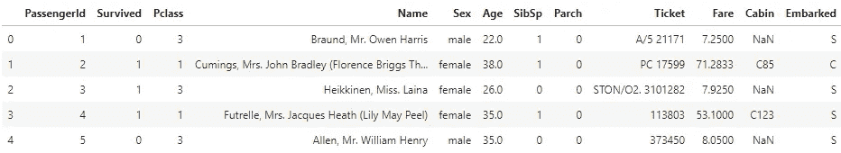
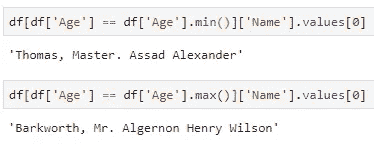
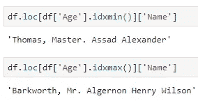
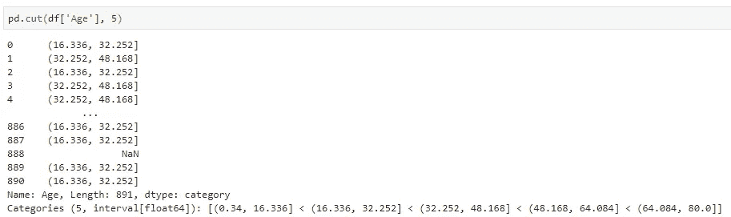
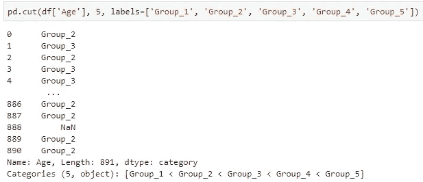
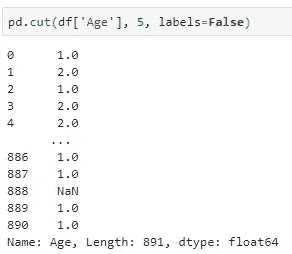
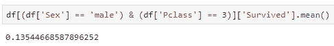
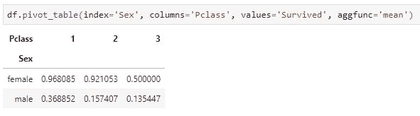
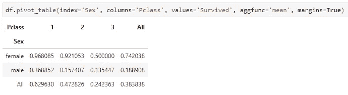

# 你应该更经常使用的 3 个熊猫功能

> 原文：<https://towardsdatascience.com/3-pandas-functions-you-should-be-using-more-often-696b41e8d7ca?source=collection_archive---------3----------------------->

## 不可否认，熊猫是一个强大的图书馆。如果您是 Python 的日常用户，它可能是您最喜欢的用于数据分析和一些快速可视化的库。

Photo by [Stan W.](https://unsplash.com/@stanyw?utm_source=medium&utm_medium=referral) on [Unsplash](https://unsplash.com?utm_source=medium&utm_medium=referral)

也就是说，人们很容易习惯于熊猫的一些核心概念，而忽略了对其功能的进一步探索。我的意思是，**谁没有重复发明轮子的罪过？**虽然这不一定是一件坏事(*因为你确切地知道你的代码应该做什么*)，但通常有更聪明的方法来达到同样的目的。

今天，我想和你们分享 3 个功能，到目前为止，我没有尽可能多地使用它们，我还想向你们展示我所说的“重新发明轮子”的确切含义。几周前，我写过一篇类似的文章，只与纯 Python 相关。如果你是一个经常重复发明轮子的人，请不要犹豫去看看:

 [## 面向数据科学家的 3 个高级 Python 函数

### 不要重复发明轮子，让你的代码更干净，更易读。

towardsdatascience.com](/3-advanced-python-functions-for-data-scientists-f869016da63a) 

好了，说够了，让我们开始研究熊猫吧。

# 使用的数据集

正如我的许多文章一样，我将使用著名的[泰坦尼克号数据集](https://raw.githubusercontent.com/datasciencedojo/datasets/master/titanic.csv)。我相信您知道如何导入它，所以在继续之前，您应该准备好以下内容:

***我们在同一页吗？*** 好，我们开始吧。

# 1.idxmin()和 idxmax()

简而言之，这些函数将返回所需条目的 ID ( *索引位置*)。在泰坦尼克号的例子中，也许你想找到最年轻/最年长的人的索引位置。让我们更进一步，你只对那个人的名字感兴趣。

一个典型的程序员方法是重新发明轮子，因为你不知道 ***idxmin()*** 和 ***idxmax()*** 的存在。这里有一种方法:

您基本上是为所需的属性设置子集并返回值。不是最干净的代码，但可能更糟。下面是如何利用前面提到的功能来实现这一点:

是的，很明显，结果是一样的，但是代码更短，更清晰。让我们进行下一个。

# 2.切割()

用最少的话来说，当你想把值装入离散区间时，你应该使用 ***cut()*** 。比如泰坦尼克号数据集有这个 ***年龄*** 属性，是连续的。在您的分析中，您可能希望计算某个年龄组的存活/死亡比率，而不是作为标量值的年龄。

我甚至不会尝试用这个函数来重新发明轮子，让我们直奔主题。其思路是将 bin*列分成 5 个桶:*

**

****不喜欢那些股票标签？*** 不成问题:*

**

*或者你根本不在乎标签什么的，想要简单的整数表示:*

**

*无论您选择哪一个，您都可以将整个表达式分配给数据框架中的一个新列，并继续您的分析。*

# *3.数据透视表()*

*数据透视表创建一个电子表格样式的数据透视表作为数据框架。如果你以前使用过 *Excel* ，我毫不怀疑你使用过它们。不用说，它们可以毫不费力地用 Python 实现。*

*假设你想知道第三类男性的平均存活率。您可以使用默认的 Pandas 及其过滤功能来获取这些信息:*

**

*但是如果你想找到男性和女性的平均存活率呢？在所有三种乘客级别中？数据透视表拯救世界。您可以简单地将索引设置为 ***性别*** ，列设置为 ***Pclass*** (乘客类)，值设置为 ***幸存*** ，然后使用您想要的任何聚合函数，但是让我们坚持使用*的含义*:*

**

*嗯，那很简单。还有一点需要注意，您还可以为**总计**添加额外的一行:*

**

# *在你走之前*

*这三个功能应该会让你走上正轨。最终的目标是花更多的时间去思考什么是最佳的做法，而不是花太多的时间在实现本身上。*

*每当你觉得你的代码比它应该的要长，使用谷歌来寻找是否有一个更短的方法。很可能已经有一个功能可以做你需要的事情，但是你没有意识到它的存在。*

****感谢阅读。欢迎在下面分享你的想法和评论。****

*喜欢这篇文章吗？成为 [*中等会员*](https://medium.com/@radecicdario/membership) *继续无限制学习。如果你使用下面的链接，我会收到你的一部分会员费，不需要你额外付费。**

* [## 通过我的推荐链接加入 Medium-Dario rade ci

### 作为一个媒体会员，你的会员费的一部分会给你阅读的作家，你可以完全接触到每一个故事…

medium.com](https://medium.com/@radecicdario/membership)*