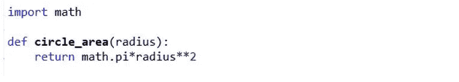
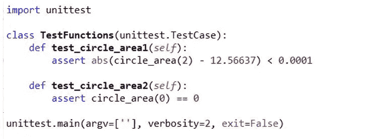
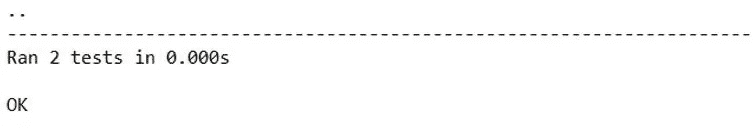
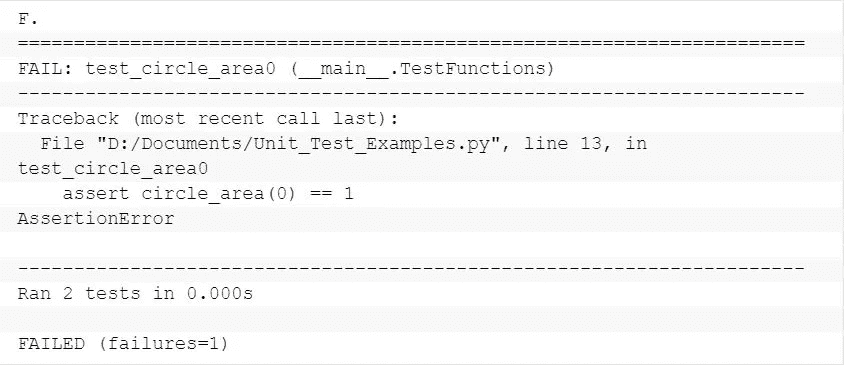
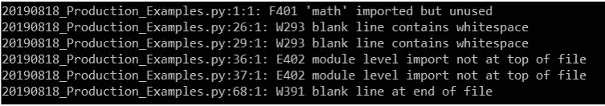
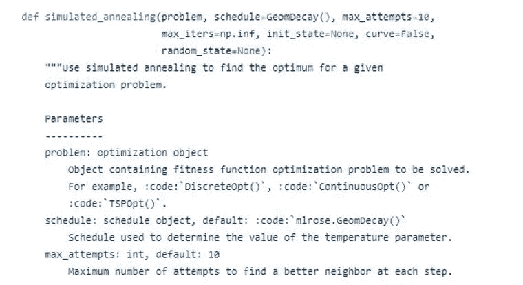
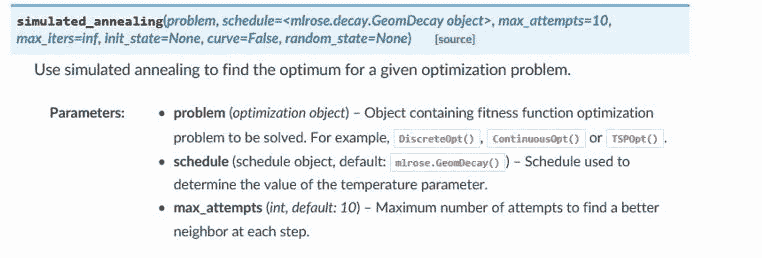

# 数据科学家可以使用 3 种 Python 工具编写高质量的代码

> 原文：<https://towardsdatascience.com/3-python-tools-data-scientists-can-use-for-production-quality-code-604a5e0acf9a?source=collection_archive---------9----------------------->


## 仅仅因为你是数据科学家，并不意味着你不应该写好代码

我对编码的第一次体验是作为一名本科统计学学生使用 S-Plus(R 的前身)。我们的讲师是一位有几十年经验的教授，他教我们如何通过在 S-Plus 控制台上一次一行地键入代码来拟合回归模型。

如果您希望能够在将来的某个时间点重新运行您的代码，您可以将其保存在一个文本文件中，然后剪切并粘贴到控制台中。

直到几年后，在我毕业后的第三份工作中，在完成统计学博士学位后，我才第一次发现编程脚本，以及好代码实际上是什么样子的。

回想起来，我对这种情况的发生感到震惊。然而，通过与我的数据科学家朋友交谈，特别是那些没有软件开发背景的朋友，我的情况似乎并不独特。

不幸的是，许多数据科学家不知道如何编写生产质量的代码。

生产质量代码是这样的代码:

*   可读；
*   没有错误；
*   对异常具有鲁棒性；
*   高效；
*   有据可查；和
*   可复制。

生产它不是火箭科学。

任何足够聪明，能够理解神经网络和支持向量机的人(即大多数数据科学家)肯定能够学习良好的编码实践。

问题是，大多数数据科学家甚至没有意识到，编写生产质量的代码是他们可以也应该学习的事情。

# 如何编写高质量的代码

在我的文章[生产质量数据科学代码的 12 个步骤](/12-steps-to-production-quality-data-science-code-35ae2f868003)中，我详细描述了一个简单的过程，数据科学家可以遵循这个过程来准备他们的代码生产。

总之，这些步骤是:

1.  确定你想要达到的目标；
2.  构建最小可行产品；
3.  利用干燥原理减少重复；
4.  创建并运行单元测试；
5.  处理异常情况；
6.  最大化时间和空间效率；
7.  使变量名和函数名有意义；
8.  对照样式指南检查您的代码；
9.  确保再现性；
10.  添加注释和文档；
11.  要求进行代码审查；和
12.  展开。

对于其中的许多步骤，没有真正的捷径可走。例如，构建最小可行产品的唯一方法就是卷起袖子开始编码。然而，在少数情况下，工具的存在可以自动化繁琐的手动过程，使您的生活更加轻松。

在 Python 中，由于 unittest、flake8 和 sphinx 包，这就是步骤 4、8 和 10 的情况。

让我们一个接一个地看一下这些包。

# 用 unittest 自动化你的错误检查

单元测试用于确保在一系列不同的环境下，组成代码的函数正在做它们应该做的事情。

如果您的代码只包含少量相对简单的函数，那么您可能只需要少量的单元测试，您可以手动运行和检查这些测试。

然而，随着代码规模和复杂性的增加，为了确保广泛的覆盖范围，您需要的单元测试的数量也会增加，手动测试导致的人为错误的风险也会增加。这就是 unittest 包的用武之地。

unittest 包是专门为自动化单元测试而设计的。要通过 unittest 包运行单元测试，只需创建一个类，并将单元测试编写为位于该类中的方法(即函数)。

例如，考虑一个在给定半径的情况下计算圆面积的函数:



为了检查这个函数是否按预期工作，您可以创建单元测试来确保这个函数为两个不同的半径值(比如 2 和 0)产生正确的输出。

使用 unittest 包，您可以自动执行这些检查，如下所示:



在这个例子中，我把我的测试类称为“TestFunctions”，但是你可以把它称为任何东西，只要这个类有 unittest。TestCase 作为其父类。

在这个类中，我创建了两个单元测试，一个测试 circle_area()适用于半径 2 (test_circle_area1)，另一个测试半径 0 (test_circle_area2)。这些函数的名称并不重要，除了它们必须以 test_ 开头并带有参数 self。

代码的最后一行运行测试。

假设所有的测试都通过了，输出看起来会像这样，每一个通过的测试在最上面一行都有一个点。



或者，如果您的一个测试失败了，那么输出的顶行将为每个失败的测试包含一个“F ”,并且将提供进一步的输出，给出失败的细节。



如果您使用 Python 脚本编写代码(即 py 文件)，理想情况下，您应该将您的单元测试放在一个单独的测试文件中，将它们与您的主代码分开。然而，如果您使用的是 Jupyter 笔记本，您可以将单元测试放在笔记本的最后一个单元格中。

一旦你创建了单元测试并使它们工作，无论何时你对你的代码做了任何(显著的)改变，重新运行它们都是值得的。

# 检查 PEP8 是否符合 flake8

编码风格指南是一个文档，它列出了特定编程语言的所有编码约定和最佳实践。在 Python 中，转到样式指南是用于 Python 代码的 [PEP 8 样式指南。](https://www.python.org/dev/peps/pep-0008/)

PEP 8 是一个 27 页的文档，所以确保你的代码符合每一项可能是一件苦差事。幸运的是，有一些工具可以帮助你做到这一点。

如果您将代码编写为 Python 脚本，flake8 包将检查是否符合 PEP 8。

安装此软件包后，只需导航到包含要检查的代码的文件夹(filename.py ),并在命令提示符下运行以下命令:

```
flake8 filename.py
```

输出将告诉您代码不符合的确切位置。

例如，此输出告诉我们 Python 脚本 2019 08 18 _ Production _ examples . py 包含 6 个不合规的实例。第一个实例在第 1 行第 1 列，其中包“math”已导入但未使用:



在 Jupyter 笔记本中，有几个扩展可以确保符合 PEP 8，包括 [Jupyterlab-flake8](https://www.npmjs.com/package/jupyterlab-flake8) 和 [jupyter-autopep8](https://github.com/kenkoooo/jupyter-autopep8) 。

# 使用 sphinx 创建专业外观的文档

有没有想过 Python 包的创造者，比如 NumPy 和 scikit-learn，是如何让他们的文档看起来这么好的？

答案是 sphinx，这是一个 Python 包，可以将文档字符串转换成各种格式的文档，包括 HTML、pdf 和 ePub。

它还与 GitHub 和 [ReadtheDocs](https://readthedocs.org/) (一个文档托管平台)集成，这样每当您的代码更新被推送到 GitHub 时，您的文档就会自动重建，确保您的文档始终保持最新。

我在编写 Python 包 [mlrose](https://github.com/gkhayes/mlrose) 时使用了 sphinx，下面是这个包中包含的一个函数的摘录。注意这个函数顶部的 docstring 被格式化的特殊方式。



对这段代码运行 sphinx 会生成以下格式良好的文档:



开始使用 sphinx 可能有点困难，但是可以在这里找到关于该主题的优秀教程。

大多数数据科学家不知道如何产生生产质量的代码，但如果你想脱颖而出，那么你就不应该像大多数数据科学家一样。

通过遵循一个简单的 [12 步流程](/12-steps-to-production-quality-data-science-code-35ae2f868003)并将一些简单的工具集成到您的工作流程中，有可能对您正在生成的代码的质量做出巨大的改进。

您可能永远不会让您的代码达到没有人会抱怨的程度，但至少，您不会因为试图在 S-Plus 控制台中一次一行地拟合一个回归模型而让自己尴尬。

*Genevieve Hayes 博士是数据科学家、教育家和人工智能及分析专家，拥有*[*Genevieve Hayes Consulting*](https://www.genevievehayes.com/)*。你可以在*[*LinkedIn*](https://www.linkedin.com/in/gkhayes/)*或者*[*Twitter*](https://twitter.com/genevievekhayes)*上关注她。她还是* [*价值驱动数据科学*](https://www.genevievehayes.com/episodes/) *的主持人，这是一个每月两次的播客，面向希望最大化其数据和数据团队价值的企业。*

*想要发掘企业数据的价值，但不知道从哪里开始？**[***下载免费的数据科学项目发现指南。***](https://www.genevievehayes.com/discovery-guide/)*