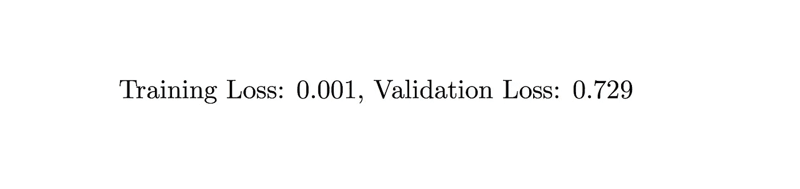
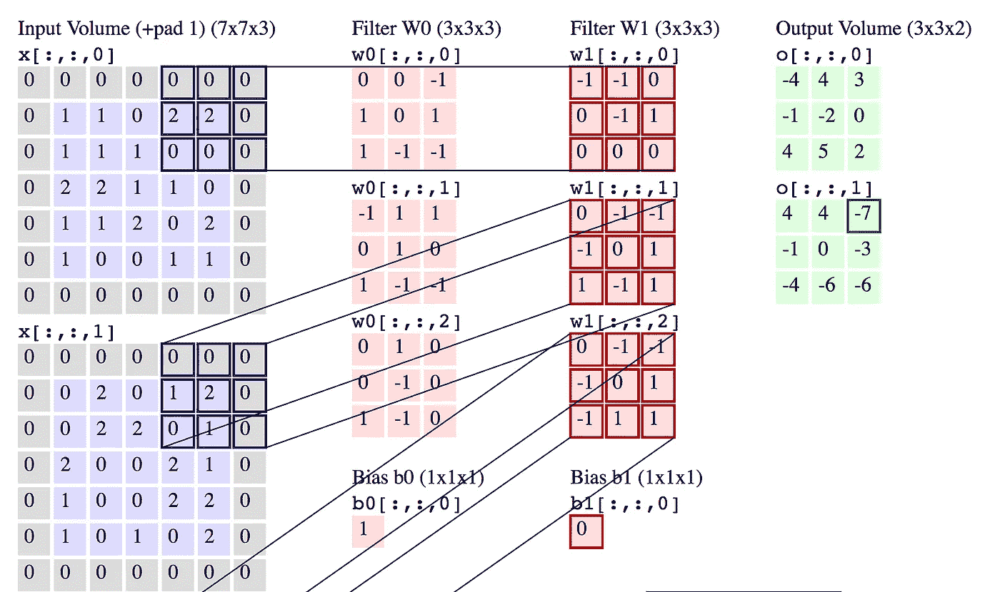
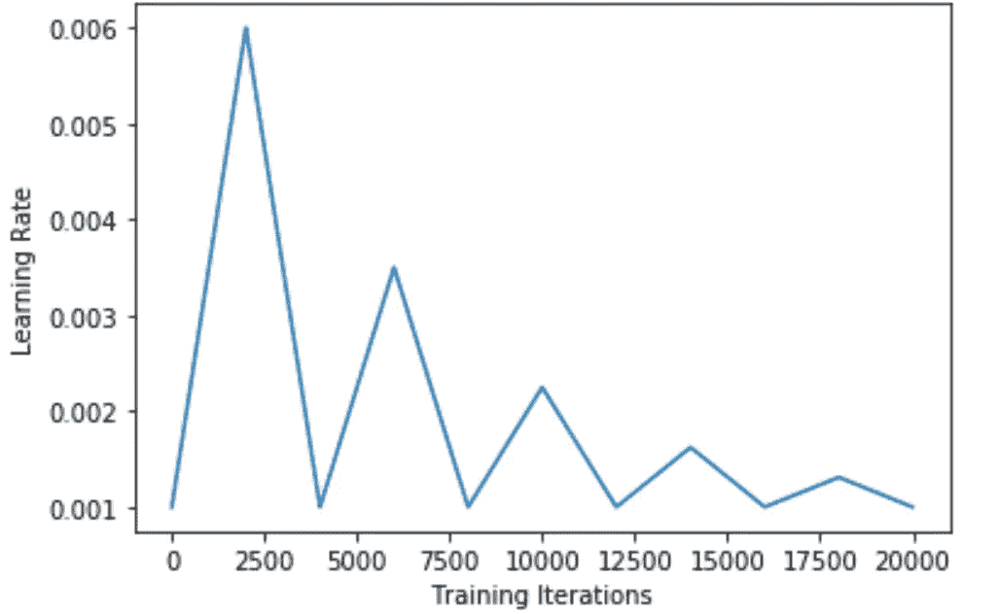

# 训练 ML 模型的 3 个快速技巧

> 原文：<https://towardsdatascience.com/3-quick-tips-for-training-ml-models-2a7a95960dbf?source=collection_archive---------28----------------------->

Not good.

对于机器学习中每一个胜利的结果，都有数百个不收敛的错误模型。

暴涨的损失函数。异常验证损失。可疑的低培训损失。这些都说明出事了。

有一些[漂亮的](https://blog.slavv.com/37-reasons-why-your-neural-network-is-not-working-4020854bd607)参考资料可以帮助彻底诊断问题，但这里有三个候选资料会立即浮现在脑海中并不断弹出。

*注意:*这尤其适用于面向图像的任务，但对于一般的 ML 任务仍然有很大的价值。

# 1.调整频道数量

特征映射是卷积层中的通道数，出现在各种应用中。这将改变单层中使用的内核数量。拥有太多的特征地图会导致过度拟合，因此找到正确的平衡是一件困难的事情。

A convolutional layer with two output channels (see [here](http://cs231n.github.io/convolutional-networks)).

# 2.好好把握学习速度

最初的学习率为训练定下了基调。开始的时候太大，你会反复无常，永远不会安定下来。从小事做起，你将永远不会在第一时间找到任何东西。这当然取决于应用，但在许多情况下，初始学习率为 0.001 或 0.01 都很好。

## 2a。改变整个学习的速度

研究使用一个时间表来改变整个培训的学习速度。随着时间的推移降低学习速度通常是一个好主意。考虑振荡，指数衰减，三角形衰减。

Learning Rate over Training Iterations (source [here](https://github.com/bckenstler/CLR)).

# 3.看数据

这真的应该是第一条也是唯一一条建议，但这似乎只是常识。看数字和摆弄超参数只会做这么多；你得看数据。如果您正在生成输出，请查看输出。

即使您将图像的像素值打印到命令行，仍然会发现有问题。在规范化、裁剪、旋转和移动的各个阶段之间，很可能有些事情没有按预期进行。

求你了。看数据。每次都很痛苦但很值得。