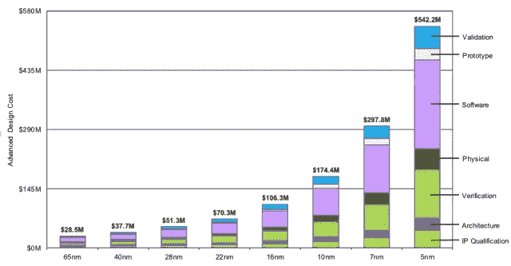

# 人工智能研究即将遇到麻烦的 3 个迹象

> 原文：<https://towardsdatascience.com/3-signs-that-ai-research-is-about-to-hit-trouble-cb3b29d63d40?source=collection_archive---------17----------------------->

Source: [Florent Darrault](https://commons.wikimedia.org/w/index.php?curid=38067753)

尽管取得了一些令人印象深刻的成就，以及对未来令人窒息的预测，但感觉人工智能的世界可能有些不对劲。不，这不是另一个关于“我们新的硅胶大师”的帖子。事实上，让我夜不能寐的恰恰相反:

如果你认为人工智能研究的功能是制造智能机器，那么你认为“智能”和“解决问题的能力”是一回事也是情有可原的。软的东西:善良、爱、同情、直觉；可以说是定义真正智力的东西，当然也是让我们保持诚实的东西，并没有得到太多的关注。至少目前，他们在“太难”的篮子里。

我一直认为语言理解领域可以为我们提供两个世界之间的桥梁:完整情感景观的一小部分，但具有有形的意义单元。看看他们遇到的麻烦就知道了。

# 1.一切都变得太大了

几年来，IBM 一直在享受“沃森”的成功，他们的问答超级计算机赢得了著名的“危险！”2011 年。令人印象深刻，是的，但是你有没有想过这个东西的大小？给你个提示:它放不进你的口袋。

当时，“沃森”实际上是一个由 90 台服务器组成的集群，每台服务器都有 8 个并行运行 4 个线程的内核和 16tb 的内存(是的，内存)。对于外行人来说，这大约是 360 台高规格笔记本电脑和大量额外内存的组合。它也没有运行 Android:专门的硬件必须为它的任务专门编程——在这种情况下，是一个智力竞赛节目。它也有一间卧室那么大。

的确，从那时起，IBM 已经做出了重大改进。沃森现在可以放在你冰箱的底部。但真正的问题是:经过这么多年的研究和数不清的数百万美元，*它仍然只做一件事*。

[Jameson Toole 的](https://heartbeat.fritz.ai/deep-learning-has-a-size-problem-ea601304cd8)关于这一点的伟大媒体文章确实让我明白了:就语言理解而言，我们已经到达了收益递减曲线的平坦部分。诚然，正如他所说，改进和效率是可以实现的，但就你和我而言，这些仍然只是为你找到餐馆(如果你幸运的话)或解决简单理解难题(如“谁对谁做了什么”)的机器。

这和我们人类使用语言的方式之间的鸿沟是巨大的。我们真的想象增加更多内核、更多输入、更多层、更多数据和更多能力([让环境见鬼去吧！](https://www.newscientist.com/article/2205779-creating-an-ai-can-be-five-times-worse-for-the-planet-than-a-car/))就行了？即使我们能做到，如果这项技术被限制在谷歌或 IBM 的服务器机房里，我们怎么能让它变得有用呢？我们一定遗漏了什么。

# 2.不再有摩尔定律

你可能会认为解决尺寸问题的办法就是等一等，直到我们有了更大、更快的芯片。几年前，你可能是对的。摩尔定律表明，计算能力(以每个芯片上的晶体管数量来衡量)每两年就会翻一番，但是[证据是](https://www.cnet.com/news/moores-law-is-dead-nvidias-ceo-jensen-huang-says-at-ces-2019/)它不再有效。低于一定的尺寸限制，在晶片上安装足够的晶体管变得非常困难，而且没有利润。

Moore’s Second Law — the cost to produce smaller transistors also increases exponentially Source: IBS

别忘了，要让人工智能系统赚钱，它们需要广泛可用。是的，GPU 和 TPUs、3D 堆叠等专业技术将允许大玩家继续发展一段时间，但从现在起几年后，这个问题[将开始向便携式设备市场渗透](http://impact of moores law slowing on portable device market)，这是赚大钱的地方。

事实上，最大的影响可能是摩尔定律曾经对行业产生的那种[“心跳”功能](https://www.technologyreview.com/s/601441/moores-law-is-dead-now-what/)——在两年周期内监管软件、硬件、零售和设计行业的创新。如果开发人员不确定他们需要的硬件是否符合规格，他们可能不太愿意冒险。

# 3.我们不理解我们试图解决的问题

问自己一个问题:“为什么有些笑话很好笑？”。我也不知道。它有一些规则:时机等等，但真的，就像在晚上画风景一样，喜剧可能有点黑暗的艺术。

假设你想建立一个喜剧人工智能。在当前的范式中，你可能会通过建立几个神经网络来实现这一点，在一周左右的时间里，向它们投掷数十亿人类标记的有趣和不有趣的语句，然后将它们配对成一个“[生成对抗网络](https://en.wikipedia.org/wiki/Generative_adversarial_network)”。在超级计算机上再训练一周左右，它甚至可能会工作([类似](http://joking.abdn.ac.uk/joker.shtml))。

问题是，即使它知道，它也只能从你给它的数据中学习。喂它巨蟒，它会跟你谈论[灌木林](https://www.youtube.com/watch?v=69iB-xy0u4A)和[死鹦鹉](https://www.youtube.com/watch?v=vnciwwsvNcc)，给它看几集《宋飞正传》，你会得到[虚无主义和存在主义焦虑](https://www.youtube.com/watch?v=EQnaRtNMGMI)。否则就完全不灵活了。如果你想让它适应一个新的环境、背景或受众，你就必须重新开始。

我们也不要忘记，幽默只是我们使用语言的一个方面。如果你想要一个“有同情心”的机器人，它也会面临类似的限制。一次两个？好吧，目前来看，这是疯狂的。

然而，作为人类，我们自然会这样做。我们似乎有一种在这种或那种情况下如何使用语言的本能，却不知道如何使用或为什么使用。我的猜测是，这不仅仅是我们以前见过的事情的重复，而是存在某种真正的自发创造，但深度神经网络的架构不允许这样做。

# 感觉很重要

在目前的形式下，人工智能对于各种事情来说都是一个非常强大的工具，但语言的使用——尤其是情感语言——不是其中之一。

情感，比如同情和善良，非常重要。他们是将我们凝聚在一起的粘合剂。随着强大的思维机器变得越来越常见，并且更经常地负责决策，我们真的希望它们没有感觉吗？

事实上，事情的现状，这是一个学术问题。我们拥有的最先进的技术还远远不够，而且已经遇到了问题。

我们可能会在这里呆一会儿。