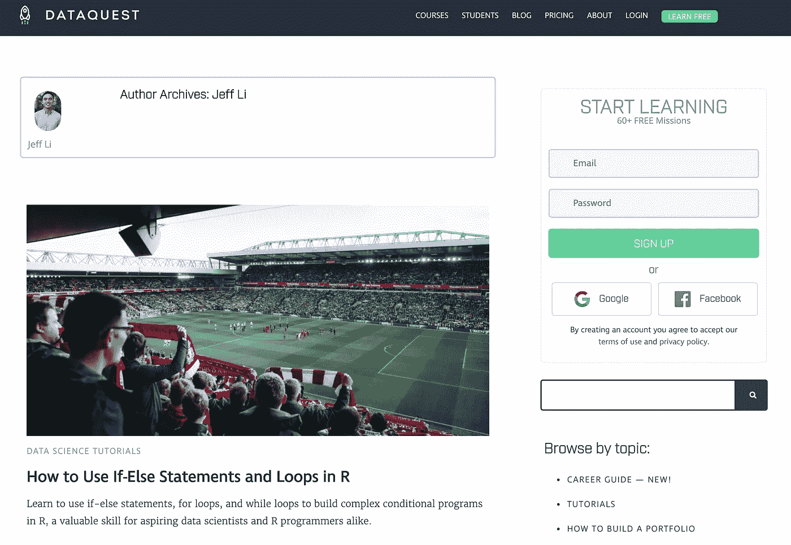
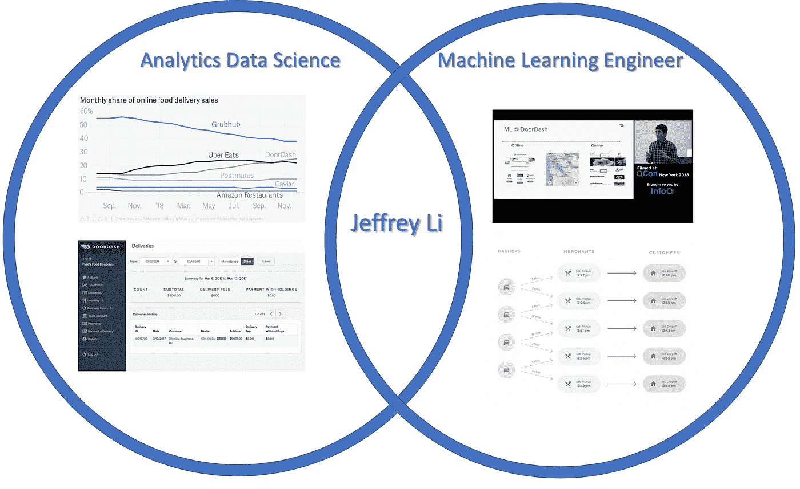
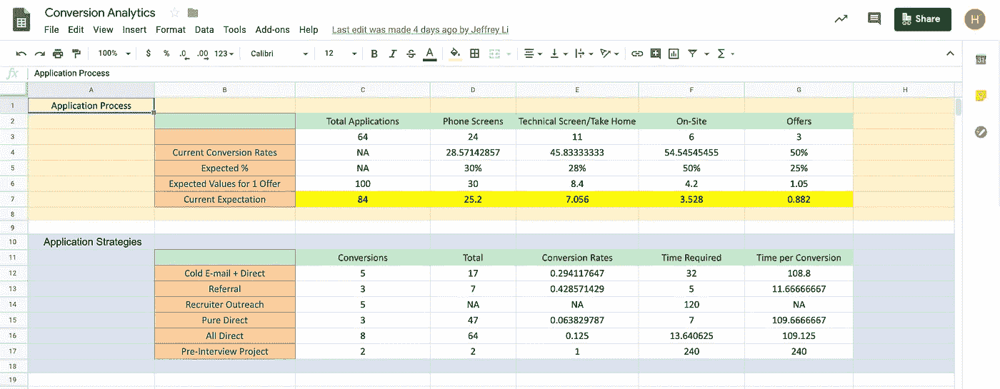
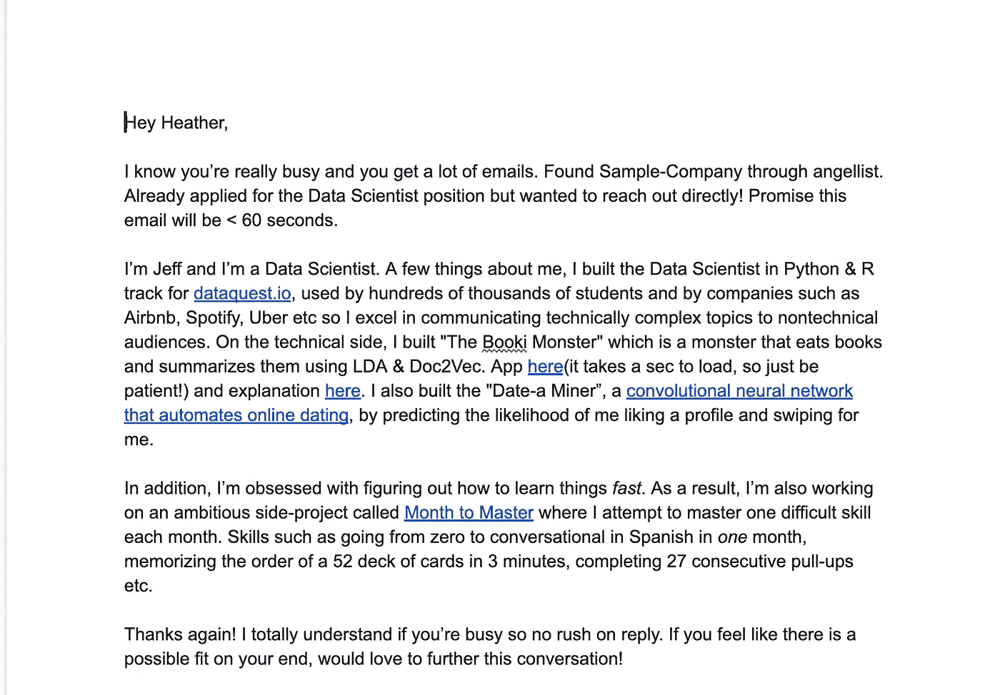
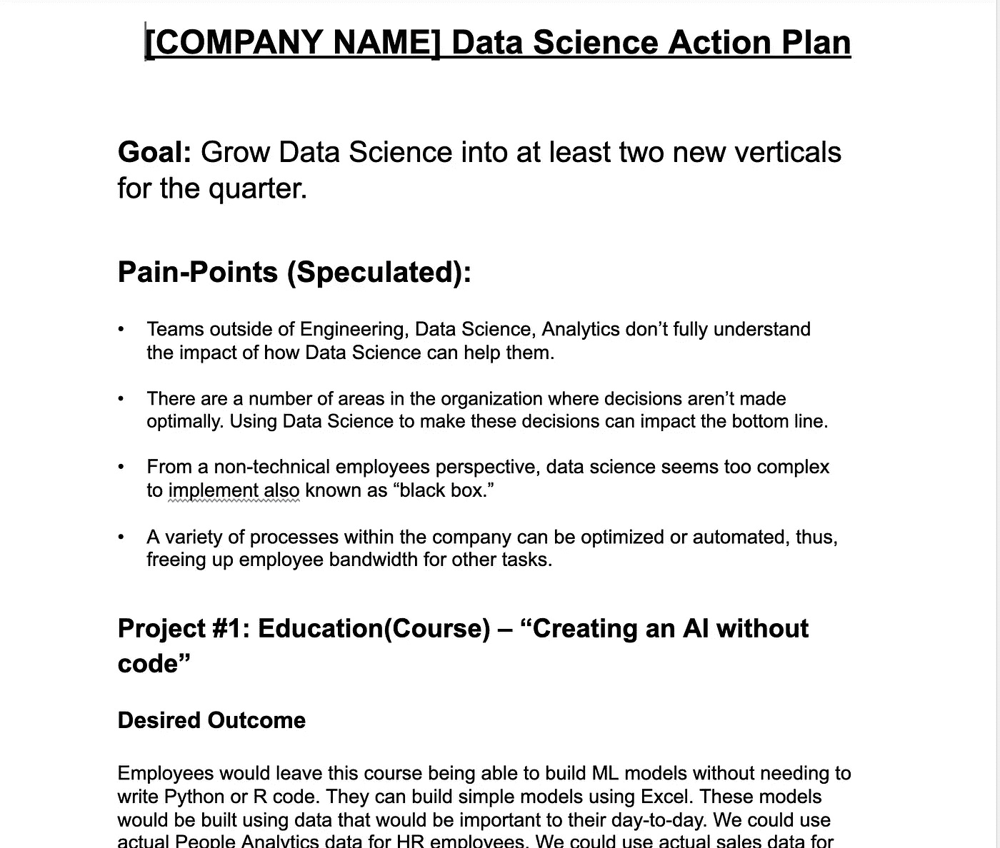
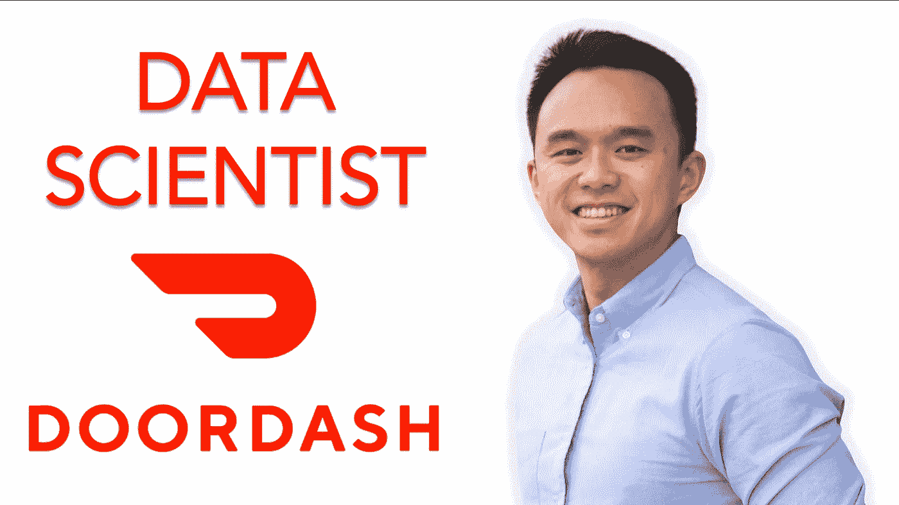

# 保证无经验数据科学工作的 3 个策略

> 原文：<https://towardsdatascience.com/3-strategies-to-guarantee-a-data-science-job-with-no-experience-68d85b345f21?source=collection_archive---------3----------------------->

## [独家 TDS 采访](https://towardsdatascience.com/tagged/tds-interview)

## TDS 采访了 DoorDash 的 Jeff li，他分享了为没有计算机科学或数学学位的数据科学应用评分的重要资源。

**面试官:** [Haebichan Jung](https://www.linkedin.com/in/haebichan?source=post_page---------------------------) ，数据科学家| TowardsDataScience.com 项目负责人。

**受访者:**[door dash 的数据科学家(机器学习)Jeffrey Li](https://www.linkedin.com/in/lijeffrey) 。

**你是如何成为数据科学家的？**

我并没有真正来自进入数据科学的传统背景。实际上，我大学毕业后的第一份工作就是从技术咨询开始我的职业生涯。虽然这是一份不错的第一份工作，但我不认为这是一份适合我的长期工作。所以在工作之外，我对快速学习很感兴趣，我尝试了很多不同的技能，我的一个更大的项目是试图通过玩扑克谋生。

我当时的目标是把扑克玩得足够好，以便能够维持我的生活方式。然而，有一次当我玩扑克的时候，我输掉了所有的钱。对我来说，如果我要在一项技能上投入大量金钱或情感能量，我还不如把它投入到一项能为他人创造价值的技能上，而不是像玩扑克那样从别人身上获取价值。所以我想继续走概率统计这条路。因此，我最终从那里进入了数据科学领域。三年后，我现在是 DoorDash 的一名数据科学家。

**你是如何从扑克生涯过渡到 DoorDash 的数据科学领域的？**

最初，我自学了不少。我自己写了很多代码。我在大学里上过几门统计学课，所以我对线性回归、决策树和随机森林有一些了解。我大概花了六到九个月的时间纯粹学习。

然后，我在一家名为 Dataquest 的初创公司找到了第一份工作，这是一家广告技术公司。我在为我们的营销团队设计课程和做分析。但我想真正发展我的机器学习技能，我认为，根据你进入的公司，将需要机器学习或实验分析。DoorDash 有一个特定的机器学习团队，我最终加入了这个团队。

Jeffrey’s tutorials on Dataquest.io

你在 DoorDash 接什么项目？

在 DoorDash，我们有三个与数据科学相关的不同团队。我们有分析数据科学家，他们专注于实验分析，也专注于构建仪表板和进行支持特定业务的分析。

然后，我们有机器学习工程师，他们正在建立更多的基础设施，进行大量的建模，以及模型的大量生产。我的团队是数据科学机器学习团队，我们位于这两个端点之间的中间。因此，我们正在构建许多专注于业务影响的模型。我们也帮助进行实验分析，也做一些数据工程和商业分析。

Three data science teams at DoorDash

特别是对我来说，我一直在从事一些项目，如推荐系统，增加新功能以向您显示最相关的餐厅，建立管道以将推荐信息纳入我们的电子邮件，以及营销归属和营销细分。我们还建立了一个预测销售的模型。

**三个数据团队是否相互协作？**

在很大程度上，这取决于你正在做的项目。当我的项目更侧重于工程时，比如建立管道以使事情变得更快，就不需要在业务方面加入一些人。这主要是我和工程团队作为一个工程为重点的项目。

然而，有一些项目，比如新特性的实验分析，我们需要了解它的影响。这将要求我们与工程部门进行更紧密的合作，因为他们将帮助执行实验，还要求我们与业务部门进行更紧密的合作，因为他们希望了解这一新功能将如何影响我们的业务。

**所以看起来 DoorDash 的申请者应该非常清楚这些不同的角色，以及他们如何利用自己的优势。**

我认为这是利用你认为自己擅长的东西和你拥有的经验的结合。我还是想说，如果你是在实验分析方面非常有经验的人，并且你想在建模方面做得更多，一定要记住这一点。我认为，一般来说，在科技公司，如果你能清楚地说出你想要什么，并利用你想要的创造价值，那么你就可以进入任何角色。

一个例子是，你非常擅长统计和分析实验，但你想做更多的机器学习。最好的方法是，你可以在公司内部找到商业问题，而机器学习是解决这个问题的最好方法。如果你能向你的经理证明这个解决方案将对业务产生重大影响，你的经理很可能会允许你这样做。

**door dash 的申请流程一般是怎样的？**

因此，与大多数科技公司相比，申请流程并没有太大不同。如果你去我们的职业网站，你可以看到具体的一步一步的过程。我们将与招聘人员进行初次通话。接下来，你会有一个带回家的作业，根据你建立机器学习模型并经历端到端过程的能力进行评分。如果看起来不错，我们会打一个回顾电话，我们会问你几个关于你的技术的问题，并了解你为什么做出某些决定的思维过程。如果看起来不错，你可以来现场，在那里我们会对你的业务、机器学习、编码和价值观进行测试。

在 DoorDash，你自己也有机会参与这个招聘过程吗？

是的，我做了大量的回顾，带回家和回顾电话。根据我在评分带回家的经验，我在市场上看到的大多数数据科学家的最大陷阱或最大弱点是*能够将机器学习模型与商业影响*联系起来。所以很多非常非常聪明的人建立了这个非常复杂的五层神经网络，它能做出很好的预测，得分很高。但是，当我们深入研究特定模型的业务影响时，他们通常很难回答这个问题。最终，我们需要机器学习对业务产生影响。这非常重要。

**那么，当这些问题与业务影响相关时，应用程序应该如何准备呢？**

我认为第一步应该是思考商业方面的行为。问问你自己:“所以我建立了这个模型。现在，这对业务有什么实际影响？”这会让你想到，“嗯，企业可能有某些度量标准来衡量企业的健康状况”。这可以是收入、盈利能力、成本等。如果你不太熟悉这些业务术语，我建议你阅读一下公司衡量的关键业务指标。

我还建议无论你面试的是什么，都要更深入一步。假设是营销分析职位。你会说，“好吧。什么是营销分析师？营销人员在日常工作中关心什么？嗯，营销关心获得更多用户，他们关心留住他们的用户，他们关心通过能够用更少的钱获得更多的用户来减少广告支出”。

所以你说，“好吧，我知道他们关心什么。所以，如果我建立这个模型，这实际上会对他们关心的事情产生什么影响？”如果很难想通这个差距，那么这可能是一个信号，需要更多地研究它如何对业务的这个特定方面更有价值，或者它可能没有价值。

最后，我通常会提醒数据科学家要同情业务方面的人，确保你从他们的角度理解事情，因为他们不知道集合、参数调整或 95%的 AUC 意味着什么。因此，尝试从他们的角度理解事情，能够将这种模式转换为他们关心的事情是非常有用的。

作为一名数据科学家，你成功进入 DoorDash 的策略是什么？

我使用三种主要策略，分别针对一般数据科学招聘的不同阶段。1)我给招聘人员和招聘经理发了一封冷冰冰的邮件。2)我使用了拉米特·塞西称之为公文包技术的东西。3)我利用我创建的数据分析来优化我应该如何为工作申请的不同部分分配时间。

> 要详细、细致地了解 Jeff 为其应用成功而创建和战略性部署的三个文档，请观看视频。下一节将只介绍这三份文件的重要性。

# 第一份文件:转换分析电子表格

Sample Conversion Analytics Spreadsheet Link: [https://docs.google.com/spreadsheets/d/1TmveoOBwRWO7lsQ7z78wkGK4oMOUHWwC_uRaKFeBI84/edit?usp=sharing](https://docs.google.com/spreadsheets/d/1TmveoOBwRWO7lsQ7z78wkGK4oMOUHWwC_uRaKFeBI84/edit?usp=sharing)

**这份文件有什么重要性？**

举个例子，当我经历求职过程时，我遇到的最大挑战之一是:如何最好地利用我的时间(面试、申请、练习代码、回答问题等)。)?我不知道如何最好地利用我的时间。所以我想做的是使用分析/数据科学来解决这个问题，以便在数据科学领域找到工作。由于我已经经历了多次求职过程，我有足够的数据点来绘制地图，并能够得出一些见解。

这张电子表格是我整理出来的，用来绘制我的求职面试流程的漏斗图。前半部分描绘了面试过程的每个部分。最后一部分列出了我用来获得更多采访的不同类型的渠道。

**在申请过程中利用这个分析电子表格有什么好处？**

像很多数据科学问题一样，这也像一个优化问题；优化有限的资源，使我们的收益最大化。如果你对这个话题感兴趣，我建议你去看看线性编程。我没有使用任何机器学习模型，因为数据点非常小，而且你必须获得足够的数据来获得这些见解。

但我认为这非常有利于最大限度地提高你的时间效率。在数据科学中，你可以学习统计学、机器学习、编码，你可以花时间回家做功课，但问题是:我如何知道哪个对我最有价值？这个电子表格肯定解决了这个问题。

例如，假设我有三个小时为面试学习或为找工作做准备。我如何有效地分配时间，使我最大限度地获得工作机会？您可以通过电子表格来解决这个问题。

# **第二份文件:直接招聘人员电子邮件**

Sample Direct Recruiter Email Link: [https://docs.google.com/document/d/16RXFT71tZJ3BUFPuDTnEke4yNsm9fiRZQlHztVDkToA/edit](https://docs.google.com/document/d/16RXFT71tZJ3BUFPuDTnEke4yNsm9fiRZQlHztVDkToA/edit)

**这封信背后的战略要点是什么？**

这封信深入探讨了更多关于理解人类心理和理解一般写作的技巧，以将收件人钩入信中。

第一段:想法是首先真正尊重某人的时间，并提及这一点(即使在我这边，我也收到相当多的信息和电子邮件，要求我做些什么)。然后确定你是如何找到它们的，以及你为什么要发邮件给它们。

第二段:建立你的证书；为什么你很适合这个角色。突出你的技能中让你与众不同的部分。

第三段:展示工作之外的自己。这样，有人谁正在阅读这份文件，读者可以理解，申请人有技术技能和沟通技巧，并非常致力于成为一个更好的人。每个人都有与众不同的因素。对于那些想要使用这个模板的人，请深入思考是什么让你与众不同。

第四段:使用黄金线。使用黄金线实际上会让读者更快地回复你的邮件。这显示了对他们优先事项的考虑，你可以从他们的角度理解事情。

# **第三份文件:公文包文件**

Sample Briefcase document link: [https://docs.google.com/document/d/1HTmC-hu9upge8vnNDe65OnrX0a7hRoIcNX2YkkJYfzc/edit](https://docs.google.com/document/d/1HTmC-hu9upge8vnNDe65OnrX0a7hRoIcNX2YkkJYfzc/edit)

**什么是公文包文档，申请人如何才能最好地使用它？**

这个想法是，当你经历面试过程并进行一次愉快的谈话时，你在面试结束时要做的是说，“等一下。我花了些时间思考你的一些问题。我为你准备了一些东西”。然后，你戏剧性地拿出你的公文包，向招聘经理展示你已经理解了他们的痛点，并给出了解决这些具体痛点的详细方案。

从招聘经理的角度来看，*他们垂涎三尺*，因为他们在想:“如果我雇用这个申请人，这个人会带着这些问题来，他们会解决我的问题”。

因此，公文包技术是一份概述公司痛点以及你提出的解决这些具体痛点的想法和项目的文件。这些项目非常详细，比如你将要使用的资源，你认为这将需要的时间，以及你认为你将要进行的项目的大纲。所以在细节层面上，很容易实现这些想法。

我应该提到的是，每当我在现场展示这份文件时，我每次都收到了工作邀请。

**换个话题，你为 TowardsDataScience.com 写的火绒文章是什么？**

 [## M2M 第 90 天——我如何使用人工智能来自动化 Tinder

### 这篇文章是 Jeff 为期 12 个月的加速学习项目“掌握一个月”的一部分。对于三月，他是…

towardsdatascience.com](/m2m-day-89-how-i-used-artificial-intelligence-to-automate-tinder-ced91b947e53) 

我想了解卷积神经网络和深度学习是如何工作的。我学习的方法是找到我想用我现有的技能解决的问题。

在这种情况下，我觉得约会应用程序占用了太多时间。我认为建立 CNN 更容易，它实际上会对我喜欢和不喜欢的个人资料进行分类。通过这个过程，我了解了神经网络是如何工作的，不同 dnn 之间的差异以及其他挑战，如调整。

**这篇文章对招聘过程有影响吗？**

影响更加间接。当我在那封邮件中向招聘人员推销时，这给了我一个很好的卖点。对于非技术性的招聘经理和招聘人员来说，理解我做了什么以及我构建这个项目的思维过程是非常重要的。

**最后一个问题:你对 TDS 的观众在整个招聘过程中有什么建议吗？**

当我玩扑克时，有一个概念，你可以在扑克中做出正确的举动，但你仍然可能会输钱。这个概念适用于生活中的一切。在我们的日常生活中，总是有随机的机会。有时我们可能做了正确的事情，但对我们来说可能不是积极的结果。这直接适用于招聘。在招聘中，有太多的变量，涉及太多的随机机会，很难控制这些事情。

因此，我想说的是，在招聘时，只需专注于你能做的、在你控制范围内的事情，并专注于做出正确的举动。他们可能每天发送 3 封冷冰冰的电子邮件。总是发一封感谢邮件。做这个公文包技术。这些都是你能控制的事情。但是请记住，有时会有很多随机的运气，事情可能不会如你所愿。

如果你还有任何问题，不要犹豫，看看我的网站:[http://www.jefflichronicles.com/](http://www.jefflichronicles.com/)。

如果你有兴趣申请 DoorDash，点击这里:[https://www.doordash.com/careers/](https://www.doordash.com/careers/)

 [## Haebichan Jung - Medium

### 阅读容格在媒介上的作品。项目负责人@TDS |数据科学家@ Recurly…

medium.com](https://medium.com/@haebichan) 