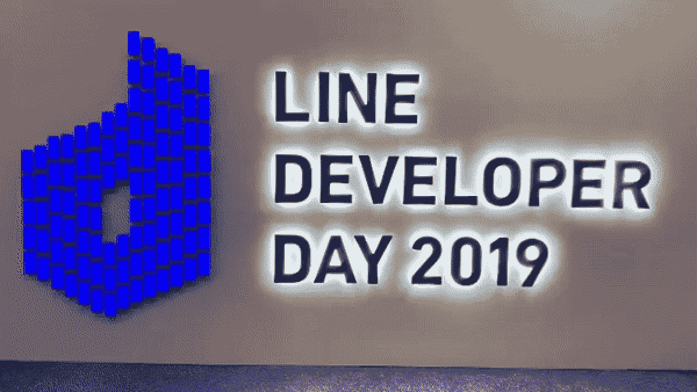
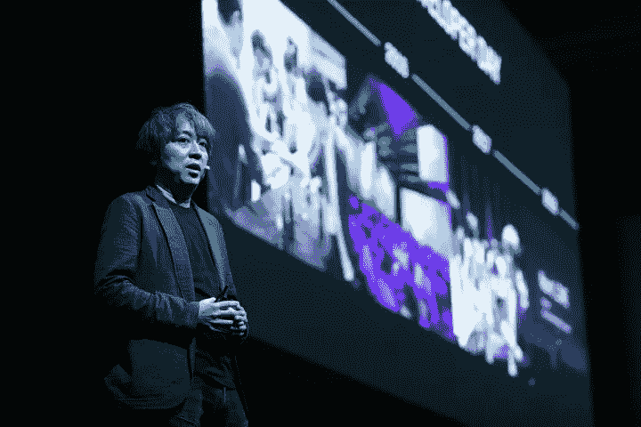
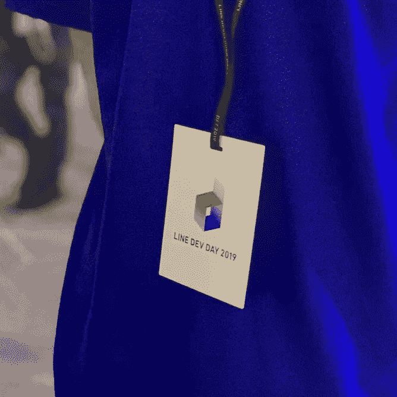
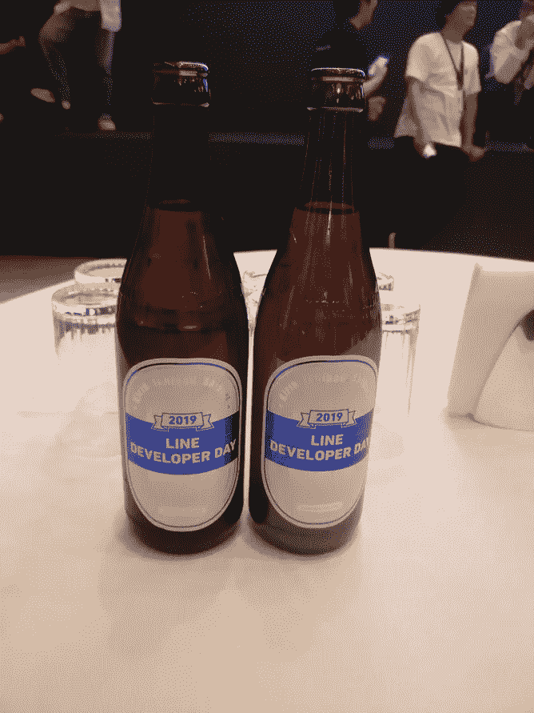
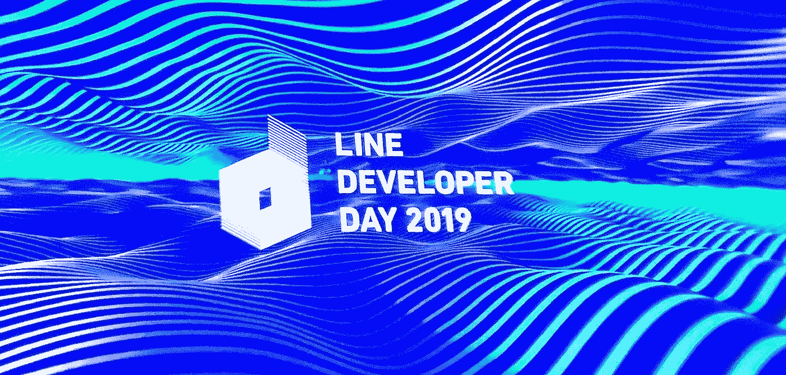

# 我在第一次 Dev 会议中学到的 3 件事

> 原文：<https://towardsdatascience.com/3-things-i-learnt-at-my-first-dev-conference-4947e73a8ac?source=collection_archive---------32----------------------->

## 以及为什么你也应该参加会议

This was the first thing you see when you arrive at the conference. The display on the left is made out of mobile phones — cool! Images from @seoyeon.leeeeee.

本周，我第一次以数据科学家的身份参加了开发者大会。这是一次很棒的经历，认识了很多人，接触了新的想法，增加了我继续学习的动力。我想分享我的经历以及我学到的一些东西。

我参加的大会是 LINE 开发者日 2019。它于 11 月 20 日和 21 日在东京举行。对于亚洲以外的人来说，LINE 是日本、泰国和台湾最大的信息平台。他们每月有 2 亿活跃用户。你可以对比一下 Whatsapp 的 15 亿。虽然它没有那么大，但肯定是在同样的规模上，并且有效地拥有他们的核心市场。

# 遇见人

首先，会议是结识志同道合者的好方法。抛开社交压力，接近人们并开始和他们谈论有趣的话题是很容易的。例如，我参加了各种关于推荐系统的讲座，之后我和我认识的人聊天。听听他们应用了什么技术以及他们经历了怎样的挣扎是很有趣的。与会者来自亚洲各地，因此**你可以接触到在你的常规国内市场**可能看不到的新想法。我不仅能感同身受，还发现了一些我从未想过的有趣问题。

例如，LINE 使用时间线帖子的推荐系统(类似于脸书或 Instagram)，由于他们的数据非常稀疏(< 0.00001% !) they can’t apply regular embedding techniques like SVD or ALS, instead they use some interesting and innovating tricks to get there. In my daily job our sparsity is closer to 0.1% so I’m lucky enough to be able to apply the standard techniques but it’s great to see that you can break away from the norm.

I also did my best to get the contact details of anyone who was facing similar problems. I believe it’s great to keep in contact with fellows in the industry, as you would see in academia, so that you can continually bounce ideas of each other and grow together.

# Speaking with Speakers

Aside from chatting with other attendees, I did my best to talk with the speakers. For some reason, at this conference the speakers were almost exclusively left unattended at the end of their talks. I took this opportunity to ask as many questions as I could (I stole 30 mins of one speaker!). There are all the benefits discussed above but a few more.

Talking with the speakers I found out that **)，即使他们中的许多人没有发布结果，他们也确实在研究有趣和前沿的技术。**数据共享限制、市场竞争或单纯的业务等问题通常会阻止他们尽可能多地共享数据。这是意料之中的事，但这也指出了参加这样的演示来了解这些技术的价值。

接下来，另一个很大的好处是能够**发现论文背后更多的东西**。数据科学研究受到重复性问题[的困扰，这意味着很难将某人在论文中发表的工作应用到你自己的工作中。通过参加会议和直接与出版商交谈，你可以补充一些你不理解的、原始论文中遗漏的细节，或者询问他们如何得到论文中的结果。](/data-sciences-reproducibility-crisis-b87792d88513)

例如，其中一位演示者向我们介绍了图像识别深度学习网络的 CutMix 技术。演示结束后，可以问他们各种细粒度的问题，比如他们是如何得出论文中的结果的，他们尝试了哪些技术，但失败了。

Image from @LINE.

# 查找员工

这个会议不会便宜的。成千上万的人，一个提供午餐和晚餐的豪华酒店，他们肯定花了很多钱。但我认为这是值得的。如果你考虑到招聘人员平均收取员工起薪的 30%左右，那么你看到的是每个员工 3 万英镑。虽然像这样的会议将花费几十万美元，但如果他们能从会议中雇用 10 名新员工，或大约 0.5%的与会者，这笔成本将很容易收回。

当然，像 LINE 这样的公司对员工(有经验的和应届毕业生一样)已经有了很强的吸引力，他们有一个内部招聘部门，这意味着招聘的实际成本更低，但经济效益可能仍然很好。

因此，对于组织者来说，这是一个巨大的招聘潜力，但作为一名与会者，你可以利用这一点。如上所述，在结识不同的人的同时，你也可以寻找下一个最优秀的同事或员工。这是一个舒适的环境，很容易投入到技术讨论中，没有面试的压力。

# 玩得开心

最后，会议只是娱乐，我们都需要偶尔来点娱乐。我相信参加会议有助于点燃我学习数据科学的热情。那是因为想法令人兴奋。与处理同样问题的人交谈会给你强烈的肯定，你正在做的工作是好的。

当然，津贴也不错。住在一家豪华酒店里，设施很棒，食物也很美味！他们甚至在会后派对上将定制标签印在啤酒上——哇！

还有其他赠品，包括标准的会议 t 恤、笔记本电脑贴纸(或者编码员认为的徽章)和一些小奖品。

Lots of bounties to be had at the conference. Note the LINE branded beers in the bottom right! Photos from @line_creative and @tweety.

# 下次

总之，这对我来说是一次宝贵的经历。我遇到了很多聪明人，能够向从事前沿技术的人提问，增加了我成为数据科学家的热情和动力。

如果你曾经怀疑过参加会议的价值，要知道如果你愿意付出一点努力，就会有丰厚的回报。进行调查，询问你的老板你是否能参加你所在地区的下一次会议！

You can find out more about the LINE Developer Day from the website at [https://linedevday.linecorp.com/jp/2019/](https://linedevday.linecorp.com/jp/2019/) or with #linedevday.