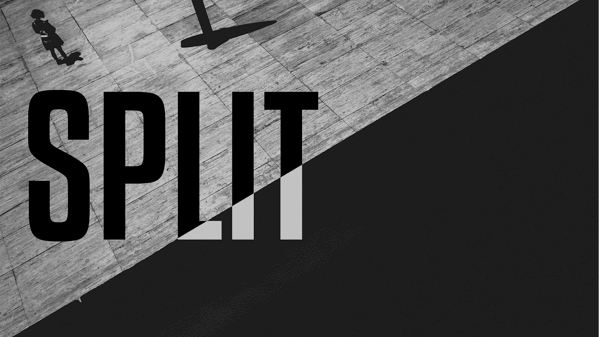
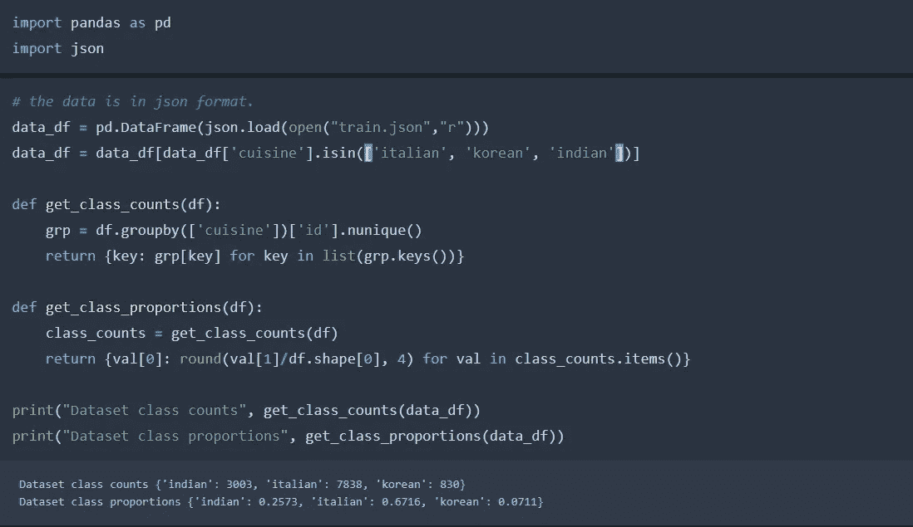
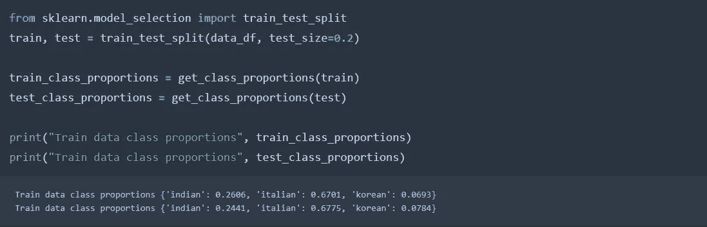
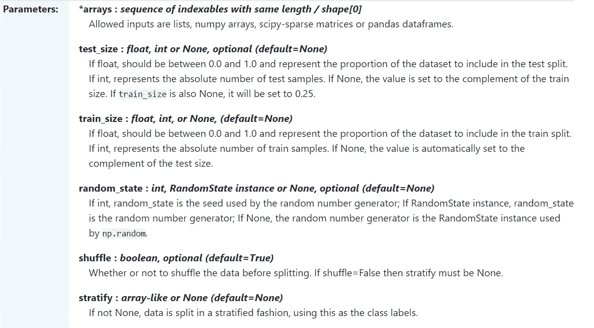
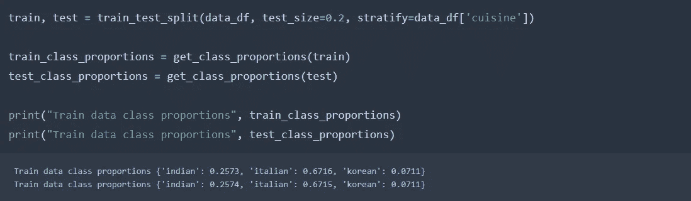
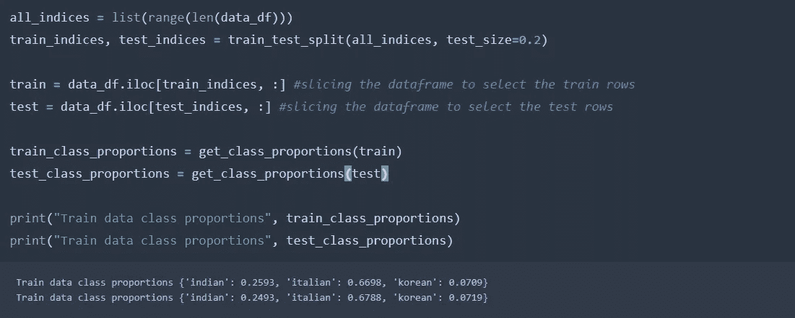
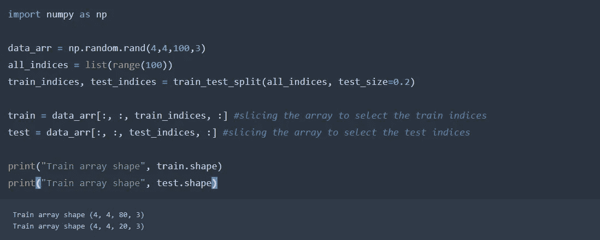
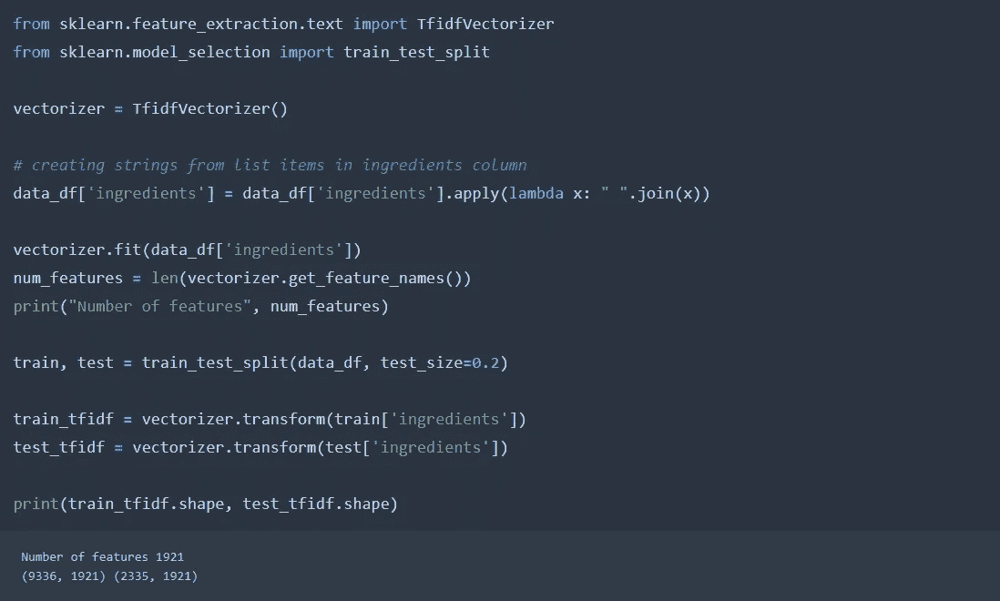
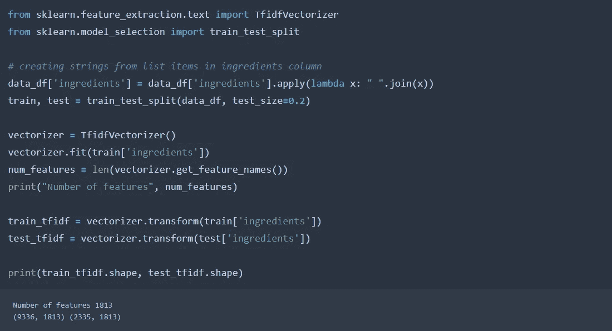

# 训练前你需要知道的 3 件事——试分裂

> 原文：<https://towardsdatascience.com/3-things-you-need-to-know-before-you-train-test-split-869dfabb7e50?source=collection_archive---------0----------------------->

Photo Illustration. Photo by [Lucca Lazzarini](https://unsplash.com/@luccalazza?utm_source=medium&utm_medium=referral) on [Unsplash](https://unsplash.com/?utm_source=medium&utm_medium=referral)

你做的一切都是对的。从选择一个很酷的预处理步骤到一个全新的损失和一个整洁的准确性度量。但是嘣！您的验证或测试结果比您预期的要差得多。那么是拟合过度，还是你的模型错了，还是亏损了？

有时，我们会忽略一些简单的事情，比如将数据集分成训练集和测试集。除非数据集带有预定义的验证集，否则您肯定至少已经这样做过一次。这很可能是你在网上任何数据科学教程中遇到的第一件事。很有可能你做错了。

# 分层

假设您正在进行多类分类，并且有一个包含 5 个不同类的不平衡数据集。你做了一个简单的训练测试分割，这是一个随机分割，完全不考虑类别的分布或比例。在这个场景中发生的事情是，您最终得到一个具有完全不同的数据分布的训练和测试集。在与测试集完全不同的数据分布上训练的模型将在验证时表现不佳。现在我们来看看，好吗？

我们从这场 [Kaggle 竞赛](https://www.kaggle.com/c/whats-cooking/data)中获取烹饪数据集。数据集有 20 个类(烹饪类型)，非常不平衡。我们选择了三个班级(意大利，韩国和印度)进行我们的小实验。

现在让我们试试 scikit-learn 所有著名的 [**train_test_split**](https://scikit-learn.org/stable/modules/generated/sklearn.model_selection.train_test_split.html) 函数。首先，我们做一个普通的分割。让我们检查结果。

我们可以看到分布的变化。虽然这里很小，但对于更小和更不对称的数据集来说，它很容易就足够大了。这个问题的解决方案是所谓的**分层**，它将锁定训练和测试集中类的分布。让我们再次进入 **train_test_split** 函数的文档页面。

在这里。最后一个参数。为了获得相似的分布，我们需要根据类值对数据集进行分层。因此，我们将我们的类标签部分数据传递给这个参数，并检查发生了什么。

瞧啊。你有相同的分布。因此，你的模型不会面临对不平衡测试集进行验证的问题，也不会让你对它的实际性能产生错误的感觉。下一个！

# 按索引拆分

对于一个定义明确的数据集，我们手头并不总是有一个简单明了的问题。作为数据科学家，现实往往相反。可能会发生这样的情况，您需要将 3 个数据集分成训练集和测试集，当然，拆分应该是相似的。你可能面临的另一种情况是，你手头有一个复杂的数据集，也许是一个 4D 数数组，你需要在第三个轴上拆分它。

这两个问题都有一个很好的解决方案。我们只需要按照数据集的索引进行拆分，这样我们就可以分别获得训练集和测试集的索引。这样做其实很容易。让我们再次使用以前的美食数据集。

注意:在多个数据集之间进行类似拆分的任务也可以通过在 train_test_split 的参数中固定随机种子来完成。但是下面只能这么做了。

我们采用 4D numpy 阵列，并且我们打算通过在它的第三维上分裂来将它分裂成训练和测试阵列。最简单的解决方法是利用我们刚刚学到的知识。

正如你所看到的，训练和测试阵列的形状与我们想要的一模一样。

# 预处理

好吧，这和数据集的分割无关。但这很重要。这一点的基本要点是:

> 您不应该使用适用于整个数据集的预处理方法来转换测试或定型数据。

如果您这样做，您就无意中把信息从训练集带到了测试集。让我们在 cuisines 数据集上使用 Tf-Idf 矢量器作为预处理器来对配料列进行矢量化，以检验这一点。

这里发生的事情是，我们在整个数据集上安装矢量器，并用它来转换训练集和测试集。会有一些词只存在于训练集中，一些只存在于测试集中。但是因为我们在矢量化之后进行了拆分，所以所有的单词都被矢量化，并包含在上图所示的 1921 tf-idf 特征中。

纠正这种情况的方法是在向量化之前进行训练测试分割，矢量器或这方面的任何预处理器应该只适合训练数据。下面是正确的做法:

可以预料，tf-idf 的特征数量比以前少了，因为有一些独特的词只存在于测试集中。因此，这些词在矢量器中不被考虑，这确保了测试集的真实的 ***、不可见的*** 性质。

所以下一次你分割或拆分数据集时，你可能会暂停一秒钟，以确保你做得是否正确。

*顺便说一句*，如果你也对深度学习感兴趣，这里有我的两个帖子:

 [## 2020 年成为计算机视觉专家的 4 步指南

### 我在过去 2-3 年的旅程中学到了什么

towardsdatascience.com](/the-4-step-guide-to-becoming-a-computer-vision-expert-in-2020-8e821514e2a7) 

在这篇文章中，我将讨论一个新手如何进入计算机视觉领域，以及如何成长为一名专家。

 [## 梯度积累:克服深度学习中的记忆限制

### 它是什么，如何实现

towardsdatascience.com](/gradient-accumulation-overcoming-memory-constraints-in-deep-learning-36d411252d01) 

在本文中，我将讨论如何利用梯度累积技术在较小的 GPU 上运行较大的批处理。

干杯！