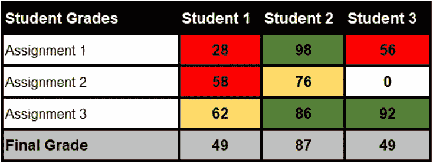

# 创建更有效运营报告的 3 个技巧

> 原文：<https://towardsdatascience.com/3-tips-for-effective-operational-reports-5a0c5123bfde?source=collection_archive---------34----------------------->

Photo by [Austin Distel](https://unsplash.com/@austindistel?utm_source=medium&utm_medium=referral) on [Unsplash](https://unsplash.com?utm_source=medium&utm_medium=referral)

## 使用这些技巧来提高你的报道技巧

报表对业务来说并不陌生，它们是一项基本需求。报告帮助用户回答问题非常重要，这样他们才能成功。

如果做得好，报告可以回答问题，并迅速将公司推向数据驱动的方向。当管理层理解数据的价值时，他们会更快地走向分析的成熟。

这里有一些关于如何改进你的报道的建议。

# 报告目的是什么？

在开始使用任何数据之前，您必须确定需要回答什么问题以及为什么要问这个问题。通常，业务问题可能不是一个实际的问题，而是一个难题。

通常，业务用户不会谈论统计术语；他们只陈述自己的工作目标。倾听那些表明他们需要知道什么或他们需要什么来推动业务的话语。

> 这些问题中有许多可以归结为“我的团队工作出色吗？”

你的工作是[将企业的问题和顾虑转化成有用的格式](https://www.zencos.com/blog/identify-audience-message-methods-data/)。

例如，一位客户服务经理表示，客户抱怨响应速度慢。你怎么知道顾客说的是不是真的？

你可以在每个阶段测量门票的年龄。如果公司承诺在七天内关闭故障票证，报告将显示超过六天的未结票证。如果结果显示 100 张票中只有 95 张符合标准，你可以认为它们符合要求。

然而，如果反过来，公司需要测试是否有足够的资源来管理这项工作，或者目标是否无法实现。事实证明客户是正确的！

# 有效运营报告的技巧

我们经常讨论创建数据故事或仪表板，您必须了解您的目标受众。在这里，目标是经理。

一份有用的报告的关键是揭示企业是如何追踪目标的。报告的最佳实践包括以下特征:自动生成，在一个中心位置可用，并具有标准格式。

# 技巧 1:使用自动化批处理来保持一致性

大多数报告都是从数据库生成的。我们通过称为批处理的自动化流程来创建报告。

批处理是在非工作时间运行的一系列程序。在批处理过程中，我们从源中提取数据，将其转换为有用的信息，然后将其放入报告中。

即使使用实时数据，仍然需要清理过程。数据很少能以原始状态显示。这使得实时报告如此具有挑战性。业务或计数规则必须在显示数据的同时尽快应用。

# 技巧 2:向下钻取路径应该有一个快速的结尾

设计摘要报告时，要考虑如何访问详细信息。用户从汇总数据到详细信息的途径称为信息路径。

您的用户从条形图开始。用户单击单个条来显示该行中记录的数量。那么用户应该在路径的最后一步，即单独的数据行。最佳做法是将点击限制在详细数据。

> 在三次点击之内，用户应该得到可操作的信息。

研究你的信息路径，确保用户不会无休止地点击！你的工作是带领他们找到他们想要的答案。

# 提示 3:提供计数规则的链接

用户必须了解哪些数据支持一个报告，这样他们才能了解报告显示的是什么信息。现代报告有数字格式。请确保您添加了计数规则的链接，这些规则解释了数据收集方法、数据过滤器、公式以及使值呈红色或绿色的原因(以显示负趋势或正趋势)。

> 用户并不总是了解数据库中的哪些信息为报告提供了素材。

有些人不知道他们的工作习惯会如何影响过程结果。例如，如果报告衡量更新的及时性，员工必须根据需要更新记录。如果员工没有这样做，他们的详细报告上的红色列可能会令人震惊。

计数规则还有第二个用途。他们为新工人提供培训。他们能够理解企业想要实现的目标。

# 额外提示:使用交通信号灯来集中用户的注意力

交通信号灯通常用于显示流程何时失控。这个概念是基于标准的交通信号。红色代表停止！(或对麻烦的警告)，而绿色意味着去或好。近年来，这种方法受到了批评。许多使用这种方法的报表构建者用所有的颜色创建了一个马戏团的外观。

最新的方法是使用性能信号。在这种方法中，如果表格单元格符合要求，则用灰色突出显示。越界度量显示为红色边框。

这个方法在不隐藏数据的情况下吸引用户的注意力，如下例所示。

# 报告是你的第一步

报告是分析成熟的开始。虽然有些人认为这项任务很简单，但它对企业的最终成功至关重要。

最初出版于 https://www.zencos.com。