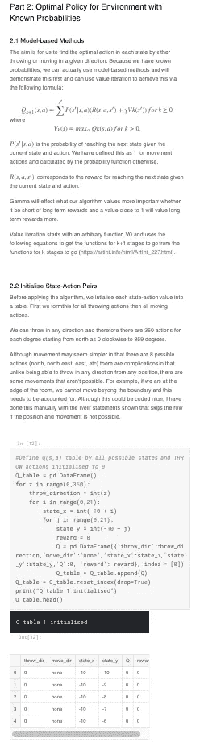
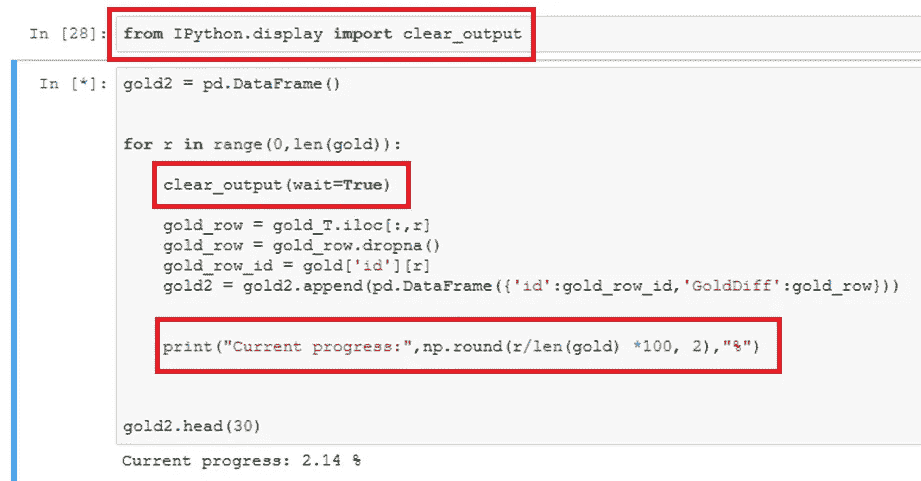
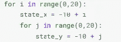
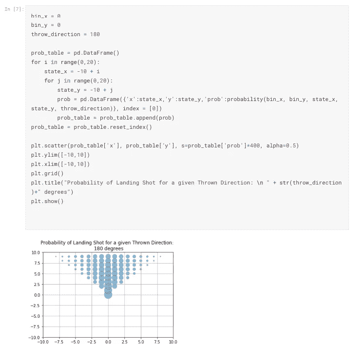
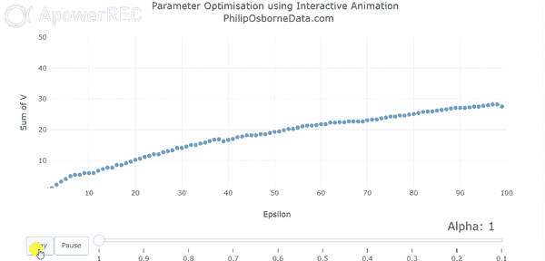

# 改善数据科学工作流程的 3 个技巧

> 原文：<https://towardsdatascience.com/3-tips-to-improving-your-data-science-workflow-71a6fb8e6f19?source=collection_archive---------13----------------------->

这些简单的技巧是根据我自己的学习经验设计的，应该可以帮助你提高数据科学工作、项目管理以及与他人分享时的成果。

# 1.笔记本和降价

近年来，用于编写代码的笔记本变得越来越流行，尽管许多人仍然喜欢在更传统的 IDE 环境中编写代码。重要的区别在于你什么时候想分享你的作品；当把你的作品发给同事或同学时，利用代码单元与减价交织的笔记本格式是非常宝贵的。

我使用任何笔记本的目的都是让人们在没有任何项目知识的情况下拿起它，并完全理解分析、决策和最终结果的含义。

为此，我通常遵循以下规则:

*   标题和介绍应该清楚地定义分析的目的
*   各部分之间应该有所区别
*   任何使用的方法都应该在一个标格中介绍、解释或引用，用 LaTeX 格式正确书写数学
*   输出图表应正确标注清晰的标题、轴标签和图例标签
*   代码单元应该有明确定义名称的变量和注释，用于根据需要解释更小的步骤

例如:

# 2.跟踪代码的进度

*你刚刚编写了处理数据的代码，你按下运行按钮，坐在那里等待你的代码块旁边的星号变成一个数字，等待…等待…*

这听起来熟悉吗？当我刚开始学习编码时，这种事情发生得太频繁了。有几个解决方案，但我发现最简单的是在循环中使用打印函数来跟踪代码完成了多远。

下图中的代码准确地显示了如何跟踪 iPython 笔记本中任何循环的当前进度。**更详细的写上去可以在这里找到****。**

**这意味着我现在知道我是否有时间去喝杯茶，或者需要让代码通宵运行，同时专注于另一项任务。它也有助于在需要完成工作所需的时间范围内更新同事，因为我可以估计在更大范围内应用时所需的时间。**

****

# **3.高效优化参数**

**当我第一次开始学习应用机器学习时，我会逐个手动更改参数输入，并记录下最终输出的结果。虽然这有助于我对参数的理解，但这很费时间，而且效率很低。**

**随着时间的推移，我凭直觉开发了三种方法(尽管我不认为我是第一个提出这些方法的人),它们极大地改进了我的参数调整:**

1.  ****利用循环自动测试参数输入****
2.  ****在循环内部迭代构建输出表，为图表或发布做好准备****
3.  ****用互动动画演示参数的影响****

**第一种方法似乎有些显而易见，使用一个简单的循环来增加每个间隔的参数，并输出该增量的值或图形，而不是手动逐个更改输入。这甚至可以用于[网格搜索](https://en.wikipedia.org/wiki/Hyperparameter_optimization)参数测试，我们基本上是在多个输入的可能参数范围内进行强力检查，如下所示。**

****

**为了进一步改进这一点，一个好的方法是形成一个数据框，在应用每个增量时添加其输出，而不是简单地打印输出。**

**做到这一点的一种方法是通过以下方式:**

*   **引入一个空的熊猫数据框**
*   **测试循环内的参数输入**
*   **应用 [append](https://pandas.pydata.org/pandas-docs/stable/generated/pandas.DataFrame.append.html) 函数向引入的数据帧添加一行，其中包含每次循环迭代的输出**

**下面的完整代码显示了这一点，其中每一行都被整齐地格式化为一个数据帧，以添加到前面的输出中。这也使得创建任何摘要图变得容易，并且可以很容易地用作准备发布的普通表格。**

****

**最后，虽然大多数项目可能不需要，但是使用交互式动画来显示参数变化的输出。我在这里写了一份关于如何做这件事的完整指南[，并在本笔记本](/creating-interactive-animation-for-parameter-optimisation-using-plot-ly-8136b2997db)的[中使用，以更好地说明改变参数对输出稳定性的影响。](https://www.kaggle.com/osbornep/reinforcement-learning-for-meal-planning-in-python)**

****

**我希望这些对你有用，并能帮助你提高数据科学的成就。**

**谢谢**

**哲学（philosophy 的缩写）**