# 业务分析师需要学习的 3 种报告类型

> 原文：<https://towardsdatascience.com/3-types-of-reports-that-business-analysts-need-to-learn-4e02f2f7e48e?source=collection_archive---------3----------------------->

日常工作中，涉及到制作表格或者[图表](http://www.finereport.com/en/data-visualization/top-16-types-of-chart-in-data-visualization?utm_source=medium&utm_medium=media&utm_campaign=blog&utm_term=3%20Types%20of%20Reports%20That%20Business%20Analysts%20Need%20to%C2%A0Learn)或者数据分析，基本都会选择 Excel。但我也看到很多人对 Excel 深度学习的难度，以及在大数据处理上的低效感到困惑。实际上，专业的商业分析师应该熟练使用各种[报表工具](http://www.finereport.com/en/reporting-tools/reporting-tools-everything-you-need-to-know?utm_source=medium&utm_medium=media&utm_campaign=blog&utm_term=3%20Types%20of%20Reports%20That%20Business%20Analysts%20Need%20to%C2%A0Learn)(Excel/QlikView/Tableau/FineReport)，以及制作不同报表的技巧。今天，我将告诉你我在做[数据分析](/what-data-analysis-tools-should-i-learn-to-start-a-career-as-a-data-analyst-af650b54c9e9)时使用的 3 种报告，以帮助你提高业务效率。

由于我经常使用的工具是 [FineReport](http://www.finereport.com/en/?utm_source=medium&utm_medium=media&utm_campaign=blog&utm_term=3%20Types%20of%20Reports%20That%20Business%20Analysts%20Need%20to%C2%A0Learn) ，所以我采用 FineReport 的分类方法。针对不同的需求，我把报表分为以下三种。

*   **一般报表**:明细报表、分组报表、交叉表报表、列报表、查询报表、数据录入报表等。
*   **汇总报表**:各种不规则报表，如复杂单据
*   **仪表盘报表**:基于业务指标显示的多维分析可视化报表

这三类报表基本解决了各种业务需求。接下来让我们来看看它们。

# 1.一般报告

# 1.1 特点

常规报告是 FineReport 中最常用的报告类型。他们使用类似 Excel 的设计模式，支持行和列的无限扩展、多个表和跨表计算等等。用户可以使用通用报表进行参数查询、数据录入、图表设计等。而一般报表又可以分为明细报表、分组报表、交叉表报表、列报表、查询报表、数据录入报表等。

# 1.2 业务场景

通用报表可以取代企业中用 Excel 制作的各种传统报表，大大减少制作时间。由于采用了 B/S(浏览器/服务器)结构，可以在网上查看报告。

通过 [FineReport](http://www.finereport.com/en/?utm_source=medium&utm_medium=media&utm_campaign=blog&utm_term=3%20Types%20of%20Reports%20That%20Business%20Analysts%20Need%20to%C2%A0Learn) 的通用报表，用户可以从不同类型的业务数据库中提取数据，制作[财务报表](/guide-to-financial-statement-analysis-for-beginners-835d551b8e29)，销售报表，生产报表，人力资源报表以及其他与经营业绩相关的报表。此外，用户可以随时随地在 PC 或移动设备上访问报告、查询数据和编辑报告。

有三种典型的报告类型。

## 1)基本报告

基本报表分为明细报表、分组报表、交叉表报表和其他基本表样。它们支持灵活的公式计算，如同比、环比、排名、比例以及打印和导出离线文件。

**分组统计:**

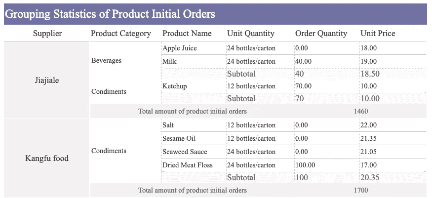

**YoY、MoM 等财务统计:**

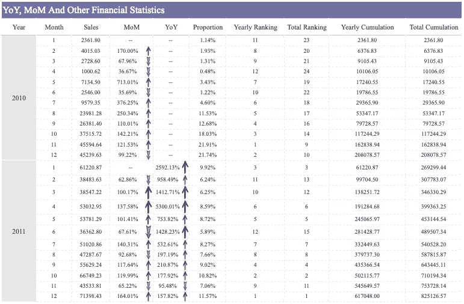

**列卡:**

**可折叠树:**

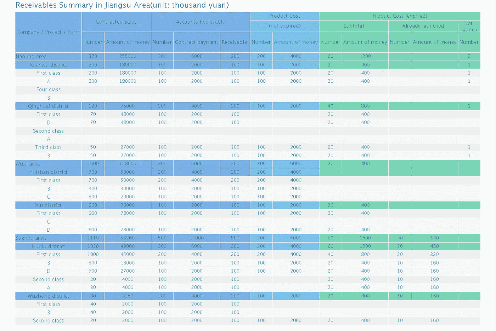

**发票:**

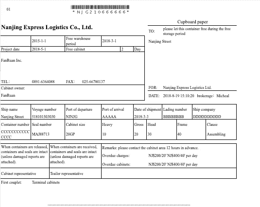

## 2)查询报表

在大多数情况下，我们并不需要一个报表来呈现数据库中的所有数据，而是根据一些条件筛选出我们想要的数据，这就是所谓的[参数查询](/4-parameter-query-functions-to-make-your-data-visualization-interactive-bbd84dd6bafb)。

FineReport 提供了多种控件类型，可以在各种场景下灵活使用实现条件过滤查询，同一个报表可以支持多个参数。

**查询报告:**

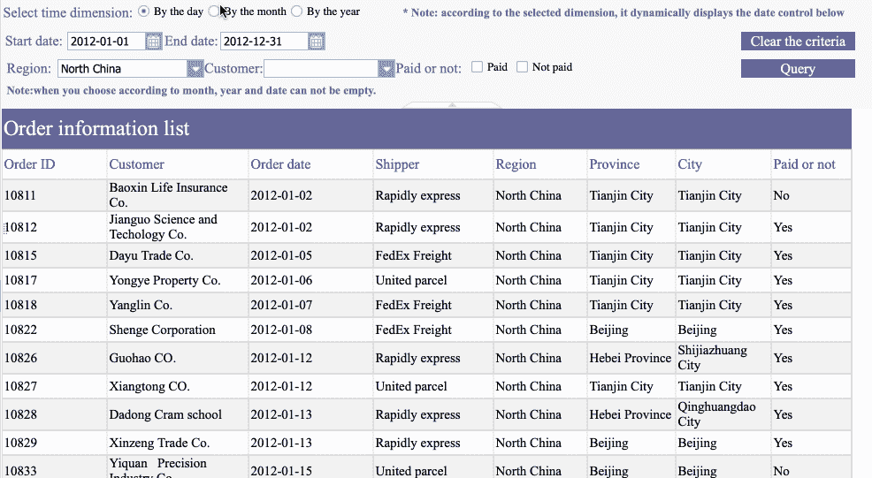

## 3)数据输入报告

传统意义上的报表是解决数据呈现的问题，即将数据从数据库中取出，以各种格式显示出来，并将显示的结果导出或打印出来。

然而，在企业的实际操作中，业务人员不仅需要查看数据，还需要进行一些编辑操作，如添加、修改和删除一些数据。这种报告被称为[数据输入](http://www.finereport.com/en/features/data-entry?utm_source=medium&utm_medium=media&utm_campaign=blog&utm_term=3%20Types%20of%20Reports%20That%20Business%20Analysts%20Need%20to%C2%A0Learn)报告。

基于以上展现/查询报表，FineReport 提供了多种控件样式，支持数据录入和 Excel 数据在线导入，可以满足不同场景下的数据编辑录入需求。

**基本填写:**

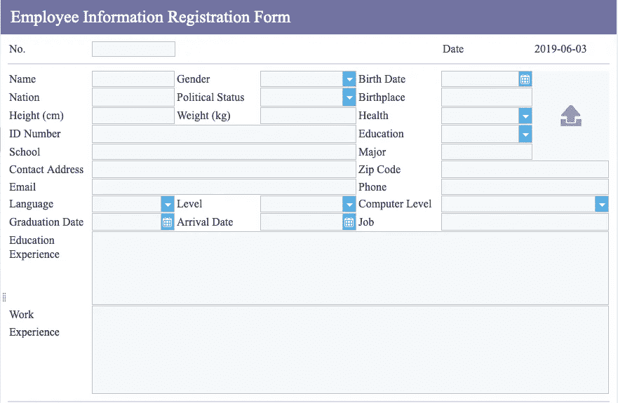

**查询、添加和删除:**

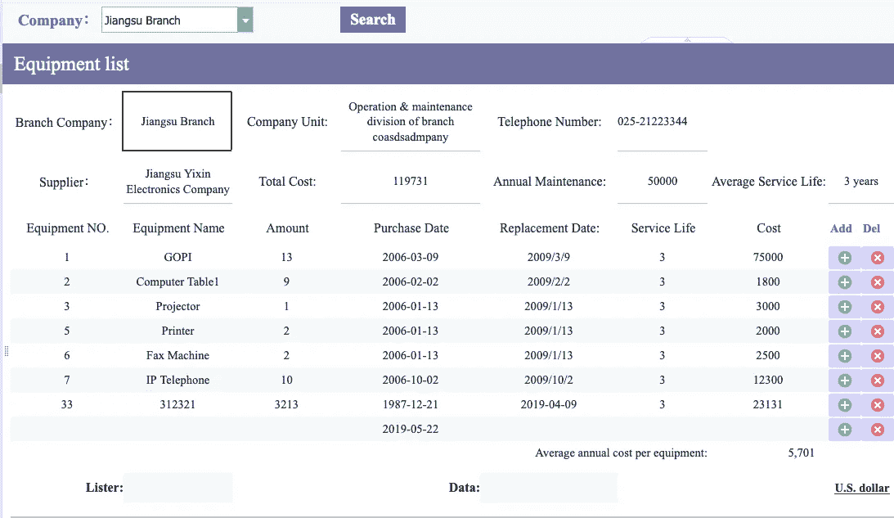

**批量删除:**

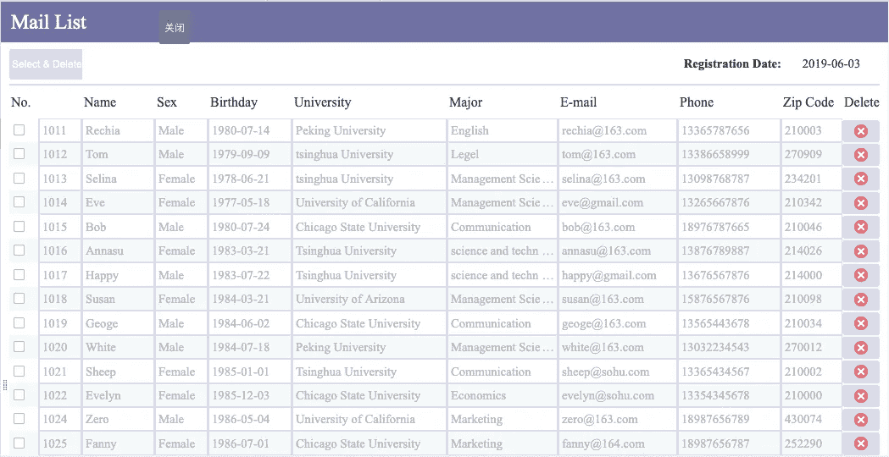

# 2.汇总报告

# 2.1 特点

聚合报告是指包含多个模块的报告，每个模块类似于单个报告或图表。各模块相对独立，互不影响。所以可以解决制作不规则大报表的问题。

# 2.2 业务场景

传统报表(如 Excel 报表)的一个大问题是，如果您调整单元格的行高或列宽，它所在的整行或整列中的其他单元格都会受到影响。这种情况下，我们很难做出表格样式不规则，或者单元格行高不一致的复杂报表。虽然在某些情况下，这可以通过不断合并或分裂单元来实现，但工作量实在太大了。

[FineReport](http://www.finereport.com/en/?utm_source=medium&utm_medium=media&utm_campaign=blog&utm_term=3%20Types%20of%20Reports%20That%20Business%20Analysts%20Need%20to%C2%A0Learn) 中的聚合报表就是为了解决这样的问题。不同的表格块组合成一个复杂的大报表，块之间的展开、行高、列宽互不影响，大大提高了制表的灵活空间。

下面的上海轨道交通日常状态报告是汇总报告的一个典型例子。

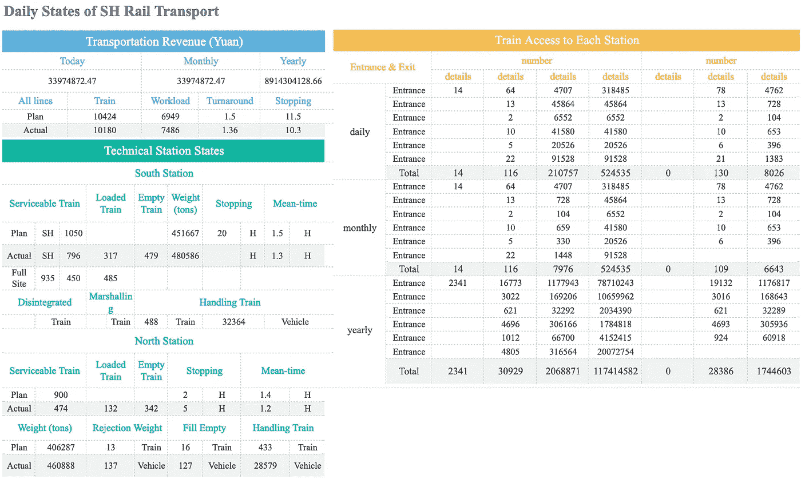

特别是当我们需要制作复杂的账单类型的报表时，用传统的 Excel 电子表格进行设计确实令人头疼。但是使用聚合报告，您可以很容易地设计这样一个表。

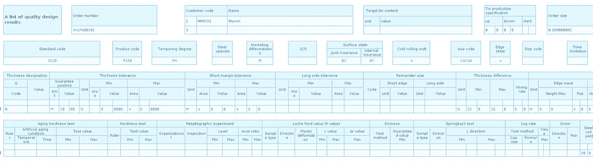

# 3.仪表板报告

# 3.1 特点

[仪表板](/a-step-by-step-guide-to-making-sales-dashboards-34c999cfc28b)报表是为解决业务[决策](http://www.finereport.com/en/features/decision-making-system?utm_source=medium&utm_medium=media&utm_campaign=blog&utm_term=3%20Types%20of%20Reports%20That%20Business%20Analysts%20Need%20to%C2%A0Learn)问题而开发的。与一般报表的表格界面不同，仪表板报表采用了类似画布的操作界面。通过简单的拖放操作，就可以构建一个功能强大、功能全面的“管理驾驶舱”。不同的数据可以整合在同一个页面上，显示各种业务指标，实现数据的多维度分析。

仪表板报告有许多功能。

*   适用于各类显示屏:PC、平板电脑、手机、电视、大屏幕等各类终端。
*   更多视觉元素:有许多视觉组件，如表格、图形、控件等。，可以自由搭配，做成各种报表。
*   组件链接分析:可以链接组件进行分析。只要你点击一个组件，关联的组件就会自动触发数据加载。
*   数据监控和定期刷新:后台可以智能检测和比对数据，前台可以及时更新数据。
*   自动轮播:仪表板报表支持同一位置不同图表样式的轮播和多个标签页的轮播。

# 3.2 业务场景

在传统的报表设计界面中，自由搭配不同的表单、图形、控件等是很繁琐的。在一页上。仪表板报告为设计和快速构建[业务仪表板](/a-beginners-guide-to-business-dashboards-981a8192a967)提供了一种简单有效的方法。

仪表板报告的一个典型应用是领导管理仪表板。

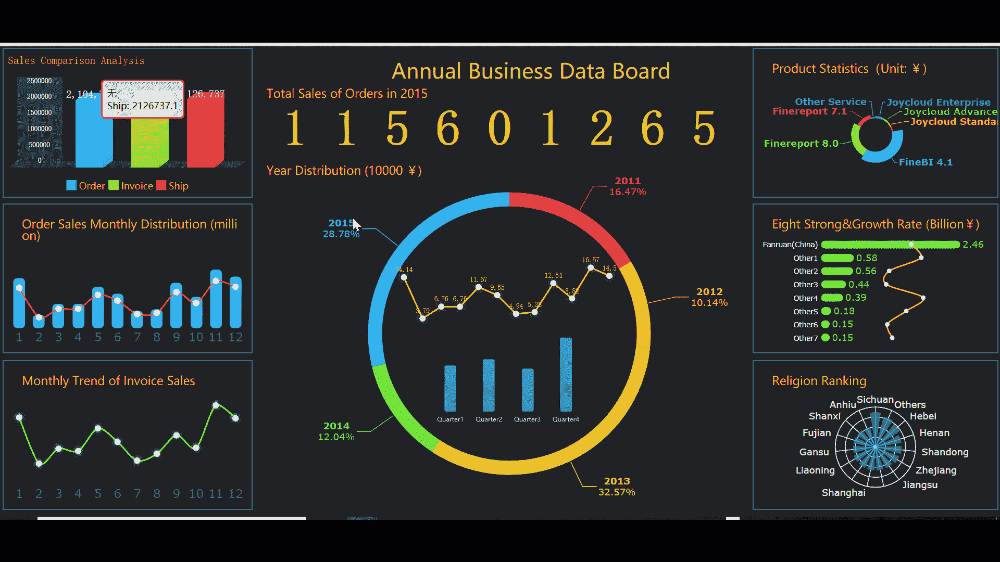

由于仪表板报告可以适应多种终端，管理员可以随时随地在浏览器、应用程序等上监控关键指标数据。

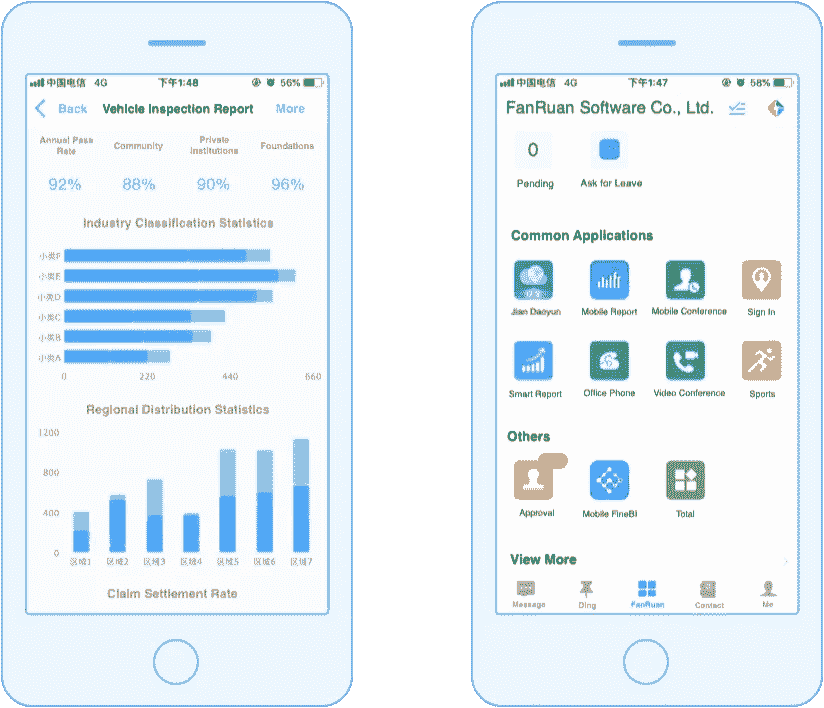

再比如，公司的战略指挥中心、监控中心，或者会议室，经常使用大屏幕实时查看关键绩效指标，或者宣传企业实力、企业形象。

# 终于

我只是展示了这三类报表的一些功能，还有很多细节没有提到。如果您充分利用 [FineReport](http://www.finereport.com/en/?utm_source=medium&utm_medium=media&utm_campaign=blog&utm_term=3%20Types%20of%20Reports%20That%20Business%20Analysts%20Need%20to%C2%A0Learn) 的三种报表设计模式，您可以满足大多数简单或复杂的报表需求，轻松实现各种业务分析。

# 您可能也会对…感兴趣

[2019 年你不能错过的 9 款数据可视化工具](/9-data-visualization-tools-that-you-cannot-miss-in-2019-3ff23222a927)

[制作销售仪表板的分步指南](/a-step-by-step-guide-to-making-sales-dashboards-34c999cfc28b)

[数据可视化中的 10 大地图类型](/top-10-map-types-in-data-visualization-b3a80898ea70)