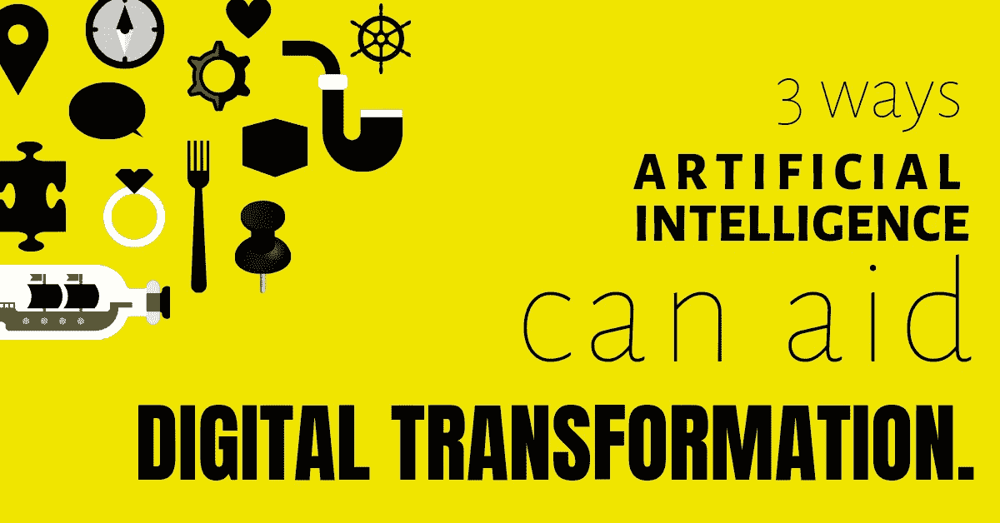

# 人工智能帮助数字化转型的 3 种方式

> 原文：<https://towardsdatascience.com/3-ways-ai-aids-digital-transformation-4a5965708c45?source=collection_archive---------22----------------------->

数字化转型和人工智能/机器学习已经成为技术领域最热门的词汇；一些组织非常热情地接受了这些。[根据国际数据公司(IDC)的一份报告](https://www.telecomstechnews.com/news/2018/nov/23/digital-transformation-investment-will-reach-197-trillion/)，2022 年，全球在实现数字化转型的技术和服务上的支出可能达到 1.97 万亿美元。同样， [Gartner 的首席信息官调查](https://venturebeat.com/2019/01/21/gartner-enterprise-ai-implementation-grew-270-over-the-past-four-years/)发现，在过去的四年里，人工智能的实施增长了 270%。

然而，组织往往没有意识到，当数字化转型和机器学习携手并进时，它们可以帮助实现完全的数字化转型。对于寻求实现数字化转型的组织来说，机器学习可能极具价值。采取互补的方法有几个好处。

印度 IT 巨头印孚瑟斯(Infosys)一份名为[企业中的人力放大](https://www.infosys.com/human-amplification/)的调查报告发现，使用人工智能支持的活动来推动数字化转型的受访者中，98%的人报告称，它为他们的组织创造了额外的收入，并将他们的底线提高了至少 15%。该报告指出，最大的影响来自机器学习，因为它帮助大幅减少了执行日常活动所花费的平均时间，并帮助做出更明智的决策，减少了出错的空间。

因为 ML 可以帮助分析复杂的数据，并根据这些数据做出准确的决策，所以它是实现完全数字化转型过程中的一个有价值的盟友。

Photo by [Markus Spiske](https://unsplash.com/@markusspiske?utm_source=medium&utm_medium=referral) on [Unsplash](https://unsplash.com?utm_source=medium&utm_medium=referral)

> “业务中使用的任何技术的第一条规则是，应用于高效运营的自动化会放大效率。第二是**自动化**应用于低效率的操作会放大低效率。”
> 
> 比尔·盖茨

数字化转型和机器学习都有携手并进的主张，组织有时可能会考虑跳过整个数字化转型。然而，这不是一个明智的想法，而且充满了问题。对于任何成功实现完全数字化转型的公司来说，一定程度的数字化成熟度是一个基本要求。尽管公司和政府机构正在思考如何**转变**他们提供现有产品和服务的方式，并创造新的产品和服务，但人工智能可以在优化过程中伸出援手，并获得可能有助于提高他们底线的见解。

以下是一些数字转换与机器学习相结合可以产生最佳结果的应用。

## 动态分析

我们知道，获得正确的数据和分析工具可以极大地增强决策。机器学习可以实时处理数十或数千个数据点，无需任何人工干预。例如，在网上购物的顾客只会得到与他们当时搜索的内容相关的报价。因此，给他们更个性化的体验。

机器学习使组织能够建立具有预测分析的模型，这些模型可以比人类更快地测试和重新测试它们。它可以在数字优化过程中带来很大的效率，特别是当涉及到自动化的数据科学能力时。

## **推动规模经济**

鉴于机器学习算法可以从现有的模式和数据中快速学习，机器学习可以帮助扩展流程，这在纯人类团队中是不可能的。数据分析师可能需要几个月才能完成一个模型，而 ML 平台只需几分钟就能完成。

## **更快的进程**

因为机器学习有能力分析比人多得多的数据，这也是一种优越的方式，它可能有助于简化和加快许多数字过程。此外，机器学习还可以帮助发现数据集中的各种关系，甚至可以帮助企业找到新的收入机会。

实际上，鉴于人工智能有潜力推动大规模流程并帮助任何企业做出明智的决策，它可以成为数字化转型过程中的一个重要工具。当然，无论是数字化转型还是机器学习，仍然存在的一个基本规则是，业务用例和目标必须明确。不清楚的商业案例会使任何组织瘫痪，不管一个组织可能带来的技术实力如何。一旦清楚了这一点，数字化转型和机器学习就能一起创造奇迹。

> 关于我们
> 
> *在 Mate Labs，我们已经构建了 Mateverse，一个全自动的机器学习平台，在这里你可以构建比* ***快 10 倍的* ***定制的 ML 模型，而无需编写一行代码*** *。我们利用专有技术、复杂管道、大数据支持、自动化数据预处理(使用 ML 模型的缺失值插补、异常值检测和格式化)、自动化超参数优化等，让分析师和数据科学家的工作变得更加轻松。***
> 
> *为了帮助您的企业采用机器学习的方式，而不会浪费您的团队在数据清理和创建有效数据模型方面的时间，请在此处注册***，我们将与您联系。**