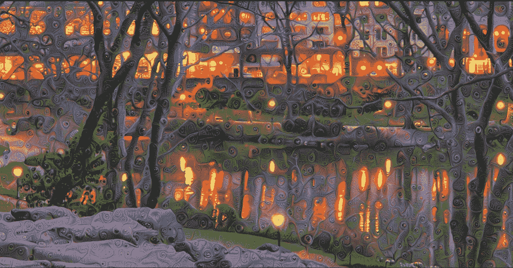

# 深度学习和编程技巧的 3 种创新方式

> 原文：<https://towardsdatascience.com/3-ways-to-create-your-own-art-and-have-fun-using-deep-learning-and-programming-c4324145f0f0?source=collection_archive---------24----------------------->

A dreamy computational photograph created by [Daniel Ambrosi](http://nips4creativity.com/art/daniel-ambrosi/).

作为一名数据科学家/数据分析师，通常意味着你主要使用你的编码技能来争论和建模数据。然而，你可以用你的技能做许多其他真正有趣、美丽和有影响力的事情。当谈到运用你的创造力时，天空是无限的。

格兰特·桑德森创作了一个视频系列,其中他用编程动画精彩地解释了数学。Nadieh Bremer 离开了她在一家四大公司的数据科学家的工作，成为一名自由职业的数据可视化设计师和艺术家。有些人利用人工智能算法创作出漂亮的艺术品，或者甚至成名并设法以可观的价格出售他们的作品。所有这些人都在某种程度上走出了熟悉的道路，为自己找到了一条“非传统”的道路，并启发了其他人。

你永远不应该把我们的兴趣局限在今天的炒作上，而是要看得更深，探索你的技能和个性的不同组合*，让你创造独特、有趣的东西，带来价值并激励他人。*

# *你为什么要这么做？*

*体验:你尝试新事物时激动人心的小“灵光一现”时刻对你的健康有益。此外，你可以获得新的技能，锻炼你的创造力和解决问题的能力。*

*发现你真正的兴趣:有时我们倾向于跟随别人正在做的事情，别人告诉我们的“下一件大事”。这样做，你就失去了自己的声音。尝试新事物是一种找到真正让你兴奋的方式。它可能会成为你的一个爱好，一个兼职项目，甚至可能是你下一步的职业发展。对我来说，玩数据很有趣，但我也喜欢创造美学上有趣的东西，这可能源于我的绘画爱好。听到太多关于人工智能/机器学习的流行语和空洞的对话让我厌烦透了。但是坐下来实际创造程序让我兴奋。*

***吸引人的切实成果:**有一次，我向同事们做了一个演示，解释神经网络是如何工作的。我用自己的绘画风格加入了一个神经风格转移的例子。我真的很惊讶其他人对我的“人工智能”生成的图片如此热情。作为一个额外的奖励，这些小发明可以在你和新朋友甚至你未来的雇主的谈话中成为一个很好的破冰工具。*

***潜在业务:**如果你创造的足够好，你甚至可以把你的创意变成真正的业务。有些人[在网上出售用深度学习创作的艺术品](https://deepart.io/)。有些人成为成功的数据，即自由职业者。还有，很多 patreons 愿意花钱让你做一些很酷的事情，即使他们没有直接从中受益。*

# ***应该如何开始？***

*以下是我们创造性努力的一些想法:*

## *1.用 P5.js 创建数字艺术作品*

*[P5.js](https://p5js.org/) 是一个用于创造性编码的免费开源 JavaScript 库。它有完整的绘图功能。你可以把整个浏览器页面想象成你的草图，而不是在纸上画草图！有了各种各样的形状和功能，你可以画出任何你能想象的东西。您可以创建像这样的小游戏和交互式数字作品(我玩这个玩得很开心！):*

**

*Sun rise scene with mouse interaction — you can view the code [here](https://codepen.io/thuvu92/pen/ExxoxyN).*

*这是我用 p5.js 创作的一个小小的“De stijl”艺术作品。 [De stijl](https://en.wikipedia.org/wiki/De_Stijl) (荷兰语为“风格”)是一个荷兰现代抽象运动，它将视觉构图简化为垂直和水平，只使用黑色、原色。*

**

*A “De stijl” art piece I created with p5.js*

## *2.数据可视化*

*数据可视化是每个与数据打交道的人的基本技能。如果您想要创建高度交互和定制的数据可视化， [d3.js](https://d3js.org/) 是您不应该错过的 JavaScript 库之一。*

*在我和我的同事参加的一次黑客马拉松中，我制作了下面这张力量布局图。我们建立了一个 NLP 模型来识别证人陈述中实体之间的相互联系，这有助于刑事法庭更快地分析案件。*

**

*Visualizing relationships between entities in witness statements.*

*虽然 D3 是一个强大的库，但它也有一个相当陡峭的学习曲线。但是，如果你已经知道一些 HTML，CSS 和一些基本的 JavaScript，你应该准备好拿起 d3。如果你是新来的，第一次想看看它能做什么，请访问 [d3 画廊](https://github.com/d3/d3/wiki/Gallery)。如果你想更有条理地学习 d3，我会推荐[阿米莉娅·沃特伯格的网站](https://wattenberger.com/blog/d3)和书，[这个](https://www.d3indepth.com/)网站。*

## *3.创建人工智能生成的艺术与神经风格转移*

*我把画水彩画作为业余爱好。有一天，我想出了一个“绝妙”的主意，用神经风格转移来创造更多我喜欢的绘画风格的艺术(我是一个多产的艺术家！).使用预训练的 VGG16 网络，仅 10 次迭代，我得到了以下结果:*

**

*Using neural style transfer to turn a photo into your own style*

## *结论*

> *解决当今世界的问题不仅需要知识和技能，还需要创造力。*

*我觉得创造力在我们的投资组合中有时被低估了。我希望通过这篇文章，你会更有动力去尝试你脑海中的想法。不管他们有多幼稚和疯狂，你一定会学到新的东西。*

*感谢您的阅读！*