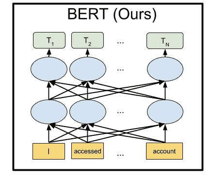

# 优化和导出在线服务 BERT 模型的 3 种方法

> 原文：<https://towardsdatascience.com/3-ways-to-optimize-and-export-bert-model-for-online-serving-8f49d774a501?source=collection_archive---------19----------------------->



Image taken from [Google AI Blog](https://ai.googleblog.com/2018/11/open-sourcing-bert-state-of-art-pre.html)

今天的主题是关于优化和导出 BERT 模型，以便根据字符串列表的预测在线提供服务。与我之前的教程不同，我将保持这篇文章简短。

本文包含以下几个部分:

1.  问题陈述
2.  减小微调 BERT 模型的大小。
3.  将模型导出到 pb 文件中。
4.  从字符串列表进行预测
5.  结论

# [第 1 部分]问题陈述

如果你一直在关注我的[上一篇关于针对多分类任务微调 BERT 模型的文章](/beginners-guide-to-bert-for-multi-classification-task-92f5445c2d7c)，你会注意到以下问题:

1.  输出模型比原始模型大 3 倍(适用于 BERT-Base 和 BERT-Large)。
2.  输出模型是 ckpt 文件。你可能需要一个 pb 文件。
3.  该代码是基于读取一个输入文件和输出概率到输出文件。您可能需要单个输入文本，而不是单个概率输出。

通过阅读这篇文章，你将学会解决上述问题。说到这里，本文不涉及以下内容:

1.  如何使用导出的 pb 文件？
2.  如何加快推断时间？
3.  如何在线上为模特服务？

# [第 2 节]减小微调 BERT 模型的大小

根据来自 BERT 团队的一名成员提供的响应，由于每个权重变量包含了亚当**动量**和**方差**变量，微调后的模型比分布式检查点大 3 倍。暂停和恢复训练都需要这两个变量。换句话说，如果您打算在没有任何进一步训练的情况下服务于您的微调模型，您可以移除变量和，大小将或多或少类似于分布式模型。创建一个 python 文件，并在其中键入以下代码(相应地进行修改):

由于内存问题，建议在终端/命令提示符下运行它，而不是在 jupyter notebook 中运行(如果遇到无法加载张量的错误，只需通过 cmd 运行它)。

您应该得到如下 3 个 ckpt 文件(取决于您在 saver.save 过程中设置的名称):

1.  model . ckpt . data-00000/00001
2.  模型.检查点.索引
3.  model.ckpt.meta

# [第 3 节]在 pb 文件中导出模型

对于那些喜欢 pb 图的人来说，从下面的[链接](https://github.com/yajian/bert/blob/master/model_exporter.py)下载 py 文件(功劳归于原创者)。将它放在您选择的目录中，并在终端中运行以下命令:

```
CUDA_VISIBLE_DEVICES=0 python model_exporter.py --data_path=./bert_output/ --labels_num=3 --export_path=./model_export/pb_graph/
```

您需要修改三个参数:

1.  **data_path** :包含三个 ckpt 文件的微调模型的路径。我把所有的文件都放在 **bert_output** 文件夹里。
2.  **标签**:你拥有的标签数量。我有三节课。
3.  **导出路径**:输出模型的路径。它将被自动创建。如果遇到与输出路径相关的错误。请从目录中删除输出路径。

完成后，您应该有一个包含以下文件的 pb_graph 文件夹:

1.  保存 _ 模型. pb
2.  变量

在下面的 github [链接](https://github.com/yajian/bert/blob/master/run_multilabels_classifier.py)中，主人做了一个脚本，可以用来训练一个多标签分类的 BERT 模型。基于当前模型，我们只能执行多分类任务，即来自所有类别的单个标签。如果您打算从所有的类中预测多标签，您可以尝试使用这个脚本。在我写这篇文章的时候，我还没有测试过它，但是你可以自己探索它。

# [第 4 节]从字符串列表预测

本节是关于对字符串列表执行推理，而不是从文件中读取。在与 *run_classifier.py* 相同的目录中创建另一个 py 文件，并键入以下内容:

该函数接受字符串列表作为参数。让我们看看函数的每一行:

1.  使用列表理解遍历列表中的每个元素，并将其转换为功能转换所需的适当格式。
2.  根据标签、最大序列长度和标记化将其转换为预测所需的特征。稍后我们将初始化所需的变量。
3.  创建一个要传递给 TPUEstimator 的 **input_fn** 闭包。
4.  基于输入要素执行预测。

转换时间通常很长，这取决于你的内存和 GPU。如果您打算进一步优化它，请检查*convert _ examples _ to _ features*和 *input_fn_builder* 。供您参考，上面提到的两个功能消耗的时间和内存最多。

我们现在将初始化所需的变量。继续添加以下代码:

完成后，最后一部分是调用 **getListPrediction** 函数，将一个列表作为参数传递:

```
pred_sentences = ['I am a little burnt out after the event.']result = list(getListPrediction(pred_sentences)))
```

您需要将结果转换为列表才能查看。您应该能够获得以下结果(3 个类的示例):

```
[{'probabilities': array([2.4908668e-06,
       2.4828103e-06, 9.9996364e-01], dtype=float32)}]
```

结果表示每个标签的概率，最高的是预测标签。您可以简单地使用输出结果并将其映射到相应的标签。

# [第五节]结论

正如我前面提到的，这是一篇相当短的文章，为了在线服务，它解决了一些与 BERT 相关的问题。如果你有兴趣通过 GPU 优化加快推理时间，敬请查看以下[链接](https://github.com/google-research/bert/pull/255)。请记住，来自 BERT 的团队成员之一已经冻结了存储库，以防止任何代码失败。然而，将来可能会有一个单独的存储库，其中包含 GPU 优化的代码。请继续关注更多关于编程和人工智能的文章！

# 伯特相关的故事

1.  [针对多分类任务的 BERT 初学者指南](/beginners-guide-to-bert-for-multi-classification-task-92f5445c2d7c)

# 参考

1.  [https://towards data science . com/beginners-guide-to-Bert-for-multi-class ification-task-92f 5445 c2d 7 c](/beginners-guide-to-bert-for-multi-classification-task-92f5445c2d7c)
2.  [https://github.com/yajian/bert](https://github.com/yajian/bert)
3.  [https://github.com/google-research/bert/issues/99](https://github.com/google-research/bert/issues/99)
4.  [https://github.com/google-research/bert/issues/63](https://github.com/google-research/bert/issues/63)
5.  [https://github.com/google-research/bert/issues/146](https://github.com/google-research/bert/issues/146)
6.  [https://github.com/google-research/bert/pull/255](https://github.com/google-research/bert/pull/255)