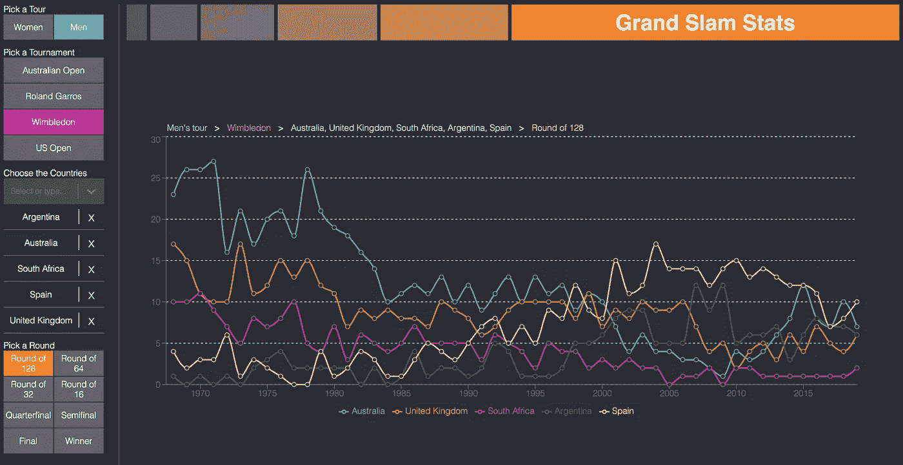
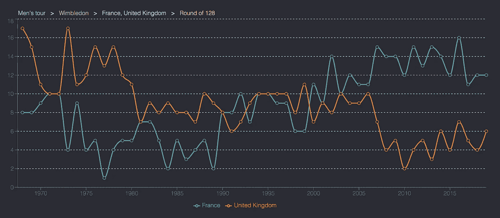
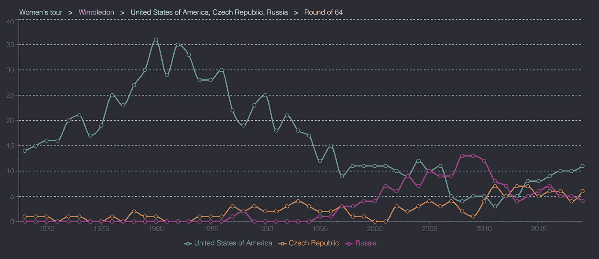
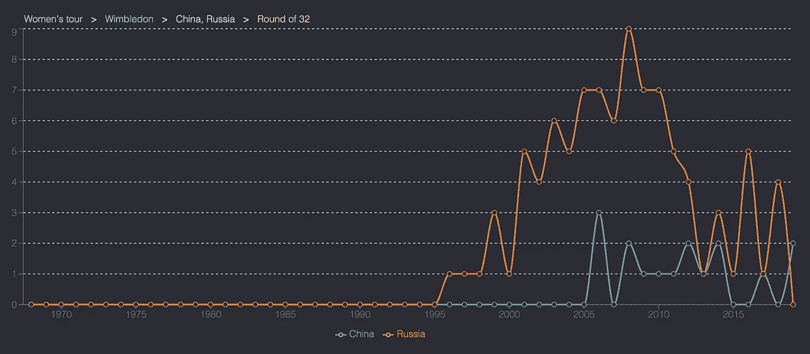

# 通过数据讲述的 3 个温网故事

> 原文：<https://towardsdatascience.com/3-wimbledon-stories-told-through-data-d127fe61584c?source=collection_archive---------23----------------------->

## 我们创建了一个交互式数据 viz 工具来比较各个国家的网球成功率

大满贯网球比赛的统计数据为无数的数据故事提供了弹药。通过观察不同时期国家的成功，男子和女子比赛的区别；四个不同比赛之间的比较。

我们创造了这个[工具](https://jpvsilva88.github.io/tennis/)来更容易地获取大满贯赛事的大量可用数据——正好赶上温布尔登。

## 首先，如何使用我们的工具“大满贯统计”

> 点击这里的大满贯统计链接:【https://jpvsilva88.github.io/tennis/ 

创建自己的图表来浏览数据很简单。点击上面的链接，然后从以下选项中选择:

*   女子或男子网球；
*   四大满贯赛事；
*   一次最多来自五个国家；和
*   第一轮 128 名参赛者将角逐年度冠军

然后，您的选择将在您刚刚创建的图表上方显示为一个方便的摘要。

为了获得灵感，这里有三个我们在探索[工具](https://jpvsilva88.github.io/tennis/)时发现的温网故事。所以买些草莓和奶油，继续读下去。

## 法国现在比英国拥有更多的温布尔登男子选手

> 邻居之间的角色互换

英国(上图中橙色部分)长期以来一直是其主场大满贯赛事的最大亮点，有大量男性参加了首轮 128 场比赛。东道主在一定程度上得益于东道国允许向没有直接进入锦标赛的球员发放的通配符数量。在整个 70 年代和 80 年代，英国经常有超过两倍的法国人(蓝色)，即使其数量在下降。

但在 1991 年，法国首次超过了英国。自那以后，随着新一代法国球员加入这项运动，如 2003 年的盖尔·蒙菲尔斯和 2007 年的乔-威尔弗雷德·特松加，法国仅 5 次落后于英国，自 2000 年以来从未落后过。

## 许多美国女选手开始从温布尔登的颓势中恢复过来

> 威廉姐妹的成功掩盖了美国人数的急剧下降

上图关注的是通过第一轮的女性。许多年来，这个舞台明显被美国玩家(蓝色)的绝对数量所主导。尽管塞雷娜·威廉姆斯(Serena Williams)和维纳斯(Venus)在 2000 年代和 2010 年代初赢得了最多的温布尔登冠军，但这掩盖了美国女性的整体数量在这一时期完全崩溃的故事。2013 年，美国被捷克共和国(orange)超越，该国在当年的 64 轮比赛中拥有最多的女选手。

这种趋势不只是在温布尔登，而是在所有大满贯比赛和美国男子比赛中。但与男性不同的是，在过去几年中，美国女选手的数量开始回升。所以也许这只是一个暂时现象，美国不应该太担心没有威廉姆斯姐妹的未来？

## 今年表现出色的俄罗斯女性都去哪里了？

> 俄罗斯女性不再填补美国女性在温布尔登留下的空白

在 21 世纪初，当美国女性人数下降时，后苏联时代的俄罗斯(橙色)开始在温布尔登填补这一空白。正如第二张图表所提到的，俄罗斯超过了美国，在一段时间内是表现最好的国家——2008 年有 9 名女性进入第三轮 32 人。但自 2000 年代末达到峰值后，数量有所减少。

尽管今年温布尔登有 11 名女性参赛，但这是自 1995 年以来俄罗斯首次在 32 强赛中没有女性参赛。相比之下，这是中国(蓝色)第一次在这个阶段比俄罗斯更成功，张帅和王蔷进入了 32 强。

> **找到自己的趋势:**【https://jpvsilva88.github.io/tennis/】T2

## 我们如何创建我们的数据，即？

我的搭档若昂是一个狂热的网球迷，他做了所有繁重的工作来创造这个[工具](https://jpvsilva88.github.io/tennis/)。这些数据可以在杰夫·萨克曼的 GitHub 账户上找到。React 用于处理数据并设计了[工具](https://jpvsilva88.github.io/tennis/)，使用漂亮的 [recharts 作为图表库](http://recharts.org/)。它是在 GitHub 上托管的，我们会手动添加新的温布尔登结果。

喜欢你看到的吗？以下是若昂在推特上的网球#dataviz:

奥利弗·卡林顿&若昂·席尔瓦公司