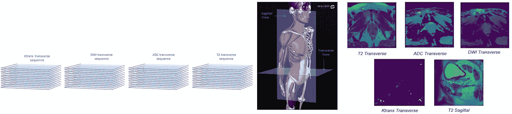
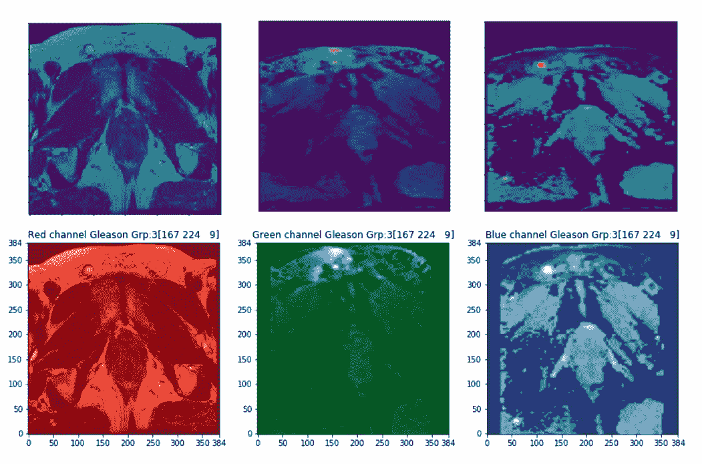
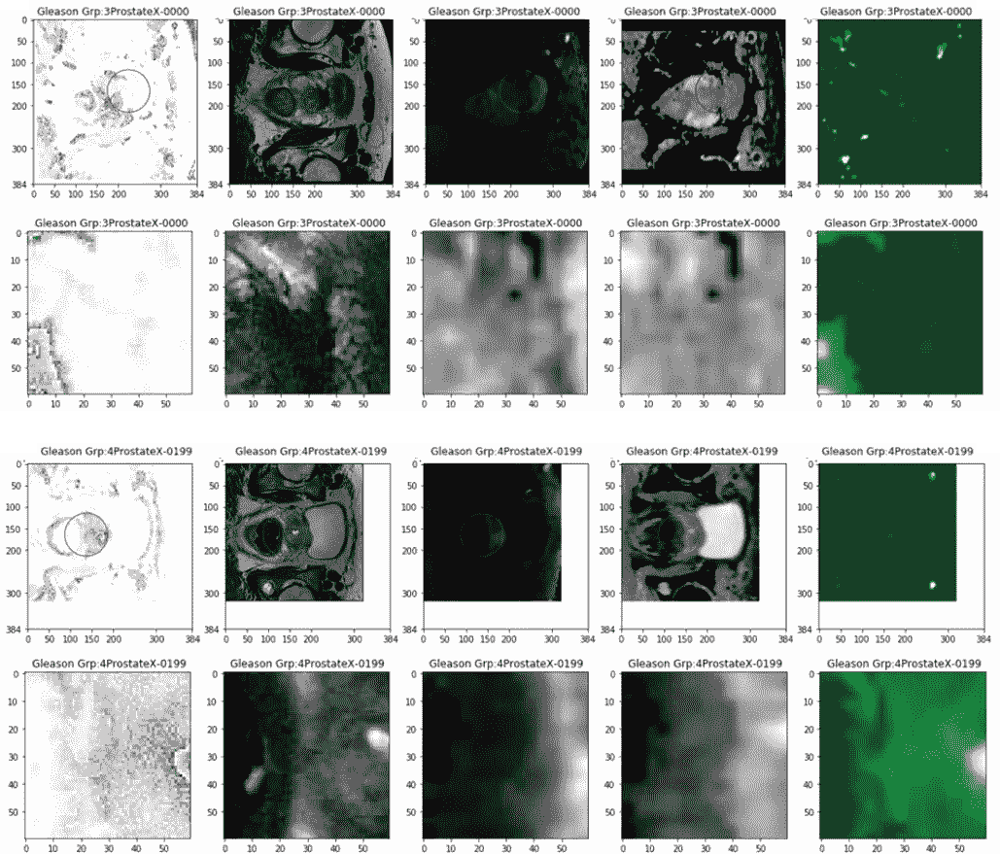
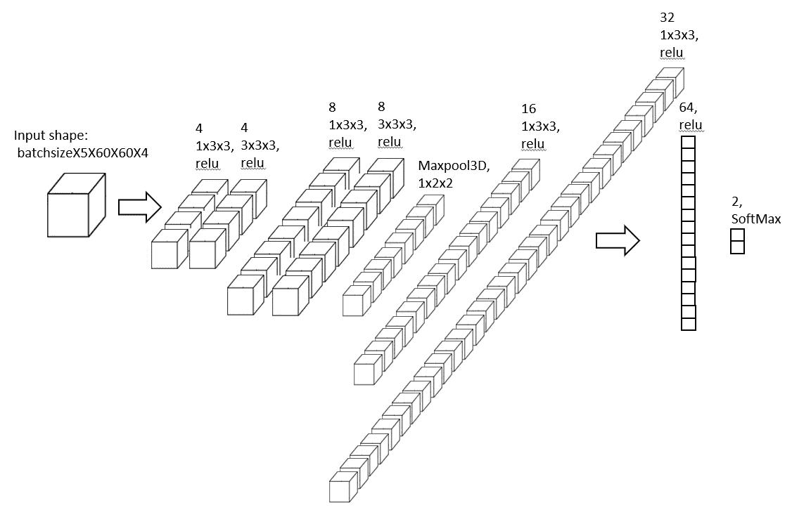
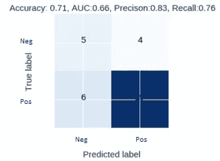
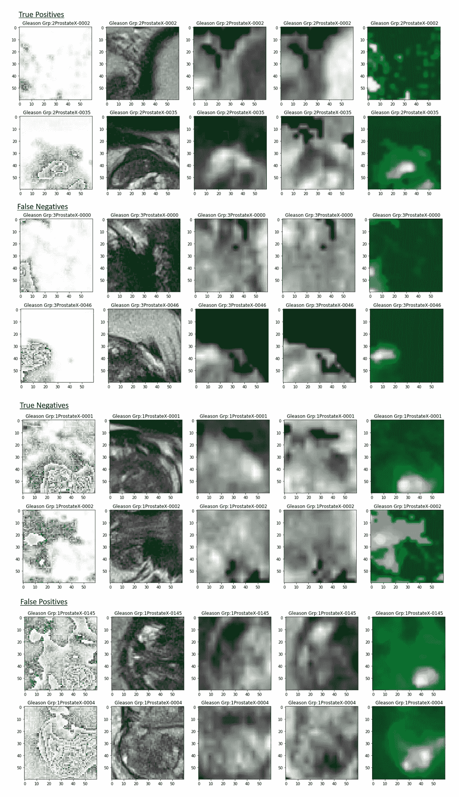

# 前列腺癌在 PROSTATEx-2 上的 3D CNN 分类

> 原文：<https://towardsdatascience.com/3d-cnn-classification-of-prostate-tumour-on-multi-parametric-mri-sequences-prostatex-2-cced525394bb?source=collection_archive---------19----------------------->

## 多参数磁共振序列的三维 CNN

## 内容

本文描述了在多参数 MRI 序列上使用 3D CNN 对前列腺癌进行显著或不显著的分类。内容如下:

*   数据集描述
*   Dicom 到 Nifti 文件格式的转换
*   不同磁共振成像序列的配准
*   围绕损伤中心裁剪并调整大小至 30 毫米乘 30 毫米
*   二元标签提取
*   训练-验证分割
*   3D CNN 架构
*   结果

## 数据集描述

使用的数据集取自[前列腺素-2 — SPIE-AAPM-NCI 前列腺素 MR Gleason 等级组挑战赛](https://wiki.cancerimagingarchive.net/display/Public/SPIE-AAPM-NCI+PROSTATEx+Challenges#b07aa11d8dd248838322e5d1b67e0909)。数据集由 162 名患者组成，其中 99 名患者作为训练案例，63 名患者作为测试案例。MRI 序列由一系列 2D 扫描组成，这些扫描以 3D 形式描绘了身体的一部分。每位患者有五种 MRI 序列模式:



(left) demonstration of MRI sequences, (middle) demonstration of views, (right) five modes of MRI in PROSTATEx-2 dataset

*   T2 加权横向序列
*   T2 加权矢状序列
*   ADC 横向序列
*   DWI 横向序列
*   Ktrans 横向序列

由于 T2 横切面、ADC、DWI、KTrans 都是前列腺的横切面视图，所以它们被一起用于对前列腺病变进行分类。没有使用 T2 矢状序列，这是前列腺的侧视图。

每个患者在他或她的 MRI 序列中可能有一个以上的病变发现。在随附的 CSV 文件中，每个病灶都标有:

*   格里森等级组(GGG)1-5(1 为最有利，5 为最不利)，
*   以及图片中病变中心的 X、Y、Z 坐标。

## Dicom 到 NIFTI 文件格式的转换

T2、ADC、DWI 序列采用 Dicom 文件格式，KTrans 采用 MHD 文件格式。所有的 DICOM 文件和 MHD 文件首先使用 MRIcoGL(【https://www.nitrc.org/projects/mricrogl/】)转换成 NIFTI 文件，MRIcoGL 使用 dcm2niix 将 Dicom 转换成 NIFTI。

> 提示:打开 MRIconGL.exe=>Import= >将 Dicom 转换为 NIFITI，将数据集的根文件夹转储到白色窗口空间，并等待转换完成，这将需要一段时间。然后用 python 脚本组织你的 Nii 文件(不是最好的方法)。或者，您可以尝试使用 [dicom2nifti](https://github.com/icometrix/dicom2nifti) python 包用 python 脚本进行转换。

## 不同磁共振成像序列的配准

由于不同的横向 MRI 模式具有不同的尺度和不同的位置，因此需要配准步骤来对准不同的模式。仿射变换用于将 ADC 序列、DWI 序列和 Ktrans 序列与 T2 序列对齐。然后这四种模式作为一个 NumPy 阵列相互堆叠。堆叠式 NumPy 阵列类似于三通道图像文件，其中红色、蓝色和绿色通道对应于 T2、ADC 和 DWI。然而，还有第四个渠道，即 Ktrans。



(top row) unregistered T2, ADC, DWI images, (btm row) co-registered T2, ADC, DWI, depicted as three channels of an image file. Ktrans is left out only in this depiction but it is used and will be shown later on.

```
import nibabel as nib
import os
from dipy.align.imaffine import AffineMappatients = os.listdir("D:\ProstateX2")
stack = []
for i in patients:
 directory = “D:\\ProstateX2\\” + i
 s = os.listdir(directory)
#Load T2.nii file
 t2 = nib.load(“D:\\ProstateX2\\” + i+ “\\” + s[7])
#Load ADC.nii file
 ADC = nib.load(“D:\\ProstateX2\\” + i+ “\\” + s[3])

 t2_static = t2.get_data()
 t2_static_grid2world = t2.affine

 ADC_moving = Diff1.get_data()
 ADC_moving_grid2world = ADC_moving.affine
 identity = np.eye(4) ADC_affine_map = AffineMap(identity, t2_static.shape,         t2_static_grid2world, ADC_moving.shape, ADC_moving_grid2world)

 transformADC = ADC_affine_map.transform(ADC_moving)

 out= np.stack([static.transpose(2,0,1), transformADC.transpose(2,0,1) axis=-1)

 stack += [patient]
```

## 围绕病变中心裁剪并调整大小至 30 毫米乘 30 毫米



columns: stacked mode (comprising T2, ADC, DWI, Ktrans), T2 mode, ADC mode, DWI mode, KTrans mode; rows: ProstateX-0000 co-registered, ProstateX-0000 cropped and resized, ProstateX-0199 co-registered, ProstateX-0199 cropped and resized

由于每个病变在序列中都有 x、y、z 坐标标签，因此可以识别病变中心，并用蓝色圈出。每个军团病例将有 30 毫米乘 30 毫米的真实世界长度，以病变为中心。由于 T2 序列的分辨率对于所有患者都不相同，所以图像的每个像素代表真实世界长度中的不同毫米。要裁剪的像素数将由公式给出:`30/pixel_spacing`其中`pixel_spacing`是在附带的 CSV 文件中给出的每个像素代表的毫米数。在病变中心裁剪所需数量的像素后，所有裁剪的图像都被调整到 60X60 分辨率，这是裁剪后最常见的分辨率。

此外，将只保留病变中心 z 坐标上下的 2 个切片。因此，裁剪和调整大小将导致 5X60X60X4 分辨率的立方体被馈送到 3D CNN 模型。最后一个通道 4 对应于每个像素上的堆叠通道(T2、ADC、DWI、Ktrans)。裁剪到较小的立方体大小将会有更集中的感兴趣区域，这将有助于模型更好地分类。

## 标签提取

给出的标签是每个病变发现的 GGG(1-5)。当 GGG 为 1 时，病变发现可进一步分组为无临床意义，当 GGG 大于 1 时，可进一步分组为有临床意义。当比较 PRSTATEx2 和 PROSTATEx 的结果时可以看出这一点，因为它们具有相同的病例。然后，根据基于 GGG 发现的它们是否具有临床意义，将每个损伤病例重新标记为真或假。对于二元标记，未来的任务是对病变是否具有临床意义进行二元分类。

## 训练-验证分割

该数据集由 99 名患者的 MRI 序列组成，但是每个患者在他或她的 MRI 序列中可能有一个以上的病变发现。如预处理步骤中所述，总共呈现和提取了 112 个发现。这 112 项发现分为 78 项用于培训的发现和 34 项用于验证的发现。

## 3D CNN 架构



3D CNN architecture

建议的架构如图所示。输入形状是 Batch_SizeX5X60X60X4。输入通过一系列 1x3x3 和 3x3x3 内核，然后是 Maxpool3D 层和另一系列 1x3x3 内核来扩展特性空间。然后，扩展的特征空间被展平，通过 64 个密集节点，最后通过 SoftMax 激活 2 个密集节点。交叉熵用于 SoftMax 输出的损失函数。

## 结果

验证集上的混淆矩阵和度量分数如下:



Confusion Matrix on the validation set



真阳性、假阴性、真阴性和假阳性打印在左侧。结果显示，虽然很难单独从每种模式中分辨出病变应该是阳性还是阴性，但是当应该是阳性(真阳性和假阴性)时，堆叠模式显示的白色多于灰色，而当应该是阴性时，堆叠模式显示的灰色多于白色。这可能是一个明显的迹象，表明多参数 MRI 可能比单一模式的 MRI 扫描更好地对前列腺癌进行分类。