# 3d 打印。人工智能:走向超越智能的开源、大规模 3d 打印

> 原文：<https://towardsdatascience.com/3dprint-ai-towards-open-source-large-scale-3dprinting-beyond-intelligence-1c692d0ac324?source=collection_archive---------24----------------------->

## 第一/二部分:理论部分

这篇文章是圣乔治·德拉孔泰迪斯在巴特利特建筑学院正在进行的研究的一部分，研究集群 I (RCI)，2019 年。

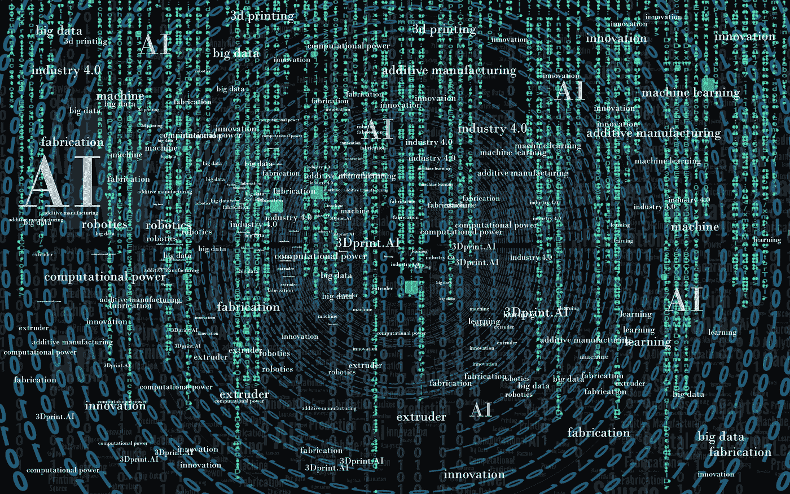

Figure 1\. AI matrix.

> ***“数字之后还有更多数字，要么我们喜欢，要么不喜欢”(Carpo，2018)***

**摘要**

在制造业数字化革命的门槛上，增材制造等新兴技术极大地改变了设计和制造(Gershenfeld，2015)。然而，当前增材制造在成本、时间和质量方面的局限性限制了其未来的发展，尤其是其大规模实施。从上述问题产生了本论文的假设，即机器学习算法的技术进步和开源社区的开放创新有可能彻底改变大规模增材制造，使其能够塑造制造的未来。为了检验这一假设，本文引入了 3Dprint。AI 是一个用于大规模增材制造的开源机器学习框架，旨在以可持续和负担得起的方式在建筑规模上让用户和技术参与增材制造的应用。

3d 打印。人工智能有两种工作模式，手动和自动。它包括以下步骤:I)打印时的视频记录和对象识别，ii)对机器人的自适应反馈，iii)所有打印设置和结果的文档，以及 iv)通过 google sheet 文件(手动模式)或通过在线分布式网络分发这些设置，以使机器学习算法能够使用它们来进行预测(自动模式)。3Dprint.AI 在高质量挤出机的设计和开发中实施，这需要在手动模式下集成上述步骤。进行印刷测试以创建数据集，用于预测挤出结果和训练社区的机器学习算法。论文最后建议将软件开发作为上述开源框架的附加操作，这可以节省计算能力并为社区赚取收入。

**关键词:**机器人 3d 打印，增材制造，人工智能，开源，创新，区块链，大规模制造

# 内容

## 01|简介

*   1.2 假设
*   1.1 定义
*   1.3 方法
*   1.4 步骤
*   1.5 预期捐款

## 02|背景

*   2.1 问题陈述
*   2.2 历史和社会背景
*   2.3 关于主旨的辩论
*   2.4 大规模 AM、设计制造中的机器学习、开源社区中的轨迹

## 03 |打印。面向大规模增材制造的开源机器学习框架 AI

*   3.1 一般描述
*   3.2 技术规范:步骤
*   3.3 社区和数据的组织
*   3.4 问题和挑战

## 04|执行:手动模式

*   4.1 挤压机
*   4.2 实施步骤
*   4.3 评估和进一步措施

## 05|结论

*   5.1 贡献
*   5.2 结束语

**参考书目**

**图片来源**

……………………………………………………………………………………….

# 1|简介

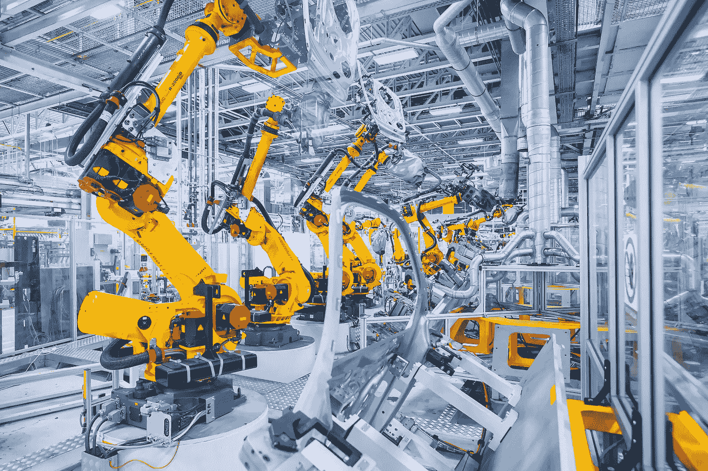

Figure 2\. Robots, production line.

**1.1 定义**

> “机器学习(ML)是使用算法来解析数据、从中学习并做出决定或预测的实践。机器使用大量数据和算法进行“训练”。’(Copeland，2016)。
> 
> 增材制造(AM)是将材料连接在一起，根据三维模型数据制造物体的过程，通常是一层又一层，与减材制造方法相反(Wohlers Associates，
> 2010 年)。
> 
> 机器人 AM 是一种使用工业机器人的附加制造工艺，因为工业机器人具有高速度、高精度和多轴运动自由度以及
> 大规模。在本文中，术语“大规模 AM”完全指机器人 AM。

**1.2 假设**

Gershenfeld (2012 年)宣称制造领域将迎来一场新的数字革命，而 Bitonti (2016 年)则否认了这一说法，称 AM 等技术的全部潜力才刚刚开始被发现。尽管 AM 有着明显的前景，但它的局限性仅限于原型规模。Bitonti (2016)指出，尽管 AM 具有大规模应用的
潜力，但由于其局限性，行业仅将其用作原型技术。

Anderson (2102)证明了硬件和软件的开放式创新可以在全球制造商的框架内增强现有技术的能力，如 AM。然而，即使计算能力和算法的可用性使机器学习的应用充满希望，它仍然是一个概念和技术挑战。为了克服这些障碍，本文引入了 3Dprint。AI，一个用于大规模增材制造的开源机器学习框架，可以加速其发展，并最大限度地减少其局限性。3d 打印。人工智能框架是在 AM 在取得实质性进展以强烈和决定性地挑战所有其他减法制造技术时面临众多限制的时候创建的。

本论文的动机是通过创建一个在线平台，让用户和实验室可以交换关于大规模实施 AM 的硬件和软件的数据和
知识，从而将 AM 带入架构规模。然而，本文的目的不是创建平台，而是研究平台运行的框架所带来的挑战。

Figure 3\. MX3D robot prints steel bridge.

**1.3 方法**
针对大规模 AM 的机器学习框架的提议借鉴了几个相关领域的研究。本文将开放硬件和软件中的 DIY 文化、数字设计中的机器学习趋势以及机器人技术在数字制造中的应用结合在一起，提出了一个框架，该框架通过挑战行业的现状，有可能将 AM 提升到建筑规模。

论文的分析轴围绕以下问题——开源创新和机器学习算法能否推进大规模 AM？

本文的批评视角集中在大规模 AM 开放社区是否可能的问题上。除了阻止用户参与的技术问题之外，还有任何道德问题吗？用户会信任区块链网络来分发数据或参与社区所需的高技能，但仍然保持一定程度的不可访问性吗？如何有效地满足社区的财政需求？

作为寻找这些问题答案的书目研究的替代方法，在提出并详细讨论本论文的想法后，在 2019 年 Autodesk 大学会议上进行了两次民意调查，一次是关于“制造的未来”，另一次是来自 Bartlett 学生的民意调查。尽管由于参与人数有限，民意调查的结果不可能完全客观，但对民意调查的回应表明了机构群体潜在成员的想法。

最后，大部分的 3Dprint。人工智能操作使用为第一研究组的所有学生开发的挤压机手动执行。在研讨会上，使用其他组的挤压机结果创建社区受到了批评。挤出机的上述设计被提供给了其他学生，他们在有益的智力环境中迅速获得了空间印刷的技能，并在车间中交换了设计和数据。

**1.4 步**

论文按以下步骤展开:

第二章将对论文的内容进行历史性的架构，同时讨论该架构的主要观点。大规模 AM、机器学习和开源社区中的轨迹将被分析和批评。

第三章将介绍 3d 打印。人工和自动模式下的人工智能框架。它将分析社区和数据的组织。它将提出技术和伦理挑战，并分析其经济效率的计划。

第 4 章将介绍挤出机，该挤出机是为 RC1 开发的，以手动模式实现了框架的大部分步骤。它将评估巴特利特的 B 制作工作室的经验，在那里所有的设计都给了来自其他集群的学生。

第五章将对本文所描述的研究进行评价和批评，最后为框架的未来发展指明道路。

**1.5 预期捐款**

这项研究旨在吸引三类不同的读者。对于建筑师——设计研究人员，旨在质疑数字制造的现有限制，并说明创建开源社区的潜力，以便在 AM 中应用机器学习，推动设计和制造超越当前的限制。对于人工智能领域的研究人员和程序员来说，本论文旨在让他们了解人工智能的问题，并激励他们在人工智能中实现机器学习算法，从而实现人工智能的革命。对于制造商和思想家来说，它旨在展示一个使用机器人 AM 大规模制造东西的框架，同时明确强调它的挑战、危险和前景。

# 02|背景

Figure 4.Detail of Daedalus Pavilion, Ai build 2016.

**2.1 问题陈述**

> 文章的问题陈述是基于大规模 AM 实现中历史上一直存在的问题；尽管它在原型规模上不断获得动力。与此同时，根据 Carpo (2017)的说法，机器学习算法已经得到发展，并成功应用于从数字设计到制造的许多不同领域。此外，Anderson (2012)认为开源社区已经彻底改变了代码和系统，用户之间的在线交互可以带来巨大的创新。**因此，本文研究了开放式创新和人工智能算法能否应用于大规模敏捷制造并加速其发展的问题。**

**2.2 关于框架主旨的辩论**

一方面，可以假设后数字时代的计算能力和算法创新可以导致使用 AM 的巨大创新。然而，另一方面，希伯伦(2016)指出，机器学习算法需要更深入地探索，因为根据研究人员的说法，它们仍处于原始阶段。

此外，尽管 AM 往往是创新的来源，但成本和过程的复杂性阻止了人们对其进行实验(Rayna，Striukova 和 Darlington，2015)。事实上，学习使用 3d 打印机或机器人所需的技能往往既耗时又费力。因此，用户往往很快对这种机器失去兴趣，宁愿不使用它们。然而，数字平台可以帮助克服这些困难，因为大多数时候，它们使用户之间能够进行多次互动，就特定问题交换知识和想法，并快速获得技能(斯尔尼塞克，2017)。许多数字公司，如谷歌，服务初创公司如优步，以及制造业，如西门子，已经开始使用平台向客户介绍他们的服务和产品，指导他们，使他们的服务和产品更容易被人们接受(斯尔尼塞克，2017)。

此外，用于大规模 AM 的开源机器学习框架往往是技术复杂且计算密集的过程。因此，在其创建过程中的每一步都可能出现的技术问题会使框架不起作用，只是浪费时间和精力。然而，Pearson (2016)指出，开源社区内部的治理可以将解决技术问题的责任分配给社区用户，以便将概念转换为功能模型，因为开源环境的灵活性使系统的修改变得简单而快速。

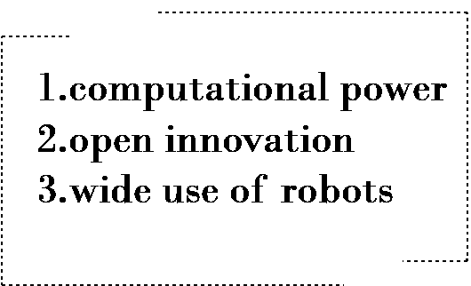

然而，可以假定，在开源社区中，由于知识产权的丧失而出现的伦理问题，它所产生的系统的不可靠性和易腐败性，以及用户缺乏伦理-经济回报，正在成为吸引社区更广泛参与的严重障碍。此外，以意想不到且通常非法的方式使用技术的可能性——例如未经授权开发枪支——会危及公共安全。然而，Pearson (2016)认为，在开源环境中，有特定的等级规则、数据保护和用户评估，以确保社区的道德和法律方面。

# 03 |打印。大规模增材制造的开源机器学习框架。

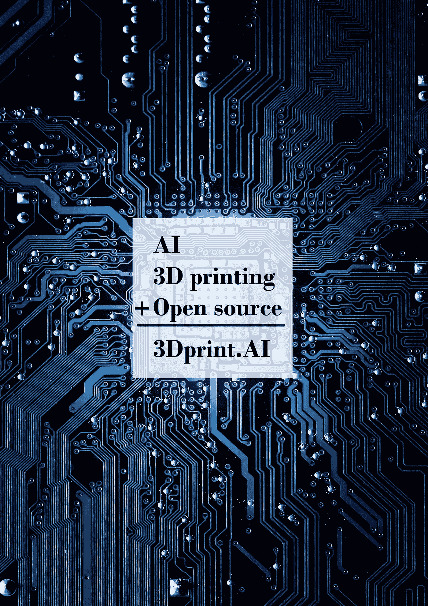

Figure 4\. 3Dprint.AI framework.

## 3.1 一般描述

3d 打印。人工智能是作为一个概念框架引入的，它使用机器人手臂进行打印，从技术上讲，它具有实际实施的潜力。3d 打印的想法。AI 于 2019 年 6 月在 Autodesk 大学会议上发表，下面介绍的讲座观众投票是对论文论点的反馈。

作为一个开源框架，3Dprint。AI 旨在连接实验室、机构、公司、初创企业，甚至是单一的、经过验证的用户。在世界各地的大学和工业中，从事大规模 AM 实验的实验室感到缺乏专注于该技术的框架是转换 3Dprint 的障碍。人工智能变成了有前途的
和技术上可行的技术。

3d 打印。AI 工作在两种模式下——使用机器学习算法的全自动模式和人工模式(图 6)。这些模式被合并到以下步骤中:I)打印时的记录和对象识别过程，ii)自适应反馈过程，iii)打印设置的文档，以及 iv)通过 Google sheets-手动模式或区块链网络-自动模式保存-分发数据。保存后，可以通过机器学习算法或人工对数据进行批判性研究，对数据进行处理，以改进设置并进行预测。手动模式可以在社区开始时使用，此时有少量数据，并且还没有编写和测试适当的算法。像大多数开源社区一样，3Dprint。AI 足够灵活，可以根据 3Dprint 未来实施的需要添加或删除步骤。

如上所述，其真正的创新在于实时识别印刷错误并预测未来结果，同时所有信息均可用于社区。成员可以向社区贡献数据，同时他们也可以测试算法做出的预测。通过这种方式，经过多次迭代后，社区将有可能开发一种使用机械臂进行空间挤压的软件，填补该领域的现有空白，并使用户更容易使用空间挤压。

框架所需的工具是一个机械臂、一个挤压机和一台计算机。一开始，机械臂可以是 6 轴机器人。挤压机可以由社区制作，供所有成员共享使用。使用相同的硬件，以避免冲突。过程的每一步都很重要，需要高精度的设置和工具，因为每一个可能的错误都会导致不同的结论和决定。下面讨论这个框架的技术、组织和伦理问题。

Figure 6\. The 3dprint.AI framework.

## 3.2 技术规范:步骤

## I)打印记录和对象识别

安装在机械臂挤压机附近的摄像机用于近距离记录所有过程。在自动模式下，相机将所有记录发送到本地计算机，计算机使用对象识别程序将打印模型与数字模型进行比较。该算法扫描打印模型的每一层(网格)，将其与照片进行比较，找出特定的打印错误。印刷错误，如包装材料，过度挤压蚀刻是众所周知的社会和非常容易找到他们的照片。

摄像机还可用于向机器人用户实时传输该过程，以便有经验的用户可以手动执行该过程，从而识别许多挤压错误，而无需使用软件。

## II)适应性反馈过程

当本地计算机识别出打印错误时，它会搜索可能的打印错误的数据库，以找到该错误的匹配项，并建议纠正该错误的步骤。计算机向机器人发送反馈以改变其 g 代码，g 代码可以控制从机器人运动到温度控制的大多数打印过程。

大多数情况下，印刷错误是由于高速或温度误差造成的。这些参数可以很容易地改变，以改善印刷效果显着。尽管这一步看起来过于复杂，但在打印过程中会逐渐产生效果。通过机器人的官方操作软件如 RobotStudio 改变机器人的 g 代码，或者通过机器人的手动控制停止进程以改变 g 代码的参数，可以手动实现相同的过程。

## III)记录打印设置、问题和解决方案

一旦打印结束，用户必须保存该过程的所有设置，如电机速度、温度蚀刻以及打印过程中出现的错误。如果他们设法纠正了错误，他们必须记录他们为纠正错误所采取的措施。他们还必须拍下模型的照片，尤其是出错的地方。如果用户无法修复错误，它将被记录为未解决的问题，并在社区中公布。随着用户贡献解决方案，大量数据积累起来。对于每一个可能的错误，每个用户可以贡献不同的解决方案，其中最佳的一个可能被使用。文档可以在 excel-google sheet 文档中完成，该文档可供社区的所有成员使用。每次打印迭代的数据表可以从打印软件自动获得，也可以由用户手动创建。

## IV)保存数据并分发给社区

在文档化之后，用户可以使用社区的区块链网络来分发他们的数据(图 36)。通过机器学习，可以对现有数据进行分析，以精确地确定需要进行哪些进一步的测试，以使预测模型更加自信(Zelinski，2018)。然而，训练机器学习系统往往是一个高度计算密集型的过程，这通常不切实际，甚至不可能在单台消费级机器上执行(希伯伦，2016)。由于这个原因，社区的一些用户将被指定实现所有的计算，以向用户提供现成的解决方案。

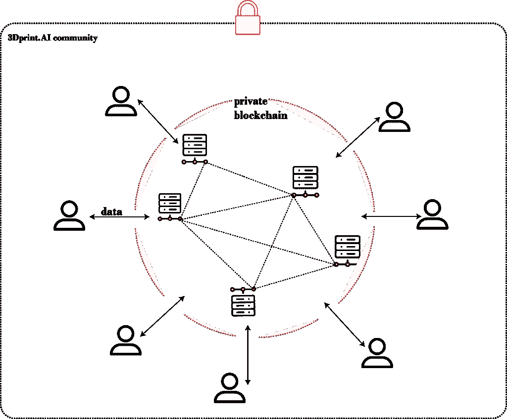

Figure 7\. Private blockchain network of 3Dprint.AI community.

## 3.3 社区和数据的组织

## 治理和层级结构

Pearson (2016)表明，治理和等级制度在开源社区中都是必不可少的，尽管开源社区的组织在许多方面都很民主，但与传统的软件开发公司没有太大的区别。在 3d 打印中。AI 框架中，上述特征往往是至关重要的，因为在将用户提交的数据添加到数据库之前对其进行评估和确认对于系统的可靠性是至关重要的。此外，在组织新项目、解决问题和回答社区提出的问题，甚至击败病毒攻击和恶意软件时，治理对于在用户之间分配特定的角色和职责是必要的。

斯尔尼塞克(2017)已经证明了这样的开源社区，即使他们有治理和规则；使用户能够以意想不到的方式行动。事实上，Pearson (2016)批评说，无论用户何时以及如何互动和参与在线社区，都是层次结构使社区变得灵活，并随着用户数量的增加而促进其分成许多子系统。

根据 Pearson (2016)的说法，开源社区具有紧密的垂直层级结构。金字塔的底部是开发一小部分工作的贡献者，其次是组织项目较大部分并评估贡献者工作的维护者，顶部是收集和组装项目所有不同部分的项目领导者(Pearson，2016)。

至少需要一名维护者来启动 3Dprint.AI。维护者将通过邀请更多用户开始，随着社区的扩展，维护者将成为项目领导者，而其他用户将成为维护者和贡献者。每个新用户都是贡献者，并向维护者交付工作。用户必须向社区证明技术技能、意愿和责任，才能成为维护者(图 35)。

项目负责人将负责 1)评估他们的贡献者，2)对他们小组的未来研究方向做出战略决策。例如，他们将决定测试哪种印刷材料，哪种挤压方法蚀刻。维护者的主要角色是:I)评估贡献者发送并提交给网络的切片设置，ii)根据其领导者的计划向社区公布需要解决的新打印问题，iii)在贡献者之间分配进行特定测试的工作。3d 打印。AI 贡献者将 I)运行打印测试和记录切片设置，ii)与其他贡献者或维护者讨论他们在打印时面临的问题，iii)向社区提供关于硬件和软件的各种升级的可行的创造性想法。在 3d 打印中。人工智能社区，声誉将通过贡献获得，而领导力将通过贡献和经验获得(Pearson，2016)。

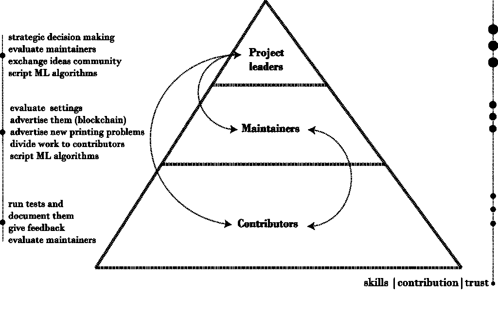

Figure 8\. Hierarchy of 3Dprint.AI community.

## 3.3.2 通过区块链网络分发数据

根据 Rosic (2019)的说法，集中式数据集过去很容易成为黑客的目标，他们想窃取有价值的信息或破坏系统。Laurence (2017)指出，区块链网络往往难以被攻击，敏感的用户信息可以通过加密算法得到保护。

在 3d 打印中。AI 框架，使用专用的区块链网络。事实上，由贡献者发送并由维护者评估的每一个数据表都将被存储起来，供社区中的每个人查看。但是，一旦数据存储在区块链中，就没有人能够对其进行更改。因此，社区开发的机器学习算法可能会被社区用于运行多次迭代和进行预测。然后，一个或多个贡献者可以测试预测，如果证明是正确的，维护者可以将它们添加到区块链网络中。因此，添加到区块链的数据可能被视为有效、安全并被社区使用。

为了更好地组织和更方便地访问，区块链中的数据将分为三个不同的组(图 9)，第一组，打印设置和挤出时发生的错误的文档。第二，机器学习算法做出的预测。第三，有经验的用户手动实现的预测。所有的组将被公布给社区，每个组将根据他们提到的打印错误被分类为子组。

## 数据的分类

上述三组数据的分类将基于一些重要的印刷参数，例如速度、几何形状的复杂性、印刷温度、材料、校准和多重误差。机器学习算法将仅与前两组中的信息一起使用，因为第三组仅包含来自用户共享的建议。上述分类将有助于更好地组织数据，使其易于为学习系统所理解(希伯伦，2016)。而 3Dprint。随着人工智能的发展，可能会添加更多的类别，而其他一些类别会因过时而被删除或排除使用。

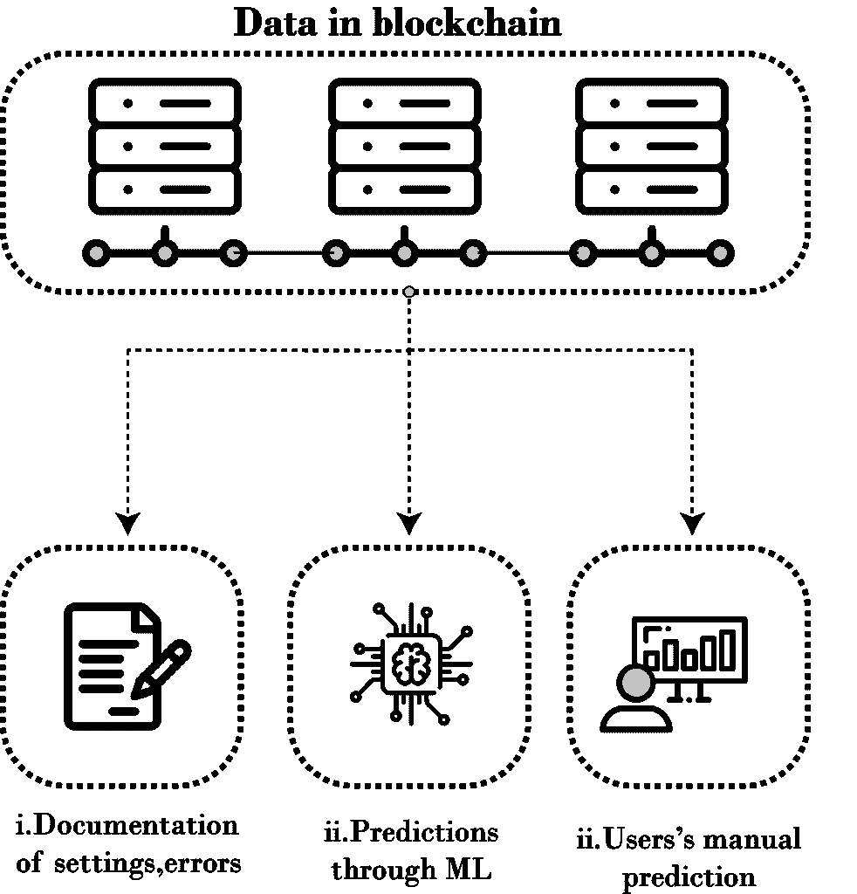

Figure 9\. Categorization of data of the community.

数据类别的另一个重要用途是在分析中，它可以揭示趋势、错误之间的关系，甚至做出预测，以确定社区未来的研究方向。建立小组和子小组将有助于更好地分配人力资源，以实现社区的特定目标和任务。数据分析可以说明印刷误差及其相互关系，以便于人工和算法预测。

# 3.4.问题和挑战

Figure 10\. Robot thinking.

## 技术

## 一.适当的数据集

3Dprint 的主要问题。人工智能使用的是训练数据。希伯伦(2016)断言，给定数据集的质量与完整性、准确性、一致性和及时性等特征有关。的确，在一定时间框架内，不完整、不准确、不一致、不同时代或不近期的数据集可能会因为大量过时的信息处理而导致不适当的决策。在 AM 中，导致一个问题的原因通常不止一个，即使是有经验的用户也很难识别所有的原因。因此，数据集不仅不能解决一个问题，还会产生更多问题，导致打印过程中出现更多故障。因此，希伯伦(2016)指出，不可靠的数据集比没有数据集更糟糕，因为计算能力被浪费了。然而，这个问题可以通过多次重复错误来最小化，直到在仔细评估投稿人提供的数据后找到最佳解决方案并记录在在线数据库中。

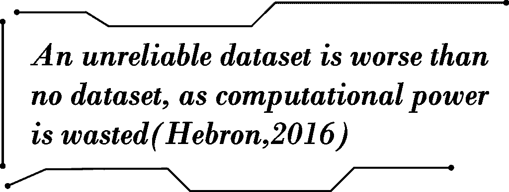

## 二。g 代码的更改

工业机器人在运行过程中更改 g 代码可能非常具有挑战性，因为任何错误都可能严重损坏其机械装置。更具体地说，一个 6 轴机械臂的每一个运动都由沿着它的每一个轴的许多小的子运动组成。为了避免在其环境中的这种损坏和进一步的故障，这些运动中的每一个变化都应该在机器人的安全轴限制内。然而，用于机器人的现有软件例如 RobotStudio 或者甚至当前机器人的手动控制器都配备有这样的功能。同时，挤出机的参数(例如温度和步进电机速度)独立于机器人的参数(例如机器人速度)，这使得改变变得容易和安全。因此，在团体的开始，框架的目标可以被设定为保持机器人处于稳定的速度，而挤出机的所有其他独立参数可以被改变以实现具有最小风险的最佳结果。

## 三。适当的文件

所有设置的正确记录是一个至关重要的问题，因为它会影响机器学习算法的预测。应验证通过 excel 文件进行的手动文档编制，以便对机构群体有用。然而，在社区开发的后期阶段，文档，至少是关于打印参数的部分，可以从打印软件自动输出给社区的维护者。为了避免混乱和错误，维护者给贡献者的指令必须集中。事实上，贡献者可以在特定范围内改变打印参数，而不是测试随机变化。同样，相同的测试可能由不同的贡献者实现，用于检查提交给维护者的参数。不同机器人产生的相同参数的打印结果的比较也可以用于测试贡献者的硬件的可靠性。

## 四。相同的机器人和挤出机

社区中的制造商可能会使用不同的机器人，建造不同的挤出机，使用不同的切片软件，这可能会使供应成为一个通用的解决方案，这将是非常具有挑战性或不可能的。在这个步骤中，可能会出现许多错误，因为硬件的差异可能会误导制造商。为了避免这些问题，3Dprint。AI 必须首先指定一个机器人模型、一台挤压机和一种特定的挤压材料，以便可以向用户提出安全的解决方案。后来，当社区准备好大量数据用于其算法时，可以添加各种硬件来为用户提供更广泛的选择。

## 动词 （verb 的缩写）打印时的环境条件

根据 Leonidou (2019)的说法，关于打印质量和一致性的最重要因素之一是打印机运行的环境条件，也就是说，具有相同机器、挤出机和切片设置的用户可能会面临不同的故障，例如。附着力不好；如果他们在不同的环境条件下操作设备，例如不同的温度。这个问题可以通过在几乎相同的环境条件下进行挤压来解决，这些环境条件是在一个封闭空间或房间内控制的，并且环境的特殊性取决于文件。

## 不及物动词过程的复杂性

计算密集型过程的复杂性仍然是框架中的一个关键问题。在桌面 3d 打印中，挤压板大部分时间达到 30cm，几乎所有的打印问题，如材料碰撞、层分离蚀刻，都可以通过 3d 模型的适当切片和优良的加工来解决。然而，列奥尼多
(2019)表明，在大规模挤压中，各种其他参数，如环境条件往往会影响印刷结果。

同时，在大规模上，消耗的成本、时间和精力要重要得多。然而，尽管打印时的相机记录和对象识别是计算密集型的，但它们提供了对过程进行连续监督的优势。然而，在简单或容易挤出的几何形状中，用户可以不使用相机记录和自适应反馈过程，而仅仅记录发生的设置错误，以便为社区开发的机器学习算法产生训练数据。

## 道德规范

Figure 11\. AI Ethics.

尽管存在技术上的挑战，但 3Dprint 的运营过程中也出现了许多伦理问题。AI 社区。下面对最重要的问题进行了批判性的讨论，并给出了两个调查结果(图 12)。更具体地说，在大会投票期间 Autodesk 应用程序出现问题后，80 个答案中只有 10 个被记录下来，这使得结果不可靠。为此，还举行了针对巴特利特学生的第二次民意调查，收到了 70 份答案。尽管由于参与人数有限，这两项民意调查都不能完全客观，但它们可以说明可以加入 3Dprint 的人们的想法和观点。未来的 AI 社区。

从整体趋势来看，两项民意调查都显示了对 3Dprint 的积极反馈。以“是”或“可能是”作为主要答案的人工智能社区。然而，将近 10 %的反馈可能是否定的，这些争论在下面的讨论中会被考虑进去。

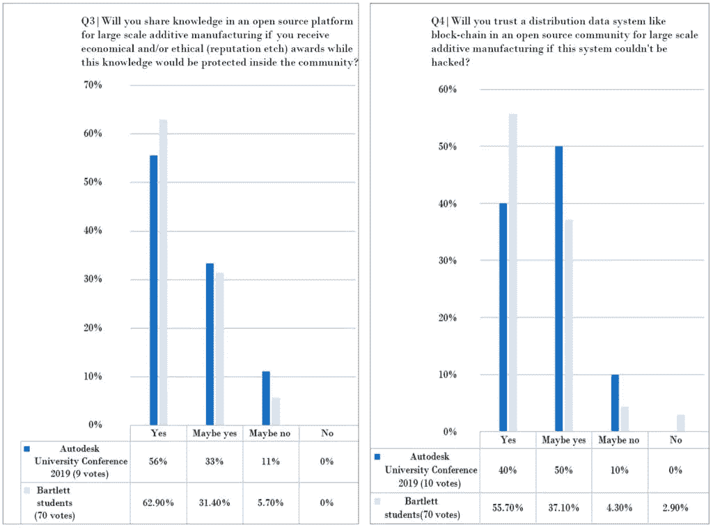

Figure 12.Polls answers. Generally, answers are supportive of the idea of 3Dprint.AI community.

## 一.作者身份和所有权问题

随着数字文化的发展，诸如“协作”、“开源”和“开放创新”等流行语越来越流行(Picon2016)。这些流行语暗示了作者身份等基本问题。按照芮(2016)的说法，主张署名权的根本要求是原创性。对于一个通过版权获得财产权的作品，它应该是原创的，否则，它只是其他原创作品的副本(芮，2016)。但是，在 open 3Dprint 这样的框架中。AI，不清楚谁拥有数据的著作权，谁有权使用这些数据。换句话说，所有权是不确定的，因此正成为一个越来越重要的问题(Fok 和 Picon，2016)。

芮(2016)指出，所有版权法的基础是作者身份产生对所创作作品的所有权的想法。芮也批评了版权的显著观点，即只有作品的创作者才拥有复制该作品的专有权。此外，他还证明了即使是像罗兰·巴特和哈罗德·布鲁姆这样的文学批评家也曾有力地论证过，声称任何创造性作品的完全原创性是不可能的。然而，在 21 世纪，利用数字技术，许多类型的合作创造性工作的所有权已经成为可能，人类刚刚开始预见这一趋势的后果(Picon，2016)。

因此，在 open 3Dprint 中。在人工智能框架中，当许多用户参与创建训练数据集时，为了避免法律纠纷和争论，所有用户都必须接受预定义的条款和条件。事实上，他们必须就数据集的权威性和用途达成一致；其完整的作者身份可以重新，因为开始，一所大学或研究所，如巴特利特。然而，根据 Pearson (2016)的说法，当社区变得受欢迎时，它可以转变为一个具有特定法律结构的组织，将所有权利和义务移交给其成员。

## 二。访问限制

根据 Gershenfeld (2012)的说法，在数字制造中，当制造商有权复制设计时，总是存在窃取知识产权的威胁。Anderson (2012)认为，开源环境中的复制问题可能是创造性的，因为当它发生时，它是成功的标志，因为从复制开始的东西可能会在改进后成为真正的创新。然而，Gershenfeld (2012)澄清说，只有一些设计应该与在线社区共享，而其他设计，包括专利，应该受到保护。

AM 工具的自由使用带来的另一个重要威胁是枪支的生产(Gershenfeld，2012)。事实上，设计和制造的民主化提出了关于所有人自由使用这些工具的重要问题。更具体地说，人类倾向于以自己的方式思考和决定技术。因此，当技术是应用于大规模 AM 的人工智能时，为了保护公共安全，对它的访问应该仅限于经过验证的用户是不言自明的。

因此，3Dprint。AI 可以开始运行，并允许大学、研究机构、行业、公司、初创企业、工厂实验室和其他选定和验证的用户访问其数据集。它不能是对所有人开放的开源框架数据，因为必须避免使用它对个人和社会可能产生的所有负面后果。

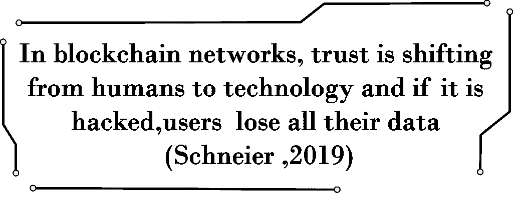

## 三。对系统的信任

根据 Schneier (2019)的说法，区块链未能实现采用，因为总是保护其敏感数据的企业不信任它。另一方面，Anderson (2012)认为，像谷歌这样的个人和公司正在参与开源平台，共享他们的数据并信任这些社区，因为他们渴望结识更多的人，并将创新过程加速到远远超过传统开发所能达到的速度。

此外，Schneier (2019)批评说，在区块链网络中，信任正在从人类转移到技术，如果被黑客攻击，丢失所有数据的用户将没有追索权。然而，Laurence (2017)已经表明，对分散的区块链网络进行攻击所需的高计算能力成本违背了黑客攻击的目的。事实上，在我写这篇文章的时候——2019 年——整个区块链网络从未被成功黑客攻击过。

此外，Schneier (2019)指出，无论一个技术系统——区块链——多么可靠，总是存在危险和威胁，尤其是当它扩大规模时。因此，许多公司只使用他们创建和控制的区块链。相反，Laurence (2017)指出，区块链开发人员已经发明了一些工具和子系统，当网络规模扩大时，这些工具和子系统可以为数据提供额外的安全性。劳伦斯认为，这些安全系统使得现有的区块链网络更难被黑客攻击或中断，尤其是当这些网络是私有的时候。

因此，依托以上专家意见和民调结果，3Dprint。AI framework 将使用一个私人区块链网络来保护其数据免受黑客攻击，同时允许社区成员访问。这样，即使是数据敏感的公司和个人也可以加入社区，并保证只有成员才能访问数据，黑客无法窃取数据。

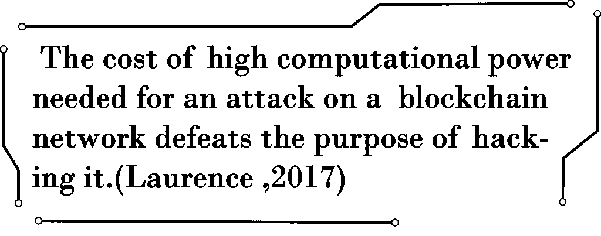

## 四。社区的参与

Anderson (2012)给出了许多个人和组织参与开源社区的理由，例如通过它们获得新的技能和声誉。另一方面，Carpo (2017)认为，尽管有许多开源环境，但大规模协作尚未在设计中发生，因为设计专业人员拒绝了这种潜力，并倾向于保护他们的特权。然而，Anderson (2012)将创客运动描述为一种趋势，它将在未来几年内演变，并在开源环境中吸引更多的人。

在 3d 打印中。AI 框架中，社区的参与是一个至关重要的问题，应该针对不同人群的具体特点分别进行研究。Anderson 认为(2012 年)，可以假设制造商和公司对推进大规模 AM 的兴趣、世界范围内大量的实验室和当前的开源趋势共同创造了动力，至少一些制造商或实验室会有动力参与 3Dprint。AI 社区。

然而，出于以下原因无法访问 3D.print.AI 正在成为一个主要的争论点。首先，对于人来说，与机器人一起进行大规模 AM 既困难又耗时。其次，必须有人向潜在成员传授基本技能，并能够进一步发展这些技能，因为大多数用户可能不熟悉工业机器人。

由于这些原因，奖励和付款，无论是道德上的还是经济上的，都可以激励技术高超的制造者与社区的其他成员分享他们的知识，并与他们建立相互信任。作为维护者，用户的层次结构可以为这个目标做出贡献，他们可以分配任务，教导贡献者完成任务，并监督他们的工作。还有，会员在社区可能获得的优质技能，可以吸引用户加入。

公司和初创企业也可以加入，因为他们可以快速获得知识，他们可以认识新的人，甚至在社区中开发他们的一些项目。专用的区块链网络可以保证他们数据的安全。公司将继续参与进来，从免费提供且不断增长的硬件和软件中获益。他们可以用它来解决他们的印刷问题，否则，他们必须付费。

## 3.4.3.社区的经济效率

根据 Pearson (2016)的说法，当开源社区积累了大量成员时，希望保护他们的财产并在经济上生存下来的人会转变为像 Linux 这样的组织。通过这种方式，他们可以从捐助者那里获得资金，同时附加的咨询委员会确保社区保持活力。Pearson (2016)发现，咨询委员会在技术、社会和政治问题上指导社区，并检查这些问题以防止它们成为问题。Kumar
( 2015)已经表明，开源社区通过向社区外的公司提供支持、销售产品或在其网站或应用上做广告来获得资金。Pearson (2016)观察到，美国的此类组织享受低税率以确保其存在。

如前所述，3Dprint。人工智能可以在像 Bartlett 和 connect 实验室、公司、初创企业这样的机构中开始运作；和用户。它可以通过上述所有方式接收资金。这个框架的经济效率是至关重要的，因为它既开发了硬件挤压机，又开发了关于大规模 AM 的软件。它需要一些初始投资来开始运作，建造挤出机，并支付一些用户，他们花时间在社区组织项目或教授贡献者 AM 技能。该基金可以通过众筹或机构的研究拨款筹集，甚至可以通过首批用户的自筹资金筹集。财务是一个至关重要的问题，会影响参与的人数。

在注册了一些成员并创建了可靠的数据集后，社区成员可以开发用于切割 3d 模型和制定刀具路径策略的软件，如 Cura 或 AIsync，然后可以将这些软件出售给没有参与进来的公司、行业和实验室，为社区赚取收入。Kumar (2016)表明，即使像微软和谷歌这样的大公司也发现，向 Linux 这样的开源社区支付创建代码的费用比自己创建代码要便宜。3d 打印可能会出现这种情况。人工智能通过与公司和行业交流他们未来的研究议程和 AM 和 AI 的最新发展。

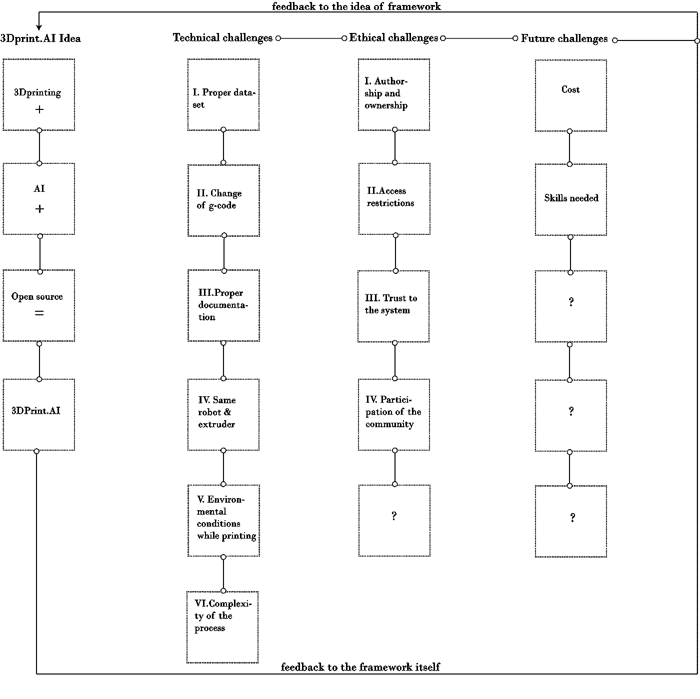

Figure 13\. General diagramme which illustrates the feedback the idea of the framework and the framework itself.

# 下一部分(II/II):该理论在机器人中的应用、研究贡献和未来计划。

> ***AI+3d printing+open source = 3d print。艾***

## 文献学

*   Ai-build (2019)。*人工智能建造技术*。[在线]可在:[https://ai-build.com/technology.html](https://ai-build.com/technology.html)[于 2019 年 5 月 2 日获得]。
*   安德森(2012 年)。*创客:新工业革命*。第一版。纽约:皇冠商务，第 83，101，102 页。
*   Autodeskresearch.com(2019)。*捕梦网项目。*【在线】可在:[https://autodeskresearch.com/projects/Dreamcatcher](https://autodeskresearch.com/projects/Dreamcatcher)【2019 年 5 月 19 日获取】。
*   f . biton ti(2016 年)。*当物质成为媒介。在:A .皮肯和 w .福克，编辑。，数字财产:开源架构*，AD 卷 86，第 5 期。霍博肯:约翰·威利父子公司，第 101-104 页。
*   Brasseur，V. (2018 年)。*用开源打造未来*。第一版。北卡罗来纳州罗利:实用主义书架，第 23–43 页。m . carpo(2017)。第二次数字化转向:超越智能的设计。伦敦:麻省理工学院出版社，第 6132 页。
*   m . carpo(2017)。*第二次数字化转向:超越智能的设计。伦敦:麻省理工学院出版社，第 6，132 页。*
*   m . carpo(2018)。马里奥·卡波说，后数字时代将更加数字化。见:[https://www . metropolis mag . com/ideas/post-digital-will-be-more-digital/](https://www.metropolismag.com/ideas/post-digital-will-be-more-digital/)【访问时间:2018 年 7 月 7 日】
*   Copeland，M. (2016 年)。*AI、机器学习、深度学习的区别？|英伟达博客*。[在线 NVidia 官方博客，可从[https://blogs . NVidia . com/blog/2016/07/29/whats-difference-artificial-intelligence-machine-learn-](https://blogs.nvidia.com/blog/2016/07/29/whats-dif-ference-artificial-intelligence-machine-learn-)获得
*   ing-deep-learning-ai/[2019 年 5 月 2 日访问]。
*   Fablabhouse.com。(2019).*私人实验室*。[在线]可在 http://www.fablabhouse.com/en【2019 . 7 . 4 访问】。
*   格申菲尔德，N. (2012 年)。*“如何制造几乎任何东西:数字制造革命”，*《外交事务》，第 43-45 页，第 55-57 页。
*   Gershenfeld，N. A. (2015) Fab: *即将到来的桌面革命——从个人电脑到个人制造*。基础书籍，第 3-17 页。
*   希伯伦，P. (2016 年)。*面向设计师的机器学习。第一版。塞瓦斯托波尔:奥莱利媒体公司，第 7、21、47、48、51、55、59 页。*
*   Hermann，m .，Pentek，t .和 Otto，B. (2016 年)。*工业 4.0 场景的设计原则。载于:第 49 届国际系统科学会议。华盛顿 DC:IEEE 计算机学会，第 3928–3935 页。*
*   约翰逊，J. (2019)。*火箭计划:3d 打印如何开启新的太空竞赛。*【在线】福布斯。可从以下网址获取:[https://www . Forbes . com/sites/Jennifer Johnson/2018/05/16/rocket-plan-how-3-d-printing-is-unlock-a-new-space-race/](https://www.forbes.com/sites/jenniferjohnson/2018/05/16/rocket-plan-how-3-d-printing-is-unlocking-a-new-space-race/)【2019 年 6 月 15 日获取】。
*   基廷，S. (2014 年)。超越 3D 打印:添加制造的新维度。*在福利特，乔纳森(编辑。)，为新兴技术设计:基因组学、机器人学和物联网的 UX*(379–405)。奥莱利媒体，第 380，383–388，393，401 页。
*   Kumar，A. (2015)。*开源公司，程序员怎么赚钱？*【在线】微软:Windows 俱乐部。可从以下网址获得:[https://www . the windows club . com/open-source-companies-programmers](https://www.thewindowsclub.com/open-source-companies-programmers)make-money【2019 年 6 月 8 日获取】。
*   兰萨德，M. (2019)。*2019 年最佳 3D 打印论坛、脸书团体和社区*。[在线]阿尼瓦。可访问:[https://www . ani waa . com/best-3d-printing-3d-scanning-forums-Facebook-groups-and-communities/](https://www.aniwaa.com/best-3d-printing-3d-scanning-forums-facebook-groups-and-communities/)【2019 年 7 月 1 日访问】。
*   t .劳伦斯(2017)。*假人区块链。*第 1 版。霍博肯:约翰·威利父子公司，第 19、21 页。
*   Leonidou，L. (2019)。设计细胞。AiBuild TechBlog。见:[https://medium . com/ai build-tech blog/engineering-the-ai cell-e 65 a4 deb-0f3c](https://medium.com/aibuild-techblog/engineering-the-aicell-e65a4deb-0f3c)【2019 年 5 月 19 日访问】。
*   Matejka，j .，Glueck，m .，Bradner，e .，Hashemi，a .，Gross-man，t .和 Fitzmaurice，G. (2018 年)。梦镜:大规模生成设计数据集的探索和可视化。 *In: 2018 智大会。多伦多:* Autodesk Research，第 3 页
*   MX3D。(2019). *MX3D 大桥。*【在线】可在:【https://mx3d.com/projects/bridge-2/】T4【2019 . 6 . 15 访问】
*   皮尔森，B. (2016)。*开源社区的共同特征——当今的开源。*【在线】开源今日组织。可从以下网址获取:http://open source today . org/common-characters-open-source-community/[2019 年 5 月 26 日获取]。
*   皮肯和福克(编辑。) (2016).*数字财产:开源架构*。公元 86 卷第 5 期。
*   霍博肯:约翰·威利父子公司，第 7、8 页。
*   a . picon(2016 年)。*从著作权到所有权*。载于:A. Picon 和 W. Fok，编辑。，*数字财产:开源架构*，AD 卷 86 期第 5 期。霍博肯:约翰·威利父子公司，第 37、38 页。
*   Rayna、l . Striukova 和 j . Darlington(2015 年)。共同创造和用户创新:在线 3D 打印平台的作用。*工程与技术管理杂志*，37(0923–4748)，第 90–102 页。
*   相对论空间。(2019).*相对论空间|星际之门——相对论空间*。[在线]可在:[https://www.relativityspace.com/stargate](https://www.relativityspace.com/stargate)【2019 年 7 月 1 日获取】。
*   Rosic，A. (2019)。*什么是区块链技术？初学者循序渐进指南*。[在线]街区极客。可从以下网址获取:[https://block geeks . com/guides/what-is-区块链-technology/](https://blockgeeks.com/guides/what-is-blockchain-technology/)【2019 年 5 月 26 日获取】。
*   芮博士(2016)。*服务、拥有、创作*。载于:A. Picon 和 W. Fok，编辑。，*数字财产:开源架构，* AD 第 86 卷第 5 期。霍博肯:约翰·威利父子公司，第 18-21 页。
*   施奈尔，B. (2019)。没有充分的理由相信区块链技术。【在线】连线。可在:[https://www . wired . com/story/theres-no-good-reason-to-trust-区块链-technology/](https://www.wired.com/story/theres-no-good-reason-to-trust-blockchain-technology/)【2019 年 6 月 8 日访问】。
*   北卡罗来纳州斯尔尼塞克(2017 年)。*平台资本主义*。第一版。英国剑桥:政治出版社，第 46、47 页
*   Tamke，m .，Nicholas，p .和 Zwierzycki，M. (2018)“建筑设计的机器学习:实践和基础设施”，*国际建筑计算杂志*，16(2)，第 123–143 页. doi: 10.1177/1478077118778580。
*   巴特利特建筑学院。(2019).建筑设计进行曲。【在线】可在:https://[www . UCL . AC . uk/bartlett/architecture/programs/graduate/March-architectural-design](http://www.ucl.ac.uk/bartlett/architecture/programmes/postgraduate/march-architectural-design)【2019 年 7 月 8 日访问】。
*   沃勒律师事务所(2019 年)。*什么是增材制造？* |沃勒联合公司。[在线]可在:[https://wohlersassociates.com/additive-manufacturing.html](https://wohlersassociates.com/additive-manufacturing.html)[2019 年 5 月 2 日访问]。
*   泽林斯基，P. (2018)。AM 遇到 AI 的地方。*增材制造*，第 7 卷，第 1 期，第 25 页。
*   Chaillou，S. (2019 年)。*建筑 AI 的来临，一个历史的视角*。波士顿:哈佛设计研究生院，第 2-15 页。
*   n .内格罗蓬特(1972)。*架构机*。剑桥马萨诸塞州。:麻省理工学院出版社，第 1–20 页。

## 图像制作者名单

*   图一。作者:平面设计，图片来源:【在线】[http://hdqwalls.com/matrix-5k-wallpaper](http://hdqwalls.com/matrix-5k-wallpaper)【5 月 2 日访问。2019].
*   图二。图片来源:[在线][https://www . day translations . com/blog/2019/01/10-trends-that-will-change-the-](https://www.daytranslations.com/blog/2019/01/10-trends-that-will-change-the-)制造业-工业-13371/【5 月 2 日访问。2019].
*   图 3。图片来源:【在线】[https://mx3d.com/projects/bridge-2/](https://mx3d.com/projects/bridge-2/)【5 月 2 日获取。2019].
*   图 4。图片来源:[在线][https://ai-build.com/](https://ai-build.com/)
*   daedalus.html[5 月 2 日访问。2019].
*   图 5。作者:平面设计，图片来源:[在线]http://her anet . info/projects/hera-2009-人文作为创造力和创新的源泉/电子文学作为创造力和创新实践的模型/[7 月 5 日查阅。2019].
*   图 6。作者。
*   图 7。作者。
*   图 8。作者。
*   图 9。作者。
*   图 10。图片来源:[在线][http://www.gizmodo.cz/?tag=ethics](http://www.gizmodo.cz/?tag=ethics)【7 月 5 日获取。2019].
*   图 11。图片来源:[在线][https://emerj . com/ethics-and-regulatory/establishing-ai-ethics-public-and-private-sector/](https://emerj.com/ethics-and-regulatory/establishing-ai-ethics-public-and-private-sector/)
    【7 月 5 日访问。2019].
*   图 12。作者:平面设计，民调:[在线]https://live.eventbase.com/polls?event=autodeskuniversi ty 2019 & session = 1180201908[7 月 11 日访问。2019].& &[在线][https://docs . Google . com/spreadsheets/d/1 oflqycmy 1 PTX 1 MH 8v 76-9 jrw _ dgfb 2 MK 3 uqrbnjjuni/](https://docs.google.com/spreadsheets/d/1oFLQycmy1ptX1Mh8v76-9jrw_Dgfb2mk3uqrBNJjUnI/)编辑？usp =共享
*   图 13。作者。