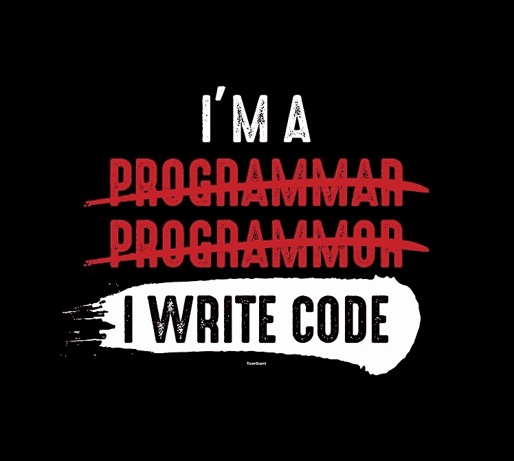
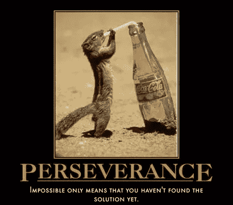
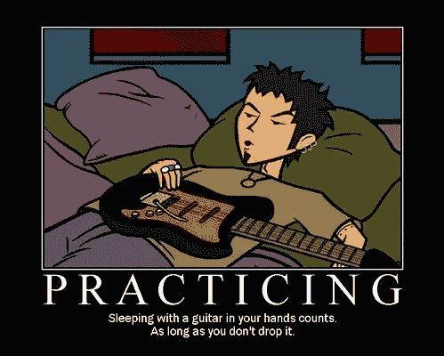
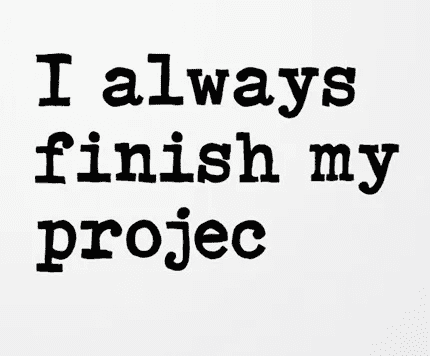
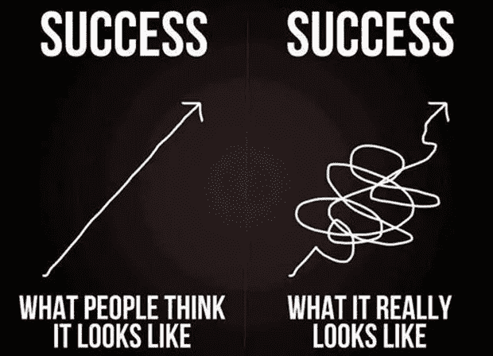

# 入门级程序员成功的 3P 战略

> 原文：<https://towardsdatascience.com/3p-strategy-to-be-successful-for-entry-level-programmers-bbf5dbbcb981?source=collection_archive---------45----------------------->

我给初级程序员的建议是，坚持下面我制定的 3P 策略，它真的在我的职业生涯中帮助了我。

**毅力**

> “毅力不是一场长跑；这是一个又一个的比赛。”—沃尔特·埃利奥特

一开始，对于大多数学习者来说，编码似乎总是一种负担，他们只是看到所涉及的永无止境的主题列表，并且一看到似乎*无法解决的*错误或艰难的编码挑战就想放弃。这不仅适用于编程，也适用于我们的现实生活。我们不能忘记，我们比我们可能面临的暂时问题更大，通过不断的努力和坚持，事情会得到解决。所以对自己有信心，在你需要的时候从你的同伴那里得到帮助，继续努力。你能行的！

**练习**

> “不是每个季节都有收获。有浇水的季节，播种的季节，拔草的季节，给土地施肥的季节。”—乔尔·奥斯坦

没错，除了练习，练习，练习，直到你做对为止。编程就是让你的双手变脏，继续写代码，直到你对概念有了深刻的理解，并在链接各种概念以提出可靠的解决方案方面领先一步。开始的时候确实需要花费大量的时间和精力，但是一旦你看到技能的提高，编程就会变得轻而易举。练习你的编码技能将真正让这些概念深入你的记忆，以至于你会感到肾上腺素激增，想出应对业务挑战的解决方案，并将我们每天做的单调任务自动化。

**项目工作**

> "你说话的声音太大了，我听不见你说什么。"-拉尔夫·瓦尔多·爱默生

就像没有人相信一个摄影师是好的，除非他有一个好的作品集来展示他的作品，程序员也一样。从一开始就记住基于项目的方法，并不断构建小项目，这些小项目可以方便地自动化手动任务，只是为了好玩。这真的让你从一开始就参与进来，并让你有信心在稍后阶段与他人分享你的旅程，讲述你所面临的挑战以及你是如何克服这些挑战的。在您的编程旅程中参与项目将帮助您创建一个侧面的个人资料，以展示您的才华，并让人们看到您在编程方面的熟练程度。'

这三件事确实有助于培养你最好的一面。我希望这个建议真的能帮助初露头角的程序员在他们的旅程中充分利用它。

我将以引用亨利·大卫·梭罗的话来结束这篇文章。

> "成功通常会降临到那些太忙而没有时间去寻找成功的人身上！"

帕夫内特·辛格