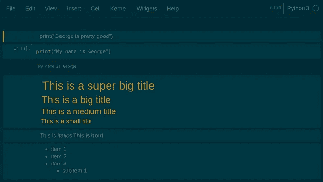

# 增强 Jupyter 笔记本的 4 个绝妙技巧

> 原文：<https://towardsdatascience.com/4-awesome-tips-for-enhancing-jupyter-notebooks-4d8905f926c5?source=collection_archive---------3----------------------->

## 扩展、主题等等！


> 想获得灵感？快来加入我的 [**超级行情快讯**](https://www.superquotes.co/?utm_source=mediumtech&utm_medium=web&utm_campaign=sharing) 。😎

Jupyter 笔记本已经成为所有希望分享他们工作的开发者的一个很棒的工具。它们提供了一种简单的共享笔记本的方式，即文本、代码和图形的组合，旨在增强我们向受众传达信息的方式。它们被广泛用于数据分析和数据科学等领域。

然而，我们中的大多数人实际上只是在触摸 Jupyter 笔记本的表面。我们使用编写 Python 代码和显示图表的基本功能。但是您知道吗，Jupyter 中有许多可定制的功能可以增强其功能。！可以让您的笔记本书写更高效、演示更有效的酷炫选项。

这里有 4 个增强 Jupyter 笔记本的绝妙技巧！

# (1)执行外壳命令

技术/编程环境中的*外壳*是一种与计算机进行*文本*(使用文本)交互的方式。最流行的 Unix shell 是 [Bash](https://en.wikipedia.org/wiki/Bash_(Unix_shell)) ( ***Bourne 再 SHell*** )。Bash 是任何 Linux 机器上终端的默认 shell。

使用 Python 时，经常会在编写 Python 代码和使用 shell 之间来回切换。例如，您可能想使用 Python 从磁盘读取某个文件，因此需要检查其确切名称。你通常只需在终端上输入 *ls* 就可以得到当前目录下所有文件和文件夹的列表。来来回回可能会非常乏味和低效

真正酷的是，Jupyter 能够执行 shell 命令，而无需离开浏览器。您所要做的就是在 shell 命令前加一个感叹号`**!**`, Jupyter 会将其解释为 Bash。[任何在命令行运行的](https://jakevdp.github.io/PythonDataScienceHandbook/01.05-ipython-and-shell-commands.html#Shell-Commands-in-IPython)命令都可以在 Python Jupyter 笔记本中使用，只需在前面加上`**!**`字符。

```
# Listing folder contents
>>> !ls
mynotebook.ipynb stuff.txt# Getting the current directory
>>> !pwd
/home/george/github/project_1# Printing from Bash 
>>> !echo "Pizza is delicious!"
Pizza is delicious!
```

我们还可以将 shell 命令的输出分配给 Python 变量，如下面的代码所示。

```
# Getting the current directory. 
# The variable "X" now contains ["/home/george/github/project_1"]
X = !pwd
```

# (2)改变主题


许多文本编辑器和编程 ide 都有可定制的主题。amoung 开发的最喜欢的一个是较暗的主题，如 monaki，因为当你整天看着屏幕时，眼睛会更舒服。幸运的是，Jupyter 有一个允许主题选择的插件。

要安装插件，只需在终端中运行 pip 命令:

```
pip install jupyterthemes
```

您可以像这样列出可用的主题:

```
jt -l
```

在撰写本文时，可以使用以下主题:

```
chesterish
grade3
gruvboxd
gruvboxl
monokai
oceans16
onedork
solarizedd
solarizedl
```

看看下面的几个例子。许多伟大的颜色选择！



solarizedd (left) | gruvboxl (middle) | grade3 (right)

# (3)笔记本扩展

Jupyter 笔记本扩展— [nbextensions](https://github.com/ipython-contrib/jupyter_contrib_nbextensions) 是 JavaScript 模块，可以用来增强笔记本的功能和用途。这些扩展实质上修改了 Jupyter UI，使其功能更加强大。

我们将从通过 pip 安装 nbextensions 开始:

```
pip install jupyter_contrib_nbextensions 
jupyter contrib nbextension install
```

安装完成后，启动 Jupyter。你会看到一个名为 *NBextensions* 的新标签。一旦你选择它，你会看到许多 Jupyter 笔记本扩展选项！


你可以通过快速的谷歌搜索来查找这些扩展，看看它们做了什么。我在下面突出了一些最有用的。

## (1)目录

顾名思义，目录会根据笔记本中标签`#`创建的标题自动为您的笔记本生成一个目录。例如，我在下面的示例图像中创建的标题是:

```
# This is a super big title
## This is a big title
### This is a medium title
#### This is a small title
```

目录在左边很好地生成了。表格中的每个标题都有一个链接，双击该链接可以直接转到该部分。当你的笔记本开始变大，并且你有许多分区时，这是非常方便的！


## (2)腹地

代码完成是大多数 ide 中非常常见的特性，尤其是 Python 的 PyCharm。开发人员喜欢它，因为它使他们的工作变得非常容易，不必记住每一个命令，因为他们知道他们的 IDE 会为他们清理东西。

heartback 支持 Jupyter 笔记本中的代码自动完成。当你打字的时候，建议就展现在你面前。这在您从外部库搜索命令时最为明显，如下例所示。超级方便！


## (3)分裂细胞

拆分单元格允许您并排查看 2 个单元格。当你有两个相关的单元格时，这是非常方便的，比如一个描述和它所指的视觉化。


# (4)使用 Qgrid 探索数据框架

我们的最后一站是 Qgrid——一个让你无需任何复杂的熊猫代码就能探索和编辑你的数据框架的工具。

Qgrid 以互动的方式在你的 Jupyter 笔记本中呈现熊猫数据帧。通过这种呈现，您可以进行直观的控制，如滚动、排序和过滤，还可以通过双击所需的单元格来编辑数据框。

让我们从安装 Qgrid 开始:

```
pip install qgrid
jupyter nbextension enable --py --sys-prefix widgetsnbextension
```

要使用 Qgrid 呈现数据帧，只需导入它，然后将数据帧传递给`show_grid`函数，如下所示:

```
import qgrid
qgrid_widget = qgrid.show_grid(df, show_toolbar=True)
qgrid_widget
```

这样做将显示带有许多交互选项的数据框:

*   添加和删除行
*   筛选行
*   编辑单元格

通过向`show_grid`函数传递更多的参数，还可以启用更多的交互式选项。你可以在[官方 GitHub 页面](https://github.com/quantopian/qgrid)上阅读更多关于 Qgrid 全部功能的细节。


# 结论

所以你有它！4 个增强 Jupyter 笔记本的绝妙技巧。

如果你想吃更多，不用担心！还有更多 Jupyter 小部件和扩展可供使用。作为推荐阅读，官方的 [Jupyter 笔记本文档](https://jupyter.org/documentation)是一个很好的起点。

# 喜欢学习？

在推特上关注我，我会在这里发布所有最新最棒的人工智能、技术和科学！也请在 LinkedIn[上与我联系！](https://www.linkedin.com/in/georgeseif/)