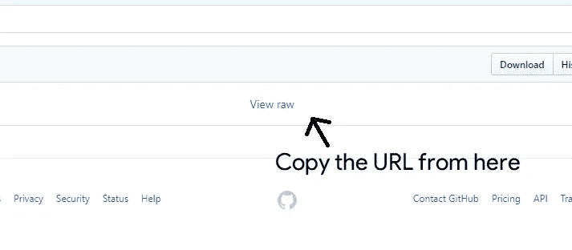
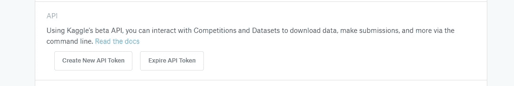

# 4 种在 Google Colab 中加载 ML 数据的好方法

> 原文：<https://towardsdatascience.com/4-awesome-ways-of-loading-ml-data-in-google-colab-9a5264c61966?source=collection_archive---------9----------------------->

## 🤖[深度学习](https://equipintelligence.medium.com/list/deep-learning-techniques-methods-and-how-tos-01015cf5f917)

## 用各种 API 和包在 Google Colab 中加载数据。


The ocean of data! [Source](https://www.google.com/url?sa=i&source=images&cd=&cad=rja&uact=8&ved=2ahUKEwi35JXb8qXlAhWDmuYKHVEpCFQQjB16BAgBEAM&url=https%3A%2F%2Fwww.vertical-leap.uk%2Fblog%2Fwhat-is-data-storytelling%2F&psig=AOvVaw2ObcN8JEZJLtppSE56RBAA&ust=1571490805719285)

Google Colaboratory 或 Colab 已经成为 ML 初学者和研究人员最喜欢的开发环境之一。这是一款基于云的笔记本电脑，一定有什么很棒的方法可以将机器学习数据从你的本地机器上传到云端。

我们将讨论一些避免你直接点击“上传”按钮的方法！

# 1)从 GitHub repo 获取数据


[Source](https://www.google.com/url?sa=i&source=images&cd=&cad=rja&uact=8&ved=2ahUKEwiq_9f38aXlAhXQ7XMBHWy_CIMQjB16BAgBEAM&url=https%3A%2F%2Fgithub.com%2Flogos&psig=AOvVaw2FW5Y05GULPwHRFIrdFF5W&ust=1571490895792248)

如果你正在做一个项目，它有自己的数据集，如任何对象检测模型，分类模型等。然后我们将直接从 [GitHub](https://github.com/) 中提取数据集。

如果数据集在存档文件中(。拉链还是。焦油)，我们可以把它记在我们的笔记本上，

1.  打开 GitHub repo，从“查看原始数据”文本中复制 URL。



The “View Raw” option gives us a downloadable link to the file.

注意:您复制的 URL 应该以`?raw=true`标签结尾。只有这样,`requests`模块才会提取 ZIP 文件。

此外，您可以随时克隆整个回购协议，

```
!git clone <repo_url>
```

2.仅此而已！现在使用`requests`和`zipfile`软件包，我们可以将数据直接下载到笔记本电脑中。

```
import requests, zipfile, io#The copied URL goes here ->
r = requests.get( 'https://www.github.com/shubham0204/...' ) z = zipfile.ZipFile(io.BytesIO(r.content))
z.extractall()
```

> 这种方法会有一些[限制](https://help.github.com/en/articles/conditions-for-large-files)。我们不能在 GitHub 上推送任何大于 100 MB 的文件。因此，对于较小的自定义数据集，这种方法可能是一种变通方法。

# 2)直接使用 wget Linux 命令

Google Colab 运行在基于 Linux 的主机上。所以我们可以直接在上面运行 Linux 命令。这很简单，而且降低了下载速度。

```
!wget <dataset_url>
```

如果是 ZIP 文件，我们可以用`unzip`命令解压，

```
!unzip images.zip /content/images/
```

详细用法见[此处](https://shapeshed.com/unix-wget/#targetText=What%20is%20the%20wget%20command,for%20downloads%20and%20viewing%20headers.)。

# 3)安装你的谷歌硬盘


[Source](https://www.google.com/url?sa=i&source=images&cd=&cad=rja&uact=8&ved=2ahUKEwipj5uX8qXlAhXFlOYKHc1UDoEQjB16BAgBEAM&url=https%3A%2F%2Fwww.google.com%2Fdrive%2F&psig=AOvVaw2D6loUSz1ETDrbelu2nwCL&ust=1571490962931298)

如果你正在做一个个人项目，并且在 Google Drive 上存储文件对你来说并不乏味，那么我们总是可以安装 [Google Drive](https://www.google.com/drive/) 。

```
from google.colab import drivedrive.mount('/gdrive')
```

一个好处是，如果我们正在训练一个像预训练 VGG 或盗梦空间这样的大型模型，保存的 Keras 模型(. h5)的大小会达到大约 500 MB，甚至权重也有大约 100–200 MB 的大小。当我们挂载 Google Drive 时，模型可以直接保存在你的云存储桶中。

当运行时重新启动或修改时，您不需要上传/下载已训练的模型。

# 4)将数据集上传到 Kaggle


[Source](https://www.google.com/url?sa=i&source=images&cd=&cad=rja&uact=8&ved=2ahUKEwi3zYOi8qXlAhU14nMBHVxqCLsQjB16BAgBEAM&url=https%3A%2F%2Ftowardsdatascience.com%2Fhow-to-begin-competing-on-kaggle-bd9b5f32dbbc&psig=AOvVaw2r-m4PgZy8nbdnB1_OF7yH&ust=1571490975754898)

你可以上传非常大的数据集到 Kaggle.com。我们可以启用“*私有数据集*选项来保护隐私。Kaggle 提供了大量现成的数据集，所以你应该考虑使用 [Kaggle API](https://github.com/Kaggle/kaggle-api) 。

我们可以使用 Colab 中的 API，

```
!echo '{"username":"<username_here>","key":"<key_goes_here>"}' > /root/.kaggle/kaggle.json!kaggle datasets download -d nltkdata/movie-review!unzip /content/movie-review.zip -d review
```

从*我的帐户生成 API 令牌- > API*



Click “Create New API Token”.

将下载一个包含用户名和令牌密钥的文本文件。将它们复制到上面的代码中。然后你就可以在 Google Colab 中使用 Kaggle 了！

# 等等，还有…

# 就这样

希望这些方法有助于将您的数据加载到 Google Colab。在你的脑海中有不同的方式？在评论中分享它们，让它们被添加到这里！