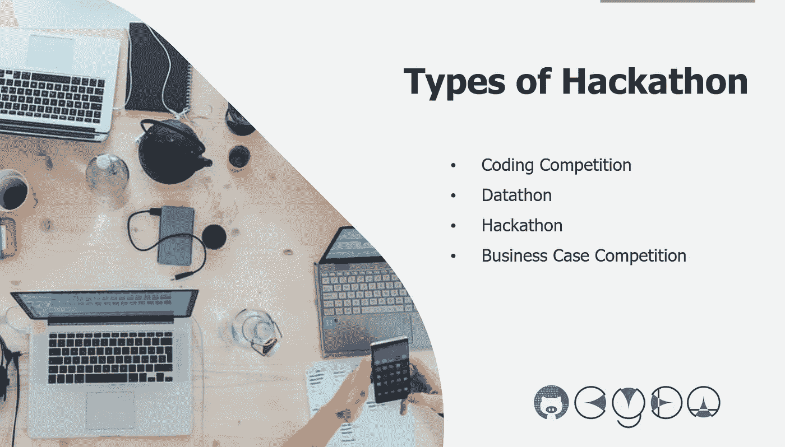

# 4 种常见的黑客马拉松

> 原文：<https://towardsdatascience.com/4-common-types-of-hackathons-7daba7296ae1?source=collection_archive---------17----------------------->

正如[上一篇文章](/5-reasons-why-students-should-join-hackathon-5c24254bc19b?source=friends_link&sk=2edb598a64d8cbf2518c8e0614522103)中提到的，并不是只有一种比赛叫做黑客马拉松。近年来，黑客马拉松不仅面向精通技术的人，还需要技术人员、设计师和商人之间的合作。根据我自己的经验，我将黑客马拉松分为四个主要类别。我将从技术含量更高的开始，转到商业元素更多的部分。你可以根据自己的能力和兴趣决定加入哪一个。

Photo by [cyda](https://cydalytics.blogspot.com/)

**1。编码比赛**

黑客马拉松(Hackathon)，看这个“黑客”加“马拉松”的词，你马上就能把它和密集的编码竞赛联系起来。事实上，这是 1999 年由 OpenBSD 组织的首届黑客马拉松的真实性质。那时，黑客马拉松大多是线下形式，技术专家聚集在一个地方，夜以继日地为一个编程项目工作。现在，随着技术的提高，许多编码竞赛被放到了网上，因此没有边界限制，参赛者可以在家里或任何他们喜欢的时间完成任务。就持续时间而言，在线比赛可能持续 1 个月到 3 个月甚至半年，可能包括几轮提交或半决赛，而线下比赛可能只举行 1 天到 1 周，可能在黑客日之前有一个参与者选择过程。除了线下和线上，还有两者的结合。其中一个著名的例子是 [Google Code Jam](https://codingcompetitions.withgoogle.com/codejam) (查看[链接](https://codingcompetitions.withgoogle.com/codejam)了解更多)。参与者将解决一系列在线算法问题，决赛选手将被邀请参加在某地举行的世界决赛。

不管是哪种格式，都有一个共同的目标，那就是找出以最有效的方式(速度)编写的程序和/或能给出最准确的结果(准确性)。有一个非常明确的判断标准，可能是 log loss 函数，也可能是组织者定义的非常复杂的逻辑。不管你用了什么方法论，简单的还是先进的，只要你的算法能得最高分，你就能打败其他竞争对手。

Photo by [Max Duzij](https://unsplash.com/@max_duz?utm_source=medium&utm_medium=referral) on [Unsplash](https://unsplash.com?utm_source=medium&utm_medium=referral)

**2。数据通**

Datathon 是编码竞赛的一个子集，它也有在线和离线版本，为什么我把它放在另一个类别中是因为这种竞赛有一个焦点，它的名字就是数据。Datathon 可能不是一个常用的名称(其他人简单地称之为黑客马拉松)，但我将使用它来描述提供数据集的黑客马拉松，参与者需要根据数据开发算法。一个完美的例子就是 [Kaggle](https://www.kaggle.com/) 竞赛。除了作为一个托管数十个 datathons 的平台之外，它还是一个非常好的获取开放数据集和向他人学习的网站。一些参与者会公开他们的笔记本，这样即使你不参加比赛，你也可以查看他们的代码。因此，如果你是数据科学领域的初学者，我强烈推荐你访问 Kaggle，探索你感兴趣的话题，你可以找到很多资源和笔记本例子。

Photo by [Goran Ivos](https://unsplash.com/@goran_ivos?utm_source=medium&utm_medium=referral) on [Unsplash](https://unsplash.com?utm_source=medium&utm_medium=referral)

**3。黑客马拉松**

大多数名为黑客马拉松的普通比赛不太受技术驱动，或者我会说他们在评判标准中有商业元素的权重。不像前两个只适合程序员或数据科学家，这种类型的黑客马拉松需要演示和原型演示，因此，除了技术人员，还需要营销人员和 UI/UX 设计师。具体来说，业务人员应该也是最有形象的人，他们将负责业务计划的演示和思考，以使解决方案在经济上合理，而设计师将负责用户体验，并使原型足够花哨，以吸引观众的注意。最后但并非最不重要的是，技术人员可能是程序员或数据科学家，这取决于主题(有时需要两者)，将是制作功能性原型的核心人员，以说明解决方案的技术可行性。关于角色的更多细节将在[的下一篇文章](/3-essential-persons-needed-to-win-a-hackathon-71391a084df0?source=friends_link&sk=5c4faa2f5eb2a5f05694cd02e0e801ba)中讨论。

Photo by [Kaleidico](https://unsplash.com/@kaleidico?utm_source=medium&utm_medium=referral) on [Unsplash](https://unsplash.com?utm_source=medium&utm_medium=referral)

**4。商业案例竞赛**

有时，你会发现商业案例竞赛也使用黑客马拉松这个名字，因为组织者可能希望包含更多的技术成分。因此，在这种类型的竞赛中，参与者可能需要解释他们在解决方案设计中使用的技术，但他们可能不需要制作嵌入了上述技术的原型。如果你是一个商务人士，可能不知道如何做建模，你可能会喜欢这种比赛，但你如何区分这种和其他三个类别。看规则就知道了。与通常的案例竞赛类似，参与者需要在演示日之前提交一份提案或演示文稿来说明解决方案。如果您在规则中看到这种情况，很可能这是一个商业案例竞争。

Photo by [Campaign Creators](https://unsplash.com/@campaign_creators?utm_source=medium&utm_medium=referral) on [Unsplash](https://unsplash.com?utm_source=medium&utm_medium=referral)

希望你能找到最适合自己的。享受黑客马拉松的乐趣。如果你想了解更多关于黑客马拉松的信息，请继续关注[我的黑客马拉松系列](https://medium.com/series/welcome-to-the-world-of-hackathon-81d194abbec4)；)

如果你觉得我的文章有用，请在[我的 linkedIn 页面](https://www.linkedin.com/in/carrielsc/)上为我的技能背书，鼓励我写更多的文章。

最初发表于 cydalytics.blogspot.com 的

 [## 欢迎来到黑客马拉松的世界

### 学生应该加入黑客马拉松的 5 个理由

medium.com](https://medium.com/series/welcome-to-the-world-of-hackathon-81d194abbec4)