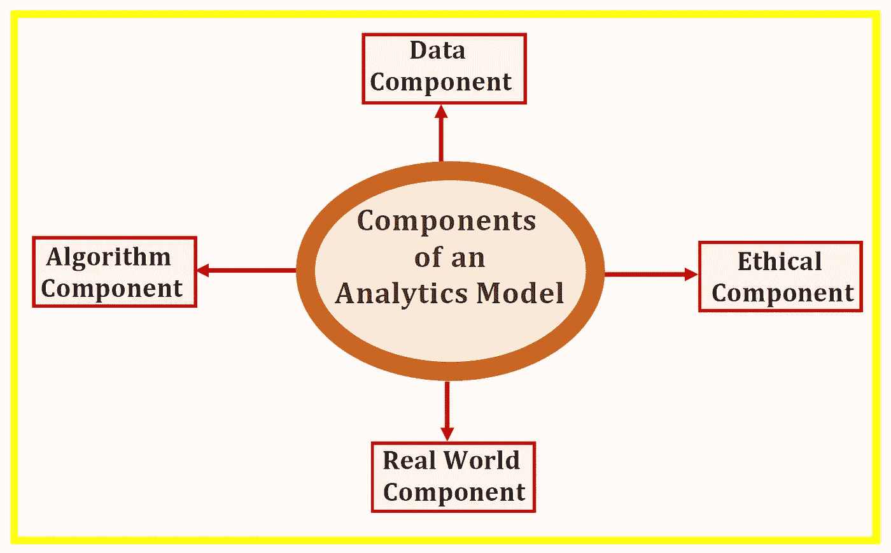

# 分析模型的 4 个组成部分

> 原文：<https://towardsdatascience.com/4-components-of-an-analytics-model-b087797f9a7a?source=collection_archive---------16----------------------->

每个对实践数据科学感兴趣的人都必须熟悉分析模型的基本组件。本文将讨论分析模型的 4 个主要组成部分，即:1)数据部分，2)算法部分，3)现实世界部分，以及 4)伦理部分。

来自数据科学培训课程的知识对于获得组件 1 和 2(数据组件和算法组件)的技能是必要的。组件 3 和 4(真实世界组件和道德组件)中的技能主要通过真实世界数据科学项目获得。在构建分析模型时，重要的是要记住，模型必须产生现实生活中有意义和可解释的结果。这就是人类经验的来源。人类(合格的数据科学专业人员)必须检查算法和计算机产生的结果，以确保在推荐部署模型之前，结果与真实世界的情况一致。

现在让我们讨论分析模型的 4 个基本组成部分。

# 分析模型的 4 个基本组成部分

# 1.数据成份

该组件包含有关数据的所有内容，包括以下内容:

## I)数据来源

本节涉及所有数据来源，例如

a)收集数据的实验或调查设计

b)从挖掘和存储大型数据集的组织购买数据

c)开放数据集的使用

d)模拟原始数据以将其与实际采样数据相结合

## ii)数据准备和转换

它处理预处理原始数据，将其转换为可用于分析或模型构建的形式，包括以下主题

a)处理缺失数据

b)数据插补

c)编码分类数据

d)预测器特征和目标特征的识别

e)数据缩放，例如特征标准化或规范化

f)特征选择和降维

g)先进的数据转换方法，如 PCA 和 LDA

可用于数据准备和转换的软件包括

*   熊猫套餐
*   擅长
*   稀有
*   计算机编程语言

# 2.算法组件

这些是应用于数据的算法，目的是从数据中获取有用且有洞察力的信息。这些算法可以分为描述性的、预测性的或规范性的。

## I)用于描述性分析的算法

其中包括可应用于可视化数据的软件包，例如生成柱状图、线图、直方图、散点图、配对图、密度图、QQ 图等的算法。一些最常见的描述性分析包包括

a) Matplotlib

b) Ggplot2

c) Seaborn

## ii)预测分析算法

这些是用于建立预测模型的算法。一些最常见的预测分析包包括

*   Sci-kit 学习包
*   插入符号包
*   张量流

预测分析算法可以进一步分为以下几组:

**a)监督学习(连续变量预测)**

*   基本回归
*   多元回归分析
*   正则回归

**b)监督学习(离散变量预测)**

*   逻辑回归分类器
*   支持向量机分类器
*   k 近邻(KNN)分类器
*   决策树分类器
*   随机森林分类器

**c)无监督学习**

*   Kmeans 聚类算法

## iii)用于说明性分析的算法

这些算法可用于根据从数据中获得的见解来指定活动的疗程。一些规定的分析算法包括

a)概率建模

c)优化方法和运筹学

c)蒙特卡罗模拟

# 3.真实世界组件

请记住，你可能非常擅长处理数据以及构建良好的机器学习算法，但作为一名数据科学家，现实世界的应用才是最重要的。每一个机器学习模型都必须产生现实生活中有意义和可解释的结果。预测模型必须根据实际情况进行验证，才能被认为是有意义和有用的。因此，人类的输入和经验对于理解算法产生的结果总是必要和有益的。

为了在现实世界中胜任，一个人必须获得超出数据科学和机器学习学术培训计划所提供的技能。仅仅从课程工作中获得的技能不会让你成为数据科学家。合格的数据科学家必须能够证明成功完成真实世界数据科学项目的证据，该项目包括数据科学和机器学习问题工作流中的所有阶段，如问题框架、数据获取和分析、模型构建、模型测试、模型评估和模型部署。现实世界的数据科学项目可以通过以下方式获得:

a) Kaggle 项目

b)实习

c)来自访谈

从事真实世界的数据科学项目将使您加深对模型构建工作流程的理解，从问题框架到数据分析、模型构建和测试以及模型应用。它还会帮助你获得额外的基本技能，例如

*   通讯技能
*   团队合作技能
*   演示技巧
*   商业头脑

# 4.伦理成分

作为实践数据科学家，这是维护高道德标准的组成部分。作为一名数据科学家，理解项目成果和发现的含义是很重要的。对自己诚实。避免操纵数据或使用有意造成结果偏差的方法。从数据收集到分析、模型构建、测试和应用的所有阶段都要符合道德规范。避免为了误导或操纵你的听众或主管而捏造结果。在解释你的数据科学项目的发现时要合乎道德。

总之，我们已经讨论了分析模型的 4 个基本组成部分。每个对实践数据科学感兴趣的人都必须熟悉分析模型的基本组件。