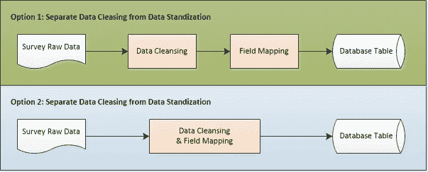
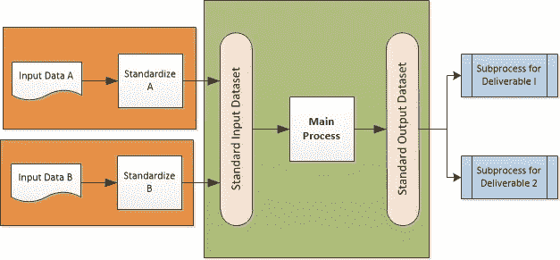

# 4 数据处理的设计原则

> 原文：<https://towardsdatascience.com/4-design-principles-for-data-processing-964d6a45cb7c?source=collection_archive---------7----------------------->

设计模式的实践在面向对象编程(OOP)中最受欢迎，这在 Erich Gamma 和 Richard Helm 的经典著作《设计模式:可重用面向对象软件的元素》中得到了有效的解释和总结。下面是维基百科对设计模式的定义:

“一个**软件设计模式**是一个通用的、**可重用的**解决方案，用于解决软件设计中给定上下文中经常出现的问题。它不是一个可以直接转化为源代码或机器码的成品设计。这是一个关于如何解决问题的**描述或模板**，可以在许多不同的情况下使用。设计模式是形式化的**最佳实践**，程序员可以用它来**解决设计应用程序或系统时的常见问题**。

对于数据科学，可能很多人都问过同样的问题:数据科学编程有设计模式吗？我会说是的。然而，为了将它们与 OOP 区分开来，我称之为数据科学的设计原则，这本质上意味着与 OOP 的设计模式相同，但是在更高的层次上。受 Robert Martin 的书《干净的体系结构》的启发，这篇文章关注数据处理和数据工程的 4 个顶级设计原则。我的下一篇文章将讨论优化性能的通用设计原则。在这两个领域中，都有可重复使用的解决方案和最佳实践，它们已经被证明:

1.  缩短整体开发周期；
2.  使数据过程更容易维护(无论使用哪种编程语言或数据准备工具)；
3.  使系统更加开放，易于操作；
4.  从一开始就确保数据质量。

**设计原则 1:始终从数据集和数据实体的设计开始**

每个数据处理都有 3 个最基本的组成部分:输入数据、输出数据和其间的数据转换。无论何时设计数据流程，首先要做的是明确定义输入数据集和输出数据集，包括:

*   所需的输入数据集和参考数据
*   要创建的输出数据集
*   每个数据集中的数据字段
*   每个字段的数据类型，如文本、整数、浮点、列表等，
*   确定每个记录唯一性的字段
*   每个字段的预期数据模式，包括它是否可以有缺失值和不同的值列表
*   数据集与组织中其他现有数据集的关系

这类似于应用于数据库的所谓数据建模，有时被称为“数据库逻辑设计”。这里的关键词是“逻辑”，因为它应该发生在实现决策之前。数据集可以写入磁盘并永久存储在公司内部，最终将成为其他流程和应用程序访问或使用的真正资产。因此，它确实很重要，应该准确、清晰地定义，并采用数据治理驱动的最佳实践和策略。特别是，应该根据业务需求或下游组件或流程的需求来定义输出数据集。输入数据集的定义应该与其来源保持一致，这样就可以很容易地跨不同的系统追踪数据谱系。

在逻辑设计之后，给定数据集的物理位置和数据结构可以作为系统设计的一部分来确定。物理结构可能与逻辑设计不同，这种情况经常发生。一个典型的例子是，逻辑设计中的字段名应该有正常的单词，使其更有意义和可读性，而物理字段名必须考虑系统或软件的限制。例如:

*   逻辑字段名称:员工姓名
*   物理字段名(不能有空格，并且有字符数限制):emp_nm

当组织中的数据平台改变时，逻辑定义不应改变，而数据集的物理表示可以根据系统需求和功能重新设计。

如果流程流需要多个步骤，则还需要定义中间数据集的内容，这可以用于不同的目的:

*   用于数据质量检查
*   提供流程检查点和阶段，以便流程在失败时不需要总是从头重新运行
*   作为另一个子流程的输入，或者可供其他系统或用户使用

与数据处理逻辑的代码相比，数据实体需要花费更长的时间和更多的精力来进行影响更大的更改，主要是因为它已经保存了数据，并且可以被其他处理使用。另一方面，一旦定义了输入、中间和输出数据集，数据处理本身的框架就就位了。我们经常看到数据工程师在没有明确定义输出的情况下就开始构建流程。这很容易导致两个后果:1)当输出改变时，更大的改变或者甚至是过程的修补；2)使输出依赖于处理逻辑，因此，错过了一些需求或定义不清。因此，在开始设计技术流程之前，一定要先定义数据集。事实上，处理逻辑很大程度上取决于输入和输出的数据定义。

数据集和数据实体的逻辑设计也与最初的业务需求收集、数据发现和数据治理过程紧密相关，以遵循组织标准。此外，仔细的逻辑设计应该考虑组织内的数据共享，如果一个字段或数据已经存在于公司的其他地方，则避免重复的数据集(参见我的文章:[主数据管理:数据策略的基本部分](/master-data-management-an-essential-part-of-data-strategy-db12411a05b2))。最后，具有良好治理的数据集的清晰逻辑设计是从一开始就确保数据质量的关键步骤(参见我的文章:[确保和维持数据质量的 7 个步骤](/7-steps-to-ensure-and-sustain-data-quality-3c0040591366))。

**设计原则 2:将业务规则与处理逻辑分离**

在罗伯特·马丁的《干净的架构》一书中，原则之一是从软件的角度，特别是 OOP 功能的角度，将业务规则与插件分离。然而，在数据工程中，存在类似的原则，而业务规则具有更广泛的含义。首先，业务规则由不同的类型组成，例如，营销、财务、安全或法规遵从性方面的特定方法。在许多情况下，数据清理和标准化的规则也可以由业务部门驱动，因此，被认为是业务规则。业务规则通常有 3 个特征:

1.  需要由业务组织或业务分析师审查
2.  可能经常改变，需要快速周转
3.  如果配置或执行不当，会导致严重的影响和后果

业务规则的管理和执行对于数据流程的成功至关重要。一个好的设计应该考虑以下几个方面:

1.  *模块化*

相同类型的规则应该在相同的数据流程、模块或函数中处理。另一方面，不同类型的规则不应该驻留在同一个进程、模块或函数中。否则，管理业务规则变化的影响会变得很困难，并且流程会变得更加难以维护。

让我们举一个处理客户调查数据的小例子，您需要清理原始数据，将其标准化，然后将标准化的数据加载到数据库表中。这里的输出是标准的数据库表，您的调查数据是原始输入。有两种建立流程的方法:

数据清理的规则不同于字段映射的规则:数据清理规则基于输入数据的值，而字段映射基于输入和输出的数据结构。鉴于此，选项 1 更好，因为它允许数据清理规则独立于字段映射规则进行更改，因此与选项 2 相比，更加灵活和简单，并且对规则修改的影响更小。换句话说，不同类型的规则的清楚分离导致更好的规则管理，而对其他类型的规则以及其他处理逻辑的影响最小。此外，专注于一种类型的业务规则的特殊功能或模块可以在需要时成熟为独立的服务，然后可以针对其他用例单独轻松地进行更改或增强。

*2。业务规则的元数据存储*

只要有可能，经常改变的业务规则部分应该被抽象出来，并存储在与编程代码本身分离的存储库(例如，数据库)中。有了这种分离，就可以在其上构建应用程序或 API，业务分析师和/或业务用户可以通过它们来检查和修改业务规则。在处理方面，引擎只是在执行时从存储库中读取规则，并将规则应用于输入数据，而不需要将任何业务逻辑硬编码到流程本身中。

*3。业务规则版本化和日志记录*

在元数据存储库中单独存储和管理业务规则之后，进一步的版本控制和日志记录功能变得非常强大，使用户能够在新版本中更改规则，并在批准或发布更改之前将结果与以前版本的结果进行比较。此外，记录每个业务规则之前和之后的结果对于控制规则执行的准确性和确保从规则引擎创建的输出数据的质量是至关重要的。

**设计原则 3:从一开始就构建异常**

数据永远不可能是完美的，因此，我们首先永远不要假设输入数据是完美的。在初始设计中，应考虑数据异常处理，如下所示:

*   数据集是否具有预期的格式？
*   输入数据集的记录数是否正确，或者是否为空？如果文件为空，许多编程语言不会失败—需要显式捕获空文件异常。
*   每一列都有正确的数据类型吗？同样，当一些记录中的少数值具有错误的格式时，一些程序可能会悄无声息地失败。
*   定义应该引发异常的条件:1)在流程可以继续时应该有警告，还是应该流程失败；2)谁会收到警报？

首先，处理数据异常对于确保数据质量至关重要。一个设计良好的流程应该预先定义所有这些异常，并在流程中捕获这些异常。这些异常不仅会导致实时警报，还会被反馈到集中式数据质量报告和仪表板中。

**设计原则 4:使用标准输入和输出易于集成**

如何才能让一个数据流程易于集成？一个重要的原则是创建标准化的输入和输出层来“封装”主流程。如下图所示，标准化输入数据的过程应该与主过程分离和分离，主过程的输出是主过程的标准输入数据集。将来，如果有多一种类型的输入数据，可以建立和集成单独的标准化流程，而不改变主流程。这也适用于输出-当需要生成可能不同格式的输出时，应首先生成标准输出图层。这允许通过构建一个单独的流程从标准输出生成未来的输出，而不需要改变主流程。显然，标准的输入和输出数据集在连接点上起作用，这样其他流程可以很容易地与主流程集成。

# **结论**

本文总结了数据处理和工程的 4 个设计原则。这些原则不仅应该被数据架构师用于设计大型系统，还应该被数据科学家和数据工程师用于较小的过程。如果这些原则以一种有纪律的方式被采用，一个设计良好的数据过程将使它更容易维护，更有效地被改变而对系统的其他部分影响更小，并且最后提供比那些不遵循上述原则的更好的数据质量。