# 使用 cuGraph 为数据科学家提供 4 种强大的图形算法

> 原文：<https://towardsdatascience.com/4-graph-algorithms-on-steroids-for-data-scientists-with-cugraph-43d784de8d0e?source=collection_archive---------10----------------------->


Networks are everywhere. Photo by [Anastasia Dulgier](https://unsplash.com/@dulgier?utm_source=medium&utm_medium=referral) on [Unsplash](https://unsplash.com?utm_source=medium&utm_medium=referral)

## GPU->Rapids->Cugraph->可扩展图形分析

作为数据科学家，我们已经对 Pandas 或 SQL 或任何其他关系数据库驾轻就熟。

我们习惯于以行的形式看到用户，以列的形式看到他们的属性。但是现实世界是这样的吗？

在一个互联的世界中，用户不能被视为独立的实体。它们彼此之间有一定的关系，我们有时希望在构建机器学习模型时包括这种关系。

现在，虽然在关系数据库中，我们不能在不同的行(用户)之间使用这种关系，但在图形数据库中，这样做相对来说比较简单。

现在，正如我们所知，Python 有一个很棒的包`Networkx`来做这件事。但问题是它不可扩展。

***GPU 凭借其众多内核和并行性，可以帮助我们解决可扩展性问题。这就是 RAPIDS.ai CuGraph 的用武之地。***

> [RAPIDS](https://rapids.ai/) cuGraph 库是一个图形分析集合，用于处理 GPU 数据帧中的数据——参见 [cuDF](https://github.com/rapidsai/cudf) 。cuGraph 旨在提供一个数据科学家熟悉的类似 NetworkX 的 API，因此他们现在可以更容易地构建 GPU 加速的工作流。

在这篇文章中，我将谈论一些你应该知道的最基本的图算法，以及如何用 Python 和 cuGraph 实现它们。

# 装置

要安装 cuGraph，您可以根据您的系统和配置，使用从 [rapids.ai](https://rapids.ai/start.html) 中选择的简单命令。


我使用的命令如下，并且我使用了夜间构建(推荐):

```
conda install -c rapidsai-nightly -c nvidia -c numba -c conda-forge -c anaconda cudf=0.10 cuml=0.10 cugraph=0.10
```

# 1.连接的组件


我们都知道聚类是如何工作的？

*你可以用非常通俗的术语把连通分量看作是一种硬聚类算法，它在相关/连通数据中寻找聚类/孤岛。*

*举个具体的例子:* ***假设你有连接世界上任意两个城市的道路的数据。你需要找出世界上所有的大洲以及它们包含的城市。***

你将如何实现这一目标？来吧，考虑一下。

我们使用的连通分量算法是基于 **BFS/DFS** 的一个特例。我不会在这里谈论它是如何工作的，但是我们将看到如何使用`Networkx`和`cuGraph`来启动和运行代码。

## 应用程序

从零售的角度来看**:比方说，我们有很多客户使用很多账户。使用连通分量算法的一种方法是在数据集中找出不同的族。**

**我们可以基于相同的信用卡使用、相同的地址或相同的手机号码等假设客户之间的边(道路)。一旦我们有了这些连接，我们就可以在相同的上运行连接组件算法来创建单独的聚类，然后我们可以为这些聚类分配一个家族 ID。**

**然后，我们可以使用这些家庭 id 根据家庭需求提供个性化建议。我们还可以使用这个家族 ID，通过创建基于家族的分组特征来推动我们的分类算法。**

**从**财务角度**:另一个用例是使用这些家庭 id 来捕获欺诈。如果一个帐户在过去进行过欺诈，则关联的帐户很可能也容易受到欺诈。**

**可能性只受到你想象力的限制。**

## **密码**

**我们将使用 Python 中的`Networkx`模块来创建和分析我们的图表。**

**让我们从一个用于我们目的的示例图开始。包含城市和它们之间的距离信息。**

**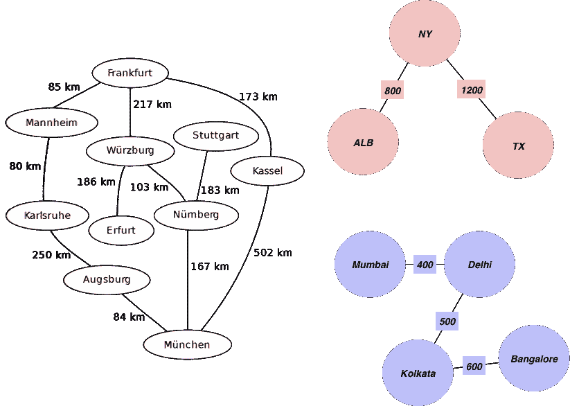**

**Graph with Some random distances**

**我们首先创建一个边和距离的列表，我们将添加边的权重:**

```
edgelist = [['Mannheim', 'Frankfurt', 85], ['Mannheim', 'Karlsruhe', 80], ['Erfurt', 'Wurzburg', 186], ['Munchen', 'Numberg', 167], ['Munchen', 'Augsburg', 84], ['Munchen', 'Kassel', 502], ['Numberg', 'Stuttgart', 183], ['Numberg', 'Wurzburg', 103], ['Numberg', 'Munchen', 167], ['Stuttgart', 'Numberg', 183], ['Augsburg', 'Munchen', 84], ['Augsburg', 'Karlsruhe', 250], ['Kassel', 'Munchen', 502], ['Kassel', 'Frankfurt', 173], ['Frankfurt', 'Mannheim', 85], ['Frankfurt', 'Wurzburg', 217], ['Frankfurt', 'Kassel', 173], ['Wurzburg', 'Numberg', 103], ['Wurzburg', 'Erfurt', 186], ['Wurzburg', 'Frankfurt', 217], ['Karlsruhe', 'Mannheim', 80], ['Karlsruhe', 'Augsburg', 250],["Mumbai", "Delhi",400],["Delhi", "Kolkata",500],["Kolkata", "Bangalore",600],["TX", "NY",1200],["ALB", "NY",800]]
```

**现在我们想从这个图表中找出不同的大陆和它们的城市。**

**首先，我们需要创建一个带边的`cudf`数据框。现在，我正在创建一个熊猫数据帧，并将其转换为`cudf`数据帧，但在现实生活中，我们将从边缘的`csv`文件中读取。**

```
import cugraph
import cudf
import pandas as pd# create a pandas dataframe of edges
pandas_df = pd.DataFrame(edgelist)
pandas_df.columns = ['src','dst','distance']# create a pandas dataframe of reversed edges as we have a undirected graph
rev_pandas_df = pandas_df.copy()
rev_pandas_df.columns = ['dst','src','distance']rev_pandas_df = rev_pandas_df[['src','dst','distance']]# concat all edges
pandas_df = pd.concat([pandas_df,rev_pandas_df])
```

**现在我们的`pandas` df 包含两个方向的边。而我们在`src`和`dst`列中的节点名是`str`格式的。显然，`cuGraph`不喜欢这样，只使用整数节点 id。**

```
# CuGraph works with only integer node IDs
unique_destinations = set()
for [src,dst,dis] in edgelist:
  unique_destinations.add(src)
  unique_destinations.add(dst)# create a map of city and a unique id
city_id_dict = {}
for i, city in enumerate(unique_destinations):
  city_id_dict[city]=i# create 2 columns that contain the integer IDs for src and dst
pandas_df['src_int'] = pandas_df['src'].apply(lambda x : city_id_dict[x])
pandas_df['dst_int'] = pandas_df['dst'].apply(lambda x : city_id_dict[x])
```

**现在是我们应该关注的主要部分:**

```
cuda_g = cudf.DataFrame.from_pandas(pandas_df)# cugraph needs node IDs to be int32 and weights to be float
cuda_g['src_int'] = cuda_g['src_int'].astype(np.int32)
cuda_g['dst_int'] = cuda_g['dst_int'].astype(np.int32)
cuda_g['distance'] = cuda_g['distance'].astype(np.float)G = cugraph.Graph()
G.add_edge_list(cuda_g["src_int"],cuda_g["dst_int"] , cuda_g['distance'])***cugraph.weakly_connected_components(G)***
```

**最后一次调用的输出是一个`cudf`数据帧。**

**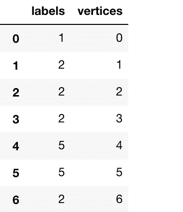**

**正如我们所看到的，标签对应于连接的组件 ID。**

# **2.最短路径**

****

**继续上面的例子，我们得到一个图表，上面有德国的城市以及它们之间的距离。**

****你想找出如何从法兰克福(起点)到慕尼黑的最短距离**。**

**我们用来解决这个问题的算法叫做 **Dijkstra** 。用 Dijkstra 自己的话说:**

> **一般来说，从[鹿特丹](https://en.wikipedia.org/wiki/Rotterdam)到[格罗宁根](https://en.wikipedia.org/wiki/Groningen)的最短旅行方式是什么:从一个城市到另一个城市。[是最短路径](https://en.wikipedia.org/wiki/Shortest_path_problem)的算法，我大概二十分钟就设计好了。一天早上，我和我年轻的未婚妻在[阿姆斯特丹](https://en.wikipedia.org/wiki/Amsterdam)购物，累了，我们坐在咖啡厅露台上喝一杯咖啡，我在想我是否可以这样做，然后我设计了最短路径的算法。正如我所说，这是一个 20 分钟的发明。事实上，它是在三年后的 59 年出版的。该出版物仍然可读，事实上，相当不错。它如此漂亮的原因之一是我没有用铅笔和纸来设计它。我后来才知道，不用铅笔和纸进行设计的一个好处是，你几乎是被迫避免所有可以避免的复杂性。最终，令我大为惊讶的是，这个算法成了我成名的基石之一。**
> 
> **— Edsger Dijkstra，在与 Philip L. Frana 的访谈中，ACM 通讯，2001[【3】](https://en.wikipedia.org/wiki/Dijkstra%27s_algorithm#cite_note-Dijkstra_Interview-3)**

## **应用程序**

*   **Dijkstra 算法的变体在谷歌地图中被广泛用于查找最短路线。**
*   **你在沃尔玛超市。你有不同的过道和过道之间的距离。您希望为顾客提供从通道 A 到通道 d 的最短路径。**

**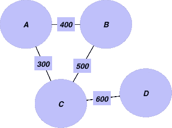**

*   **你已经看到 LinkedIn 如何显示一级关系，二级关系。幕后发生了什么？**

## **密码**

**我们已经有了之前的图表。我们可以找到从一个源节点到图中所有节点的最短距离。**

```
# get distances from source node 0
distances = cugraph.sssp(G, 0)# filter infinite distances
distances = cugraph.traversal.filter_unreachable(distances)distances
```

**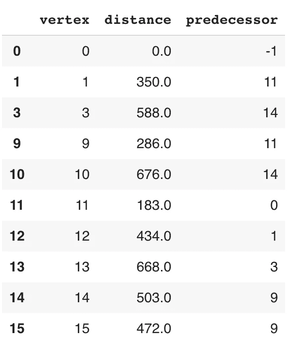**

**现在，如果我们必须找到节点 0 和 14 之间的路径，我们可以使用距离`cudf`。**

```
# Getting the path is as simple as:path = []dest = 14
while dest != 0:
   dest = distances[distances['vertex'] == dest]['predecessor'].values[0]
   path.append(dest)# reverse the list and print
print(path[::-1])
-------------------------------------------------------
[0, 11, 9]
```

# **3.Pagerank**

**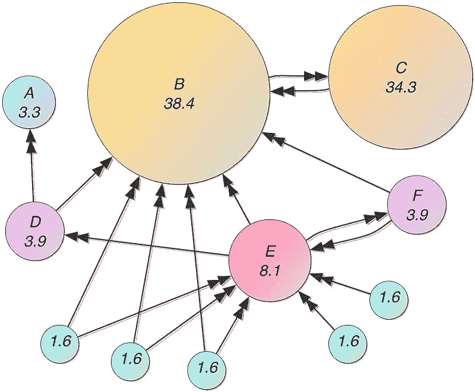**

**这是长期以来为谷歌提供动力的页面排序算法。它根据输入和输出链接的数量和质量给网页打分。**

## **应用程序**

**Pagerank 可以用在任何我们想要评估任何网络中节点重要性的地方。**

*   **它已经被用于通过引用来寻找最有影响力的论文。**
*   **已经被谷歌用来对网页进行排名**
*   **它可以用来对 tweets 进行排序——用户和 Tweets 作为节点。如果用户 A 关注用户 B，则在用户之间创建链接；如果用户发推文/转发推文，则在用户和推文之间创建链接。**
*   **推荐引擎**

## **密码**

**在这个练习中，我们将使用脸书的社交网络数据。**

```
# Loading the file as cudffb_cudf = cudf.read_csv("facebook_combined.txt", sep=' ', names=['src', 'dst'],dtype =['int32','int32'])# adding reverse edges also
rev_fb_cudf = fb_cudf[['dst','src']]
rev_fb_cudf.columns = ['src','dst']
fb_cudf = cudf.concat([fb_cudf,rev_fb_cudf])
```

**创建图表**

```
# creating the graph
fb_G = cugraph.Graph()
fb_G.add_edge_list(fb_cudf["src"],fb_cudf["dst"])
```

**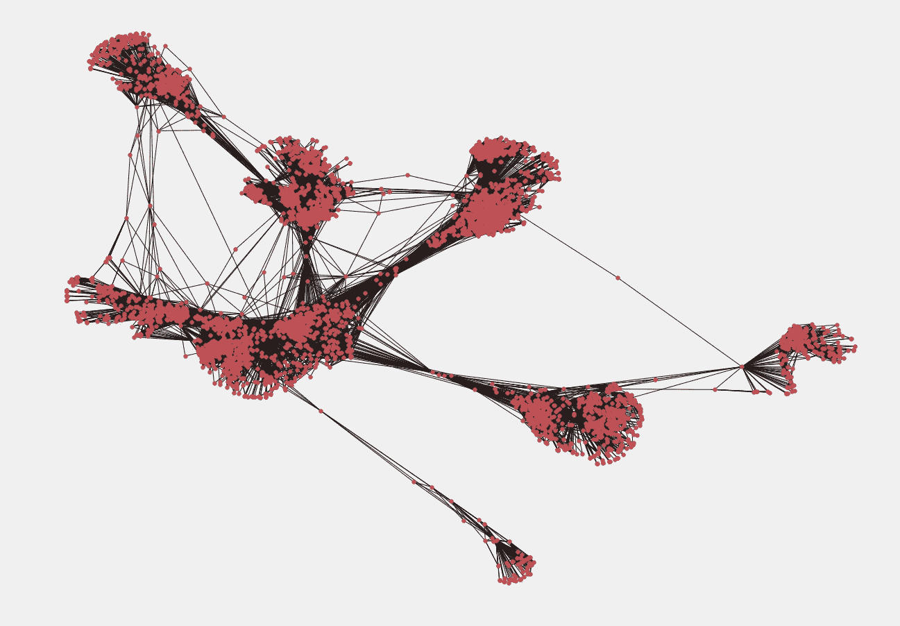**

**FB User Graph**

**现在我们想找到具有高影响力的用户。**

**直观地说，Pagerank 算法会给一个有很多朋友的用户更高的分数，而这个用户又有很多 FB 朋友。**

```
# Call cugraph.pagerank to get the pagerank scores
fb_pagerank = cugraph.pagerank(fb_G)
fb_pagerank.sort_values(by='pagerank',ascending=False).head()
```

**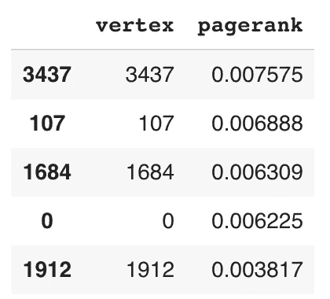**

# **4.链接预测**

****

**继续我们在脸书的例子。您可能已经在您的脸书帐户中看到了推荐的朋友。如何才能创建我们的小推荐器呢？**

*****我们可以根据当前的边来预测未来哪些边会被连接吗？*****

**一种简单快速的方法是使用 Jaccard 系数。**

## **应用程序**

**链路预测可能有许多应用。我们可以预测**

*   **那些打算在一个引用网络中建立合作关系的作者**
*   **谁会成为社交网络中的朋友？**

## **想法**

**我们计算两个节点 I 和 j 之间的 Jaccard 系数如下:**

**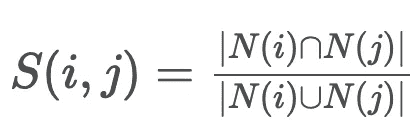**

**其中，分子是 I 和 j 的共同邻居的数量，分母是 I 和 j 的不同邻居的总数。**

**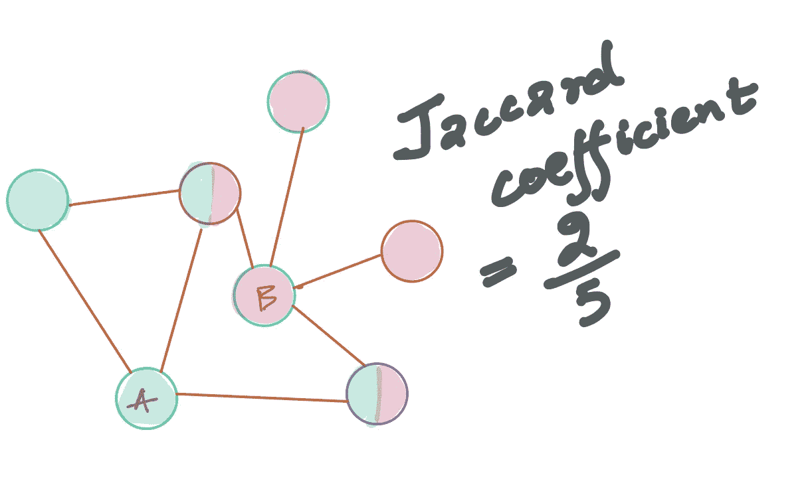**

**因此，在图中，一半红色和一半绿色的节点是 A 和 b 的共同邻居，它们总共有 5 个不同的邻居。所以 JaccardCoeff(A，B)是 2/5**

## **密码**

**我们首先用所有可能的节点组合创建一个`cudf_nodes` cudf。**

```
max_vertex_id = fb_pagerank['vertex'].max()
data = []
for x in range(0,max_vertex_id+1):
  for y in range(0,max_vertex_id+1):
    data.append([x,y])
cudf_nodes =cudf.from_pandas(pd.DataFrame(data))
cudf_nodes.columns = ['src','dst']cudf_nodes['src'] = cudf_nodes['src'].astype(np.int32)
cudf_nodes['dst'] = cudf_nodes['dst'].astype(np.int32)
```

**然后，我们可以计算节点之间的 Jaccard 系数，如下所示:**

```
jaccard_coeff_between_nodes = cugraph.link_prediction.jaccard(fb_G,cudf_nodes["src"],cudf_nodes["dst"])
jaccard_coeff_between_nodes.head()
```

**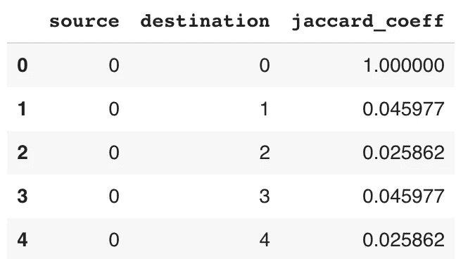**

*****但我们仍未完成。*** 我们需要去掉`source==destination`处的边和图中已经存在的边。我们将使用简单的连接和过滤操作来实现这一点，这些操作与 pandas 非常相似。**

```
jaccard_coeff_between_nodes=jaccard_coeff_between_nodes[jaccard_coeff_between_nodes['source']!=jaccard_coeff_between_nodes['destination']]
fb_cudf.columns = ['source', 'destination']
fb_cudf['edgeflag']=1
jaccard_coeff_joined_with_edges = jaccard_coeff_between_nodes.merge(fb_cudf,on= ['source', 'destination'],how='left')
# We just want to see the jaccard coeff of new edges
new_edges_jaccard_coeff = jaccard_coeff_joined_with_edges[jaccard_coeff_joined_with_edges['edgeflag']!=1]
```

**这是我们最终排序的数据帧，带有未连接节点之间的 Jaccard 系数。我们知道向我们的平台用户推荐什么样的朋友。**

```
new_edges_jaccard_coeff.sort_values(by='jaccard_coeff',ascending=False)
```

**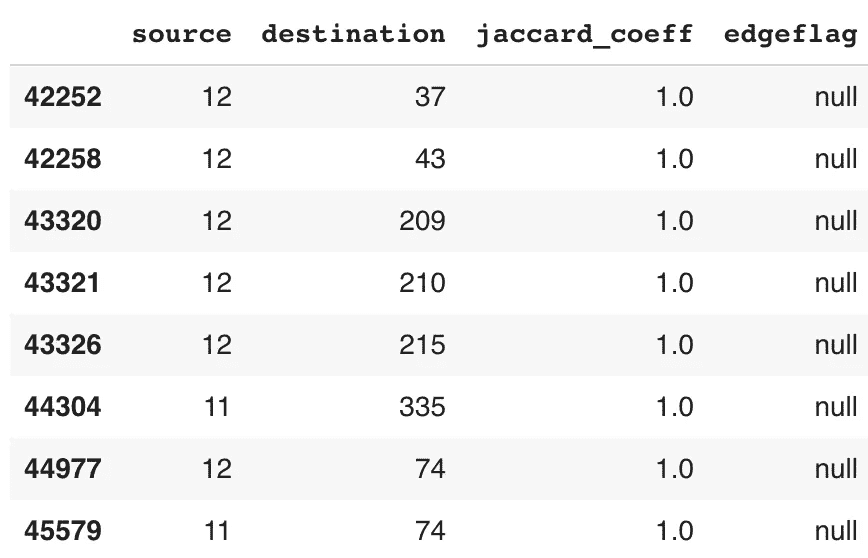**

# **基本网络统计**

****

**关于你的网络，有很多你想知道的基本措施。**

**以下是你如何让他们进入你的社交网络**

```
print("Number of Nodes",fb_G.number_of_nodes())
print("Number of Edges",fb_G.number_of_edges())
------------------------------------------------------
Number of Nodes 4039 
Number of Edges 176468
```

**您还可以计算每个节点的 indegree 和 outdegree。**

**在有向图中，这对应于追随者的数量和追随者的数量。**

```
fb_G.degrees().head()
```

**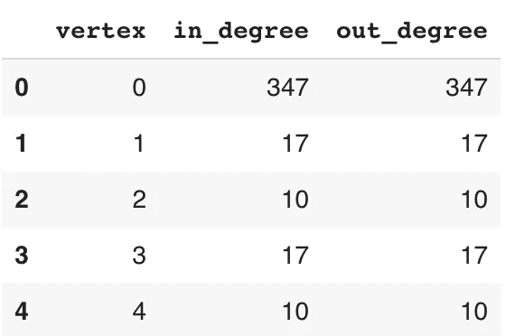**

# **性能基准**

**如果我不为不同的算法添加特定的基准，我就不能公正地对待这篇文章。**

**在我的基准研究中，我使用了斯坦福大学大型网络数据集集合中的三个数据集，按规模递增的顺序排列。**

1.  **[自我-脸书](https://snap.stanford.edu/data/ego-Facebook.html):来自脸书的无向图，有 ***个 4 K 节点和 88 K 条边*****
2.  **[自我推特](https://snap.stanford.edu/data/ego-Twitter.html):有向图，有 ***81 K 个节点和 1.7 米*** 条边**
3.  **[ego-Gplus](https://snap.stanford.edu/data/ego-Gplus.html) :来自 Google+的带有 ***107 K 个节点和 13.6 M*** 条边的有向图**

**下面是我在 NVIDIA [***特斯拉 V100 32 GB GPU***](https://amzn.to/2OaF9uq) 上进行的实验结果。感谢 NVIDIA 的 Josh Patterson 和 Walmart Labs 的 Richard Ulrich 为我做的安排。所有时间都以毫秒为单位:**

**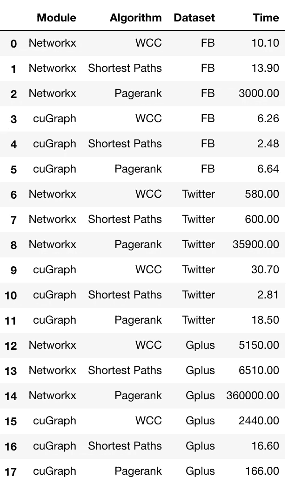**

**我没有在结果中添加 Jaccard 系数，因为它甚至不能在使用 networkX 的 facebook 上运行。对于 cuGraph，它有毫秒级的延迟。**

**让我们想象一下这些结果:**

**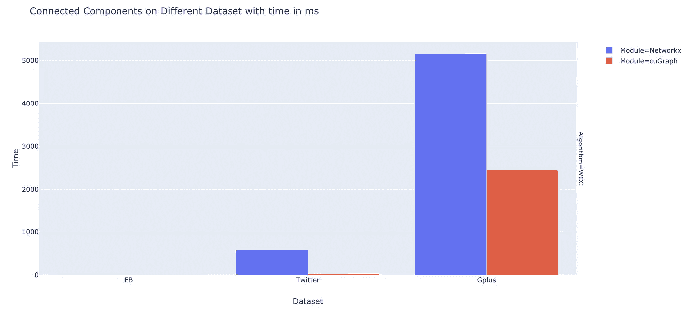**

**Scales well for Weakly Connected Components compared to NetworkX**

**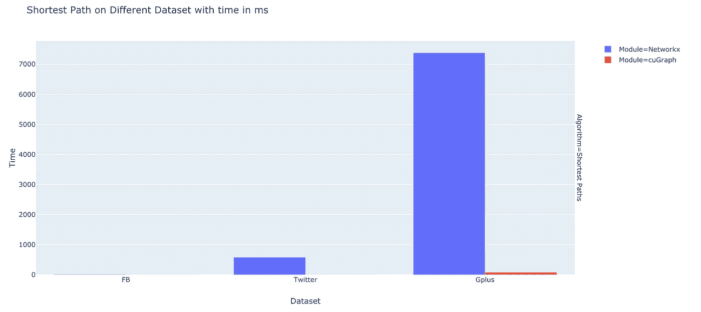**

**cuGraph is pretty good with shortest paths. As you can see, the algorithm takes negligible time compared to networkX**

**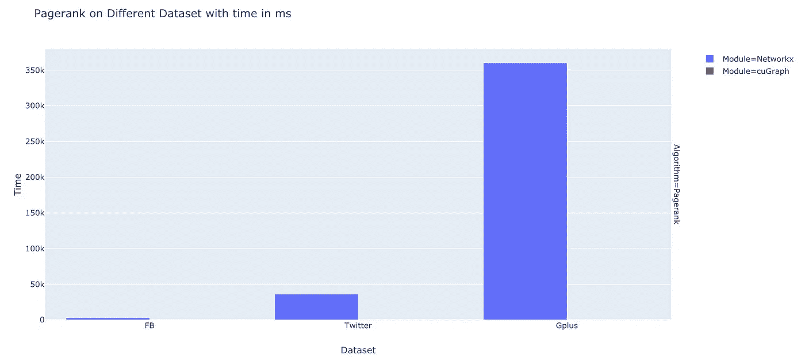**

**It is on PageRank that cuGraph truly shines. NetworkX is not at all viable for PageRank when compared with cuGraph.**

# **警告**

**Rapids `cuGraph`是一个优秀的图形分析库，但是我感觉还缺少一些东西。也许我们会在下一个版本中得到它们。**

*   **有点不方便，我们只能使用数据类型为 int32 的编号节点。重新编号有助于解决这个问题。查看我的笔记本中的[基准](https://github.com/MLWhiz/data_science_blogs/tree/master/cuGraph_Benchmark)以获得准确的代码。检查函数`cugraph.symmetrize_df`来创建无向图。**
*   **有些算法还没有实现。例如，我找不到 MST、中心性度量等。**
*   **需要更多示例笔记本来记录最佳实践。我可能会去做其中的一些。**
*   **库中没有可视化组件。我必须去`networkx`绘制图表。**

*****但尽管如此，我还想补充一点，用 GPU 提供图形分析的想法太棒了，我可以忍受这些小问题。*** 以及他们让 API 与`pandas`和`networkx`如此相似的方式增加了它的价值。**

*****我记得以前用 GPU 需要很多代码。RAPIDS 的目标是让 GPU 无处不在，这是一个了不起的创举。*****

# **结论**

****

*****在这篇文章中，我谈到了一些改变了我们生活方式的最强大的图形算法，以及如何用 GPU 来扩展它们。*****

**我喜欢 Rapids AI 一直致力于让典型的开发人员/数据科学家能够访问 GPU 的方式，并且认为我们直到一年前才听说过它。他们已经走了很长的路。**

**此外，这里是最新的 0.9 版本的文件为`[cuDF](https://docs.rapids.ai/api/cudf/stable/)`和`[cuGraph](https://docs.rapids.ai/api/cugraph/stable/)`。**

**你可以在这个 [Google Colab 笔记本](https://colab.research.google.com/drive/1quS3-yg6frFo__4VyJTyUytHhqnBQ9j_)中获得运行代码，在我的 [Github 存储库](https://github.com/MLWhiz/data_science_blogs/tree/master/cuGraph_Benchmark)中获得带有基准的代码，因为 Google Colab 在基准测试时缺乏资源。**

# **继续学习**

**如果你想阅读更多关于图算法的内容，这里有一个由 UCSanDiego 在 Coursera 上开设的[大数据图分析课程，我强烈推荐你学习图论的基础知识。](https://coursera.pxf.io/YgKbbe)**

**谢谢你的阅读。将来我也会写更多初学者友好的帖子。在 [**媒体**](https://medium.com/@rahul_agarwal?source=post_page---------------------------) 关注我，或者订阅我的 [**博客**](http://eepurl.com/dbQnuX?source=post_page---------------------------) 了解他们。一如既往，我欢迎反馈和建设性的批评，可以通过 Twitter [@mlwhiz](https://twitter.com/MLWhiz?source=post_page---------------------------) 联系。**

**此外，一个小小的免责声明——在这篇文章中可能会有一些相关资源的附属链接，因为分享知识从来都不是一个坏主意。**