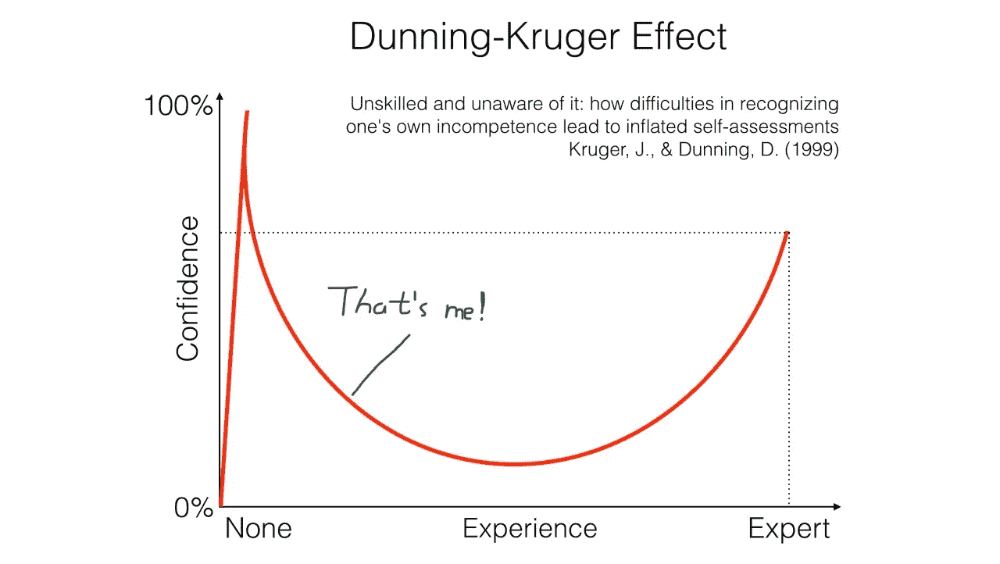
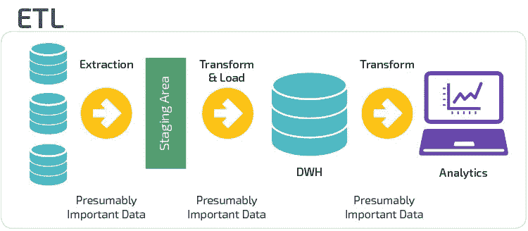
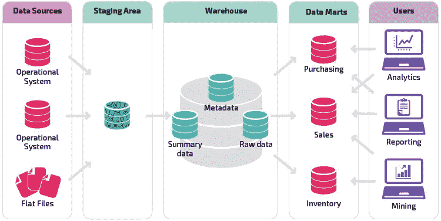

# 大学需要教授的关于数据科学/分析的 4 件重要事情

> 原文：<https://towardsdatascience.com/4-important-things-universities-need-to-teach-about-data-science-analytics-6ab5988639ca?source=collection_archive---------27----------------------->

## 从数据收集、预处理到非技术交流，这些都是专业人员处理数据的重要技能。


Photo by [Pang Yuhao](https://unsplash.com/@yuhao?utm_source=medium&utm_medium=referral) on [Unsplash](https://unsplash.com?utm_source=medium&utm_medium=referral)

如果你在阅读这篇文章时遇到任何困难，你可以通过下面的链接访问我的网站，绕过 Medium 的付费墙

[](https://www.bobbymuljono.com/) [## 鲍比·马尔乔诺

### 数据分析师

www.bobbymuljono.com](https://www.bobbymuljono.com/) 

尽情享受吧！

# 问题是

我记得我在本科时做的分析和机器学习项目，教授们希望我们通过在学期的最后几周实施课堂上教授的统计和机器学习概念来制作演示文稿和科学报告。这些项目有一个共同点:**我们要选择容易获得的数据集。通常来自卡格尔。不要误会我的意思。Kaggle 是一个极好的公共数据来源，也是一个展示数据科学技能的竞赛网站。但这些数据是为您准备的，只需要最少的预处理，更多的是为了完善您的算法，以达到排行榜中的前 N 分。在数据科学/分析领域寻找工作的应届毕业生最有可能具备扎实的编程技能，也许有一些实习和多个在校项目经验。他们写了一份简短而甜蜜的简历，更新了他们的 Linkedin，可能还有他们的 Github 知识库，开始像发传单一样发出去，参加了几次面试，却收到了多次拒绝。**

> 对于任何积极找工作的人来说，被拒绝是再正常不过的事情了。但是他们需要反思这些拒绝，并从中成长。为此，我向你们展示了邓宁-克鲁格效应。



邓宁-克鲁格效应是不言自明的，但请允许我把它放在数据科学和分析的背景下，以帮助那些在这个领域寻找工作的人比其他人更有优势。

# 数据收集

所有数据科学家和分析师都受雇于各自的公司，提供统计见解和商业智能。有些公司会有一大堆 excel 电子表格，里面有成千上万的观察数据，随时可以为你提供任何形式的可视化或预测性分析。有些人对他们想要的东西有明确的要求，**但有些人没有**。问题是:

> 许多学校没有训练我们制定与数据相关的业务问题，并为现有产品或服务提供解决方案。我们如何提出从头开始解决业务问题的数据收集方法？


Photo by [Milan Seitler](https://unsplash.com/@milanseitler?utm_source=medium&utm_medium=referral) on [Unsplash](https://unsplash.com?utm_source=medium&utm_medium=referral)

想象一下，你被告知你的客户对你公司的服务感到不满意已经有一段时间了。你打算如何解决这个问题？解决你的问题需要哪些数据？你打算怎么跟你的老板说？这是应届毕业生的问题。我们太习惯于被填鸭式地提供现成的数据，以至于我们往往会忽略作为数据分析师/科学家的一个最重要的部分:**能够从零开始制定多个变量，并提出收集方法来帮助您的数据后处理工作。**这个例子有很多角度。从简单的以自然语言处理(NLP)的自由文本形式收集客户反馈，到多个定量变量，如评级、投诉时间、客户年龄等。

> 在数学专业，重点在于你对统计测试或模型拟合的理解。因此，提供被设计成具有一些高度相关的变量以便于推断的数据是有意义的。

以曾经流行的[波士顿房价数据集](https://scikit-learn.org/stable/modules/generated/sklearn.datasets.load_boston.html)为例。它们让您感到满意，因为您的模型具有很高的预测能力。

**我的建议:**开始一个自己的小型个人项目，包括为自己收集数据。也许你对通过提取多个航班的价格来预测机票价格感兴趣[这里](https://www.faredetective.com/)。也许您对使用 NLP 将您自己的电子邮件收件箱分成多个类别感兴趣。您可以将数据科学应用到日常生活中，这有无限的可能性。不要局限于你学校提供的材料。现实世界的问题需要现实世界的数据。最后但同样重要的是，与公众分享你的项目！你永远不知道潜在的雇主是否会挖走你的工作！(附:我正在做一个涉及数据科学的个人项目！敬请关注！)

# 数据预处理

假设您可以访问公司的数据集市，将数据作为数据帧导入 R 或 Python 脚本。你有 X 个变量，由你决定执行任何你想要的分析或机器学习。在学校，分析要求很可能已经为你准备好了，数据不需要任何预处理。学生们如此习惯于被提供学习资料，以至于他们可能没有意识到真实世界的数据是多么不完善。人类收集的数据可能会出现错误。某些缺失条目是不可避免的。自由文本中必然会出现拼写错误。来自不同数据源的日期可能采用不同的格式。不胜枚举！

> 你的数据对于分析或机器学习的价值取决于它的质量。删除那些异常值，根据您的判断删除/替换那些丢失的数据，创建您认为可能对您的项目有帮助的新变量，确保数据集在需要时是标准化的，等等。始终假设您最初看到的数据需要清理！

我的建议:【Kaggle 的某些公共数据源提供尽可能原始的数据集。以[波士顿 Airbnb 数据](https://www.kaggle.com/airbnb/boston)为例。他们有一个包含 95 个变量的 csv 文件！有些缺少数据，有些变量看起来没有用，这取决于你要回答的是什么样的商业问题。因此，将该数据集作为预处理练习，同时磨练您的商业意识！

# **数据管道**

如果您的代码以下列开头:

```
# For python
import pandas as pd
df = pd.read_csv(“dataset.csv”)# For R
df <- read.csv("dataset.csv")
```

然后——就像我一样，您从数据集市中手动提取数据，并在脚本中完成所有的数据处理/转换。这是对数据分析师的基本要求。当您需要从多个来源检索数据时，从数据集市中手动提取 CSV 文件的任务可能会令人望而生畏。

> 数据科学家超越了仅仅读取 CSV 文件的概念，他们不仅在脚本中花费了大部分数据预处理时间，而且还与数据工程师一起建立了一个可靠的 ETL 数据基础架构，用于从多个来源高效导入干净和标准化的数据。



Traditional ETL Process (Source: [Panolpy](https://panoply.io/data-warehouse-guide/3-ways-to-build-an-etl-process/))

一个好的 ETL 基础设施的重要性是如此重要，以至于数据库系统的知识和 SQL 数据库查询的熟练程度对数据科学家来说是如此重要，也许对他们的机器学习知识同样重要。



Deeper look in the ETL Process (Source: [Panolpy](https://panoply.io/data-warehouse-guide/data-mart-vs-data-warehouse/))

学校通常有关于数据库系统的独立课程，这为学生提供了一个很好的机会来磨练他们的 SQL 技能，并用基本的关系数据库概念设计数据库系统。但是同样，设计数据库的场景是在任务或项目中提供的，对“客户”想要什么有明确的要求。在现实世界中，有时候提出问题比解决问题更难。您的业务或客户需求可能非常模糊，设计符合他们需求的数据库取决于您的创造力。这个表模式需要哪些变量？数据库系统需要哪些表来满足客户的需求？哪些变量需要清理和标准化？我如何将我的脚本与数据库集成，以提供移动分析和机器学习解决方案？

从您自己的数据库中检索数据可能不是您需要做的唯一导入工作。学习如何从 API 中检索数据是非常重要的，因为这是解决任何业务问题所必需的。

> 只是一个简短的**免责声明**，我不是一个有经验的数据科学家来提供关于数据管道的准确信息，所以我为这部分的任何错误信息道歉。

**我的建议:**即使你刚开始是一名数据分析师，也要掌握一些关系数据库和 SQL 技能，这样你就可以跳过为项目手动打开 CSV 文件的过程。我受过这方面的正规教育，但我建议任何 SQL 新手和希望掌握这一技能的人去 Coursera 或 Udemy。我目前注册了 Udemy 的 [**完整的 SQL 训练营**](https://www.udemy.com/course/the-complete-sql-bootcamp/) 课程，只要我想为任何即将到来的项目更新我的基本 SQL 知识。最重要的是，问问自己如何将脚本与 SQL 数据库集成，以实现无缝数据导入。

# 沟通

不管你是数据分析师还是数据科学家。如果别人看不到你的工作的价值，你的工作就几乎毫无意义。在学校，我们被教导通过 p 值来解释假设检验的重要性。如果你在进行假设检验后的第一反应是:“由于 p 值小于 0.05，我们拒绝零假设并得出结论，那么不管你是在进行卡方检验、克鲁斯卡尔沃利斯检验、威尔科森符号秩检验还是任何其他假设检验。”，那你就有坏消息了。事实是，如果你的顶头上司没有技术倾向，他/她就不会关心 p 值或假设检验。他/她不在乎你使用什么统计测试或机器学习算法，只要你能够用正确的推理回答他们的商业问题。


Photo by [You X Ventures](https://unsplash.com/@youxventures?utm_source=medium&utm_medium=referral) on [Unsplash](https://unsplash.com?utm_source=medium&utm_medium=referral)

是的，他们可能会感谢你通过使用你的统计和机器学习工具箱所付出的努力，但如果他们不理解你的解释的意义或看到你的发现中的任何价值，他们可能不会充分利用你的工作来改善他们现有的产品或服务。

> 如果你能揭开你的工作的神秘面纱，让一个十几岁的孩子能够理解它的意义，那么很有可能你的顶头上司也会这么做。

让我们看一个简单的例子。假设您的任务是确定商场 X 中商店 A 和商店 B 之间的顾客流量，这两家商店都专营运动服装。自然，您会想要确定流量的分布并检查其正态性，然后对您的假设进行适当的统计测试。现在你要向你的顶头上司汇报你的发现。

统计学专业的应届毕业生可能会说:“我发现商店 A 和 B 的客流量呈正态分布，在进行了 5%显著性的简单 t 检验后，我得出结论，两家商店的平均客流量不同。看条形图，A 店客流量比 b 店高。”

另一方面，一位**经验丰富的分析师**将简化调查结果，并进一步增加陈述的价值，“从统计上来说，商店 A 在大多数时间比商店 B 有更高的流量。但是，我们需要理解为什么 A 店比 b 店吸引更多的顾客，是鞋子的设计吗？是店铺的室内设计还是提供比 B 店更有吸引力的促销优惠？我们和市场部讨论一下这件事，收集一下他们的想法。或许他们能给我们一些启示，告诉我们如何将 A 店的某些成功之处融入到我们的产品中。”

看出区别了吗？一个有经验的分析师知道如何根据产品经理想要听到的来说话，而不是用技术术语来迷惑他们。**许多产品经理希望对你的发现有简短但有价值的见解。如果需要，只解释你的工作流程。**

我的建议是:尽可能在工作之外以课程的形式学习沟通方面的软技能。如果你还是大学生，找些销售工作或者教书的工作。这些工作需要你把信息咀嚼成小块，这样你的客户/学生才能理解你的解释。

# **结论**

邓宁·克鲁格效应是一个真实的现象，不管他们学的是什么专业，在应届毕业生中普遍存在。你的学校为你进入职场提供了充足的资源。然而，你的学习并没有在你大学生活的最后几天停止。参加外部会议，参加在线课程，与志同道合的人交流。你会惊讶自己有多不知道！

这可能是为什么大多数数据科学家的职位要求至少有硕士学位和至少 5 年的工作经验。

保持对知识的渴望！