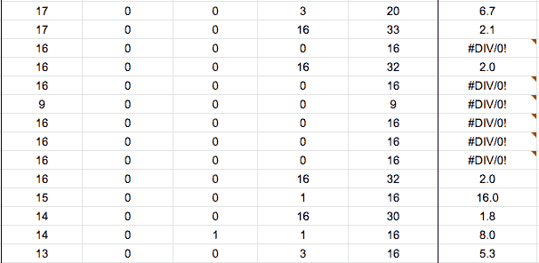
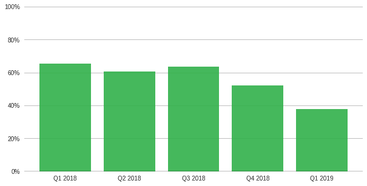
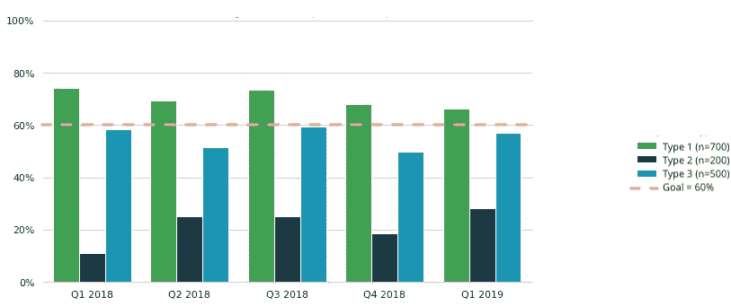

# 4 从向领导层展示指标中吸取的经验教训

> 原文：<https://towardsdatascience.com/4-lessons-learned-from-presenting-metrics-to-leadership-5d2d060a090a?source=collection_archive---------26----------------------->

*促使领导层采取行动*

风险投资公司红杉资本(Sequoia Capital)在他们在媒体上的[数据科学出版物](https://medium.com/sequoia-capital/tagged/sequoia-data-science)中，将数据科学定义为“[一门使用数据提取知识和见解的科学和求真学科](https://medium.com/sequoia-capital/why-data-science-matters-ee583f785a55)。没有定义和跟踪好的度量标准，很难获得有意义的见解。然而，“s [意味着只有统一的标准是不够的。如何使用它也同样重要。它必须由高层领导部署，以确定并告知哪些目标和指标是重要的](https://medium.com/sequoia-capital/the-building-blocks-of-a-data-informed-company-70cc5908143d)。换句话说，指标需要是可操作的。

但是我不想写另一篇关于创建可操作的度量而不是虚荣度量的文章。相反，我打算分享我个人在展示指标方面的进步，让领导层相信数据，并对他们做出基于数据的决策感到放心(甚至自信)。

Photo by [You X Ventures](https://unsplash.com/@youxventures?utm_source=medium&utm_medium=referral) on [Unsplash](https://unsplash.com?utm_source=medium&utm_medium=referral)

为什么要做出基于数据的决策？我们都有自己的偏见，而偏见让我们的直觉不那么值得信任。你的直觉很容易出错，在很多情况下，它并不比随机选择好多少。如果没有能力做出基于数据的决策，我们通常会选择最响亮的(或最具表现力的，或最资深的，或最有经验的，或最顽固的，等等)意见。)房间里的人，这相当于从一顶装满所有潜在决策的帽子里随机抽出一个决策。

以下是我学到的四条重要经验，可以让领导得出有意义的见解，做出基于数据的决策。

**TL；博士**

1.  数字很难；许多数字令人震惊
2.  指标是时间序列数据
3.  没有目标，度量就没有洞察力
4.  没有细节的见解是不可行的

# **第一课——数字很难；很多数字让人应接不暇**

*A snapshot of my initial list of metrics. So many numbers…*

我从每个企业客户的结果列表(当时只有 60 个)这一理论出发，开始了我的度量工作，这是一个很好的起点，可以精确定位有流失风险的客户。当我向产品、客户成功和领导部门的代表展示结果电子表格时，我认为每个人都会快速地对电子表格进行排序和过滤，以评估哪些客户做得“很差”。然而，现实情况是，从来没有人打开过这个电子表格。

我个人认为度量是迷人的，并喜欢思考它们如何代表业务或产品性能。事实证明，大多数人并不认同我的观点。我的同事想听一个容易理解的故事，并指出任何已经发现的缺陷，而一个充满数字的电子表格不能提供这一点。

因此，在我下一次演讲之前，我做了一些调整:

1.  我从电子表格转换到数据可视化来交流结果。
2.  我将尽可能多的指标转换成百分比，使数字更直观。

# **第 2 课-指标是时间序列数据**

*This metric is 80%. Cool story bro.* 🤷

在我的第二个演示中，我升级到了一个在臭名昭著的环形图中显示为整体的一部分的指标。您可以看到上面的指标产生了 80%的值，但是该指标中包含了哪些数据呢？这是否代表了过去的一周、一个月或一年？例如，即使你知道数据覆盖了过去一个月，如果不与其他结果进行比较，一个结果本质上是没有意义的。领导层需要了解指标是如何随着时间的推移而变化的。该指标应随时间绘制，以便了解每日、每周、每月、每季度或每年的变化。

此外，应该尽可能接近实时地呈现数据。如果你计算这些数字，然后在两周后提交给领导层，你的见解很可能已经过时且不相关。自动化数据流和实时仪表板的开发解决了这个问题，但请记住，仪表板的创建非常耗时，并且需要维护以确保数据管道不会中断。

# **第三课——没有目标的衡量标准是没有洞察力的**

*My data visualization displaying the metric’s quarterly change. But no goal…*

现在，我有了一个图表，显示了过去一年各季度指标的变化情况。太好了！但是这些结果是好是坏呢？随着时间的推移，这一比例似乎在下降——我们应该恐慌还是庆祝？

为了从这些结果中获得洞察力，利益相关者需要就该指标的目标达成一致。对于这一指标，我们一致认为目标应该是超过 60%。这意味着我们去年在 Q1、Q2 和第三季度成功实现了目标，但最近几个季度(第四季度和 Q1)的表现远低于我们的目标，需要采取行动。这是一个很好的见解！

# **第四课——没有细节，洞察力是不可行的**

*This chart demonstrates that Type 2 and Type 3 are specifically not meeting the goal to exceed 60%.*

我们现在了解了最近几个季度的指标绩效没有达到目标的事实，但是我们如何知道要采取什么措施来提高整体指标呢？将指标数据分解成类别、存储桶或组有助于确定需要重点改进的特定领域。上面的可视化演示表明，将指标分解为子类型(类型 1、类型 2 和类型 3)揭示了类型 1 每个季度都达到了目标，类型 2 没有达到目标，而类型 3 远低于目标。有了这些额外的细节，领导层就可以将精力集中在某个特定的小组上，以提高整体的指标绩效。

请注意，我还在图例中包含了样本大小，以了解每种类型在总体指标中的权重。

# **结论**

总之，度量是没有用的，除非它们向领导层揭示了当前的不足。为了揭示缺陷，度量标准应该以简单的数据可视化形式显示，显示随时间的变化以及目标是否达到。度量标准应该分成小组，以确定需要改进的具体领域。