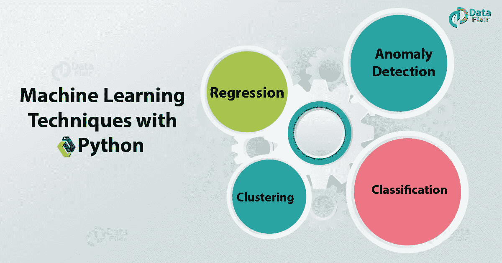
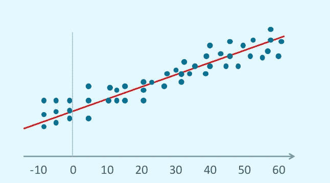
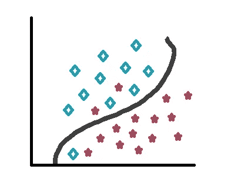
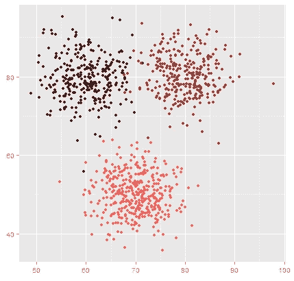

# 使用 Python 的 4 种机器学习技术

> 原文：<https://towardsdatascience.com/4-machine-learning-techniques-with-python-ceee451b0085?source=collection_archive---------4----------------------->

*4 使用 Python 的机器学习技术*

# 机器学习技术与算法

虽然本教程致力于使用 Python 的机器学习技术，但我们很快就会转向算法。但是在我们开始关注技术和算法之前，让我们看看它们是不是一回事。

T2 技术是解决问题的一种方式。这是一个非常通用的术语。但是当我们说我们有一个*算法*时，我们的意思是我们有一个输入，我们希望从它那里得到一定的输出。我们已经清楚地定义了实现这一目标的步骤。我们会不厌其烦地说，一个算法可以利用多种技术来获得输出。

既然我们已经区分了这两者，那就让我们来了解更多关于机器学习的技术。

# 使用 Python 的机器学习技术

Python 机器学习技术有 4 种类型，我们来讨论一下:

# a.机器学习回归

字典会告诉你，倒退就是回到以前的状态——一个通常不太发达的状态。在统计学书籍中，你会发现回归是一个变量的平均值和其他值的对应值如何相互关联的度量。但是让我们谈谈你将如何看待它。

*Python 机器学习技术—机器学习回归*

## 一.回归均值

查尔斯·达尔文的同父异母的表兄弗朗西斯·高尔顿观察了几代人的香豌豆大小。他的结论是，顺其自然会产生一系列的尺寸。但是如果我们有选择地培育大小合适的香豌豆，它会变得更大。随着时间的推移，大自然掌握着方向盘，甚至更大的豌豆也开始产生更小的后代。我们有不同的豌豆大小，但我们可以将这些值映射到特定的直线或曲线。

## 二。另一个例子——猴子和股票

1973 年，普林斯顿大学教授伯顿·马尔基尔在他的书中提出了一个主张。畅销书《漫步华尔街》坚持认为，一只被蒙住眼睛的猴子在选择投资组合时，可以像专家一样出色，向报纸的金融版面投掷飞镖。在这样的选股比赛中，猴子打败了专业人士。但这只是一两次。事件足够多，猴子的表现就会下降；它回归到平均值。

*Python 机器学习技术——猴子和股票*

## 三。什么是机器学习回归？

在该图中，直线最符合由点标记的所有数据。使用这条线，我们可以预测 x=70 的值(有一定程度的不确定性)。

*使用 Python 的机器学习技术——什么是机器学习回归*

作为一种机器学习技术，回归在监督学习中找到了基础。我们用它来预测一个连续的数字目标，并从我们已经知道的数据集值开始工作。它比较已知值和预测值，并将预期值和预测值之间的差异标记为误差/残差。

## 四。机器学习中的回归类型

我们通常观察到两种回归-

*   线性回归-当我们可以用直线表示目标和预测值之间的关系时，我们使用线性回归-

*y=P1x+P2+e*

*   非线性回归——当我们观察到目标和预测值之间的非线性关系时，我们不能将其表示为直线。

# b.机器学习分类

## 一、什么是机器学习分类？

分类是一种[数据挖掘](https://data-flair.training/blogs/data-mining/)技术，让我们预测数据实例的组成员。这使用预先标记的数据，属于监督学习。这意味着我们训练数据，并期望预测它的未来。“预测”是指我们将数据分类到它们所属的类别中。我们有两种属性-

*   输出属性-又名依赖属性。
*   输入属性-又名独立属性。

## 二。分类方法

*   决策树归纳——我们从标记为[元组](https://data-flair.training/blogs/python-tuples-syntax-examples/)的类中构建一棵决策树。它有内部节点、分支和叶节点。内部节点表示对属性的测试，分支表示测试结果，叶节点表示类标签。涉及到的两个步骤是学习和测试，这些都很快。
*   基于规则的分类——这种分类基于一组 IF-THEN 规则。规则表示为-

如果条件，则结论

*   通过反向传播进行分类-神经网络学习，通常称为连接主义学习，建立连接。反向传播是一种神经网络学习算法，是最流行的算法之一。它反复处理数据，并将目标值与要学习的结果进行比较。
*   懒惰学习者-在懒惰学习者方法中，机器存储训练元组并等待测试元组。这支持增量学习。这与早期学习者的方法形成对比。

## 三。ML 分类示例

我们举个例子。想想我们在这里教你不同种类的代码。我们向您展示 ITF 条形码、Code 93 条形码、QR 码、Aztecs 和数据矩阵等。一旦完成了大部分的例子，现在轮到你来识别我们展示给你的代码的种类了。这是监督学习，我们使用两者的部分例子——训练和测试。注意每种类型的一些恒星是如何在曲线的另一边结束的。

*使用 Python 的机器学习技术— ML 分类示例*

# c.使聚集

聚类是一种无监督的分类。这是一个探索性的数据分析，没有可用的标记数据。通过聚类，我们将未标记的数据分成有限且离散的数据结构集，这些数据结构集是自然且隐藏的。我们观察到两种聚集现象

*   硬集群——一个对象属于一个集群。
*   软聚类——一个对象可能属于多个聚类。

在聚类中，我们首先选择特征，然后设计聚类算法，然后验证聚类。最后，我们解释了结果。
a .示例
回想一下 b.iii 节中的示例。您可以将这些代码组合在一起。二维码，阿兹特克，和数据矩阵将在一组，我们可以称之为 2D 代码。ITF 条形码和 Code 39 条形码将归入“1D 代码”类别。这是星团的样子-

*使用 Python 的机器学习技术——聚类*

# d.异常检测

异常是偏离其预期路线的东西。有了机器学习，有时，我们可能想要找出一个离群值。一个这样的例子是检测牙医每小时 85 次补牙的账单。这相当于每个病人 42 秒。另一种方法是只在周四找到特定的牙医账单。这种情况会引起怀疑，异常检测是突出这些异常的好方法，因为这不是我们要特别寻找的东西。

所以，这都是关于 Python 的机器学习技术。希望你喜欢我们的解释。

# 结论

因此，在本教程中，我们学习了 Python 的四种机器学习技术——回归、分类、聚类和异常检测。此外，如果您有任何疑问，请随时在评论框中提问。

你也可以参考-

*   [Python ML —应用](https://data-flair.training/blogs/applications-of-machine-learning/)
*   [Python ML —算法](https://data-flair.training/blogs/machine-learning-algorithms-in-python/)