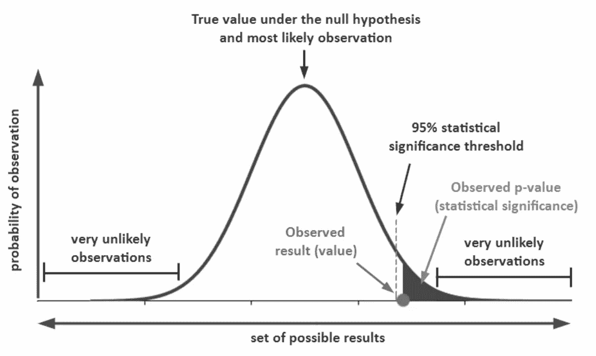

# 我在用 Firebase 远程配置运行 A/B 测试时犯的 4 个错误

> 原文：<https://towardsdatascience.com/4-mistakes-that-i-made-while-running-a-b-tests-with-firebase-remote-config-f7b17f18b34a?source=collection_archive---------6----------------------->

大约一年半以前，我学习了 Firebase 远程配置和实验，并开始在我当前的产品 CricPlay 中使用它，一旦我们达到了有意义的 A/B 测试的适当规模。Firebase 提供了一个健壮的低成本(免费使用，但开发人员需要花费一些时间来设计远程配置的应用程序)框架，以在实际用户的生产应用程序中测试您的假设。根据代码定制的级别，它可以处理相当简单(CTA 颜色、复制)到复杂(备选业务逻辑)的用例。

十几次实验之后，我列出了我的一些错误(这样你就不会犯这些错误了)。

这篇文章假设一个初学者到中级平台的理解。如果你刚刚开始使用 Firebase 进行 A/B 测试，你应该浏览这个视频系列来开始:[https://www.youtube.com/playlist?list = PLl-k 7 zzesylnt 1-3 lfiy 89 ytafqzlzo-O](https://www.youtube.com/playlist?list=PLl-K7zZEsYLnt1-3lFiY89YtAFQzLZo-O)

# 1.目标不正确

Firebase 是一个移动应用套件。处理新的配置值需要对应用程序进行更改。如果您重新设计了应用程序商店屏幕，以便从远程配置中读取购买按钮的颜色，则需要更新应用程序。当运行一个实验时，重要的是只针对那些实际处理被测试的配置值的应用程序版本。这很重要，因为在总共 100 个用户中，可能只有 20 个更新到了最新版本。

在 20 个用户的基础上可能具有统计显著性的%改善(或恶化)对于更大的基础可能显得无关紧要。

统计显著性表示 2 个变异体(或更多)的转化率之间的差异不是由于随机机会而出现的可能性。在 A/B 测试中，我们执行的是零假设测试。零假设表明变化对转化率没有影响。除非有证据表明事实并非如此，否则它被认为是真实的。如果一个结果不能用零假设来解释，并且需要另一个假设，那么这个结果就具有统计学意义。

在上面的例子中，替代假设适用于 20 个用户，但是零假设适用于其他 80 个用户——配置值的变化对以前的版本没有影响。

此外，如果新更新的采用速度较慢，则实验需要运行更长时间，以便获得足够大的样本来代表总体基础。更重要的是，快速更新到最新版本的现有用户可能会表现出与一两周后更新的用户略有不同的行为。

除了应用程序版本，Firebase 还支持其他几个目标标准。用户可以通过受众细分、属性、地理和语言来定位。如果设计了一个实验来优化多语言应用程序的英文行动号召，它必须针对设备语言设置为英语的用户。

要了解所有可用的瞄准功能，请参考[文档](https://firebase.google.com/docs/ab-testing/abtest-config#user_targeting)。

# 2.不使用激活事件

激活事件是针对实验的正确部分的扩展。考虑一个旨在优化游戏入门体验的实验，以便让更多用户参与游戏(通过事件“游戏性”捕获)。为了获得有意义的见解，实验应该仅限于新用户。设置激活事件有助于这一点。

与目标定位不同，它不会在采样时过滤用户。在测试样本中，测试变量既提供给新用户，也提供给现有用户。然而，将“注册”设置为激活事件确保了只有新用户(执行“注册”事件的用户)被分析用于实验。
不设置激活事件会稀释结果，因为现有用户也会触发“游戏性”事件。

# 3.仅依靠 Firebase Analytics 来分析结果

Firebase 控制台提供了许多关于正在运行的实验的见解:关于实验状态的摘要，对主要目标事件以及其他实验目标的影响的概述，以及对每个变体相对于任何目标的性能的详细理解。

对于大多数简单的实验(UI 更改，添加新功能)，仅控制台结果就足以验证假设并推出最佳变体。但是，复杂的问题可能需要额外的分析，而 Firebase 控制台可能无法做到这一点。

其中一个实验是为了了解“欢迎奖金”对游戏经济的影响。欢迎奖金使用户能够在注册时获得一些虚拟货币，以体验“高级”功能。对虚拟货币的高需求通过 IAP 和奖励广告推动了货币化。因此，受欢迎的奖金应该会在短期内减少新用户的收入，目的是让更多的用户迷上优质功能，以促进长期的货币化。

在 Firebase 控制台中，很难分析一个在游戏中到处都是水龙头和水槽的经济体，尤其是在事件模式设计得不太好的情况下。

这个问题有两个解决方案:

## 使用 BigQuery 进行分析

通过将 BigQuery 链接到 Firebase，可以访问所有与 A/B 测试相关的分析数据。对于每个变体，Firebase 都添加了一个用户属性 *firebase_exp_ <实验号>* ，值为 *<变体索引>* ，可以用来跟踪在 BigQuery 中暴露给每个变体的用户。

## 将实验数据传递到其他分析平台/您的数据库

这可以通过创建一个虚拟配置值来实现(比如说 *firebaseExperimentId* )。默认值是一个空字符串。应用程序被配置为如果为空则忽略该值，并在用户配置文件更新时传递非空值。在配置实验变量时，这个虚拟值用于将变量信息传递给应用程序。

这个用户配置文件值可用于创建漏斗、分析屏幕流以及在分析工具(在我的例子中是 CleverTap)中为变量执行高级分段。它有助于利用您的高级分析工具的功能(相对于免费的 Firebase analytics)。

作为扩展，这个虚拟值也可以用于实现服务器端实验。应用程序将该值作为 API 头传递。API 可以根据远程配置值提供备选业务逻辑。

# 4.管理重新安装和多个设备

这也是 Firebase 实验的局限性之一。如果您的应用程序有很多重新安装和/或用户从多个设备访问同一个帐户，那么同一个用户可能会接触到一个实验的两个测试变量。A/B 测试使用 Firebase SDK 生成的实例 ID 来识别唯一的设备/用户。如果用户卸载应用程序并再次安装，SDK 将生成一个新的实例 ID，因此将该用户视为新用户。如果同一用户在不同的设备上登录应用程序，也是如此。

同样，对于大多数简单的实验，如 UI 优化或测试新功能，这并不重要。然而，对于复杂的任务，比如测试可选的业务逻辑，它可能会影响结果，或者更糟的是会让一些用户感到困惑。特别是在像印度这样的市场，很高的重新安装率是很常见的。

解决方案是要么切换到另一个 A/B 测试解决方案，要么构建一个相同的定制实现。两者都有其局限性——添加另一个工具并传递所有事件以执行有意义的分析的成本，与开发统计模型以对用户进行采样并分析实验结果的成本。

也可以有一条中间道路(我选择了这条道路)。它需要在应用程序的后端创建远程配置值和实验的副本，并通过 API 公开它们。这可以用来针对登录用户“锁定”远程配置值，即使 Firebase 在稍后阶段(重新安装后或从另一个设备访问)为同一用户提供了不同的值。当实验结束，获胜者被推出时，建立一个解锁机制是很重要的。

重要的是要注意，根据重新安装或多个设备的百分比，这可能会导致 Firebase 控制台上的实验结果出现显著差异。Firebase 不知道应用程序正在覆盖这些用户的远程配置值。因此，需要在 BigQuery 或其他分析工具中通过传递被覆盖的配置值来分析结果。

不是最佳的解决方案，但是有效！如果您正在管理一个分析平台，请将此视为一个功能请求。

你从 Firebase 实验或 A/B 测试中学到了什么？请在评论中告诉我。