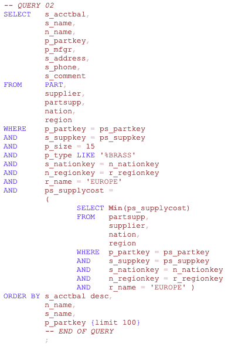
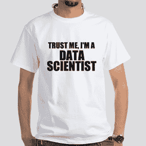

# 2020 年作为首席信息官要避免的 4 个错误

> 原文：<https://towardsdatascience.com/4-mistakes-to-avoid-as-a-cio-in-2020-c804190eddfc?source=collection_archive---------45----------------------->

## 您是否在考虑迁移到云、实现定制应用的现代化以及投资数据科学计划？

作者:蒙特·兹韦本，赛义德·马哈茂德

首席信息官们正在最终确定他们 2020 年的战略计划，这些计划不可避免地涉及到向云迁移、定制应用的现代化以及对数据科学计划的投资，这里列出了在这一过程中需要避免的失误。

1.  没有明确的计划，不要迁移到云。

Cloud migrations can be disappointing

作为一名首席信息官，如果您没有迁移到云的计划，您可能会感到错失良机。毕竟，云是未来的潮流，它承诺企业可以更快地将其应用程序上线，而不必担心建设数据中心的资本支出。通过迁移到云，您的组织还将能够灵活地调整他们消耗的计算资源，包括按需和独立调整，因为云架构允许存储和计算分离。这是双赢，对吗？。不完全是这样，这取决于您通过将基础架构迁移到云来实现的目标。

首先，要意识到一旦你迁移到了云端，计价器就会一直运转。冲向云的公司完成了项目的第一阶段，并意识到他们的运营费用增加了，因为人工操作员的节省被通常在线的应用程序的云计算资源的成本超过了。过去在内部部署时会被资本化的资源现在会进入云中的 P&L。通常这个数字要高得多。

这让我们想到了您的组织试图通过迁移到云来实现的目标。如果您的目标是通过整合新的数据源(如传感器、物联网设备和社交媒体)或向其中注入人工智能和机器学习来丰富您的任务关键型应用程序，那么仅仅迁移到云是不够的。这是因为集成各种技术以构建统一平台的重担仍然落在 IT 部门的肩上。在这种情况下，构建一个集成的横向扩展基础架构(可以利用不同的数据源并在云中使用机器学习(ML)做出智能决策)所需的工作与在内部构建基础架构没有明显的不同。换句话说，简单地将您的基础设施迁移到云中不会使您的遗留应用程序变得敏捷、可伸缩和智能。云是获得敏捷性的一个很好的举措——但还不足以获得一个更好的可以利用数据和使用 ML 的应用程序。

**2。不要从头开始重写您的遗留应用程序。**

Rewriting applications is unnecessarily destructive

您面临着来自企业的压力，要求您对一些任务关键型应用程序进行现代化。根据您所在的行业，这些应用可能是核保或欺诈检测、需求规划或预防性维护。这些曾经是公司皇冠上的宝石的应用程序现在已经成为“遗产”它们变得缓慢是因为需要处理的数据量急剧增加。此外，它们从未被设计为对正在成为规范的多样化和非结构化数据进行操作，包括从传感器、物联网设备和社交媒体生成的数据。最重要的是，在线交易的数量和速度要求这些应用程序是智能的，并在没有人工干预的情况下实时采取智能行动。

毫无疑问，考虑到业务对敏捷性、可伸缩性和智能性的要求，您认为除了在现代平台上完全重写这些应用程序之外别无选择。如果你采取这种行动，你就部分正确了。是的，您确实需要在一个平台上重新构建这些应用程序，该平台可以随着数据量的增长而横向扩展，能够存储和分析各种数据，并可以将人工智能注入到应用程序中，但您不必重写应用程序本身。在这种情况下，一个恰当的类比是旧金山的维多利亚时代的老房子，它们对所有者的价值与遗留应用程序对企业的价值相同。为了保护这些房屋免受地震，他们必须根据最新的建筑技术进行改造，包括提升房屋并用螺栓将其固定在地基上。通过这样做，土木工程和建筑公司保存了房屋的建筑外观和历史，同时保护它免受地震破坏。

A database migration can be as effective as an earthquake retrofit

同样，通过保持应用程序完好无损并将其置于现代基础之上，您将保留熟悉的界面和业务逻辑，这是您公司的秘密武器，同时适应大数据的数量和多样性，并通过人工智能和机器学习使应用程序变得智能。通过采用这种方法，您还可以使您的组织免于着手一个昂贵、冗长且有风险的项目。

**3。不要为了 NoSQL 数据库而放弃 SQL 应用程序。**

The power of SQL is clear as NoSQL systems rush to put in SQL layers

许多首席信息官已经考虑使用 HBase、Cassandra、Dynamo 和 MongoDB 等 NoSQL 数据库构建他们的下一代运营应用程序。这种方法的主要理由是现代应用程序必须管理的数据的数量、多样性和速度。DB2、Oracle、SQL Server、Postgres、MySQL 等传统 SQL 数据库在 web 应用程序、物联网设备和传感器生成数据的环境中苦苦挣扎。这些数据库没有提供扩展或存储半结构化或非结构化数据的实用方法。

但是，您应该认识到，当用 NoSQL 数据库替换后端 SQL 数据库来更新应用程序时，您可能会招致巨大的风险和项目范围的扩大。NoSQL 数据库缺乏完整的 SQL 支持，这使得大量的应用程序代码需要重写。此外，找到具备所需 NoSQL 专业知识的开发人员比大量已经精通 SQL 的开发人员要难得多。另一个增加 NoSQL 数据库平台迁移风险的因素是数据模型经常需要完全重新设计。修改后的数据模型会导致显著的数据反规范化和重复，这需要公司编写大量的新代码来确保重复的数据在其所有定义中保持一致。最后，NoSQL 数据库的性能可能无法与传统数据库相媲美。NoSQL 系统通常擅长短期运行的操作查询，但是它们在分析查询上的性能通常很差，不能满足应用程序的需求。

出于上述考虑，如果您正在考虑在 NoSQL 数据库上移植一个遗留应用程序，请考虑市场上现有的一些横向扩展的分布式 SQL 平台。这些平台提供了 NoSQL 数据库的好处，但不存在上面讨论的问题。

**4。不要将数据科学归为幕后活动。**

Break the silos on projects and include the business

数据科学是数学家和统计学家的领域，他们构建了凡人难以理解的复杂算法。数据科学家目前花费大量时间等待数据工程师从大量内部和外部数据源获取数据。然后，数据科学团队会经历一个严格的实验阶段，创建可能包含预测信号的功能集，并对这些功能进行分析。这种培训和测试工作流程**冗长而复杂，需要跟踪应用程序来帮助数据科学家组织和审核他们的实验。一旦模型被构建和训练，它就被移交给一个应用程序开发团队，以注入到一个应用程序中，并将其投入生产。这就是问题所在，组织目前有一个“数据科学团队”、“数据工程团队”和“应用程序开发团队”，但每个团队本身都没有准备好完成从定义业务需求到将应用程序部署到生产中的工作。数据科学、数据工程和应用程序开发团队根本没有足够深入的业务知识。数据科学是一项团队运动，需要来自数据科学家、数据工程师和应用程序开发人员的代表，与了解业务流程的人员并肩工作，构建能够交付切实业务成果的智能应用程序。**

如果将人工智能和机器学习作为任务关键型应用程序的一部分进行操作是您的首要任务，那么您必须打破组织孤岛，建立由数据工程师、应用程序开发人员、数据科学家和主题专家组成的多学科团队，以构建能够推动业务发展的应用程序。

要了解有关如何在 2020 年实现业务转型的更多信息，请下载我们关于应用现代化的白皮书以及 it 在数字化转型中的重要作用。