# 4 个参数查询功能，使您的数据可视化互动

> 原文：<https://towardsdatascience.com/4-parameter-query-functions-to-make-your-data-visualization-interactive-bbd84dd6bafb?source=collection_archive---------16----------------------->

## 在[数据可视化](http://www.finereport.com/en/features/data-visualization?utm_source=medium&utm_medium=media&utm_campaign=blog&utm_term=4%20Parameter%20Query%20Functions%20to%20Make%20your%20Data%20Visualization%20Interactive)中，除了可视化的呈现，还有一个核心要素就是人机交互。

对于高维多元数据可视化系统，交互是必不可少的元素之一。这体现在两个方面。一是高维多元数据导致的数据过载，使得有限的可视化空间无法呈现所有数据，也难以表达高维复杂结构。所以需要交互技术来弥补。第二，交互是操作者与操作界面之间的交流，用户可以有选择地获取自己想要的信息。对用户理解数据，发现模式很有帮助。

比如想查看每个月的销售额，一般的方法是每个月做一个报表，然后放在一起对比。但是查找和对比数据很麻烦，很容易出错。如果使用交互式可视化，可以使用过滤功能随意查询数据，非常方便。

但是我们如何在图表或仪表板中实现可视化交互呢？这时，我们需要使用**参数查询**。接下来我给大家介绍四个基本的参数查询功能以及它们可以适用的交互场景。

(注:本文所有图表均采用 [FineReport](http://www.finereport.com/en/?utm_source=medium&utm_medium=media&utm_campaign=blog&utm_term=4%20Parameter%20Query%20Functions%20to%20Make%20your%20Data%20Visualization%20Interactive) 制作，个人[下载](http://www.finereport.com/en/download-2?utm_source=medium&utm_medium=media&utm_campaign=blog&utm_term=4%20Parameter%20Query%20Functions%20to%20Make%20your%20Data%20Visualization%20Interactive)完全免费。这个[可视化工具](http://www.finereport.com/en/data-visualization/data-visualization-31-tools-that-you-need-know.html?utm_source=medium&utm_medium=media&utm_campaign=blog&utm_term=4%20Parameter%20Query%20Functions%20to%20Make%20your%20Data%20Visualization%20Interactive)本身就有很多参数查询功能，不需要写代码。所以我用 FineReport 创建了一些图表，向大家展示如何用参数查询实现交互可视化。)

# **1。参数过滤**

它是交互式可视化的基本功能，即可以根据不同的条件过滤不同的数据。

例如，在下面的存货核算表中，在点击该报表中的“查询”按钮之前，系统会根据参数的默认值检查并显示数据。在此报告中，仓库复选框的默认选择是仓库 1 和仓库 3。我们可以自由选择时间段和仓库来查询我们想要的数据，也就是多值查询。

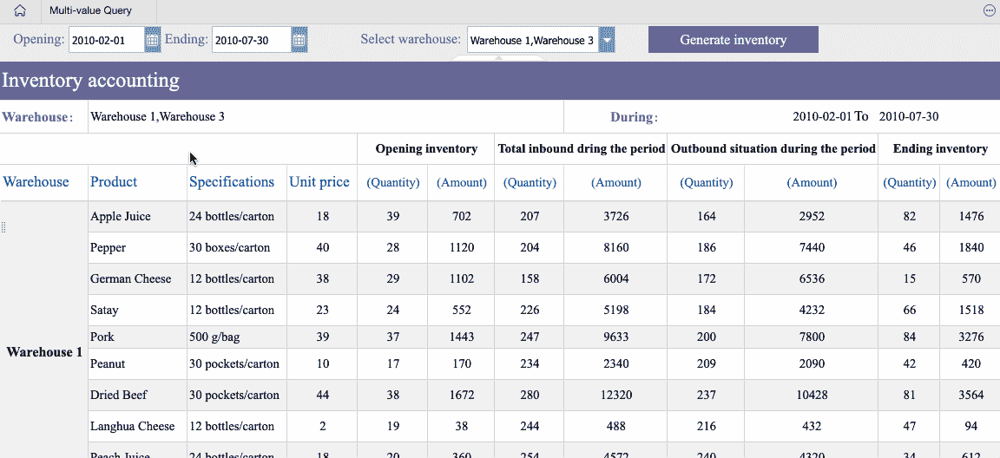

当然，在使用参数过滤时，也可以将表格改为图表。

在下面的图表中，您可以很容易地查询任何月份和年份的每个客户的销售额、每个雇员的销售额或每个销售人员的销售额。

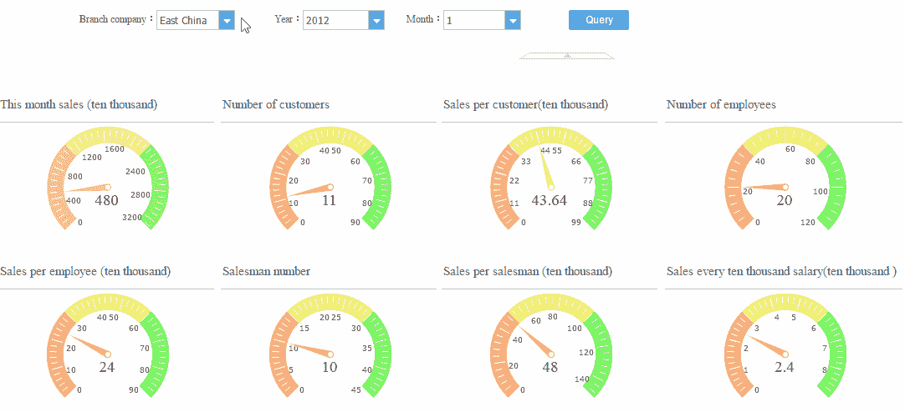

又如，通过下图所示的交互式图表设计，管理人员可以及时了解每个分公司每月的人员变动情况。可见参数过滤在交互式可视化中的应用非常广泛。

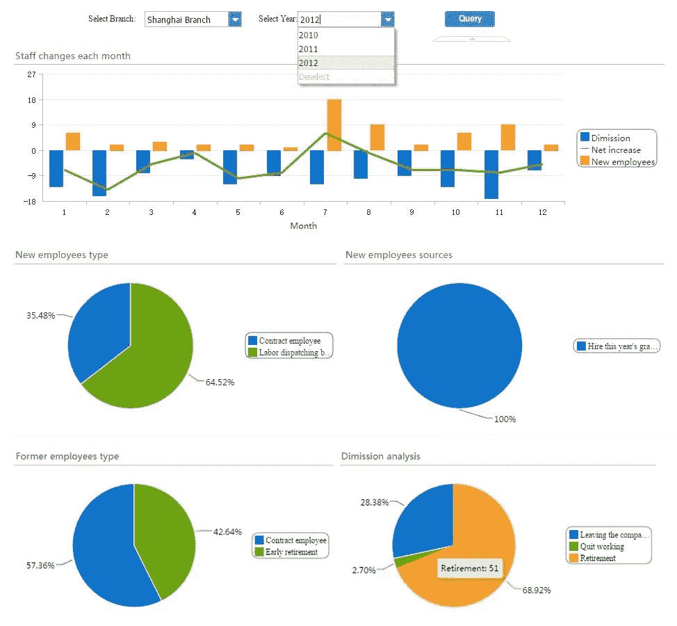

# **2。参数联动**

链接两个或多个组件，实现数据之间的自动关联，即关联图表。

如下图，左上角的图表显示了不同销售区域的分店数量和利润贡献率。使用图表链接功能，当您单击第一个柱形图中的一个区域时，接下来的三个图表将显示所选区域的客户订单帐户、订单历史记录和季度订单预测。

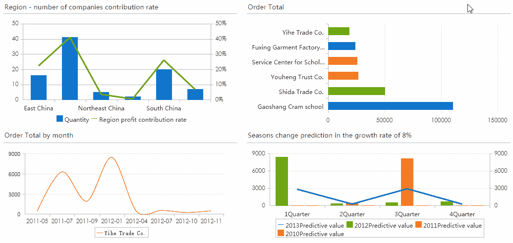

下面是 10 大销售人员的数据分析报告。

很抱歉，我写的一些报告是中文的。我给你简单解释一下。只看参数联动的效果。

单击第一个直方图中的任何销售人员姓名，以及订单金额、销售额、客户质量等。会自动与员工的数据相关联。

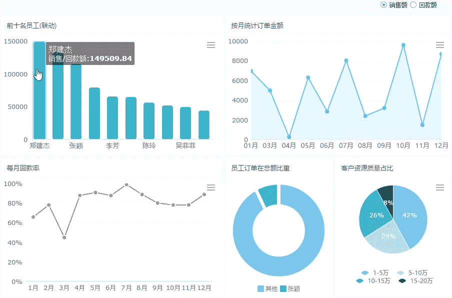

此外，参数联动还可以用于产品分析报表、现金流量表等多种场景。

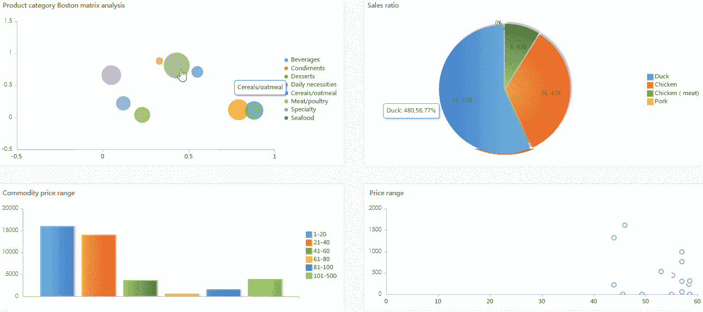

# **3。下钻联动**

这是动态图表的一个共同特点，主要是实现数据在无限多个图层上的扩展，查询更高维度的明细数据。

简单的钻孔功能如下图所示。在此图中，我们钻取从国家到省以及从省到市的销售。我们还可以根据右边的滑块过滤数据。

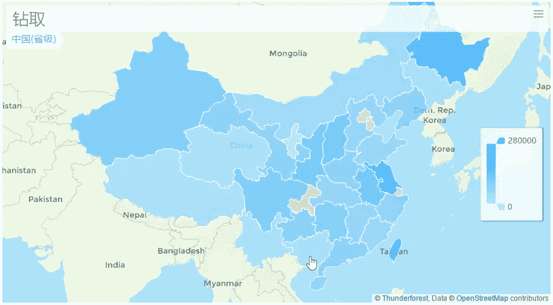

现在我们在地图下钻的基础上增加联动功能。只需点击左侧的一个区域，该区域的详细表格和图表数据就会显示在右侧。地图目录链接到相应的级别。

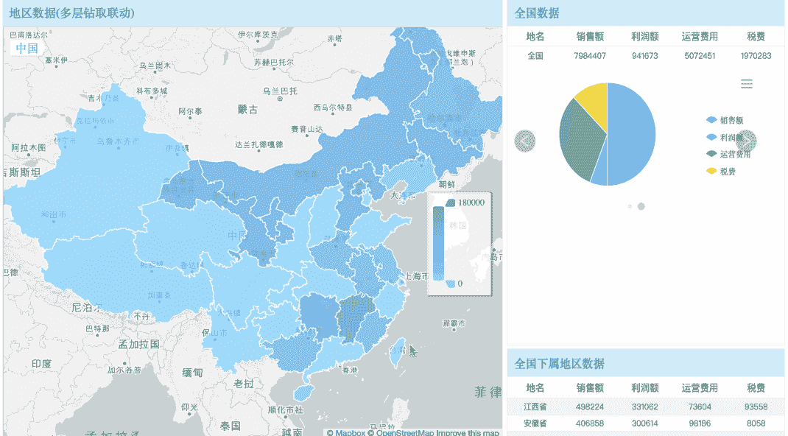

下钻联动也广泛应用于交互式可视化，常见于旅游信息展示、商场财务分析等。

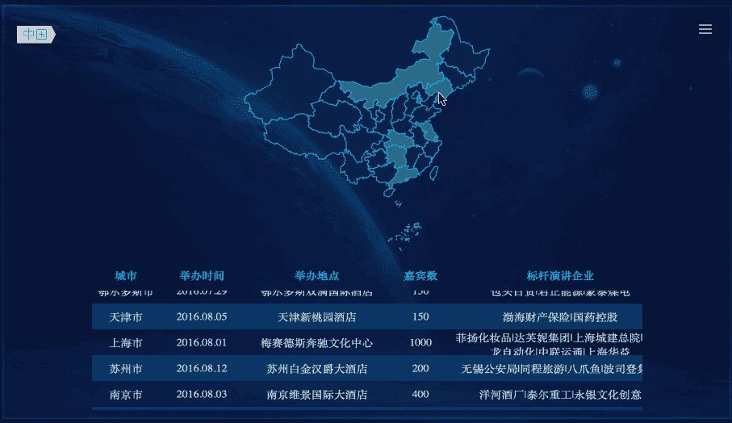

Tour Information Display

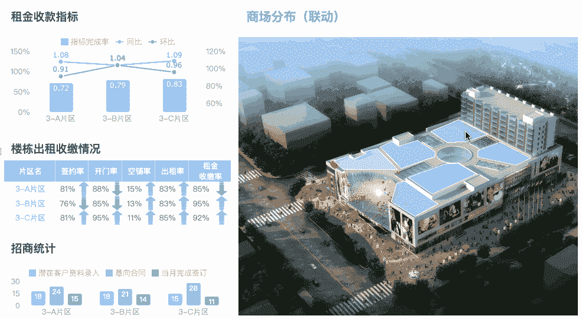

Analysis of Comprehensive Indicators of Shopping Malls

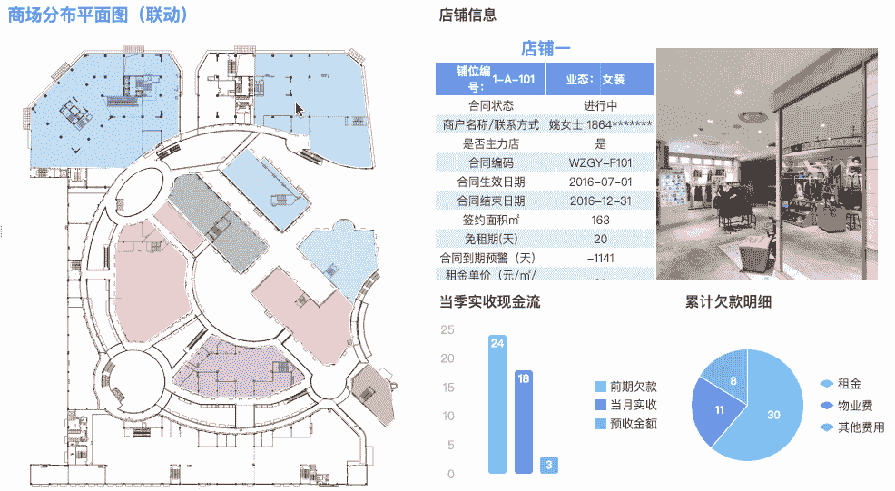

Analysis of the Financial Management of Stores

# **4。参数面板的动态显示**

在很多情况下，当我们使用参数查询功能时，某些查询条件只有在满足一定要求的情况下才会显示出来。例如，在下面的报告中，当您在该报告中选择“按天”时，它将显示“开始日期”和“结束日期”。如果选择“按月”，将隐藏日期控件，显示“年”和“月”。如果选择“按年”，只会显示“年”。

那么，通过这篇文章，你学会了一些**交互可视化**的技巧了吗？请记住，让您的表格或图表动态化并在不同的图表之间创建关系是非常重要的。

# 您可能也会对…感兴趣

[制作销售仪表板的分步指南](/a-step-by-step-guide-to-making-sales-dashboards-34c999cfc28b)

[数据可视化中的 16 大图表类型](/top-16-types-of-chart-in-data-visualization-196a76b54b62)

初学者如何设计酷的数据可视化？