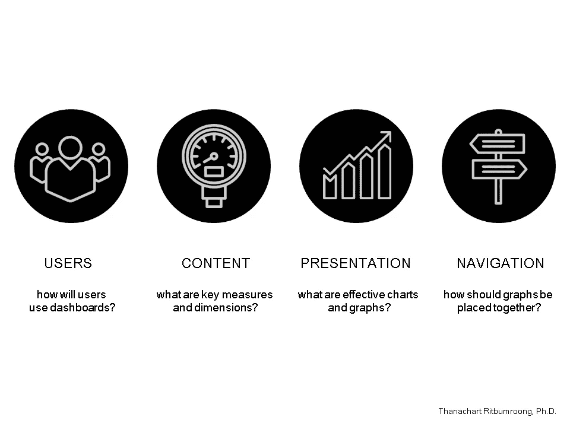
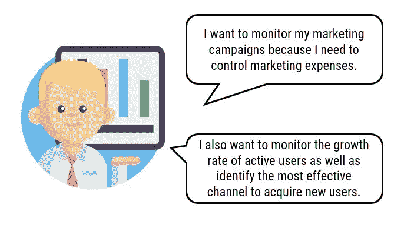
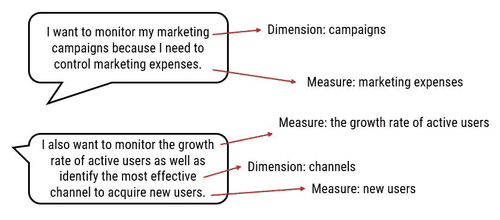
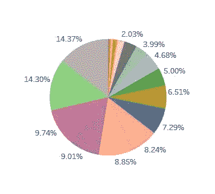
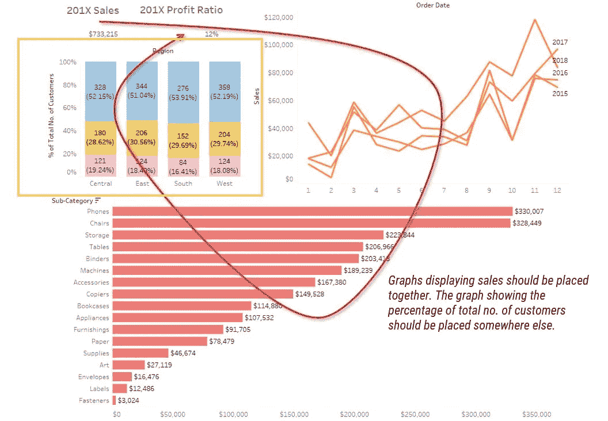

# 仪表板设计的 4 个原则

> 原文：<https://towardsdatascience.com/4-principles-of-dashboard-design-8ad4387c305a?source=collection_archive---------31----------------------->

设计仪表板似乎是一件容易的事情。通常，它将从将数据导入可视化工具开始。然后，将挑选出精美的图表，看看它们是否与数据相符。经过几分钟的反复试验，我们希望我们能从随机选择的图形中得到启发。不，你不会得到你想要的洞察力。

从我的观察来看，如果你不知道想象什么，你最终将从你的仪表板上什么也得不到。这意味着您需要首先从数据中提取洞察力。构建仪表板是数据分析的最后一个阶段。

如前所述，构建一个好的仪表板是一个将数据扔进可视化工具并希望魔法出现的过程。

这是我构建一个好的仪表板的框架。

# 1)用户

首先，你需要了解你的用户是谁。为了深入了解用户的真正需求，我们将应用设计思维的概念。设计思维的关键概念是理解用户的需求和洞察力。设计思维鼓励我们超越用户需要什么，进入用户为什么需要它。

我们需要深入了解用户或者“为什么”这个问题。那么，用户为什么需要仪表盘呢？

我对此的回答是，他们希望使用仪表板来执行某个操作；例如，做出决策、监控业务绩效等等。

你的工作是了解用户将如何使用仪表板。一旦你真正理解了它们，你就会更好地知道仪表盘上应该显示什么。

Icons made by [Freepik](https://www.freepik.com/) from [www.flaticon.com](https://www.flaticon.com/) is licensed by [Creative Commons BY 3.0](http://creativecommons.org/licenses/by/3.0/)

# 2)内容

您需要确定哪些度量和维度最能支持您的用户。度量和维度是我们希望向您的用户显示的内容，以便他们发现问题、确定问题的原因并采取措施解决问题。

**度量**是您想要分析的关键数字。

**维度**是分类字段，用于将度量值分解成更小的细节。

应该选择一些措施来方便用户处理信息。我发现许多仪表板要求用户计算总数的百分比、比率或总计。如果用户显然需要这些信息，应该在仪表板上显示出来。

# 3)演示

清楚地定义了所有重要的度量和维度后，选择正确的图表类型至关重要。根据我的观察，图表是根据熟悉程度来选择的。应根据数据类型选择图表。例如，折线图适用于呈现时间序列数据。

饼图被认为是无效的可视化差异，尤其是当差异是微不足道的。此外，饼图不应有超过 5 个切片，因为。阅读和理解会很困难。

# 4)导航

最后，将图形和图表结合在一起创建一个仪表板涉及到位置和定位。具有相同数据集或相似主题的图表应放在一起。仪表板不应该要求用户在图表之间来回跳转。

此外，图表应该基于它们的视觉层次来定位。显示概览数据的图表应位于顶部。详细信息通常显示在下面的区域。

良好的导航将允许用户从仪表板中提供的图表构建一个故事。

这一原则提供了作为仪表板设计基础的主要组件，旨在帮助将仪表板用于实际操作。它强调需要了解开发 dashboard 的整个过程，从使用用户移情技术了解真实用户的需求，到选择和放置具有正确组合的图表。