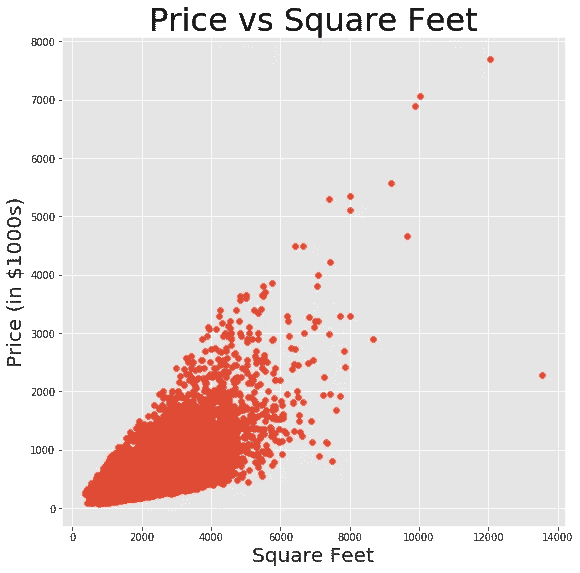
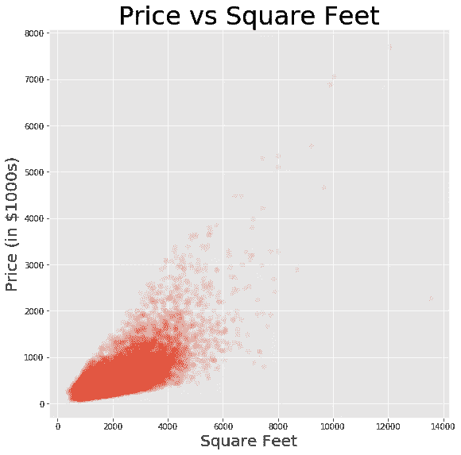
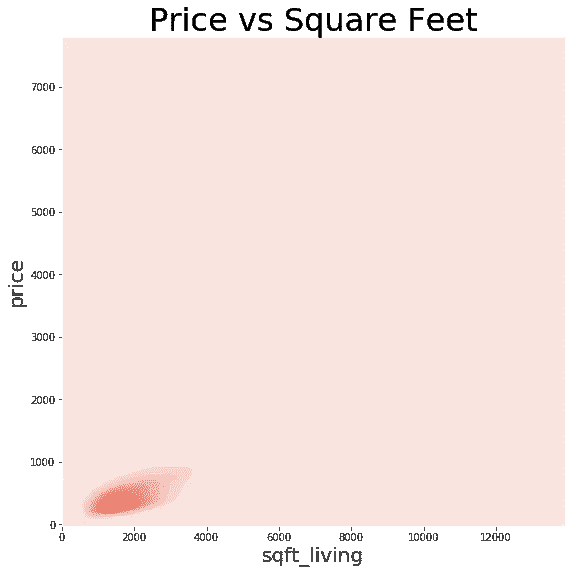
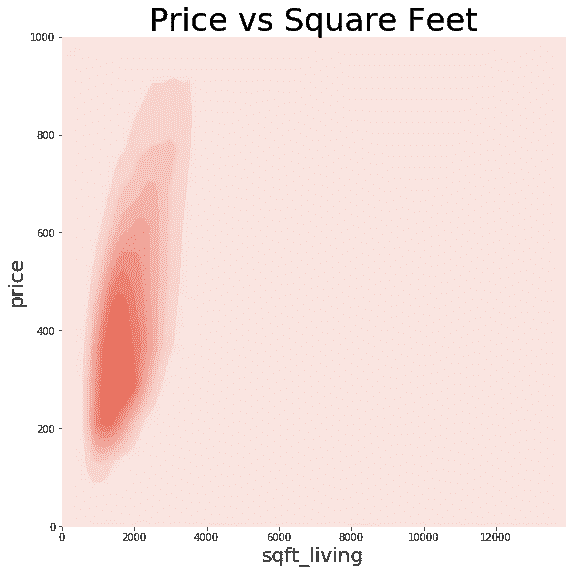
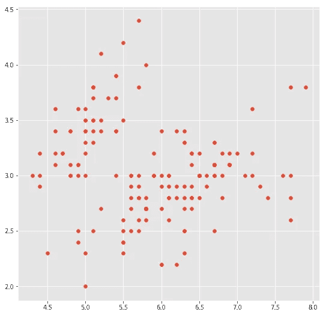
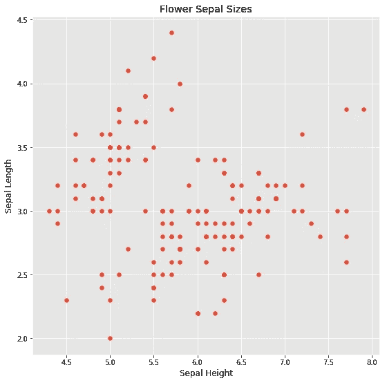
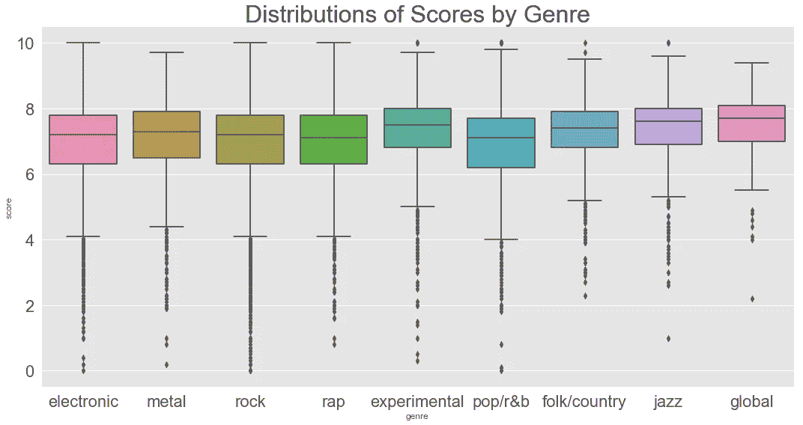
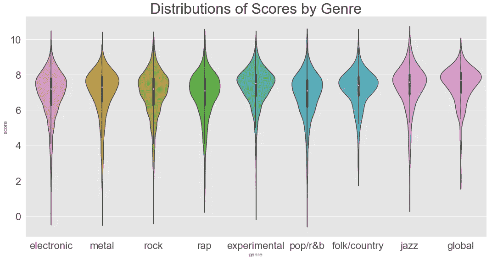

# 更好的数据可视化的 4 个快速技巧

> 原文：<https://towardsdatascience.com/4-quick-tips-for-better-data-visualization-abac05b842f8?source=collection_archive---------36----------------------->

数据可视化是任何数据科学家工具箱中最重要的技巧之一。我们的大脑是视觉化的:当我们把数据视觉化时，我们让它更容易消化——对我们自己，对决策者和利益相关者都是如此。因此，它是 EDA(探索性数据分析)和演示的重要工具。

这里有 4 个快速简单的技巧来提高数据可视化。

# 1.使用 KDE 图进行密度检查

这是 Seaborn 的一个被大大低估的特性。KDE 代表核密度估计，而 KDE 图相当独立地解决了无法看到密集散点图的问题。考虑这个例子，有一个华盛顿州金县房价的数据集…

```
plt.figure(figsize=(9, 9))
plt.title("Price vs Square Feet", fontsize=32)
plt.xlabel("Square Feet", fontsize=20)
plt.ylabel("Price (in $1000s)", fontsize=20)
plt.scatter(df["sqft_living"], df["price"]/1000);
```



正如你所看到的，100 万到 200 万美元的购房者几乎和下图一样多——但是直觉上，很明显，我们知道这不是真的。对于这种情况，通常的权宜之计是应用 alpha 透明度——它有时会起作用——但它在这里对我们没有太大帮助。

```
plt.figure(figsize=(9, 9))
plt.title("Price vs Square Feet", fontsize=32)
plt.xlabel("Square Feet", fontsize=20)
plt.ylabel("Price (in $1000s)", fontsize=20)
plt.scatter(df["sqft_living"], df["price"]/1000, alpha=0.1);
```



我们的数据现在很难看到，但至少我们可以更好地告诉它的密度。100 万到 200 万美元的买家似乎不再那么多了，但 100 万美元左右的买家似乎和其他价位的买家一样普遍。但是再一次，KDE 的阴谋独自解决了这个问题。

```
plt.figure(figsize=(9, 9))
plt.title("Price vs Square Feet", fontsize=32)
plt.xlabel("Square Feet", fontsize=20)
plt.ylabel("Price (in $1000s)", fontsize=20)
sns.kdeplot(df["sqft_living"], df["price"]/1000, shade=True);
```



通过绘制一系列颜色梯度而不是所有单个数据点，KDE 图向我们展示了数据的*密度估计*。现在，我们终于可以看到我们一直以来都知道的事实:绝大多数买家购买的是 2000 平方英尺以下的房屋。英尺和 50 万美元。在我们没有预先了解我们的数据的情况下，这种洞察力将是无价的，也是非常容易被忽略的。现在，如果我们通过在代码中添加`plt.ylim(1000)`来放大…

```
plt.figure(figsize=(9, 9))
plt.title("Price vs Square Feet", fontsize=32)
plt.ylim(1000)
plt.xlabel("Square Feet", fontsize=20)
plt.ylabel("Price (in $1000s)", fontsize=20)# Setting the ylim oddly flips the axis upside down 
# in this case, so we have to flip it back. 
ax = sns.kdeplot(df["sqft_living"], df["price"]/1000, shade=True)
ax.invert_yaxis();
```



经过所有这些变化，我们现在能够更清楚地了解数据内部的情况。

# **2。给你的坐标轴贴上标签，让它们可读**

我的一位非常明智的导师曾经建议说，如果你要和另一位数据科学家约会，而你不是那种会给你的 x 轴和 y 轴贴标签的数据科学家，约会不会很顺利。推而广之，毫无疑问，用极小的字体标注坐标轴会导致平庸的日期。抛开厚脸皮的幽默不谈，让别人清楚地看到*你实际想象的* *是非常重要的。接下来的两个数字很好地说明了*不*应该做什么:*



始终标记您的轴并设置您的`fontsize`。

# 3.整理你的输出

这只是生活质量的一个小问题，但是如果你像我一样热衷于细节，那么你可能会非常欣赏它。当你在 Jupyter 笔记本或实验室中使用 Matplotlib 和 Seaborn 时，不言而喻，你希望你的图形出现在你实际的笔记本中；然而，直到第二次运行第一个图形单元时，它们才开始工作。这是因为 Matplotlib(以及 Seaborn 的扩展，因为它是一个 Matplotlib 包装器)并不是专门针对 Jupyter 的，所以它不确定您是想在不同的窗口中查看图形，保存它，还是什么。所以你要明确。加入这行代码(最好是在您的导入中的某个地方),然后再也不用担心它了:

```
%matplotlib inline
```

此外，无论何时运行绘图功能，都会得到一个非常多余的小读数，如下所示:

```
<matplotlib.collections.PathCollection at 0x1a23ccacf8>
```

这里有一个有趣而鲜为人知的事实，Python 有分号！它们完全是可选的，但是如果你愿意(出于某种原因)，你可以像在 Java 等其他语言中一样使用它们。如果您在任何绘图单元格的最后一行代码的末尾添加 1，读数就会消失。瞧啊。

# 4.使用小提琴图和箱线图进行分布检查

直方图对于了解单个变量的分布非常有用，但是如果您想要比较多个变量呢？或者更精确地了解数据的中位数和百分位数分布？在这些情况下，盒子情节和小提琴情节是你的朋友！

```
plt.figure(figsize=(15, 8))
plt.title('Distributions of Scores by Genre', fontsize=32)
sns.set(font_scale=2)
sns.boxplot(x='genre', y='score', data=genre_scores)
plt.tight_layout();
```



该图描绘了各种风格歌曲的 Pitchfork 评论分数的分布。`genre_scores`是一个只有两列的数据帧:每首歌曲的数字分数，以及由分类字符串变量表示的流派(例如:`"jazz"`)。通过方框图，您可以很容易地看到中位数(彩色方框中心的线)、第 25 个和第 75 个百分位数(彩色方框的边界)以及每个分布的尾部。甚至离群值也被描绘出来！

但是，虽然箱线图非常精确地显示了这些界限，但我们在查看每个点的数据的确切分布时却失去了粒度。不仅如此，每当出现长尾和/或大量离群值时，我们的可视化就会变得混乱。小提琴的剧情解决了这两个问题，做的时候看起来很惊艳。

```
plt.figure(figsize=(15, 8))
plt.title('Distributions of Scores by Genre', fontsize=32)
sns.set(font_scale=2)
sns.violinplot(x='genre', y='score', data=genre_scores)
plt.tight_layout();
```



水平部分越宽，y 轴上出现的特定值就越多。更重要的是，中间带点的黑色粗线为我们做了之前盒状图所做的事情:向我们显示中间值以及第 25 和第 75 百分位标记。小提琴的情节是我最喜欢的视觉化作品之一:它们很美，并且在一张图片中告诉你很多东西。然而，它们可能有点难以完全消化，所以有时像箱线图这样更简单的替代方法实际上仍然有很多价值。有时候少即是多。

# 结论

我希望这些提示能在您探索数据和解释发现时对您有所帮助。感谢阅读！