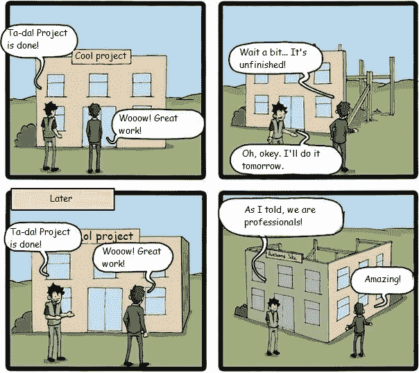

# 开始参与数据科学黑客马拉松的 4 个理由

> 原文：<https://towardsdatascience.com/4-reasons-to-start-participating-in-data-science-hackathons-5d95d01a662d?source=collection_archive---------15----------------------->

我的黑客马拉松参与之路始于大约一年半前。我设法参加了 20 多个不同规模和主题的活动，这些活动分别在莫斯科、赫尔辛基、柏林、慕尼黑、阿姆斯特丹、苏黎世和巴黎举行。在所有这些事件中，我一直从事各种形式的数据分析。我喜欢访问新的城市，建立新的联系，提出新的想法，快速实施旧的想法，以及在演讲和结果宣布时感受肾上腺素。

这篇文章是三篇文章中的第一篇，专门讨论黑客马拉松话题。我要告诉你关于黑客马拉松的概念，以及参加黑客马拉松的原因。第二个帖子将显示组织者的错误及其进一步的结果。第三篇文章将提供关于黑客马拉松最受欢迎的问题的答案。

# 什么是黑客马拉松？

黑客马拉松持续几天，它的目标是解决某些问题。通常，黑客马拉松解决几个问题，每个问题都是一个单独的赛道。发起公司提供任务描述、成功指标(指标可以是主观的，如新颖性和创造性，也可以是客观的，如延迟数据集上的分类准确性)和实现成功的资源(API、硬件、数据集)。参与者应阐明问题，提出解决方案，并在一定时间内展示他们的产品原型。最佳解决方案将同时获得奖项和进一步合作的机会。

## 黑客马拉松赛段

一旦宣布了任务，黑客马拉松参与者就被团结成团队:每个孤独者都得到一个麦克风，并谈论所选择的任务、他的背景、想法以及他需要合作来实现它的专家。有时一个团队可能只由一个人组成，这个人能够在足够高的水平上独立完成所有的工作。这与数据分析黑客马拉松相关，但对于产品活动来说，这通常是被禁止或不被推荐的——活动组织者旨在公司中进一步的项目开发延续；与那些希望独自创造产品的参与者相比，之前组建的团队有几个优势。最佳团队成员数量为 4 人，即一名前端、一名后端、一名数据科学家以及一名商人。

> 最佳团队成员数量为 4 人，即一名前端、一名后端、一名数据科学家以及一名商人。

顺便说一下，数据科学/产品黑客马拉松的区分非常简单——数据科学黑客马拉松意味着有一个具有明确指标和排行榜的数据集，或者有机会通过 Jupiter 笔记本中的代码获胜，而产品一则意味着所有其他内容，即需要它来制作一个应用程序、网站或其他有吸引力的东西。

通常，该项目在周五晚上 9 点开始，而截止日期是周日上午 10 点。应该留出一定的时间睡觉(睡觉是强制性的，连续 30 个小时编码肯定会失败，[我亲自检查了一下](/why-you-should-not-code-30-hours-in-a-row-a3a471301826))，这意味着参与者开发高质量产品的时间太少了。公司的代表和导师可以帮助参与者。

> 睡眠是强制性的，连续编码 30 小时肯定会失败，[我亲自检查过](/why-you-should-not-code-30-hours-in-a-row-a3a471301826)。

项目运作始于与公司代表的沟通，因为他们更好地认识到任务的细节、标准，并且很可能会对你完成的工作做出判断。当前的沟通目标是认识到哪些领域是最相关的，以及要关注的主要方面。

一个黑客马拉松设定了以下任务:对一个有表格数据、图片和清晰指标——RMSE——的数据集进行回归。当我与该公司的数据科学家交谈时，我意识到他们需要一个分类，而不是一个回归——事实是有人认为最好的问题解决方案是那个。此外，它们需要分类，以便在做出决策时认识到哪些参数是最重要的，然后手动处理它们，而不是获得货币指标的增长。即初始任务(用 RMSE 回归)变为分类；评估优先级从获得的准确性变为结果解释机会。这拒绝了使用堆叠和黑盒算法的机会。简单的对话节省了我很多时间，也增加了我获胜的机会。

> 简单的对话节省了我很多时间，也增加了我获胜的机会。

一旦你清楚地认识到任务，一定要着手工作。您需要设置检查点，即完成任务所需的时间；此外，继续与公司代表和技术专家等导师交流也是一个好主意，因为这有助于在项目开发期间及时做出修正。重新审视这个问题可能会提出一个有趣的解决方案。

组织者过去经常举办讲座和大师班，因为许多新人都参加黑客马拉松。像往常一样，讲座的数量为 3 个，即关于产品形式中自己想法演示方式的讲座，关于技术主题的讲座(例如，在机器学习中使用 open APIs 以避免自己的 speech 2 文本开发两天，但使用现有的代替)，关于推销的讲座(介绍自己产品的方式，如何在公开演讲时使用自己的手以避免观众感到厌烦)。有各种方法鼓励参与者，即练习瑜伽、乒乓球和网球或游戏机。

> 有各种方法鼓励参与者，即练习瑜伽、乒乓球和网球或游戏机。

你需要在周日早上向陪审团提供你的手术结果。好的黑客马拉松意味着一切从专业技术开始，不管你声称的东西真的有用吗？当前的测试目标是将那些只得到漂亮演示而不是真实产品的团队与那些真正成功开发出东西的团队分开。不幸的是，并非所有的黑客马拉松都意味着技术专长，这有时会导致那些获得超过 12 张幻灯片演示而不是真实产品的团队获胜。这样的先例并不常见，但因为它们最容易被记住，这导致了一个事实，即许多人确信一个好的演示是黑客马拉松 99%的胜利。事实是陈述，相当重要，但其贡献不超过 30%。

> 事实是陈述，相当重要，但其贡献不超过 30%。

一旦参与者发言完毕，评审团将决定授予获奖者。那么，正式的黑客马拉松部分就完成了。

# 参与黑客马拉松的动机

## 1.经验

就获得的经验而言，黑客马拉松是一项非常独特的活动。事实上，有几个地方可以在两天内实现自己的想法，并获得即时反馈。批判性思维、团队合作技能、时间管理、在压力下工作的能力、以可理解的形式展示自己的运营成果、演示技能以及其他许多方面都在黑客马拉松中得到了提高。因此，对于有理论知识的人来说，黑客马拉松是一个获得真正有价值经验的好地方。

## 2.奖赏

通常情况下，黑客马拉松奖金第一名约为 15k-10k 欧元(在俄罗斯为 10-30 万卢布)。可以使用一个简单的公式来计算预期的参与值:

`**EV = Prize * WinRate + FutureValue — Costs**`

其中`**Prize**`是奖金的大小(我们假设只有一个奖金)；

`**WinRate**` —胜利概率(新手团队的当前值上限为 10%，有经验的团队超过 50%；我遇到过这样的人，他们每次参加黑客马拉松都会获奖，但这是个例外，因为他们的胜率低于 100%)。

`**FutureValue**`是展示未来参与收益的一种:它既可以从已获得的经验形式中获利，也可以从已建立的关系、收到的信息等中获利。当前值几乎不可能准确确定，但必须记住；

`**Costs**` —交通费、住宿费等。

是否参加的决定是在 hackathon EV 和 activity EV 比较的基础上作出的，这是你想做的，而不是 hackathon:如果你打算整天躺着看电视，那么你应该参加 hackathon；但你的计划是花时间和你的父母或女朋友在一起，然后可能成为你的团队参加黑客马拉松(开玩笑，你自己决定)，如果你打算做自由职业者——只要比较一下美元-小时。

根据我自己的计算，我可以肯定地说，参加俄罗斯黑客马拉松与普通初级-中级数据科学家通常工作日的货币利润是相称的，但是有一些重要的特征(团队规模、黑客马拉松类型、奖金等。).因此，今天的黑客马拉松可能会令人愉快地增加你的个人预算，但不是一个真正的黄金机会。

## 3.在公司和网络工作

黑客马拉松是公司招聘新员工的方式之一。这是一个很好的方式来表明你是一个合格的人，并且知道如何在黑客马拉松上工作，这与在黑板上旋转二叉树的面试形成对比(这并不意味着它对应于你在工作时要完成的任务，但传统必须得到尊重)。这样的战斗条件测试可能会取代整个测试日。

由于参加了黑客马拉松，我找到了第一份工作。我展示了一个从数据中获取更多资金的绝佳机会，以及我将采取的方式。所以，我赢了，然后继续实施那个项目，同时在赞助公司工作。那是我人生中的第四次黑客马拉松。

## 4.唯一数据集

对于数据科学黑客马拉松来说，这是非常重要的一点，但不幸的是，并不是每个人都意识到它的重要性。通常，赞助公司会在活动期间提供真实数据集。目前的数据是私人的，受到 NDA 的保护，这并不妨碍在真实的数据集而不是玩具泰坦尼克号上展示概念证明。这样的结果将极大地有助于申请某家公司、竞争对手公司的工作，或证明未来类似项目的合理性。显而易见，在其他条件相同的情况下，完成项目并获得积极反馈是一件好事。总的来说，这种实施的项目与 Kaggle 上的奖牌和地位起着类似的作用，但它们对行业的价值更明显。

# 技巧

参与黑客马拉松是一个相当多样化的背景，很难制定规则列表。不过，在这里我想提供观察清单，能够帮助一个新人:

即使你没有背景或团队，也可以参加黑客马拉松。想想能带来什么好处。也许你有一个有趣的想法或者你精通某个领域？你有一个很好的机会在阐述一个问题的时候运用你的领域知识，并找到有价值的解决方案。或者你可以谷歌一下最好的？如果你能在 GitHub 中找到现成的实现，你的技巧将会节省很多时间。还是你很擅长 Lightgbm 参数调优？在这种情况下，一定要在 Kaggle 比赛中证明这一点，而不是参加黑客马拉松。

**战术比机动更重要。**黑客马拉松设定了解决问题的任务。有时，为了解决问题，需要揭示问题。检查你发现的问题是否真的与公司相关。请务必检查您的解决方案是否符合问题，并问问自己解决方案的最优性。在评估您的决策时，紧急性问题和建议的解决方案的充分性是最重要的。你的神经网络架构不重要。

**尽可能多地参加黑客马拉松，但不要参加组织得不好的活动。**

将你的 hackathon 操作结果添加到你的简历中，并随意公开写下它。

Very true for hackathons Minimum Viable Product (MVP)