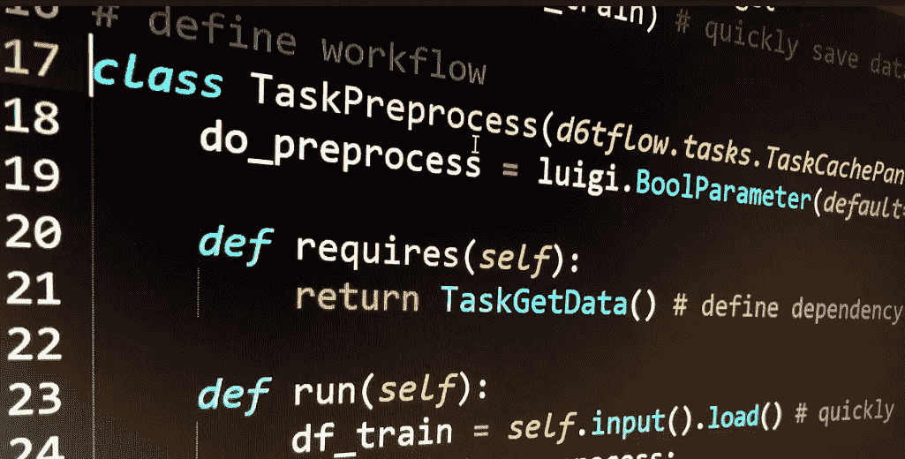

# 你的机器学习代码可能不好的 4 个原因

> 原文：<https://towardsdatascience.com/4-reasons-why-your-machine-learning-code-is-probably-bad-c291752e4953?source=collection_archive---------18----------------------->

*你当前的 ML 工作流程可能会将几个线性执行的功能链接在一起。虽然很快，但它可能有许多问题。与其线性链接函数，不如将数据科学代码编写为一组任务，它们之间存在依赖关系。也就是说，您的数据科学工作流应该是一个 DAG。*



您当前的工作流程可能将几个功能连接在一起，如下例所示。虽然很快，但它可能有许多问题:

*   随着复杂性的增加，它无法很好地扩展
*   您必须手动跟踪哪些函数是用哪些参数运行的
*   您必须手动跟踪数据保存的位置
*   其他人很难阅读

```
import pandas as pd
import sklearn.svm, sklearn.metricsdef get_data():
    data = download_data()
    data.to_pickle('data.pkl')def preprocess(data):
    data = clean_data(data)
    return data# flow parameters
do_preprocess = True# run workflow
get_data()df_train = pd.read_pickle('data.pkl')
if do_preprocess:
    df_train = preprocess(df_train)
model = sklearn.svm.SVC()
model.fit(df_train.iloc[:,:-1], df_train['y'])
print(sklearn.metrics.accuracy_score(df_train['y'],model.predict(df_train.iloc[:,:-1])))
```

# 该怎么办呢？

与其线性链接函数，不如将数据科学代码编写为一组任务，它们之间存在依赖关系。也就是说，您的数据科学工作流应该是一个 DAG。

https://github.com/d6t/d6tflow 是一个免费的开源库，可以让你轻松构建高效的数据科学工作流。

我们没有编写这样的函数:

```
def process_data(df, parameter):
    df = do_stuff(df)
    data.to_pickle('data.pkl')
    return dfdataraw = download_data()
data = process_data(dataraw)
```

您可以编写可以作为 DAG 链接在一起的任务:

```
class TaskGetData(d6tflow.tasks.TaskPqPandas): def run():
        data = download_data()
        self.save(data) # save output dataclass TaskProcess(d6tflow.tasks.TaskPqPandas): def requires(self):
        return TaskGetData() # define dependency def run(self):
        data = self.input().load() # load input data
        data = do_stuff(data) # process data
        self.save(data) # save output datadata = TaskProcess().output().load() # load output data
```

这样做的好处是:

*   不管你的工作流程有多复杂，所有的任务都遵循相同的模式
*   你有一个可伸缩的输入`requires()`和处理功能`run()`
*   您可以快速加载和保存数据，而不必硬编码文件名
*   如果输入任务没有完成，它将自动运行
*   如果输入数据或参数改变，该功能将自动重新运行
*   其他人阅读和理解工作流要容易得多

# 机器学习 DAG 示例

下面是一个机器学习流程的程式化示例，用 DAG 表示。最后，您只需要运行 TaskTrain()，它就会自动知道要运行哪些依赖项。完整示例见[https://github . com/d6t/d6t flow/blob/master/docs/example-ml . MD](https://github.com/d6t/d6tflow/blob/master/docs/example-ml.md)

```
import pandas as pd
import sklearn, sklearn.svm
import d6tflow
import luigi# define workflow
class TaskGetData(d6tflow.tasks.TaskPqPandas):  # save dataframe as parquet def run(self):
        data = download_data()
        data = clean_data(data)
        self.save(data) # quickly save dataframeclass TaskPreprocess(d6tflow.tasks.TaskCachePandas):  # save data in memory
    do_preprocess = luigi.BoolParameter(default=True) # parameter for preprocessing yes/no def requires(self):
        return TaskGetData() # define dependency def run(self):
        df_train = self.input().load() # quickly load required data
        if self.do_preprocess:
            df_train = preprocess(df_train)
        self.save(df_train)class TaskTrain(d6tflow.tasks.TaskPickle): # save output as pickle
    do_preprocess = luigi.BoolParameter(default=True) def requires(self):
        return TaskPreprocess(do_preprocess=self.do_preprocess) def run(self):
        df_train = self.input().load()
        model = sklearn.svm.SVC()
        model.fit(df_train.iloc[:,:-1], df_train['y'])
        self.save(model)# Check task dependencies and their execution status
d6tflow.preview(TaskTrain())'''
└─--[TaskTrain-{'do_preprocess': 'True'} (PENDING)]
   └─--[TaskPreprocess-{'do_preprocess': 'True'} (PENDING)]
      └─--[TaskGetData-{} (PENDING)]
'''# Execute the model training task including dependencies
d6tflow.run(TaskTrain())'''
===== Luigi Execution Summary =====Scheduled 3 tasks of which:
* 3 ran successfully:
    - 1 TaskGetData()
    - 1 TaskPreprocess(do_preprocess=True)
    - 1 TaskTrain(do_preprocess=True)
'''# Load task output to pandas dataframe and model object for model evaluation
model = TaskTrain().output().load()
df_train = TaskPreprocess().output().load()
print(sklearn.metrics.accuracy_score(df_train['y'],model.predict(df_train.iloc[:,:-1])))
# 0.9733333333333334
```

# 结论

将机器学习代码编写为一系列线性函数可能会产生许多工作流问题。由于不同 ML 任务之间复杂的依赖关系，最好将它们写成 DAG。https://github.com/d6t/d6tflow 让这变得非常容易。或者，你可以使用 [luigi](https://github.com/spotify/luigi) 和 [airflow](https://airflow.apache.org/) ，但是它们更适合 ETL 而不是数据科学。