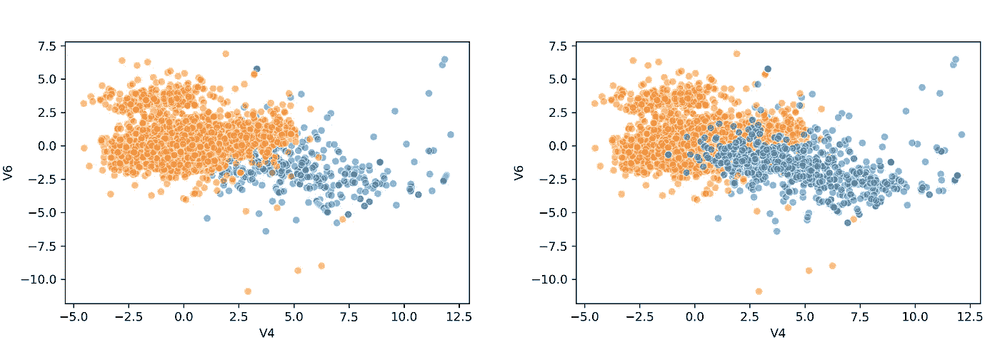
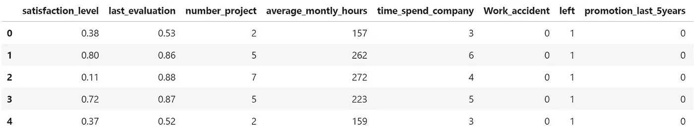
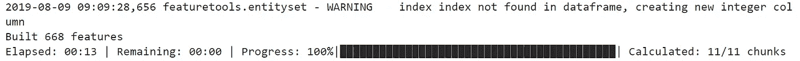
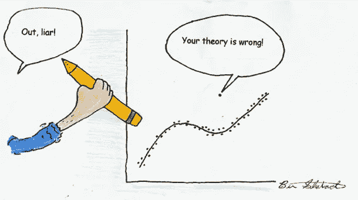
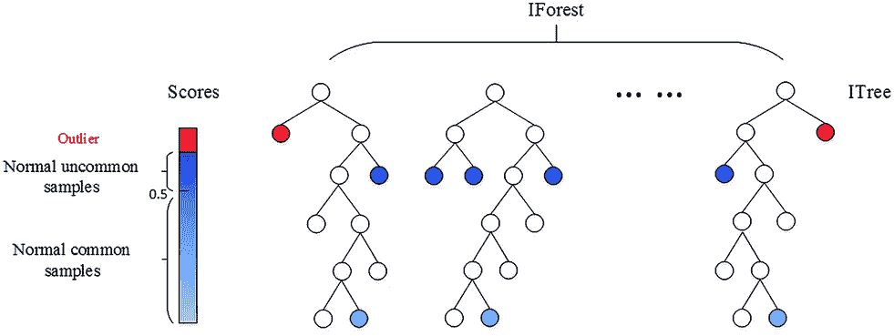
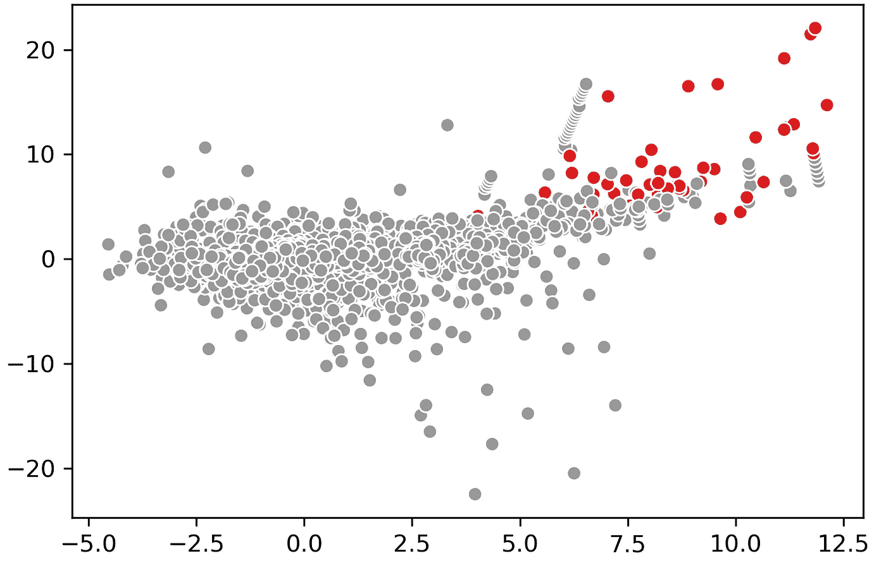

# 高级特征工程和预处理的 4 个技巧

> 原文：<https://towardsdatascience.com/4-tips-for-advanced-feature-engineering-and-preprocessing-ec11575c09ea?source=collection_archive---------11----------------------->

## 特征工程

## 创建新要素、检测异常值、处理不平衡数据和估算缺失值的技术。

[https://www.analyticsvidhya.com/blog/2018/11/data-engineer-comprehensive-list-resources-get-started/](https://www.analyticsvidhya.com/blog/2018/11/data-engineer-comprehensive-list-resources-get-started/data-engineer/)

显然，开发机器学习模型的两个最重要的步骤是**特征工程**和**预处理**。特征工程包括创建特征，而预处理包括清理数据。

> 折磨数据，它会承认任何事情*。—罗纳德·科斯*

我们经常花费大量时间将数据提炼为对建模有用的东西。为了使这项工作更有效，我想分享 4 个技巧和诀窍，可以帮助你工程和预处理这些功能。

我应该注意到，尽管这可能是老生常谈，**领域知识**可能是工程特性中最重要的东西之一。通过更好地理解您所使用的功能，它可能有助于您防止欠拟合和过拟合。

你可以在这里找到带分析的笔记本。

# 1.重采样不平衡数据

在实践中，您经常会遇到不平衡的数据。如果你的目标只是有轻微的不平衡，这不一定是个问题。然后，您可以通过使用适当的数据验证措施来解决这个问题，例如*平衡精度*、*精确召回曲线*或 *F1 得分*。

不幸的是，情况并非总是如此，您的目标变量可能会非常不平衡(例如，10:1)。相反，您可以使用称为**击打**的技术对少数目标进行过采样，以引入平衡。

## 重击

[SMOTE](https://jair.org/index.php/jair/article/view/10302) 代表*合成少数过采样技术*，是一种用于增加少数类样本的过采样技术。

它通过查看目标的*特征空间*并检测最近的邻居来生成新的样本。然后，它简单地选择相似的样本，并在相邻样本的*特征空间*内随机地一次改变一列。

实现 SMOTE 的模块可以在[不平衡学习](https://imbalanced-learn.readthedocs.io/en/stable/index.html)包中找到。您可以简单地导入包并应用 fit_transform:

Original data (LEFT) versus oversampled data (RIGHT).

如您所见，该模型成功地对目标变量进行了过采样。使用 SMOTE 进行过采样时，您可以采取几种策略:

*   `**'minority'**`:只对少数类重新采样；
*   `**'not minority'**`:对除少数类以外的所有类进行重新采样；
*   `**'not majority'**`:对除多数类以外的所有类进行重新采样；
*   `**'all'**`:对所有类进行重采样；
*   当`**dict**`时，按键对应目标类别。这些值对应于每个目标类所需的样本数。

我选择使用字典来指定我想要对数据进行过采样的程度。

**附加提示 1** :如果您的数据集中有分类变量，SMOTE 可能会为那些不可能发生的变量创建值。例如，如果有一个名为 isMale 的变量，它只能取 0 或 1，那么 SMOTE 可能会创建 0.365 作为值。

相反，您可以使用考虑到分类变量性质的 SMOTENC。该版本也可在[不平衡学习](https://imbalanced-learn.readthedocs.io/en/stable/index.html)包中获得。

**附加提示 2:** 确保在创建训练/测试分割后进行过采样，以便只对训练数据进行过采样。您通常不希望在合成数据上测试您的模型。

# 2.创建新功能

为了提高模型的质量和预测能力，通常会从现有变量中创建新的特征。我们可以在每对变量之间创建一些交互(例如，乘或除)，希望找到一个有趣的新特征。然而，这是一个漫长的过程，需要大量的编码。幸运的是，这可以通过使用**深度特征合成**来实现自动化。

## 深度特征合成

深度特征合成(DFS)是一种算法，使您能够快速创建具有不同深度的新变量。例如，您可以将多对列相乘，但也可以选择先将 A 列与 B 列相乘，然后再将 c 列相加。

首先，让我介绍一下我将在这个例子中使用的数据。我选择使用[人力资源分析数据](https://www.kaggle.com/lnvardanyan/hr-analytics)，因为这些功能很容易理解:

简单地基于我们的直觉，我们可以将`**average_monthly_hours**`除以`**number_project**`识别为一个有趣的新变量。然而，如果我们只遵循直觉，可能会错过更多的关系。

[包](https://github.com/Featuretools/featuretools)确实需要理解它们对实体的使用。但是，如果您使用单个表，您可以简单地遵循下面的代码:

第一步是创建一个`**entity**`，如果需要的话，可以从它创建与其他表的关系。接下来，我们可以简单地运行`**ft.dfs**`来创建新的变量。我们用参数`**trans_primitives**`指定如何创建变量。我们选择了数字变量相加或者相乘。

The output of DFS if verbose = True

正如你在上面的图片中看到的，我们只用了几行代码就创建了额外的 668 个特性。创建的功能的几个示例:

*   `**last_evaluation**` 乘以`**satisfaction_level**`
*   `**left**` 乘以`**promotion_last_5years**`
*   `**average_monthly_hours**` 乘以`**satisfaction_level**` 加上`**time_spend_company**`

**附加提示 1:** 注意，这里的实现比较基础。DFS 的伟大之处在于它可以从表之间的聚合创建新的变量(例如，事实和维度)。参见此[链接](https://docs.featuretools.com/loading_data/using_entitysets.html)的示例。

**附加提示 2:** 运行`**ft.list_primitives()**`以查看您可以执行的聚合的完整列表。它甚至处理时间戳、空值和经度/纬度信息。

# 3.处理缺失值

和往常一样，没有处理缺失值的最佳方式。根据您的数据，简单地用某些组的平均值或模式填充它们可能就足够了。然而，有一些先进的技术可以使用已知的数据部分来估算缺失值。

一个这样的方法叫做**iterative inputr**这是 Scikit-Learn 中的一个新包，它基于流行的 R 算法，用于输入缺失变量 MICE。

## 迭代估算器

尽管 python 是开发机器学习模型的一种很好的语言，但仍有相当多的方法在 R 中工作得更好。一个例子是 R 中完善的插补包:missForest、mi、mice 等。

**迭代估算器**由 Scikit-Learn 开发，将每个缺失值的特征建模为其他特征的函数。它以此作为估算值。在每一步，选择一个特征作为输出`y`，所有其他特征作为输入`X`。然后在`X`和`y`上安装一个回归变量，用于预测`y`的缺失值。对每个特征都这样做，并在几轮插补中重复。

让我们看一个例子。我使用的数据是众所周知的泰坦尼克号数据集。在这个数据集中，列`Age`有我们想要填充的缺失值。代码一如既往地简单明了:

这种方法的好处在于它允许你使用自己选择的估计量。我使用了一个 RandomForestRegressor 来模拟 r 中常用的 missForest 的行为。

**附加提示 1:** 如果您有足够的数据，那么简单地删除缺失数据的样本可能是一个有吸引力的选择。但是，请记住，这可能会在您的数据中产生偏差。也许丢失的数据遵循一种你错过的模式。

**附加提示 2** :迭代估算器允许使用不同的估算器。经过一些测试，我发现你甚至可以使用 **Catboost** 作为一个估算器！不幸的是，LightGBM 和 XGBoost 不起作用，因为它们的随机状态名不同。

# 4.离群点检测

如果对数据没有很好的理解，离群值是很难发现的。如果您非常了解数据，您可以更容易地指定数据仍然有意义的阈值。

有时这是不可能的，因为很难实现对数据的完美理解。相反，你可以利用离群点检测算法，比如流行的**隔离森林**。

## 隔离森林

在隔离森林算法中，关键字是*隔离*。本质上，该算法检查样本分离的难易程度。这将产生一个隔离数，该隔离数通过在随机决策树中隔离样本所需的分裂数来计算。然后对所有树的隔离数进行平均。

Isolation Forest Procedure. Retrieved from: [https://donghwa-kim.github.io/iforest.html](https://donghwa-kim.github.io/iforest.html)

如果算法只需要做几次分裂就能找到一个样本，那么它更有可能是一个离群值。分割本身也是随机分割的，从而为异常产生更短的路径。因此，当所有树的隔离数较低时，该样本极有可能是异常。

为了展示一个例子，我再次使用了我们之前使用过的信用卡数据集:

额外提示 1 :有一个[扩展](https://github.com/sahandha/eif)版本的隔离森林，它改进了一些缺点。然而，T4 的评论褒贬不一。

# 感谢您的阅读！

如果你和我一样，对人工智能、数据科学或心理学充满热情，请随时在 [LinkedIn](https://www.linkedin.com/in/mgrootendorst/) 上添加我，或者在 [Twitter](https://twitter.com/MaartenGr) 上关注我。

有代码的笔记本可以在这里找到[。](https://github.com/MaartenGr/feature-engineering/blob/master/Engineering%20Tips.ipynb)

任何反馈和意见，一如既往，非常感谢！