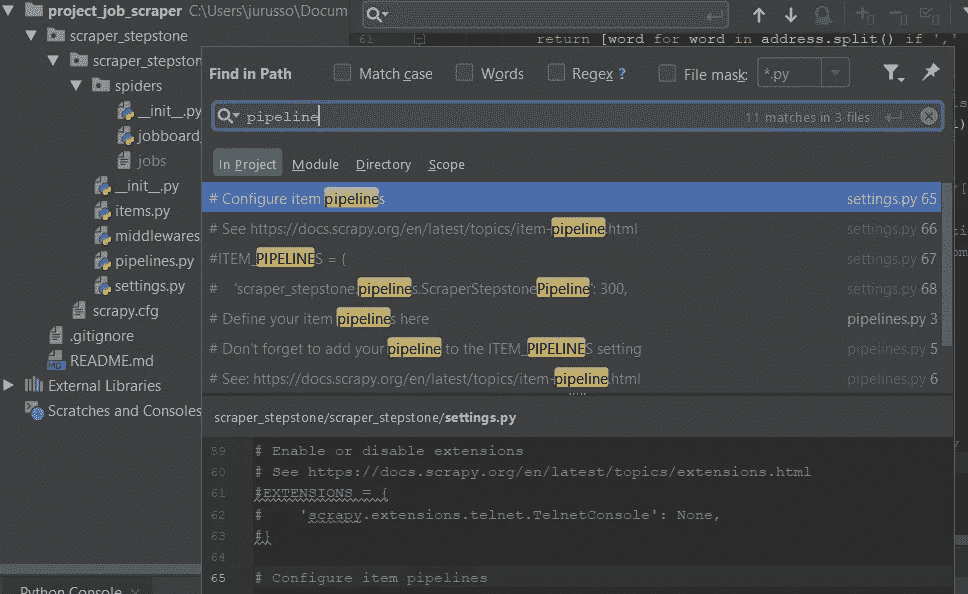
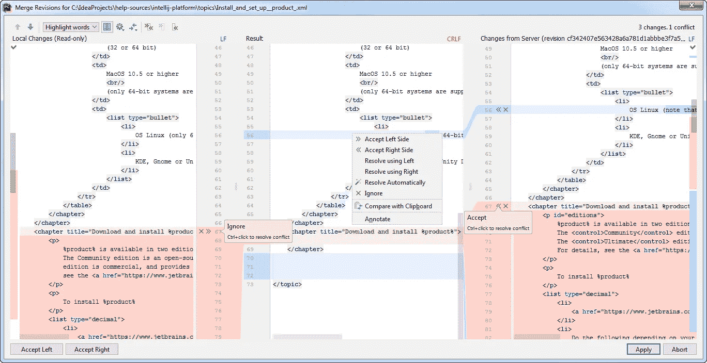
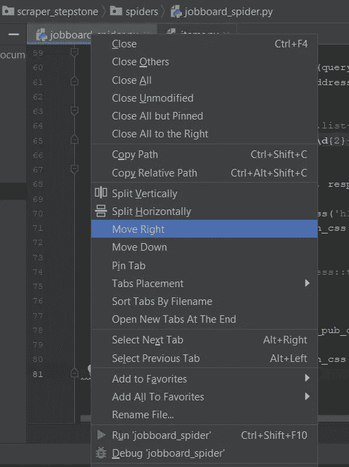
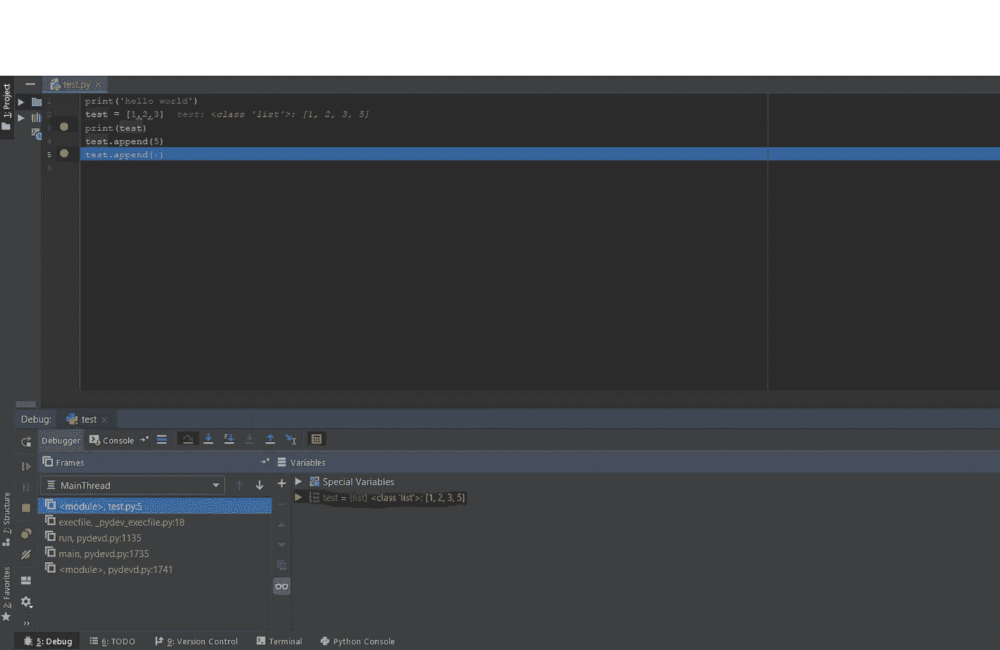

# 在下一个 Python 项目中使用 PyCharm 的 4 个理由

> 原文：<https://towardsdatascience.com/4-tips-to-get-the-best-out-of-pycharm-99dd5d01932d?source=collection_archive---------6----------------------->

## 如何使用编辑器的特性来帮助您在大型项目中跟踪 Python 代码

The PyCharm Logo from [jetbrains.com/pycharm](https://www.jetbrains.com/pycharm/)

PyCharm 是最常见的 Python 编辑器，仅次于 Spyder。当我几年前开始使用它时，我正在为我的毕业设计编写一个推荐系统。我只是听从了我的项目教练的建议，完全不知道编辑器的优点是什么。我知道它与 Anaconda 集成在一起，这让我的生活稍微轻松了一些，但仅此而已。老实说，当时我也不太了解版本控制。3 年过去了，我还在坚持 PyCharm，但这一次，我有我的理由。

当您只是简单地尝试机器学习或为不需要复杂的文件夹结构或模块中组织的脚本的短项目编码时，编辑器的选择通常并不重要。当项目变得更大，有几个脚本、模块、测试和程序员在同一个脚本上协作时，问题和偏好通常会出现。我相信，这就是 PyCharm 的额外特性对任何 Python 程序员都有很大帮助的地方。

我只是提到社区版的功能，而不是专业版的。因此，任何人都应该能够在该软件的免费版本中使用这些功能。

我将描述 PyCharm 的 4 个特性，它们在我上一个 Python 项目中产生了真正积极的影响:

*   **寻找瓦尔多:**如何在大型项目中轻松导航
*   **Git 集成:**版本控制变得简单，包括快速解决冲突！
*   **窗口分割:**为了在开发时更好地了解代码。
*   **调试:**如何避免不计其数的打印语句！

# “寻找沃尔多”的情况

任何程序员都知道，当他们可以看到代码中使用的函数，但在任何地方都找不到它的定义时，是多么痛苦。他们知道它的名字，也知道它的样子。这个“Waldo”函数似乎在做一些至关重要的事情，但是当脚本数量众多和/或相当长时，要找出这个函数最初是在哪里定义的可能会很麻烦。

PyCharm 有一个非常好的特性，允许在项目中的任何地方查找某个关键字的出现。它类似于 CTRL-F，但更好。

## 在路径中查找功能

位置:**编辑>查找>在路径**或**中查找使用快捷键 **CTRL-Shift-F****

The Find in Path window in PyCharm

当我需要查找变量或函数的第一个引用时，Pycharm 中的" **Find in Path** "特性非常方便。如果我想包括库或者只包括某个模块，它也有几个选项来改变我的搜索范围！另一个方便的特性，“路径中的**替换”，也是同样的工作方式。它可以自动替换我的项目/模块/范围中出现的所有关键字。**

我喜欢这个功能，因为我很懒，也很不耐烦。人们总是可以判断出函数是否被导入，进入文件夹找到正确的模块(如果函数在其中)，然后滚动脚本直到找到函数定义。但是时间和耐心往往是稀缺的，所以当谈到轻松导航大型项目时，任何帮助都是受欢迎的。

## 一点小小的警告…

值得一提的是，如果你一直给你的函数或变量起相同的无意义的名字，比如“x，y，z”，“result”和“df”，这个特性就变得毫无用处。我建议在项目变得更大之前，给变量和函数取一个有意义的名字，这也是为了下一批可能要从事这项工作的程序员。

# 没有理由不使用版本控制！

使用版本控制可以理解版本控制的重要性。幸运的是，py charm**非常容易与 Git** 一起使用。无论您喜欢使用命令行还是 GUI，选项都在那里。您可以使用 PyCharm 中的选项，在版本控制下提交和推送到您的分支，恢复到您脚本的前一个版本，以及比较分支(尽管我不经常使用那个)。你也可以很容易地在屏幕的右下角看到你在哪个分支。

## 解决冲突功能(我的最爱！)

地点: **VCS >吉特>解决冲突**

Resolve Conflict window from [jetbrains.com](https://www.jetbrains.com/help/pycharm/)

PyCharm 的“解决冲突”特性仍然是有史以来最好的特性(我甚至没有夸张)。当我不得不解决几个脚本中的多个冲突时，它让我省去很多麻烦。当在本地合并一个分支后发生冲突时，PyCharm 将以红色显示所有有冲突的文件。在上面提到的位置打开“解决冲突”窗口后，PyCharm 在一个窗口中显示我的分支版本、合并的版本和我试图合并的分支版本。对于每个变更或冲突，我可以决定在合并的脚本中采用冲突代码的哪一部分。当几个程序员在同一个项目上工作时，合并冲突经常发生，所以我非常喜欢 PyCharm 的这个特性。

# 我们需要更多的窗户！

位置:**右击我的脚本名>向右移动**

Move Right option

当我在写一个新的脚本或者更新一个现有的脚本时，我经常需要在不同的脚本之间来回切换。经常需要查看我们使用的代码约定，在另一个脚本中定义的函数名，或者我以前编写代码的方式。皮查姆也接手了这个案子。它允许您拆分和移动窗口，以便在您当前正在处理的脚本旁边显示一个或多个脚本。如果你还想在代码的工作方式和外观上保持某种一致性，这会很有帮助。

# 压扁虫子！

当我在一个大项目中工作时，调试可能是一项非常痛苦的任务，并且输出中有些东西不正确。要找出我的数据帧为什么和在哪里得到一些重复值，可能需要在我的代码中的几个地方使用无数不同的 print 语句，我可能会迷失在输出窗口中打印的变量和数据帧的数量中。

## 调试器

位置:**右击我的脚本名>调试‘测试’**

My extremely poor attempt at highlighting the important tools of the debugger.

通过使用断点和调试器模式，你可以很容易地**在你代码的任何地方**评估你的变量。任何时候你的代码在断点处停止，调试窗口将显示每个变量的值，它允许你**查看数据帧内部**。你也可以点击小计算器，在临时变量上写表达式。如果你通过使用我(试图)突出显示的箭头来浏览代码，你也可以看到你的变量的内容是如何逐行演变的。要了解更多细节，你还可以找到一个非常清晰的教程，教你如何在[jetbrains.com](https://www.jetbrains.com/help/pycharm/debugging-your-first-python-application.html)上使用调试器。

感谢阅读！

我最近与数据科学相关的故事:

 [## 一个数据科学家需要了解多少数据工程？

### &他/她不需要知道多少。

towardsdatascience.com](/how-much-data-engineering-does-a-data-scientist-need-to-know-93afe7fab40c)  [## 从销售代表到数据科学家

### 我从销售专员到数据科学家的转变&最大的挑战是什么。

towardsdatascience.com](/from-being-a-sales-rep-to-being-a-data-scientist-4bb1da79ba3f)