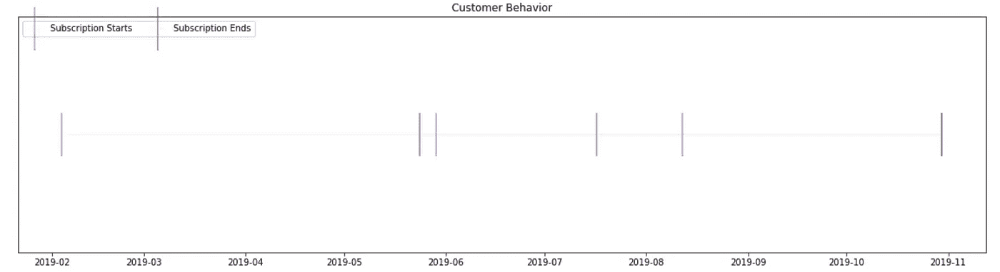
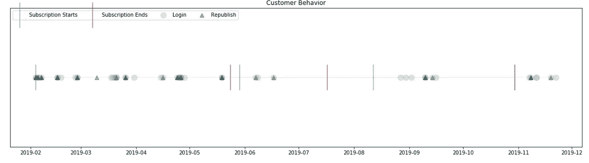
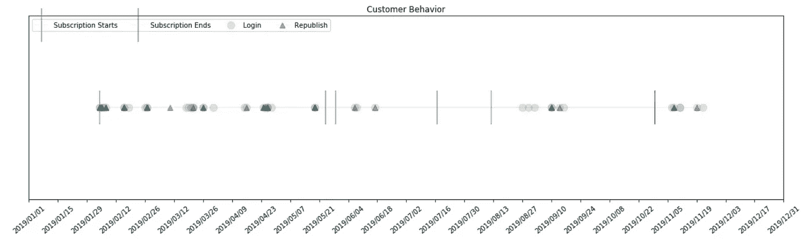
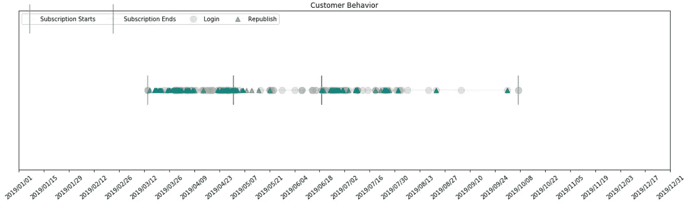

# 使用 Python Matplotlib 可视化行为的 4 个技巧，以及简单的教程

> 原文：<https://towardsdatascience.com/4-tips-to-visualize-behavior-with-python-matplotlib-follow-by-easy-tutorial-dc11f35b5b10?source=collection_archive---------23----------------------->

## 处理不同动作事件和多次发生的事件的提示

# 为什么要可视化客户行为？

我目前在 Unbounce 工作，担任数据分析师。Unbounce 是一个基于订阅的工具，帮助营销人员建立和优化登录页面，以获得高转化率。像任何其他基于订阅的公司一样，我们希望减少客户流失，吸引客户停留更长时间。其中很大一部分是了解哪些行为与更长的客户保持率相关，为什么会这样，以及我们如何培养这些行为。

虽然我们可以使用许多统计方法来检查客户行为趋势，但我发现将一些客户的行为可视化(并与面向客户的团队讨论)以形成稍后可以验证的假设是有帮助的。

# 数据

在本教程中，我们将使用包含 4 个帐户的事件和订阅信息的示例数据。不包含任何个人信息，并且帐户的唯一标识已被更改以确保安全。

客户行为数据通常包括日期和时间事件，即客户执行特定操作的时刻。在本教程中，我们将研究帐户重新发布(`republished_df`)和登录(`login_df`)的事件。

我们也有每个客户的订阅信息(`subscription_info_df`)。一个客户可以有多个订阅，但每个订阅都是互斥的。客户的新订阅只有在他/她翻炒(意味着停止支付)然后重新订阅时才开始。我们称这个人为活板。

# 加载和转换

```
republished_df = pd.read_csv(filepath)
login_df = pd.read_csv(filepath)
subscription_info_df = pd.read_csv(filepath)
```

在进行可视化之前，我们需要将日期列转换为日期-时间格式。现在，Python 认为它们是一串字符串。因此，日期将不会及时安排。

```
republished_df['action_date'] = pd.to_datetime(republished_df['action_date'])login_df['action_date'] = pd.to_datetime(login_df['action_date'])subscription_info_df['subscription_starts_at'] = pd.to_datetime(subscription_info_df['subscription_starts_at'])subscription_info_df['subscription_ends_at'] = pd.to_datetime(subscription_info_df['subscription_ends_at'])
```

让我们为本教程获取一个帐户的样本数据。

```
sample_subscription = subscription_info_df[subscription_info_df['AccountCode'] == 'a']sample_republished = republished_df[republished_df['AccountCode'] == 'a']sample_login = login_df[login_df['AccountCode'] == 'a']

*# This is a constant for visualization purpose* 
sample_subscription['vizline'] = 0.5
sample_republished['vizline'] = 0.5
sample_login['vizline'] = 0.5
```

# 提示 1:这个账户是当天活动账户吗？让我们混合一些颜色

当我们需要想象不同的事件只发生一次，但它们可能在同一天发生时，这个技巧很方便。

像任何一家基于订阅的公司一样，Unbounce 希望吸引那些订阅、流失然后在某个时间点回来的用户。有些情况下，客户流失和重新订阅发生在**同一天**。为了区分同一天的时髦女郎，我们可以使用这种混色技巧。

注意:我们在这里假设每个订阅都是互斥的。

如果我们用不同于`subscription end date`的颜色来显示`subscription start date`，并使用一些不透明度，我们将为同一天的美眉提供不同的颜色。

比如这里我选择**蓝色**为`subscription start date`，选择**红色**为`subscription end date`，通过`alpha = 0.5` ( `alpha`范围从 0 到 1)改变不透明度。这导致**洋红色**用于当天的时髦女郎。

你可以通过这篇[文章](https://mymodernmet.com/color-mixing-chart/)了解更多关于混色的基础知识。

下面是 Matplotlib 中颜色代码的列表[。](https://matplotlib.org/examples/color/named_colors.html)

```
fig, ax = plt.subplots(figsize=(20, 5))ax.plot(sample_subscription['subscription_starts_at'], sample_subscription['vizline'], 
        marker='|', linewidth = 0.1,
        markersize=50, mew=2, alpha=0.5,
        color='royalblue', label='Subscription Starts')no_expire_mask = ~sample_subscription['subscription_ends_at'].isnull()ax.plot(sample_subscription[no_expire_mask]['subscription_ends_at'], sample_subscription[no_expire_mask]['vizline'],
        linewidth = 0.1, marker='|',
        markersize=50, mew=2, alpha=0.5,
        color='crimson', label='Subscription Ends')ax.legend(loc='upper left', ncol=2)
ax.set_title("Customer Behavior")*# Remove y-axis ticks as we don't need it*
ax.get_yaxis().set_visible(**False**)
```



从上面的图表中，我们知道这个帐户有 4 个订阅。在最后一次订阅中，他/她是当天活动的参与者。第三个订阅结束时，最后一个订阅开始，因此我们在这里看到的是洋红色，而不是蓝色或红色。

除了颜色和 alpha，在`axes.plot()`函数中还有更多参数，你可以根据你想要如何设计你的图表来调整，比如标记类型和标记大小(我们将在下一篇技巧文章中对`marker`进行更详细的讨论)。

点击阅读关于这些参数[的更多信息。](https://matplotlib.org/3.1.1/api/_as_gen/matplotlib.axes.Axes.plot.html)

# 技巧 2:每个动作的频率和强度是多少？让我们使用不同的形状和不透明度

**当我们需要想象在同一天可能发生多次的不同事件时，这个小技巧很方便。**

因为 Unbounce 是一个帮助营销人员发布和优化其登录页面的工具，所以我们关心重新发布事件。我们想了解:

*   与登录该工具相比，客户重新发布页面的频率如何？
*   客户每次登录重新发布多少/密集？

为了帮助回答这些问题，我们需要在同一个图表上绘制登录和重新发布。这有两个问题:

*   客户可以在同一天登录并重新发布
*   客户可以在同一天多次执行这些操作

而要解决这些问题，我们可以在`axes.plot()`函数中使用不同的形状(通过`marker`)和不透明度(通过`alpha`)。有许多标记类型，但是这里我使用*圆圈*用于登录，使用*三角形*用于重新发布。你可以在这里了解其他类型:[https://matplotlib . org/3 . 1 . 1/API/markers _ API . html # module-matplotlib . markers](https://matplotlib.org/3.1.1/api/markers_api.html#module-matplotlib.markers)。

```
ax.plot(sample_login['action_date'], 
        sample_login['vizline'],
        marker='o', markersize=11,
        alpha=0.3, color='darkseagreen',
        linewidth=0.1, label='Login')ax.plot(sample_republished['action_date'],
        sample_republished['vizline'],
        marker='^', markersize=8,
        alpha=0.5, color='teal',
        linewidth=0.1, label='Republish')
```



从上面的图表中，我们可以回答两个行为问题:

*   **与登录该工具相比，客户重新发布页面的频率如何？** —在第一次订阅期间，该客户几乎每 2 周登录并重新发布一次，但在随后的订阅中，这一频率有所降低。有时他们登录时没有重新发布页面。
*   **与登录该工具相比，客户重新发布页面的频率如何？** —在所有订阅期间，该帐户在登录时往往会多次重新发布，因此我们会看到深色的三角形。这表明他们可能会在每次修改页面预览时重新发布。

# 技巧 3:这个账户的行为与另一个相比如何？让我们确定我们看的是同一个尺度

当你想比较一个实体和另一个实体时，这个提示特别方便。

如果我们只调查一个客户，我们不知道这个客户是否是一个高度参与的客户，或者这种行为是否是我们所有客户群的规范。为了弄清楚这一点，我们可以从最简单的技术开始:随机挑选一些客户，手动比较他们的行为。

为了进行更合理的比较，我们希望确保图表使用相同的刻度。有些客户会在年初开始订阅，而有些客户会在年中或年底开始订阅。在这种情况下，我想限制我的图表显示从 1 月 1 日到 12 月 31 日的日期范围。为此我们可以使用`axes.set_xlim()`函数。

点击阅读更多关于`axes.set_xlim()` [的内容。](https://matplotlib.org/3.1.1/api/_as_gen/matplotlib.axes.Axes.set_xlim.html)

```
*# Limit date range*
datemin = pd.to_datetime('2019/01/01').date()
datemax = pd.to_datetime('2019/12/31').date()
ax.set_xlim(datemin, datemax)

*# Format date*
date_form = mdates.DateFormatter("%Y/%m/%d")
ax.xaxis.set_major_formatter(date_form)*# Ensure ticks fall once every other week (interval=2)* 
ax.xaxis.set_major_locator(mdates.WeekdayLocator(interval=2))
ax.xaxis.set_tick_params(rotation=40)
```



# 技巧 4:让它可重复

我是受大卫·罗宾逊启发的三原则的忠实粉丝。

> *当你已经写了 3 次相同的代码时，写一个函数*

由于我们要在数据集中可视化 4 个客户的行为(显然不止 3 个)，我想写一个函数。我喜欢函数，因为我们可以对可视化效果进行系统化的修改，并节省大量时间将这些修改复制粘贴到每个图表上。

我们的第一个功能是获取一个帐户的数据。

我们的第二个功能是可视化帐户的行为。注意，我在第二个函数中使用了第一个函数。

我们来试试吧！

```
_ = _visualize_customer_behavior('b')
```



以下是我们刚刚在本教程中浏览过的所有内容的完整代码:

[](https://github.com/hadinh1306/blog-posts/blob/master/tutorials/Visualize_Customer_Behavior.ipynb) [## hadin 1306/博客帖子

### 此时您不能执行该操作。您已使用另一个标签页或窗口登录。您已在另一个选项卡中注销，或者…

github.com](https://github.com/hadinh1306/blog-posts/blob/master/tutorials/Visualize_Customer_Behavior.ipynb) 

*更多关于数据分析和工作生活平衡的文章，可以查看我的* [*博客*](https://medium.com/@hablogging) *。让我们也* [*连接*](https://www.linkedin.com/in/hanhatdinh/) *并保持我们的数据(对话)流动！*