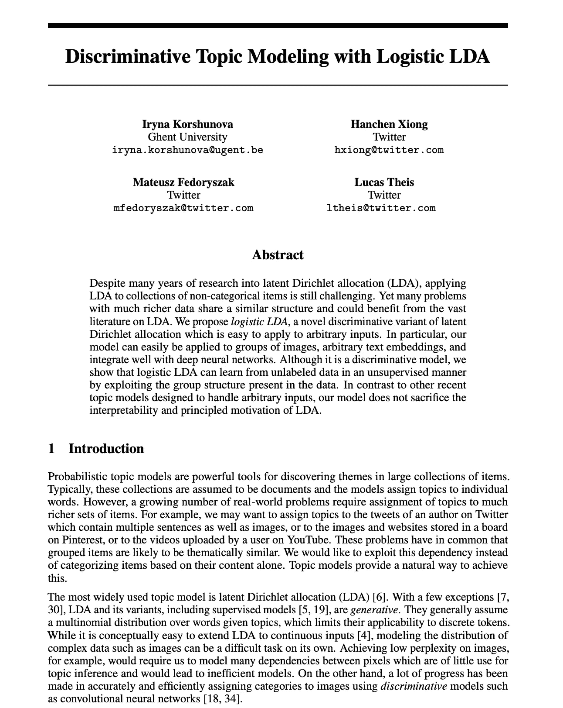
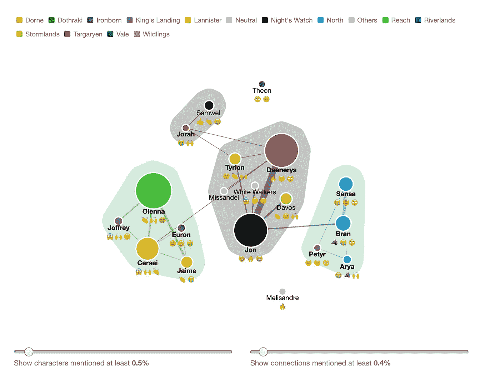

# 在 NLP 上你需要知道的 4 个技巧——来自 Twitter 数据科学家

> 原文：<https://towardsdatascience.com/4-tips-you-need-to-know-on-nlp-from-a-twitter-data-scientist-635206c817e9?source=collection_archive---------14----------------------->

## [独家 TDS 采访](https://towardsdatascience.com/tagged/tds-interview)

## 独家关注 Twitter 的 NLP 项目、采访流程和数据科学工具——TDS 采访。

**面试官:**[TowardsDataScience.com 项目负责人 Haebichan Jung](https://www.linkedin.com/in/haebichan/) 。

**受访者:** [阿方索·博尼拉](https://www.linkedin.com/in/alfonsobonilla/)，Twitter(健康)的数据科学家，之前是沃尔玛实验室的数据科学家——华盛顿大学计算语言学硕士。

你能描述一下你的专业背景吗？

我叫阿方索·博尼拉。我是一名计算语言学家，目前在 Twitter 担任数据科学家。到底什么是计算语言学家？计算语言学是语言学的一个分支，它使用计算方法来解决语言问题。在过去的几年里，我对语言空间中机器学习模型(特别是深度学习模型)的可解释性越来越感兴趣——尤其是当涉及到面向消费者的产品时。虽然非常有效，但结果和模型本身很难被人类(尤其是用户)解释，并且可能不一定与语言的某些方面相关联——词类、语义或语法结构，等等。我特别感兴趣的是嵌入空格，它与语言概念的关系，以及偏见是如何产生的([我在下面写了一点！](https://medium.com/@fonzbonz/ai-can-be-sexist-classist-and-racist-3c2c83712a4))。

 [## 人工智能可能是性别歧视者、阶级歧视者和种族主义者。

### 有一张图片展示了从土耳其语到英语的翻译。土耳其语是中性的…

medium.com](https://medium.com/@fonzbonz/ai-can-be-sexist-classist-and-racist-3c2c83712a4) 

**你现在在 Twitter 的哪个团队工作，你专注于哪些项目？你能详细告诉我们这些团队是如何划分的吗？**

我是一名数据科学家，支持 Twitter 的工作，我们称之为平台的健康，我们努力确保平台上的每个人都感到安全，并与可信的信息互动。

健康只是 Twitter 数据科学的一个领域。Twitter 的数据科学跨越不同的产品层面。产品表面是指用户可以与平台交互的不同地方。其中一些领域包括家庭时间表、搜索和入职培训。

Twitter 的招聘流程是怎样的？这个过程与你申请沃尔玛实验室(你以前的公司)的过程不同吗？

我在 Twitter 招聘过程中的经历非常积极。与一名招聘人员进行了第一次电话交谈。我们谈到了我为什么对 Twitter 感兴趣，并就这个角色进行了一些讨论。后来有了技术屏，有了结对编码。我喜欢这次编码采访的原因是，它并没有给我一个千篇一律的编码问题，而是真正关注于为真实世界的应用程序编码。最后一步是现场面试。现场面试包括 4 次面试和午餐休息。每次采访都简短而甜蜜，集中在关键概念上，而且有趣。尽管压力很大，面试官还是测试了他们的创造力，并真正关注问题的解决。在那之后，提供服务的速度非常快！在整个招聘过程中，每个人都非常细心，风度翩翩。

沃尔玛的招聘流程也非常相似。我要和招聘人员进行电话交谈，然后是配对编码的技术筛选，还有 4 次现场面试和午餐。两次面试都测试技术概念，如统计和编码，以及沟通、解决问题和其他对数据科学至关重要的软技能。

**你使用 Twitter 的常用工具有哪些？**

在我的日常生活中，我通常使用 Python 和 SQL。我发现自己在使用常用的库和工具，如 Jupyter、Sci-Kit Learns、Numpy 和 Pandas，以及 NLP 专用库，如 NLTK、SpaCy 和 Gensim。此外，Twitter 还开发了一个大数据工具，叫做 burning。burning 是一个 Scala 库，可以轻松指定 Hadoop MapReduce 作业。你可以在下面找到更多关于它的信息。

 [## 滚烫的

### burning 是一个 Scala 库，可以轻松指定 Hadoop MapReduce 作业。滚烫建立在层叠之上…

twitter.github.io](https://twitter.github.io/scalding/) 

**你目前是一名 NLP 数据科学家。但你也是受过正规训练的计算语言学家。你能告诉我们这两个学科之间的异同吗？**

(提示 1)这两者高度相关，它们之间的界限非常模糊。计算语言学，以及更一般的语言学，致力于理解不同层次和不同语境下的人类语言。另一方面，自然语言处理(NLP)和计算机科学侧重于计算机系统和软件的实现。我认为计算语言学(CL)使用计算方法来理解语言，而自然语言处理(NLP)专注于开发程序和算法来解决基于语言的问题。两者都是高度跨学科的，相互影响，尤其是在技术方面。

它们之间的主要区别是它们的潜在焦点和每个领域旨在解决的问题类型。一个很好的例子是每个字段如何看待解析。

解析到底是什么？解析是根据一组规则(正式语法)将一串符号分析成逻辑句法成分的过程。围绕解析的主要计算语言学问题围绕着形式语法。另一方面，大多数 NLP 问题更关心解析中使用的算法。两者都旨在改进解析，但关注问题的不同但高度相关的部分。

这些相似和不同之处在你的日常工作中是如何体现的？

(提示 2)当谈到我的工作时，主要的区别出现在我要回答的问题中。在我的工作中，很多与实现相关的问题更倾向于 NLP，而与用户相关的问题更倾向于 CL。

与实现相关的问题的一个很好的例子是*“我如何按照主题有效地聚集推文？”*。主题聚类是一种特定类型的聚类，其中推文或更一般的文档按主题分组在一起。常用的技术有 [LDA](https://en.wikipedia.org/wiki/Latent_Dirichlet_allocation) 、 [K-means](https://en.wikipedia.org/wiki/K-means_clustering) 、 [Doc2Vec](https://medium.com/scaleabout/a-gentle-introduction-to-doc2vec-db3e8c0cce5e) 。在分析推文时，对我们来说，系统地、一致地将推文分组是很关键的。对于常用的技术，这可能具有挑战性，因为 Tweets 由用户、文本和网络组成(都是不分类的数据)。鉴于这些问题的挑战，Twitter 已经围绕主题聚类做了新颖的工作，提出了 LDA 的一种变体，称为使用逻辑 LDA 的区分主题建模。这只是我们为更好地服务用户所采取的方法的一个例子。

[https://arxiv.org/pdf/1909.01436.pdf](https://arxiv.org/pdf/1909.01436.pdf)

用户相关问题的一个很好的例子是*“人们是如何谈论 X 的？”*。最终在 Twitter，我们是一个对话的平台。推动这些对话的人是真实的人。了解他们如何使用平台将有助于我们开发更好的平台。Tweet 聚类是我们了解人们如何谈论话题的一个很好的方式。为了纪念《权力的游戏》, Twitter 的数据可视化团队创建了一个互动工具，让我们可以看到用户如何谈论角色，以及他们如何将角色与其他角色联系起来。

[https://interactive.twitter.com/game-of-thrones/#?episode=63](https://interactive.twitter.com/game-of-thrones/#?episode=63)

**对想要进入 NLP 数据科学的 TDS 社区有什么建议吗？**

(提示 3 和 4)对于那些对 NLP 感兴趣的人来说，我认为理解如何使用不同的 NLP 工具以及何时以及为什么使用这些工具非常重要。何时使用算法的原因和算法本身一样重要。

就资源而言，我肯定会先看看 Jurafsky & Martin 的[语音和语言处理](http://www.cs.colorado.edu/~martin/slp.html)(未完成的第三版可以在这里找到)以及 Dickinson、Brew 和 Meuer 的[语言计算机&](https://www.amazon.com/Language-Computers-Markus-Dickinson/dp/1405183055)。有关实现的更多信息，请查看[自然语言工具包(NLTK)简介](http://www.nltk.org/book_1ed/)。此外，还可以查阅以下论文:[雷斯尼克&林，2010](http://www.cs.colorado.edu/~jbg/teaching/CMSC_773_2012/reading/evaluation.pdf) ，[本德(2008)](http://citeseerx.ist.psu.edu/viewdoc/download?doi=10.1.1.498.7068&rep=rep1&type=pdf) ，[霍维&斯普雷特(2016)](http://aclweb.org/anthology/P/P16/P16-2096.pdf) ，[内森等人 2007](http://vsdesign.org/publications/pdf/p2585-nathan.pdf) ，[博卢克巴斯等人 2016](https://papers.nips.cc/paper/6228-man-is-to-computer-programmer-as-woman-is-to-homemaker-debiasing-word-embeddings.pdf) 。这绝不是一个详尽的列表，而是一个很好的方式来暴露你自己存在的问题，以及人们使用了什么技术来解决它们！

## 对于我们的其他 TDS(视频)采访，请点击下面的链接

 [## Tds 访谈-走向数据科学

### 阅读《走向数据科学》中关于 Tds 采访的文章。分享概念、想法和代码。

towardsdatascience.com](https://towardsdatascience.com/tagged/tds-interview) 

> 我要感谢 Twitter 通信团队的 Lindsay McCallum 审阅并批准了这篇文章。