# 4 数据地图在商业分析中的应用

> 原文：<https://towardsdatascience.com/4-uses-of-data-maps-in-business-analysis-9f9589c3f69a?source=collection_archive---------15----------------------->

在一些新闻报道和商业杂志中，经常看到地图被用来分析和展示商业现象。这种使用地图来反映和分析数据的形式称为数据地图。数据图谱是业务[数据分析](/what-data-analysis-tools-should-i-learn-to-start-a-career-as-a-data-analyst-af650b54c9e9)过程中非常直观形象的表达方式。你可以使用地图显示各个地区的销售和利润，或者显示全国各地仓库的分布，以优化运输网络。再比如，如果我们需要统计商场的人流量和分布，热图可以帮助我们实现有针对性的广告投放。

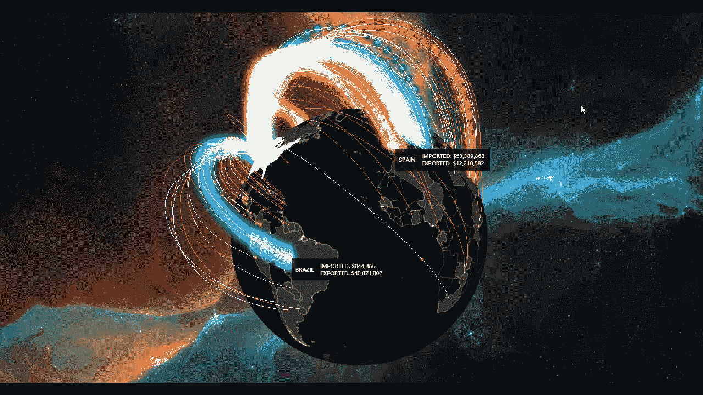

Made with [FineReport](http://www.finereport.com/en/?utm_source=medium&utm_medium=media&utm_campaign=blog&utm_term=05)

在类似于上面的场景中，地图的显示无疑会比简单的表格直观得多。作为一种专业应用程序，数据地图在以下领域具有广泛的分析用途。

# 1.数据地图的用途

## 1.1 人口分布

根据年龄、性别、收入、受教育程度等人口统计数据。，对地图上不同区域或社区的客户进行分析和分类。数据可以帮助我们了解他们的生活方式、兴趣和购物习惯。

## 1.2 市场容量预测

分析地图上每个网点的资源投入、销售收入、产品销量，预测整个市场的容量，让资源科学配置到市场潜力最大的区域。

## 1.3 物流路径规划和供应链管理

比如通过下面的数据图，可以了解订单的分布情况，仓储设置是否合理，物流路线如何优化。

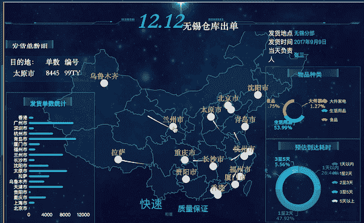

Made with [FineReport](http://www.finereport.com/en/?utm_source=medium&utm_medium=media&utm_campaign=blog&utm_term=05)

## 1.4 连锁店位置

连锁店和餐厅的选址通常要考虑很多空间因素。利用地图可以直观地展示客流量、门店容量等指标，是进行市场规划的好方法。

# 2.数据映射的类型

实际上，数据地图有多种表现形式。这里我介绍五种常见类型。

## 2.1 分销类型

为了制作这种类型的地图，我们根据数值的大小给相应的区域添加不同的颜色。颜色深度反映了数值，如下所示。

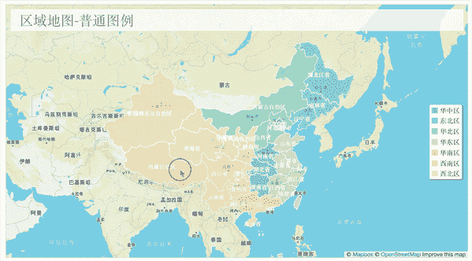

Made with [FineReport](http://www.finereport.com/en/?utm_source=medium&utm_medium=media&utm_campaign=blog&utm_term=05)

上面的地图显示了单维数据。如果要根据全国范围内的销量分布来分析一个省或城市的销量，可以通过钻取得到数据。

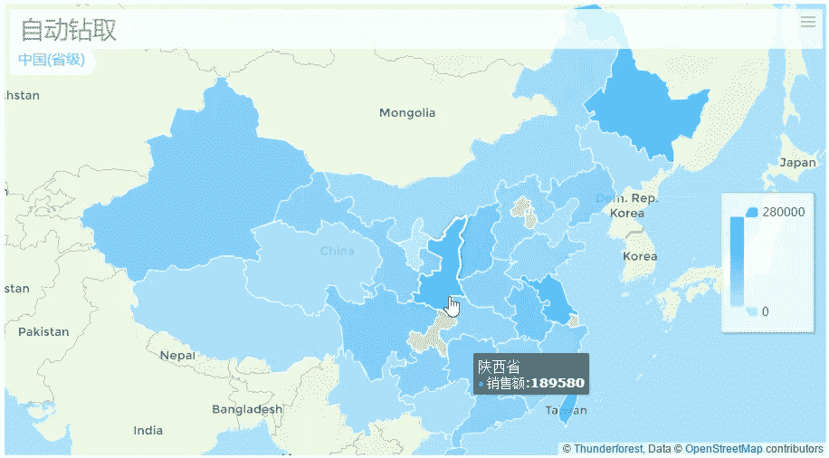

Made with [FineReport](http://www.finereport.com/en/?utm_source=medium&utm_medium=media&utm_campaign=blog&utm_term=05)

## 2.2 标记类型

数据地图的标记类型用作位置提醒。您可以使用点或图形让读者将他们阅读的内容与其地理位置联系起来。这样的地图本身并不能反映定量信息。它可以反映位置、流量和密集分布，并减少数据分析的抽象。

Made with [FineReport](http://www.finereport.com/en/?utm_source=medium&utm_medium=media&utm_campaign=blog&utm_term=05)

Made with [FineReport](http://www.finereport.com/en/?utm_source=medium&utm_medium=media&utm_campaign=blog&utm_term=05)

## 2.3 图表类型

图表型地图是在一个区域的全部或部分区域上显示一个简单的图表，如柱形图、饼状图、气泡图等，相当于增加了一个基本维度，使数据结果一目了然。图表用于直接显示区域中的数据趋势，以进行比较或形成关系。下图是区域图和气泡图的组合，气泡阴影表示数据的大小。这种映射不应该复杂。注意尺度，对复杂的图表使用数据钻取。

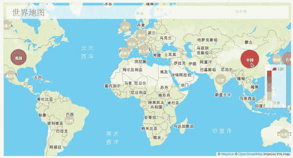

Made with [FineReport](http://www.finereport.com/en/?utm_source=medium&utm_medium=media&utm_campaign=blog&utm_term=05)

## 2.4 热图

热图是根据区域数据的大小来填充不同的颜色深浅，从而反映数据的分布。这是一个非常常见的地理可视化。它可以实时描述种群分布、密度和变化趋势。例如，下面是为一个叫车应用程序制作的交通密度图。

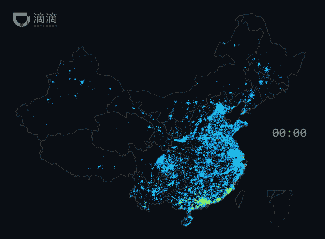

Made with [FineReport](http://www.finereport.com/en/?utm_source=medium&utm_medium=media&utm_campaign=blog&utm_term=05)

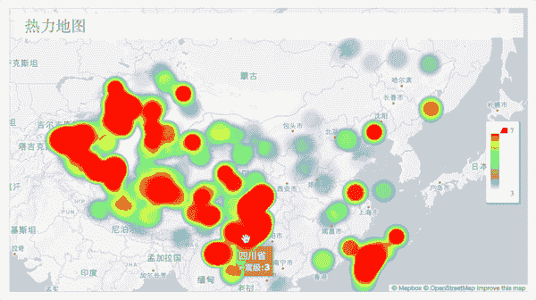

Made with [FineReport](http://www.finereport.com/en/?utm_source=medium&utm_medium=media&utm_campaign=blog&utm_term=05)

## 2.5 自定义地图

数据地图还有其他复杂的样式，比如添加动态地图或动态图表，或者与其他表格结合形成仪表板。

## 购物中心平面图

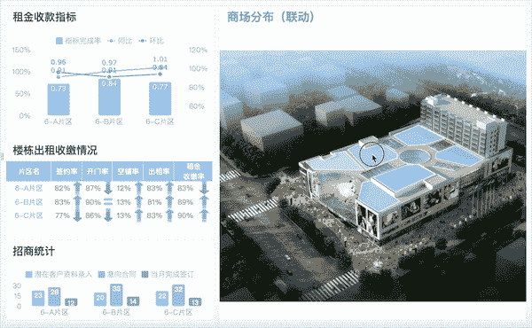

Made with [FineReport](http://www.finereport.com/en/?utm_source=medium&utm_medium=media&utm_campaign=blog&utm_term=05)

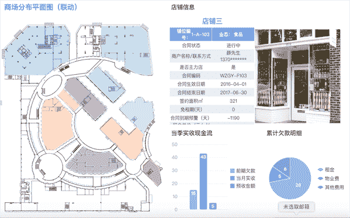

Made with [FineReport](http://www.finereport.com/en/?utm_source=medium&utm_medium=media&utm_campaign=blog&utm_term=05)

## 仪表盘

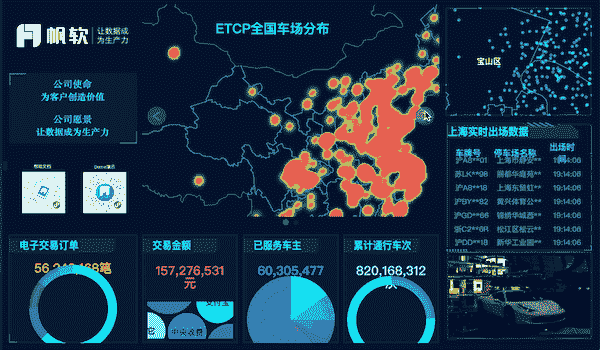

Made with [FineReport](http://www.finereport.com/en/?utm_source=medium&utm_medium=media&utm_campaign=blog&utm_term=05)

## GIS 地图

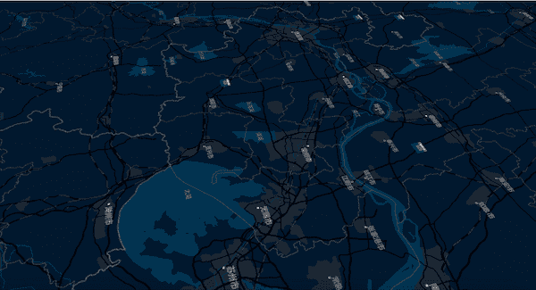

Made with [FineReport](http://www.finereport.com/en/?utm_source=medium&utm_medium=media&utm_campaign=blog&utm_term=05)

# 技巧

文中所有资料图均用 [FineReport](http://www.finereport.com/en/?utm_source=medium&utm_medium=media&utm_campaign=blog&utm_term=05) 制作。FineReport 是一款企业级业务分析工具，具有强大的[数据可视化](/how-can-beginners-design-cool-data-visualizations-d413ee288671)功能。它通常用于各种业务中的数据分析。只需简单的拖拽，你就可以创建各种很酷很有用的数据地图。对初学者很友好。

如果你想自己制作数据图，可以去官网[免费下载 FineReport](http://www.finereport.com/en/download?utm_source=medium&utm_medium=media&utm_campaign=blog&utm_term=05) ，里面提供了很多数据图组件。最后我想说，当你开始迈出第一步的时候，你会发现数据分析其实很简单！

*原载于 2019 年 7 月 5 日*[*http://www.finereport.com*](http://www.finereport.com/en/data-visualization/4-uses-of-data-maps-in-business-analysis.html)*。*