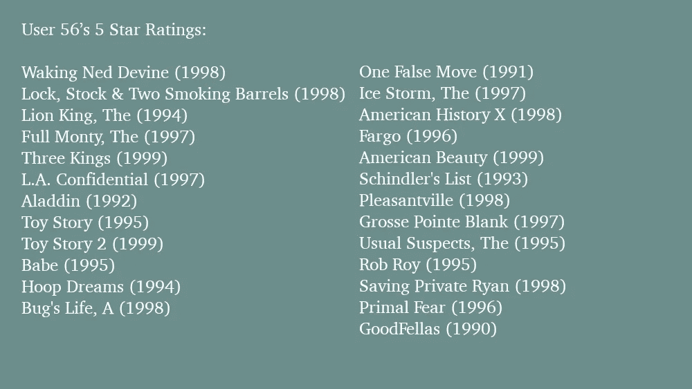
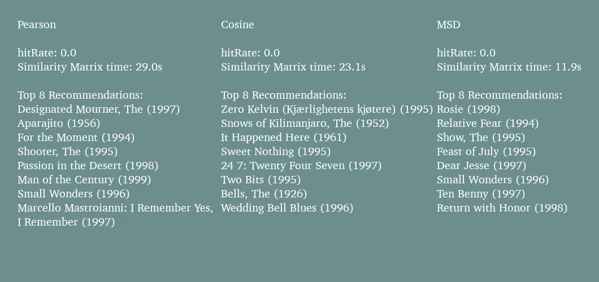

# 增强你的推荐系统的 4 种方法

> 原文：<https://towardsdatascience.com/4-ways-to-supercharge-your-recommendation-system-aeac34678ce9?source=collection_archive---------13----------------------->

## 在用户面前提高可扩展性和质量的 4 个实用步骤。

Credit: Unsplash/Peter Lewicki

推荐系统帮助用户找到他们喜欢的商品。他们通过为一个给定的用户产生一个预测的可能性分数或一个顶级推荐项目列表来做到这一点。推荐可以基于过多的因素，包括用户人口统计、总体项目流行度和历史用户偏好。在亚马逊、Spotify 和 Tinder 等地方经常会遇到现实生活中的例子。

然而，许多系统的运行规模强调了成功的学术和“小数据”应用的挑战。此外，用户意识和选择的增加导致了*偏好混乱*意味着用户比以往任何时候都更乐意放弃一个不准确的服务。

考虑到这一点，以下 4 点是可实现的想法，它们针对可伸缩性问题，同时提高您的协同过滤推荐的质量。

Credit: @BlaxZtar

**1——抛弃基于用户的协同过滤模式。**

在商业环境中，协同过滤算法面临的一个关键挑战是处理数据的**稀疏性**和**可扩展性**。现代系统需要处理数千万个潜在数据点的能力，对性能限制的容忍度较低。在这些系统中，用户可能已经与不到 1%的可用项目进行了交互。

**基于用户的协同过滤模型**中的瓶颈主要出现在对*邻居、*的搜索中，这些邻居是在大用户群中历史上对给定用户表现出相似偏好的其他用户。能够搜索成千上万的邻居固然很好，但系统必须根据它们所适应的业务进行扩展——能够实时搜索数百万个邻居会为您和您的用户带来真正的价值。

切换到**基于项目的协同过滤算法**将推荐问题从用户空间转置到项目空间。它探索的是项目之间的关系，而不是用户之间的关系。在大多数现实生活的应用程序中，项目的数量与用户的数量相比相形见绌，并且在许多情况下项目是静态的。也就是说，项目集的变化远不如用户数量的变化频繁。这允许基于项目的协同过滤模型的拟合阶段和预测阶段的分离。

我们来看看实践中的区别。

使用来自 6，040 个用户的 3，704 部电影的 994，168 个评级的训练集(MovieLens 1M 数据集)，评估基于用户的算法的相似性矩阵的计算成本是 *77.6 秒*，但是对于基于项目的算法，仅 *28.4 秒*，每个使用**皮尔逊相似性**。

这种转变解决了大规模系统的计算能力问题，这在某些阶段变得比质量上的微小差异更重要。当然，如果您的用户集小于您的项目集，并且预期变化相对不频繁，那么例外是存在的。

**2 —黄金标准相似度计算技术。**

相似性的概念是协同过滤框架的关键元素。对于基于用户的协同过滤算法，**用户相似性矩阵**由组成，该矩阵测量任何一对用户偏好之间的距离。同样，**项目相似性矩阵**测量基于项目的框架中任何一对项目之间的相似性。三种通常讨论的技术是**皮尔逊、余弦**和**均方差(MSD)** 但是您应该使用哪种相似性计算技术呢？

输入用户 56。用户 56 评价了 54 部电影，下面给出了来自上述相同训练集的 5 部星级电影。

Figure 1 — User 56’s Top Rated Movies

我选择用户 56 纯粹是出于兴趣，考虑到用户喜欢《美国历史 X》和《宝贝》(可以说是两部关于猪的电影)，会有什么样的推荐。产生适当的推荐是数据集中其他用户的功能，但是挑选这些用户的能力取决于对**相似性**度量的选择。

Figure 2 — Similarity Metric Comparison (model hit rate, computation time, top 8 movie list)

忽略计算速度的差异，所有 3 个顶级列表都报告说**命中率**为 0，我不知道你的情况，但我在任何推荐列表中都没有认出一部电影。通常情况下，这就是结果。丑。

这更有可能是数据集的产物，而不是相似性度量，因此停止通过离线评估度量搜索黄金标准相似性计算技术，并开始 **A/B 测试**。真相在于现实生活中的反应。

**3 —使用*模型尺寸*提升您的算法。**

在基于项目的协同过滤框架中，**模型大小**的概念围绕着这样一个思想，即关于用户偏好的足够信息存在于与他们已经高度评价的项目最相似的项目的子集中。从逻辑上讲，与最高评级的已见项目具有高相似性的未见项目对最终推荐列表贡献最大是有意义的。**模型大小** *是由活动用户评定的任何给定活动项目的最相似项目的邻域。*

对于大量的项目，对整个候选集的推荐很快变得过于计算密集。对项目的邻域进行操作大大减少了进行预测所需的时间，但也减少了模型必须排序的信息。关键的权衡就变成了*什么级别的信息可以确保推荐既及时又合适？*

Figure 3 — Model Size Comparison (top 8 movie list, computation time, hit rate, hit rate by rating)

使用前述的 MovieLens 数据集，可以在具有余弦相似性的基于项目的模型上检查模型大小的影响。对于用户 56，邻域实现立即改变前 8 个列表。从所有 8 部电影都是可识别的这一事实来看，这个模型似乎不再抛出晦涩难懂的推荐了(对我来说)。*降低了系统噪音。*我这样说并不是因为我现在能认出前 8 名名单中的电影，而是因为在**留一交叉验证**测试集上**命中率**的增加(6040 个前 8 名名单)。

使用只有 10 个项目的邻域实际上将系统的命中率从 0%提升到 1.4%，更重要的是在五星预测上的命中率为 2.1%。虽然标题点击率随着邻居增加到 50 个项目而提高，但五星级项目稳定在 2.5%左右，因此整体改善源于 4 星级类别。

仔细想想除了顶级分类之外的其他分类对你的系统是否重要。推荐是如何在屏幕上显示的？顶级列表中有多少项？你的单子消耗率是多少？

模型大小可以减少大量的计算量，同时有时还可以提高推荐的质量。文献表明 30 岁左右是最佳值( [Herlocker 等人，1999](https://grouplens.org/site-content/uploads/evaluating-TOIS-20041.pdf) )，但文献不知道你的背景。亲自动手，观察它如何影响对您所关心的客户的顶级推荐。花一点时间调整模型大小可以极大地改善客户体验，增加您的服务消费，并减少平均销售周期指标。

**4——驱动您的用户、推动您的成功的因素。**

*你的评分函数应该反映用户的效用。*

从最终结果开始，反向工作，**基于项目的协同过滤**的目标是从给定用户尚未评级的所有项目集合中创建一个顶级推荐列表。为了做到这一点，一个 ***分数*** 被分配给还没有被该目标用户评级的每一个项目——即**候选生成**步骤。然后可以基于分数进行排名，并且可以将最高的项目呈现给**活动用户**。

我们为每个候选项目建立的 ***分数*** 是活动项目的等级以及活动项目和候选项目之间的相似性的函数。文献通常使用相似性加权评分总和([萨瓦尔等人，2001](https://www.researchgate.net/publication/2369002_Item-based_Collaborative_Filtering_Recommendation_Algorithms) )，这是一种天真的尝试，可以通过以下几种方式进行改进。

*时间加权*。第一个主要步骤是评估你的用户对你的物品的敏感程度。长期偏好与学习相一致，即随着一个人的知识基础扩大，对生活的看法改变，习惯改变，偏好随之改变。相比之下，短期偏好往往受到社会病毒式传播、社会压力和影响的欺凌。通过将最近的评级加权为高于旧的评级，系统可以更快速地响应变化的用户偏好。决定你的系统对新数据有多敏感，是理解长期偏好变化和病毒行为之间的细微差别。无论哪种方式，目标都是了解用户对环境和产品的反应，并将其纳入评分过程。

*负加权。*由于相似性分数是非负的，与评级较低的所见项目不相似的候选项目对顶级推荐几乎没有影响。实际上，模型忽略了这些项目。另一种评分方法可以惩罚对已知不喜欢的项目具有高相似性评分的候选项，并提升对已知不喜欢的项目具有低相似性评分的候选项。实现这一点的一种方式是将评级的尺度和相似性的尺度都线性移动到中心 0。这一概念摆脱了仅仅根据用户喜欢的已知商品进行推荐的局限，大大提高了你的模型推荐的多样性。

当然，这只是两种可能的修改，应该让您考虑一下 score 函数对您的业务的实用性。用户的地理位置和非线性转换也应该在适当的时候进行研究。

**结束语**

没有一篇文章能为你开出一个完美调整的推荐算法，我在这里也不做尝试。相反，我希望通过上面的四个关键点来提高对某些调优选择的认识，这些选择有可能*增加边际额外努力的实际价值。*

你优化的*价值*,无论是歌曲、点击量还是文章，都应该符合商业需求，并根据商业需求进行评估，而不是学术指标。结果不在乎准确性，只在乎呈现在眼前的东西的顺序。拥抱协作过滤的简单性，因为它可以在个性化订购中提供强大的功能&寻求用户的真实反馈。

另外，对于那些想知道“如何做”的人，我个人很喜欢[詹姆斯·柯克](https://medium.com/u/75df3566f52c?source=post_page-----aeac34678ce9--------------------------------)的文章[这里](/getting-started-with-recommender-systems-and-tensorrec-8f50a9943eef)。

Github 代码:[https://github.com/93tilinfinity/collab-filter-basic/](https://github.com/93tilinfinity/collab-filter-basic/)