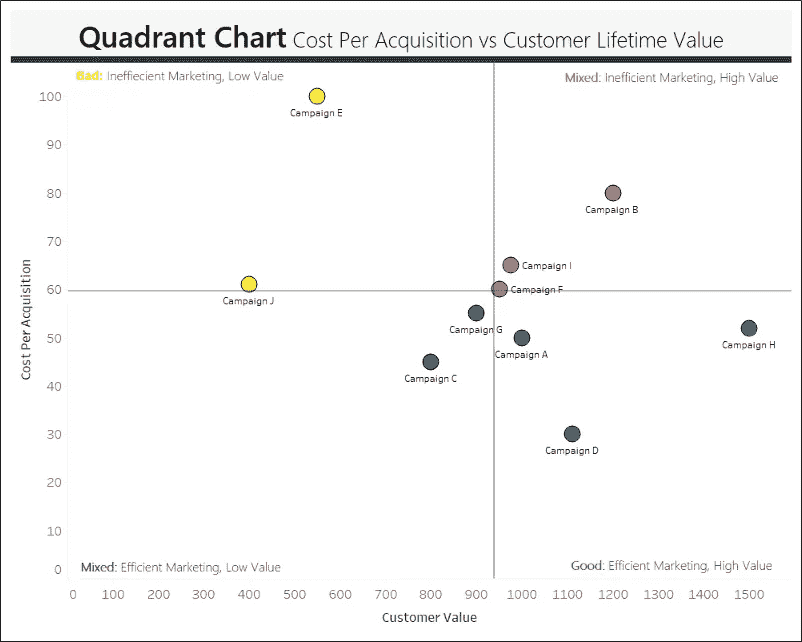
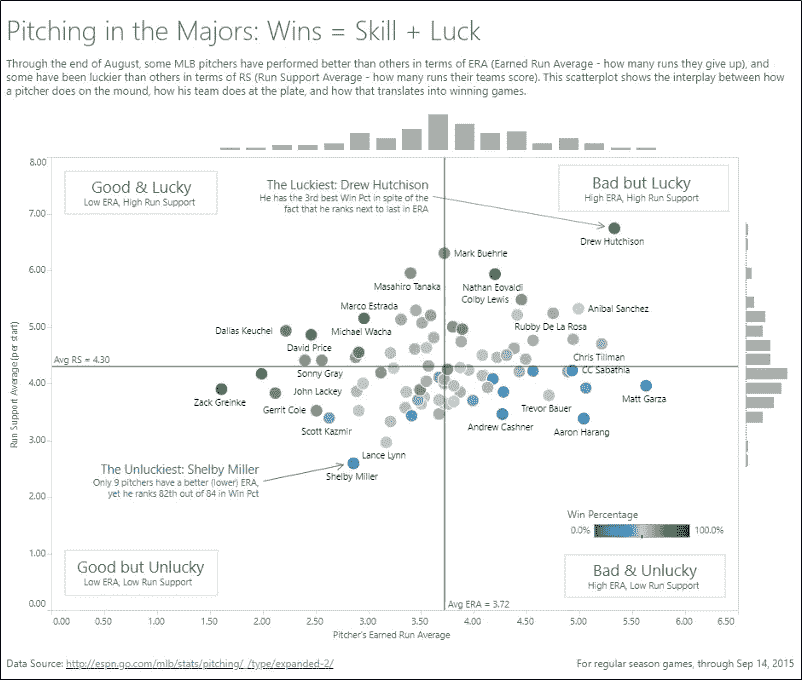
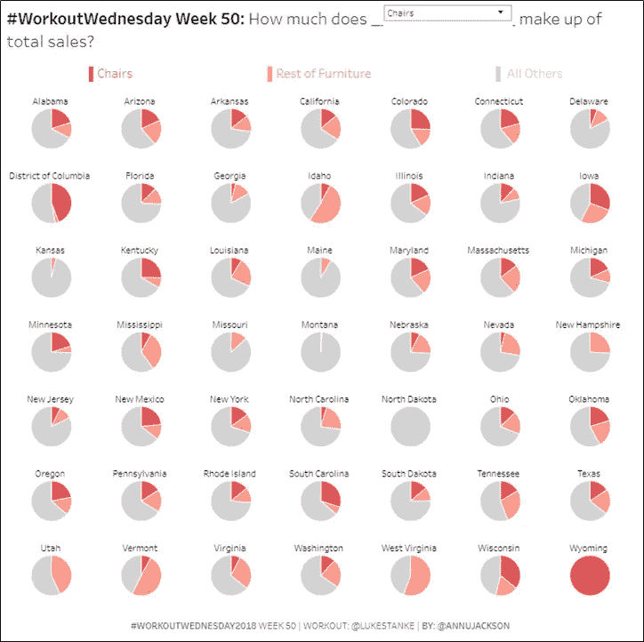
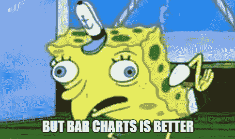
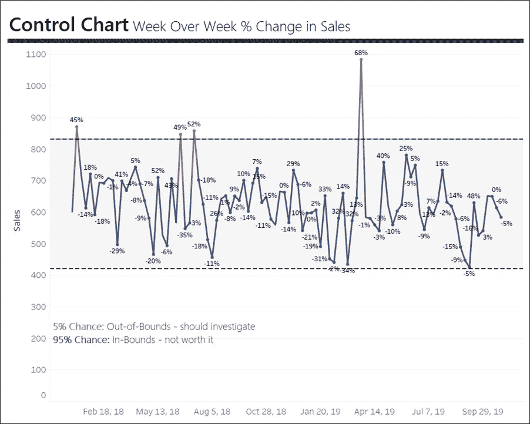
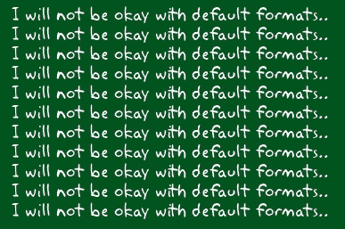

# 数据可视化的 5 个惊人技巧

> 原文：<https://towardsdatascience.com/5-amazing-tips-for-data-visualization-990fdb19c396?source=collection_archive---------8----------------------->

## 快速将数据转化为有洞察力的东西。

Shutterstock by majcot

有没有针对分析师的数据可视化模块？就像一个盯着空白画布的画家或一个写不出第一句话的作家——你可能是一个只盯着 Excel 中的数据墙的分析师。

或者也许你只是觉得自己像一只想要学习新技巧的老狗？

这个列表包含了我最喜欢的 5 种持续产生有效数据可视化的技术。它还有助于防止这种可怕的数据可视化阻塞。再见数据墙…你好洞察！

1.  **散点图你最感兴趣的两个指标**

在审查一个利益相关者的新仪表板时，我们收到了一条让我深思的评论。他们说，“这很好地描述了到底发生了什么，但没有多少采取行动的洞察力。”

在商业智能中，可视化所发生的事情通常比可视化可操作的见解容易得多。

这就是散点图出现的地方。

散点图被广泛用于评估两个指标之间的相关性。经常被忽视的是，它们实际上有另一个用例。这种变化通常被称为象限图。

首先，确定两个重要或有趣的指标。其次，至少要有一个你可以采取行动的维度，比如州、员工或营销活动。那就散开吧！

例如，在市场营销中，我们经常关心两个指标。效率方面的营销绩效(以较低的营销支出获得尽可能多的客户)。质量方面的营销绩效(获得高价值的客户)。

当我们按活动分散这两个指标时，我们可以快速清晰地看到好的和坏的方面。

Made with Tableau

该散点图的作用是将资金从活动 E 和 J 中抽出，投入到活动 D 和 h 中。这种方法非常有效，因为它将你的维度划分为四个易于理解的象限。

[数据可视化专家 Ben Jones](https://dataliteracy.com/about-us/ben-jones-2/) 最初向我展示了散点图的这种变化。第二个例子是他的象限图。他使用颜色作为第三维度，而不是将颜色分配给象限。

[Visualization on Tableau Public](https://public.tableau.com/views/2015MLBLuckyGood/LuckyOrGood?:display_count=y&:origin=viz_share_link)

作为一个叫谢尔比的人，我发现自己处于许多尴尬、不幸的境地。这种形象化让我感觉更好，因为谢尔比·米勒不仅仅是一个叫谢尔比的人，他也是最不幸的投手。

有人认为散点图对于非技术观众来说太复杂了。非技术观众只能理解条形图和折线图。我拒绝相信这个。我真的认为这种思路已经过时了。我们生活在互联网和大数据时代，对数据分析的了解要多得多。很肯定大多数人都见过散点图。

在工作中，我从未向非技术人员展示过象限图，这是一个失败。老实说，恰恰相反。

**2。使用许多相同的数据可视化促进比较**

设计理论家爱德华·塔夫特说:“唯一比饼图更糟糕的是其中的几个。”

尽管我觉得这句话很好笑，但我实际上不同意爱德华·塔夫特的观点。他有第二个更重要的引述，与第一个相矛盾。

"对于数据表示中的各种问题，小倍数是最好的设计解决方案."

小倍数是反复使用相同的数据可视化来促进比较。让我们直接看一个馅饼热起作用的例子。这是由数据可视化专家[安·杰克森](https://public.tableau.com/profile/ann.jackson#!/)创造的。

[Visualization on Tableau Public](https://public.tableau.com/profile/ann.jackson#!/vizhome/WorkoutWednesday2018Week5049PieCharts/WorkoutWednesday2018Week5049PieCharts)

当你可以比较不同的对象时，描述性分析是最好的。如果我们把所有这些馅饼合在一起，说“在美国，椅子占销售额的 25%”会怎么样没有上下文，很难快速理解这是什么意思。

小倍数可以给观众带来闪电般的语境。我们的眼睛和大脑天生就能迅速察觉到一件事与另一件事不一样。可能有助于生存之类的东西。

条形图实际上会带走这一指标的总和为 100%。抱歉，讨厌饼状图的人，这实际上是饼状图更好的选择。但是，我们不要忘乎所以——当有疑问的时候，用条形图表示出来。

只是想指出，小倍数有时也被称为格子图。

**3。确保清晰让你创造清晰**

如果你坐在电脑前不知道从哪里开始，你可能会错过一些非常重要的东西——清晰项目。

从问自己两个问题开始。

*   我的客户/利益相关者是否清楚地陈述了他们想要回答的问题？
*   我们是否就我将在数据集中使用的指标和计算达成一致？

听起来很简单，对吗？然而，我已经看到并参与了许多忽视目标、业务、目的、问题等的项目。

我们最成功的仪表板通常有两个品质，良好的数据和对我们想要回答的问题的高度关注。

这个技巧是一个简单的两步过程:

1.  确保客户/利益相关方的明确性
2.  如果你不能从客户/利益相关者那里获得清晰的信息，那就站在他们的角度，创造你自己的问题来询问数据

这就是为什么确保清晰可以让你创造清晰！再见数据墙…你好洞察！

**4。时间序列变化控制图**

我们的销售额比上周下降了 20%!拉响警报。快速查询一堆乱七八糟的东西，叫“司机”！

呀！这是描述性分析中最常见、最不幸的情况之一。您发现导致销售额比前一周下降 20%的真实因素组合的可能性有多大？几乎没有。

这个提示将帮助你至少开始理解这 20%的下降是否真的值得注意，或者仅仅是基于历史结果的随机变化。

时间序列有分布。您可以用周作为频率来绘制指标的直方图。您可以使用分布和变化来计算标准偏差。这样，您就可以用一个上限和下限来包装您的时间序列图。

Made with Tableau

控制图有助于我们评估这种增减是否真的不寻常，或者只是随机变化。我们可以推后说 20%的下降是绝对正常的，而不是花一整个下午进行消防演习分析。

根据我上面的销售数据，你可以看到 2018 年 5 月 13 日的销售额比前一周下降了 20%。但是，它在控制图范围内，所以我们可以将其评估为数据中的正常变化，而不是关注真正异常的几周。

如果你想控制 tableau 中的图表[，这里有一个教程](https://www.tableau.com/learn/tutorials/on-demand/control-charts)。

需要更多的帮助来防止这些时序消防演习？更好的选择是用 A/B 测试或准测量方法来补充描述性分析，例如[差异中的差异](https://en.wikipedia.org/wiki/Difference_in_differences)。我真的很喜欢谷歌开源的一个叫做[因果影响](https://opensource.googleblog.com/2014/09/causalimpact-new-open-source-package.html)的包，它通过时间序列建模来帮助区分随机变化和真实影响。

**5。分配大量时间用于设计和格式化**

下次你向观众展示时。以这句话开头，“今天，我希望与你建立零信任，零信誉。”从来没有人用这个打开过。

数据可视化的全部意义在于与受众交流。在数据和分析领域，可信度和信任至关重要，但也很脆弱。

设计和格式是表现专业、可信和赢得观众信任的最简单的方法之一。然而，我一次又一次地看到人们在设计和格式上花费很少的精力。令人遗憾的是，分析和数据非常棒，却从未引起观众的共鸣。

数据可视化不仅仅是处理数字和显示结果。目标是要有洞察力和吸引力。

我喜欢 Ryan Sleeper 在他的书《实践的舞台》中所说的，“……如果不能用高质量的设计来平衡数据质量，你的数据可视化将永远无法发挥其全部潜力。”

是时候在你的时间表中划出至少一部分专门用于设计了。如果你不同意，我会把你送到黑板前。

