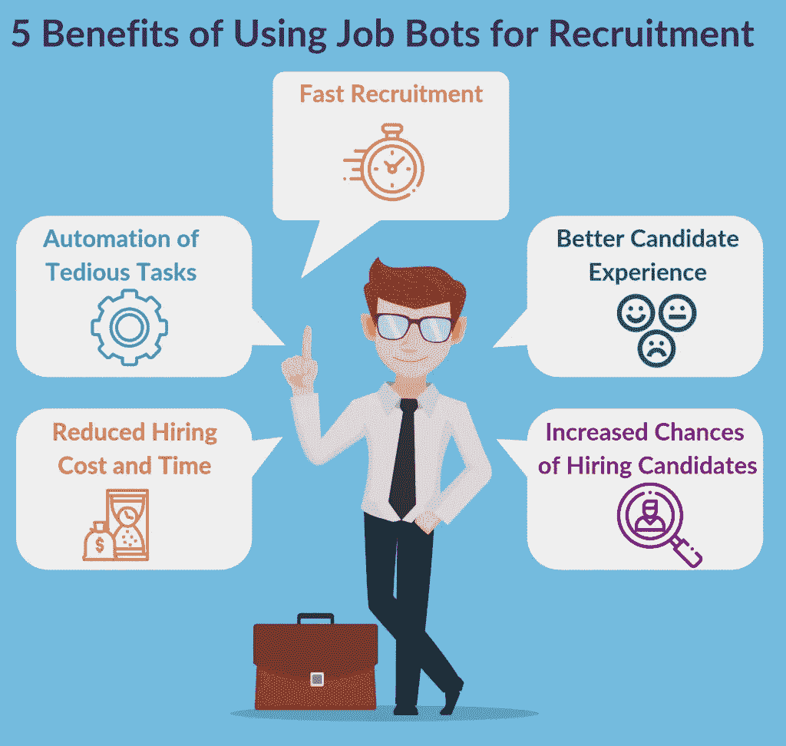

# 使用求职机器人招聘的 5 大好处

> 原文：<https://towardsdatascience.com/5-benefits-of-using-job-bots-for-recruitment-e0bd7d0fdd23?source=collection_archive---------23----------------------->

*原载于*

*开发智能招聘机器人，让招聘人员和候选人的生活变得更快更简单。*

*不可否认，印度是 bot 发展的最大市场之一。聊天机器人的发展有了显著的增长。许多公司已经接触到了聊天机器人创意，涉及电子商务、银行、教育、医疗保健、职业咨询等多个行业。*

*尽管如此，聊天机器人开发服务市场中还有一个领域仍在发展，那就是招聘行业。我们并不是没有用于招聘的聊天机器人。但他们非常少，大多数企业在招聘候选人时仍然更信任人类而不是机器人。*

> *然而，我们不要忘记这样一个事实，公司因为雇佣了糟糕的候选人而遭受巨大的损失。据统计:超过 25%的公司去年遭受了 5 万美元的损失，这不是一个小数目。*

*现在，如果企业在招聘过程中使用招聘机器人，事情会有所不同。他们本可以通过咨询最好的聊天机器人开发公司来避免这种损失*

*在招聘过程中使用工作机器人的好处是惊人的，在这篇博客中，我将会谈论它们。那么，让我们开始吧:*

**

*[Image by author](https://www.signitysolutions.com/blog/job-bots-benefits/)*

# *使用机器人招聘的好处*

# *1.快速招聘*

*对于招聘人员来说，雇佣候选人的过程是漫长而令人疲惫的。投放广告，在工作平台上跟踪候选人，通过电子邮件或电话联系每个候选人，安排面试，然后选择一个他们认为符合所有工作要求的候选人并不容易。整个过程需要几周，有时甚至几个月。*

*然而，工作机器人可以将整个招聘过程缩短到一两天。你知道怎么做吗？作者:*

*   *只选择那些严格符合选择标准的潜在候选人。*
*   *在保证有回应的平台上接触候选人。*
*   *快速审查申请和安排面试。*

*总的来说，招聘机器人可以帮助你更快地招聘到候选人，这也是它们非常受欢迎的原因。*

# *2.繁琐任务的自动化*

*有几件小而关键的事情会导致招聘过程的延迟。例如，手动准备潜在候选人的列表。这是一个需要花费大量时间和精力的漫长过程。此外，出现错误的可能性也很大。有时，招聘人员非常忙，几乎没有时间去查看每个候选人的个人资料，看看他/她是否符合选择标准。*

*甚至安排面试的过程也同样忙碌。这涉及到很多麻烦，比如通知候选人面试，反复核对他们来不来，提醒面试官已经安排好了面试等等。在工作机器人的帮助下，你可以自动完成所有这些繁琐的任务，从而减少招聘时间，让招聘变得更轻松。所以建议联系 [AI 开发](https://www.signitysolutions.com/ai-machine-learning-development-services)公司，向他们咨询 bot 开发。*

# *3.更好的候选人体验*

*让我用一个例子来更好地解释这一点，我的一个朋友期待申请一家 IT 服务公司的职位。所以，她花了几个小时完善她的简历，对公司做研究，写一封有吸引力的求职信。最后，在反复核对了一切之后，她申请了这个职位。作为回报，她收到的只是招聘人员冷冰冰的电子邮件回复:谢谢你的申请。我们会尽快与您联系。*

*她再也没有公司的消息了。她发了后续邮件，但没有回应。现在，我的朋友很生气。她在 LinkedIn 上写了一篇长文，公开羞辱了该公司。成千上万的人阅读了她作为候选人的经历，公司的声誉遭受了重大挫折。但这一切都是可以避免的。*

*他们所做的就是在我的朋友提出申请后对她进行跟进。然而，问题是招聘人员每天会收到成千上万封电子邮件，不可能对每封邮件都进行跟进。这就是客服聊天机器人形式的招聘机器人发挥作用的地方。他们不仅不时跟踪候选人，还在整个招聘过程中指导他们。这将改善候选人的体验，并让你的品牌处于正面的聚光灯下。*

# *4.降低雇佣成本和时间*

*由于工作机器人正在使用非常先进的算法来选择特定职位的候选人，因此选择不符合工作要求的候选人的机会是最小的。这意味着你不必浪费时间和资源去面试错误的候选人。相反，你只需要专注于正确的事情。此外，这些招聘机器人可以自动完成一些小任务，如准备面试候选人的记录，通知他们面试日期，跟进，安排面试，收集面试官的反馈等。当您手动执行这些任务时，需要花费数天甚至数周的时间。*

*此外，由于你已经和你第一次面试的候选人建立了良好的关系，你可以很容易地通过直接向这些人推销来节省成本和时间。总体而言，在求职机器人的帮助下，你可以将面试的时间和成本减少 50 %- 60 %,这可不是一个小数字。*

# *5.增加雇用有才能的候选人的机会*

*人工选择候选人的过程是有缺陷的。有时候，我们最终会拒绝有才华的候选人，而雇佣那些毫无才华的人。这不仅浪费了公司的时间和资源，还误导应聘者认为公司对人才没有价值。但我们不能因此责怪招聘人员。毕竟他们也是人，也会犯错。此外，他们还会收到成千上万份求职申请，必须一一审核。所以，他们可能会忽略一两个。*

*然而，像 Textkernel 这样的人工智能工具会密切关注你在潜在候选人中寻找什么，并向你推荐它们。这减少了出错的机会，确保你不会错过任何有才华的人。那么，你应该使用机器人进行招聘吗？我的回答是:是的，为什么不呢？*

*与其他行业一样，人工智能也可以被证明是招聘领域的游戏规则改变者。使用求职机器人，你可以更快、更低的招聘成本雇佣到有才华的候选人。这是大多数公司已经开始在招聘过程中使用它们的主要原因，他们实际上正在从中受益。*

*因此，在招聘中不使用人工智能机器人，你肯定会错过很多东西。那么，你还在等什么？赶快联系一家聊天机器人开发公司吧。*