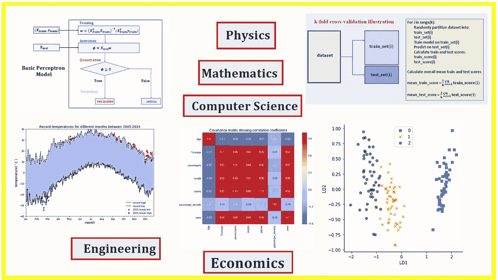

# 进入数据科学的 5 个最佳学位

> 原文：<https://towardsdatascience.com/5-best-degrees-for-getting-into-data-science-c3eb067883b1?source=collection_archive---------5----------------------->

**Image Source: Collections of my data science articles.**

数据科学是一个广阔的领域，包括几个细分领域，如数据准备和探索；数据表示和转换；数据可视化和显示；预测分析；机器学习等。对于初学者来说，学习数据科学的基础知识可能是一项非常艰巨的任务，特别是如果您没有适当的指导，无法了解所需的必要培训，或者要学习哪些课程，以及学习的顺序。在讨论容易导致数据科学的学位培训项目之前，让我们讨论一下数据科学所需的基本技能。

在之前的一篇文章( [**数据科学最低要求:开始做数据科学需要知道的 10 个必备技能**](/data-science-minimum-10-essential-skills-you-need-to-know-to-start-doing-data-science-e5a5a9be5991) )中，我讨论了从业数据科学家必备的 10 个必备技能。这些技能可以分为两类，即**技术技能**(数学&统计、编码技能、数据争论&预处理技能、数据可视化技能、机器学习技能和真实世界项目技能)和**软技能**(沟通技能、终身学习技能、团队合作技能和道德技能)。

虽然数据科学需要多种技能，但由于其多学科的性质，可以被视为数据科学先决条件的 3 种基本技能是**数学技能**、**编程技能**和**解决问题技能**。

分析学科的学位将为你提供数据科学所需的基本技能。每个在分析学科有很强背景的人基本上都可以通过自学来学习数据科学。

如果你有分析学科的背景，并且正在考虑数据科学，这里有一些你可以用来自学的资源:

(一) [**数据科学专业证书**](https://www.edx.org/professional-certificate/harvardx-data-science) **(HarvardX，直通 edX)**

(二) [**分析:基本工具和方法**](https://www.edx.org/micromasters/gtx-analytics-essential-tools-and-methods) **(Georgia TechX，through edX)**

(三) [**应用数据科学与 Python 专业化**](https://www.coursera.org/specializations/data-science-python) **(密歇根大学，通过 Coursera)**

(四)**“Python 机器学习”，塞巴斯蒂安·拉什卡著。**这本书提供了关于数据科学和机器学习的很棒的介绍，包括代码:**“Python 机器学习”，作者 Sebastian Raschka** 。作者以一种非常容易理解的方式解释了机器学习的基本概念。此外，代码也包括在内，因此您实际上可以使用提供的代码来练习和构建您自己的模型。我个人认为这本书在我作为数据科学家的旅程中非常有用。我会向任何数据科学爱好者推荐这本书。你所需要的是基本的线性代数和编程技能，以便能够理解这本书。

现在让我们来讨论 5 个可以轻松通向数据科学的最佳学位项目。我会试着给这些程序排序，从最好的开始，一路往下。我的排名可能有偏见，我想是因为我的背景，但请告诉我。

# 进入数据科学的 5 个最佳学位

# 1.物理学

我想把物理放在我清单的首位。我可能有偏见，因为我自己就是一个训练有素的物理学家。但是我觉得这个排名很有道理。物理学学位是最通用的学位项目之一。物理学学位为解决问题、分析技能、数学技能和编程技能提供了坚实的基础。这些技能很容易转移。这解释了为什么你可以找到在不同领域工作的物理学学位持有者，如学术界、技术、银行和金融、研发、软件工程、法律、军事、数据分析师等。

如果你目前正在攻读物理学学位，并且正在考虑数据科学，请确保你参加了一些编程课程。一些编程方面的背景知识是你在数据科学方面所需要的。你也可以选一些基础和高级统计和概率的课程。

# 2.数学

我会把数学放在第二位。就像物理学一样，数学也是一个非常多才多艺的领域，拥有数学背景可以通向几个学科，如银行和金融、工程、卫生部门、研发等。扎实的数学和统计学背景是数据科学最重要的技能。

如果你目前正在攻读数学学位，并且正在考虑数据科学，请确保你参加了一些编程课程。此外，参加一些基础和高级统计和概率的课程也很重要。

# 3.计算机科学

计算机科学学位在我的清单上排在第三位。就像物理和数学一样，计算机科学培训项目为解决问题、数学和编程技能提供了良好的基础。编程技能在数据科学中至关重要。

如果你目前正在攻读计算机科学学位课程，并正在考虑数据科学，请确保你参加了一些数学课程，如微积分、线性代数、统计和概率以及优化方法。

# 4.工程

任何工程学位课程，如机械工程、电气工程或工业工程，都将为您提供数据科学所必需的分析技能。

如果你目前正在攻读工程学位，并且正在考虑数据科学，请确保你参加了一些编程课程以及一些统计和概率方面的基础和高级课程。

# **5。经济学、会计学或商业学位**

这些领域的学位也可以作为通向数据科学的途径。与物理和数学等课程相比，这些课程提供的分析技能可能缺乏数学的严谨性，但经济学或会计学学位将为人们提供商业技能，这在数据科学的现实应用中是必不可少的。

如果你目前正在攻读经济学、会计学或商业学位课程，并且正在考虑数据科学，请确保你参加了一些数学课程，如微积分、线性代数、统计和概率，以及编程课程。

总之，我们已经讨论了可以作为通向数据科学之路的 5 个学位项目。任何有正确动机和热情的人都可以学习数据科学的基础。然而，在物理、数学、计算机科学、工程或经济学等分析学科的背景将是一个额外的优势。