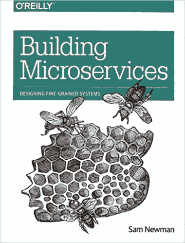
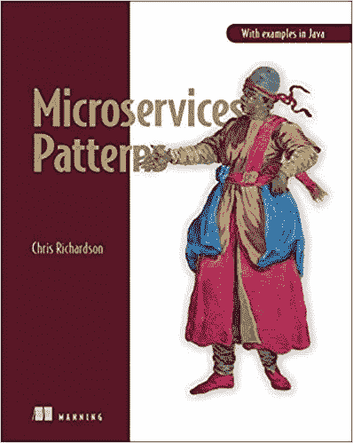
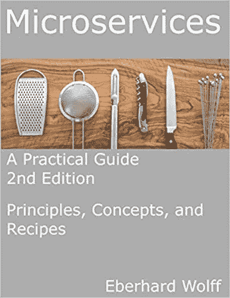
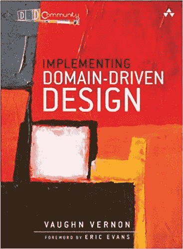
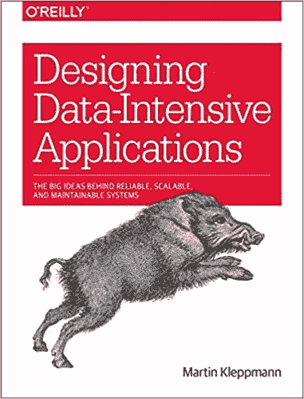

# 5 本关于微服务的最佳书籍

> 原文：<https://towardsdatascience.com/5-best-microservices-book-db981ef9c433?source=collection_archive---------1----------------------->

## 以正确的方式设计微服务架构的必备书籍

Photo by [Gabriel Sollmann](https://unsplash.com/@gabons?utm_source=unsplash&utm_medium=referral&utm_content=creditCopyText) on [Unsplash](https://unsplash.com/s/photos/library?utm_source=unsplash&utm_medium=referral&utm_content=creditCopyText)

对于复杂的应用程序，微服务架构提供了许多吸引人的优势，正如我在以前的帖子“ [**微服务架构:简要概述以及为什么你应该在你的下一个项目**](/microservice-architecture-a-brief-overview-and-why-you-should-use-it-in-your-next-project-a17b6e19adfd) 中使用它”中详细讨论的那样。设计微服务是一项极具挑战性的任务。更糟糕的是，如果微服务设计不当，注定会失败。开发人员和架构师应该事先对微服务架构有一个清晰的了解，才能设计微服务架构。如今，开发人员使用堆栈溢出、在线课程或博客帖子来了解某个主题。我建议通过彻底阅读一些书籍来补充在线课程、会议、博客帖子，以避免设计微服务中的陷阱。

在这里，我列出了五本书，它们将有助于更好地理解微服务架构以及如何在现实项目中使用它。

**1。** [**构建微服务**](https://samnewman.io/books/building_microservices/)

[***Sam Newman***](https://samnewman.io)是微服务架构的早期开拓者和微服务大师之一。在这本开创性的书中，他详细描述了微服务架构的原理以及如何设计、部署、测试和观察微服务架构。他还指出了设计微服务的潜在陷阱，以及如何以渐进的方式将 Monolith 应用程序迁移到微服务中。另外，萨姆·纽曼的文字优雅、清晰，他用一种令人惊讶的简单方式解释了如此复杂的话题。这是任何想从事微服务的人必读的一本书

[②**。微服务模式**](https://www.manning.com/books/microservices-patterns?a_aid=microservices-patterns-chris&a_bid=2d6d8a4d)

[***克里斯·理查森***](https://www.chrisrichardson.net/) 是一位享有盛誉的微服务专家，他还运营着一个最受欢迎的 [**微服务博客**](https://microservices.io/) 。在本书:**微服务模式**中，Chris Richardson 描述了微服务架构的优势以及微服务的劣势和挑战。对于每个挑战，他都会提供一个或多个解决问题的模式以及它们的优缺点。这本书还总结了微服务世界中使用的所有模式。

**3。** [**微服务—实用指南**](https://practical-microservices.com/)

[***Eberhard Wolff***](https://ewolff.com/)*是德国著名的软件架构师，写过几本关于微服务的德语和英语书籍。微服务的主要挑战之一是它为不同的问题提供不同的解决方案，选择正确的解决方案相当困难。《微服务——实用指南》这本书在这方面非常有用，因为它为不同的问题提供了不同的解决方案，包括它们的优缺点。本书还花了大量时间讨论云原生微服务，如 Docker、Kubernetes、服务网格等。*

*[**4。实现领域驱动设计**](https://www.amazon.de/Implementing-Domain-Driven-Design-Vaughn-Vernon/dp/0321834577/ref=sr_1_1?__mk_de_DE=%C3%85M%C3%85%C5%BD%C3%95%C3%91&keywords=vaughn+vernon&qid=1575163924&sr=8-1)*

**

*微服务的最大挑战是如何将一个复杂的业务应用程序分割成不同的松散耦合的服务。幸运的是，领域驱动设计可以在这方面有所帮助。领域驱动设计提倡分两步设计软件:**战略设计**和**战术设计**。在战略设计中，IT 和业务一起寻找核心领域、支持领域、无处不在的语言和上下文映射。在战术设计中，它将每个域分解成更小的构建块，例如实体、值对象、聚合和聚合根。因此，领域驱动设计有助于找到微服务的边界和构建模块。为了深入了解领域驱动设计，我更喜欢由[***Vaughn Vernon***](https://vaughnvernon.co/)写的“**红皮书**，而不是由[***Eric Evans***](https://twitter.com/ericevans0?lang=en)写的原版**蓝皮书**，因为这本书可读性更好，并且使用了现代技术栈(例如，事件源，CQRS)。*

***5。设计数据密集型应用***

**

*微服务的另一个困难挑战是将中央数据存储拆分为特定于微服务的数据存储，然后在微服务之间共享数据/消息。此外，微服务架构提倡为微服务使用合适的数据存储，这可能会导致多语言数据库。因此，对现代数据存储、数据转换、数据共享的深刻理解对于设计有效的微服务至关重要。Martin Kleppmann Martin Kleppmann 雄辩地深入讨论了关于数据的一切:SQL、NoSQL 数据库、数据存储格式、数据传输格式、消息队列。这是关于现代数据管理最全面最完整的一本书，也是微服务架构师的必读书籍。*

*如果你觉得这很有帮助，请分享到你最喜欢的论坛上( **Twitter，脸书，LinkedIn** )。高度赞赏评论和建设性的批评。感谢阅读！*

*如果你对微服务架构感兴趣，也可以看看我下面的文章:*

* [## 有效的微服务:10 个最佳实践

### 正确实施微服务架构的 10 个技巧

towardsdatascience.com](/effective-microservices-10-best-practices-c6e4ba0c6ee2)  [## 微服务架构:简要概述以及为什么您应该在下一个项目中使用它

### 微服务架构的背景以及微服务架构相对于整体架构的优势

towardsdatascience.com](/microservice-architecture-a-brief-overview-and-why-you-should-use-it-in-your-next-project-a17b6e19adfd)  [## 微服务架构及其 10 个最重要的设计模式

### 微服务架构、每个微服务的数据库、事件源、CQRS、Saga、BFF、API 网关、扼杀者、电路…

towardsdatascience.com](/microservice-architecture-and-its-10-most-important-design-patterns-824952d7fa41)*